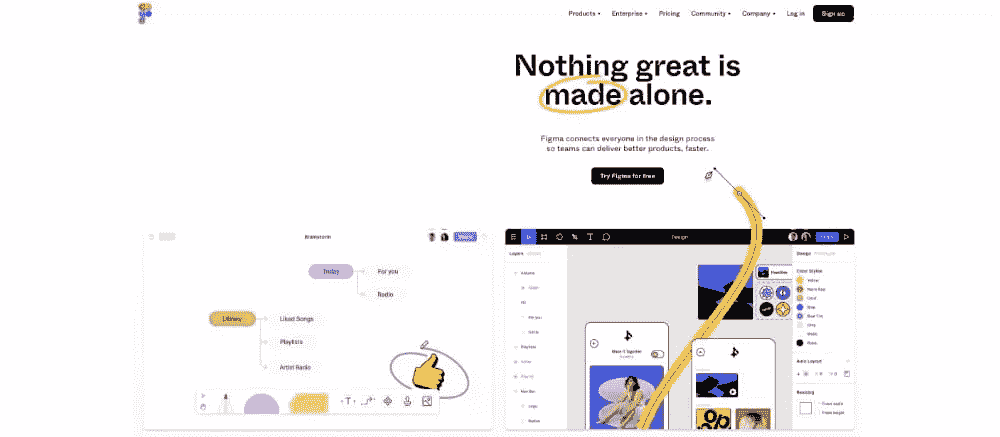
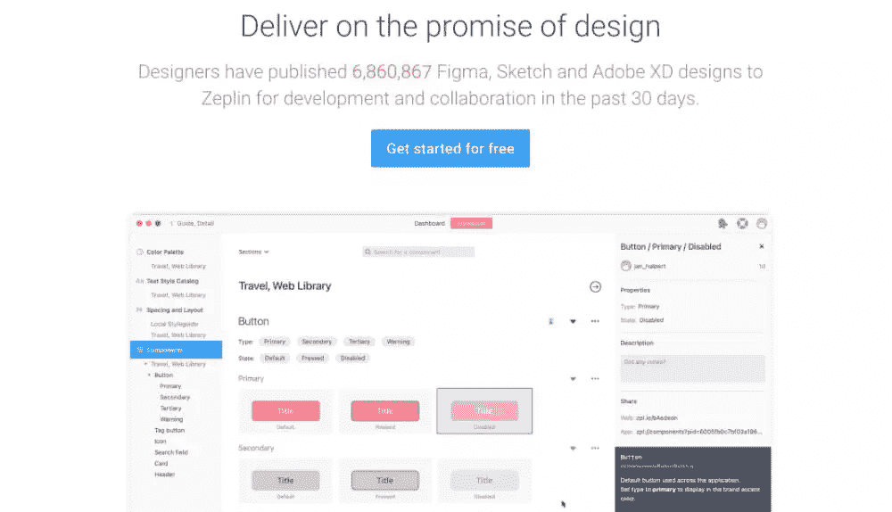
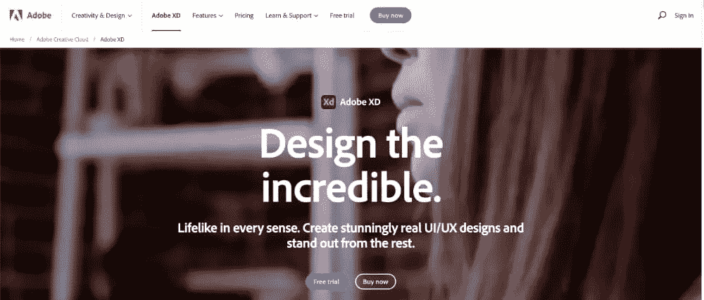
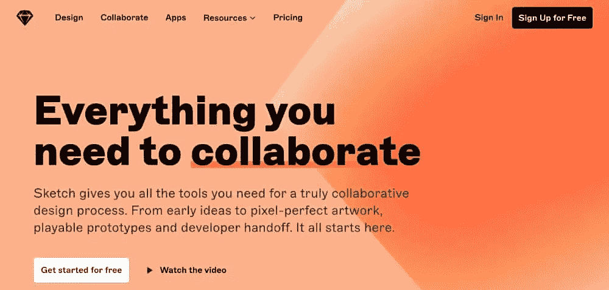

# 2022 年 5 大最佳设计移交工具

> 原文：<https://www.sitepoint.com/best-design-handoff-tools/>

**在本文中，我们将探讨设计移交工具和整个设计流程的当前状态，并从市场上挑选出五款最佳设计移交工具。**

设计移交包括将 UI 设计移交给开发人员，开发人员将对其进行编码。在“设计移交”成为一个术语之前，移交设计是一项复杂、令人沮丧且经常是灾难性的任务。很久以前，Adobe Photoshop 是唯一可用于设计用户界面的工具，设计移交工具和/或功能并不存在。将设计转换成代码被称为“切分 PSD”。哦，那些日子。

切割 PSD(Photoshop 文档)是开发人员的责任，这非常令人沮丧，因为可以理解开发人员不想使用设计工具。设计师会手动记录设计规范以使事情更加清晰，但这仍然会导致视觉/功能上的不一致，并引起与开发人员的激烈讨论。我还是会做噩梦。(如果你想分享我的噩梦， *[这里有一个不错的迷因集合供你探索](https://invisionapp.com/inside-design/6-design-dev-memes/)。*)

### 今天的设计移交

如今，有大量的 UI 工具支持设计移交功能，甚至还有完全致力于移交的工具，它们帮助设计人员和开发人员将设计转换为代码，存放设计文件，保持设计元素之间的一致性，并促进设计人员和开发人员之间的良好合作。

现代化的设计师和开发人员认识到设计移交过程是一个关键的开发过程，无论是从零开始构建设计系统还是产品。事实上，像 Figma 这样的 UI 设计工具同时提供了移交和设计系统功能。

## 设计移交工具实际上是做什么的？

移交工具帮助:

*   设计师准备好他们的设计供检查
*   开发人员检查设计并将其转化为代码
*   设计师和开发人员进行协作和交流

没有设计移交，开发人员只剩下一个选择:*猜测*。猜测通常会导致视觉和功能上的不准确——比如使用了错误的颜色或者交互行为异常。反过来，这会影响用户的体验，并让设计师陷入核危机。

让我们来看看五个最好的设计移交工具。

## [Figma](https://figma.com/) (最常用)

*   平台:Web、macOS、Linux、Windows
*   [定价](https://figma.com/pricing/):0 美元/用户/月，12 美元/用户/月，45 美元/用户/月

虽然在支持多少代码语言方面不如 Zeplin 先进，但 Figma 将设计风格转化为 CSS(用于 web)、Swift(用于 iOS/macOS/iPadOS)和 XML(用于 Android)。然而，无论如何，这应该涵盖了大部分的设计移交。

当设计需要翻译成 Sass、Less、Stylus、React 本机代码等时，可以安装替代设计移交工具作为 Figma 插件。

图像资源可以以 SVG 或 PNG 格式导出或复制到剪贴板，一次或单独以任何分辨率导出或复制。

如果合作者对设计有什么要说的(或要问的),他们可以使用上下文注释清晰、公开地交流，这有助于合作，并确保每个人都知道设计应该是什么样子、感觉和功能。

Figma 不仅是设计移交最常用的工具，也是用户流、用户界面、交互原型、设计系统、*和*版本控制最常用的工具(根据 [2020 年设计工具调查](https://uxtools.co/survey-2020/#toolkit))。虽然 Zeplin 是评分最高的切换工具，因为它支持更多的代码语言，但 Figma 也不落后，因为它是多功能的，比切换方便得多。

总而言之，我会选择 Figma(就像大多数团队一样)，直到我需要使用不受支持的代码语言来交付设计，在这种情况下，Zeplin 是一个更理想的第二选择。

## [泽普林](https://zeplin.io/)(最高评级)

*   平台:Web、macOS、Windows
*   导入自:Sketch、Figma、Adobe XD、Photoshop
*   [定价](https://zeplin.io/pricing):0 美元/用户/月，6 美元/用户/月，12 美元/用户/月

Zeplin 比 Figma 支持更多的代码语言(React Native、Sass、Less、Stylus 等。除了标准的 Swift、XML 和 CSS 之外)。它也比类似 Figma 的工具便宜，尽管这是因为类似 Figma 的工具是多功能的，涵盖了更多的 UI 设计工作流程。Zeplin 是评级最高的设计移交工具(根据 2020 年设计工具调查)，因此一些设计师往往会忽略这一缺点。

为了使用 Zeplin，您需要首先使用 Photoshop、Adobe XD、Sketch 或 Figma 创建设计，因此完全可以理解一些设计师宁愿将他们的 UI 设计工作流包含在一个工具中，这可能是 Figma 比 Zeplin 更经常用于移交的原因。

就功能性而言，Zeplin 做了你期望一个移交工具做的所有事情(而且做得相当好)。它以各种格式和各种分辨率导出图像资产，将设计风格转化为代码，并促进交流。

## [视觉](https://invisionapp.com/)

*   平台:Web、macOS、Windows
*   [定价](https://invisionapp.com/plans/):0 美元/用户/月，7.95 美元/用户/月

InVision 的设计移交工具 Inspect 在 Specs 和 Prototype(分别是 InVision 的设计文档工具和主 web 应用程序)中工作，它只是 InVision 大型(可能*太过*大型)设计协作工具套件中的一个工具。

然而，在将设计交给开发人员之前，您很可能会在 InVision Studio (InVision 的 UI 设计工具)中创建自己的设计。Studio 面向 macOS 和 Windows 用户。

虽然 InVision suite 只会让您花费 7.95 美元/用户/月，与类似的工具相比，这听起来是一笔不错的交易，但 InVision 最近因在工具营销上超支而陷入负面反馈，这些工具并没有达到宣传的效果。主要的批评是，即使在推迟发布之后，InVision 工具有时也感觉半生不熟和脱节。相比之下，Figma 是一款完美的应用。

尽管如此，InVision 仍然是设计移交中第三常用的工具，并且总体上仍然是常用的工具。虽然它看起来确实在走下坡路，激烈的竞争正在蚕食它的市场份额，但它最近很安静(希望忙于倾听客户的声音，所以我不会把它从*到*中抹去)。

InVision 的 Inspect 工具可以将设计风格翻译成 CSS、Less、Sass、SCSS、Stylus、Swift/Objective-C(苹果)、*和* XML(安卓)，这是一个令人印象深刻的列表。如果您熟悉 InVision 生态系统，选择 Inspect 进行设计交付流程并不是一个坏选择，也不会让您倾家荡产。

## Adobe XD

*   平台:macOS、Windows
*   [定价](https://adobe.com/products/xd/pricing/individual.html):0 美元/用户/月，9.99 美元/用户/月，22.99 美元/用户/月

到目前为止，我们已经讨论了设计移交工具(Zeplin)、包含设计移交的多功能 UI 设计工具(Figma)以及包含设计移交的多个半集成工具的设计套件(InVision)。在这些工具中，Adobe XD 与 Figma 最为相似，也是一个多功能的 UI 设计工具。

Adobe XD 是这份名单的有力竞争者，没有太大的缺点。事实上，如果你已经熟悉 Adobe 生态系统，Adobe XD 可能是最好的选择，尤其是如果你已经订阅了 Adobe Creative Cloud(在这种情况下，你可能可以访问 Adobe XD)。

如果不是，每月 9.99 美元仍然是一个公平的交易，因为它以更少的钱提供了与 Figma 相同的功能。然而，由于我们在这里讨论的是设计移交，值得注意的是 Adobe XD 只将样式转换为 CSS。但是它包含了通常的功能(格式切换、资产导出、内容提取)。

总而言之，如果你只需要将设计移交给 CSS 和/或你已经熟悉 Adobe 生态系统，Adobe XD 是一个不错的选择。在这两种情况下，支付更多费用订阅 Figma 可能是不必要的。

## [草图](https://www.sketch.com/)

*   平台:macOS
*   [定价](https://www.sketch.com/pricing/):9 美元/用户/月，99 美元/用户/年

按照 Figma 和 Adobe XD 的思路，Sketch 是另一种多功能设计工具，可以简化大多数 UI 设计工作流，包括设计移交。然而不幸的是，Sketch 只支持将设计风格转换成 CSS(比如 Adobe XD)。

Sketch 的另一个缺点是，它的核心应用程序只支持 Mac 用户，尽管由于 design handoff 通过一个可共享的 URL 工作，这不应该是开发人员的任何问题(但如果您的团队有多个设计师，这是一个需要考虑的问题)。

总的来说，素描不是最好的，但也不差。它仍然保持在前五名，因为设计师喜欢它的用户体验。

## 另外五个设计移交工具

虽然下面的设计移交工具没有前面提到的那样广泛使用，但是如果前五个工具不适合你或你的团队，下面的设计移交工具是值得研究的。此外，以下几个工具(UXPin 和漫威)属于一个更大的工具生态系统，最好将工作流包含在一个单一的生态系统中。(也就是说，如果你已经在使用 UXPin 或漫威，也可以用它来进行切换。)

*   [摘要](https://abstract.com/)
*   [UXPin 切换](https://uxpin.com/studio/handoff/)
*   [漫威交接](https://marvelapp.com/features/handoff/)
*   [Avocode](https://avocode.com/)
*   [友好](https://sympli.io/)

## 结论

从这个列表中的设计移交工具来看(根据用户数量排名)，很明显设计师们更愿意将他们的 UI 设计工作流程包含在一个单一的生态系统中——或者更好的是，一个单一的工具(“前五名”中唯一的专用设计移交工具是 Zeplin)。顾客也不反对多付钱。

我个人对此表示赞同。为 Figma 支付更多费用当然是值得的，fig ma 涵盖了整个 UI 设计工作流程(包括设计交付),不仅是在单个生态系统中，而且是在单个工具/界面中。也就是说，我不介意将设计同步到 Zeplin，因为它提供了强大的用户体验。

然而，其他移交工具也有它们的好处。最终，设计和开发团队应该寻找能够使设计者和开发者之间的协作更加顺畅的东西，所以有必要尝试两到三个选项，看看什么最适合你和其他参与设计者和开发者交接的利益相关者。

想从头开始学习 UX 吗？使用 SitePoint Premium 获得 UX 设计书籍的完整收藏，涵盖基础知识、项目、技巧和工具等。[现在就加入，每月仅需 6 美元](https://www.sitepoint.com/premium/products/Z2lkOi8vbGVhcm5hYmxlL1Byb2R1Y3QvMzA3?utm_source=blog&utm_medium=articles)。

## 分享这篇文章