# 用于创建漂亮图表的 15 个 JavaScript 库

> 原文：<https://www.sitepoint.com/best-javascript-charting-libraries/>

几乎无法想象没有图形和图表的仪表板。它们快速有效地呈现复杂的统计数据。此外，一个好的图表还可以增强网站的整体设计。

在本文中，我将向您展示一些最好的图形和图表 JavaScript 库。这些库将帮助您为未来的项目创建漂亮且可定制的图表。

虽然大多数库是免费和开源的，但其中一些提供了带有附加功能的付费版本。

## 我们的顶级 JS 图表库:

*   D3 . js–受欢迎，得到很好的支持，但学习曲线很陡。
*   [plot . ly](https://plotly.com/javascript/)-非常适合科学制图。基于 D3.js 构建。
*   [chart . js](https://www.chartjs.org/)–简洁大方

### 其他值得一提的是:

*   [谷歌排行榜](https://developers.google.com/chart/)
*   [charist . js](http://gionkunz.github.io/chartist-js/)
*   [备件](https://recharts.org/en-US/)
*   [n3-图表](http://n3-charts.github.io/line-chart/#/home)
*   [辛查特](https://www.zingchart.com/)
*   
*   [融合图表](https://www.fusioncharts.com/)
*   [Flot](http://www.flotcharts.org/)
*   
*   
*   
*   [any chart](https://www.anychart.com/products/anychart/overview/)

## D3.js —数据驱动的文档

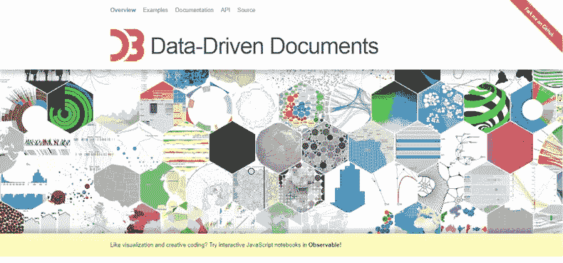

当我们想到今天的图表时， [D3.js](http://d3js.org/) 是第一个出现的名字。作为一个开源项目，D3.js 无疑带来了许多现有库中所缺少的强大特性。像[动态属性](https://d3js.org/#properties)、[进入和退出](https://d3js.org/#enter-exit)、[强大的转换](https://d3js.org/#transitions)等特性，以及对 jQuery 语法的熟悉，使它成为制作图表的最佳 JavaScript 库之一。D3.js 中的图表是通过 HTML、SVG 和 CSS 呈现的。

与许多其他 JavaScript 库不同，D3.js 不附带任何现成的预构建图表。但是，您可以查看用 D3.js 构建的[图列表来获得一个概述。如您所见，D3.js 支持各种各样的图表类型。](https://github.com/mbostock/d3/wiki/Gallery)

初学者的一个缺点可能是其陡峭的学习曲线，但有许多[教程](https://github.com/d3/d3/wiki/Tutorials)和[资源](https://github.com/d3/d3/wiki#resources)让你开始。

D3.js 不能很好地与 IE8 这样的老浏览器兼容(但是谁能呢？).但是你总是可以使用像 [aight plugin](https://github.com/shawnbot/aight) 这样的插件来实现跨浏览器的兼容性。

如果你想学习 D3.js，我们有一本关于用 D3 进行[数据可视化的书。](https://www.sitepoint.com/premium/books/introduction-to-data-visualization-with-d3/)

## Plotly.js

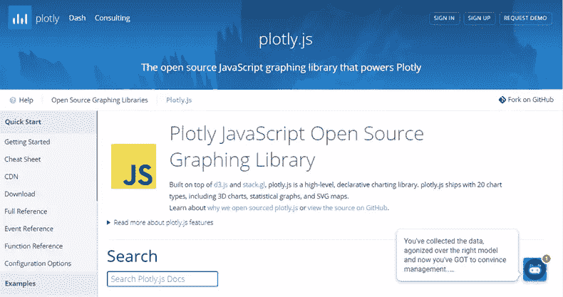

Plotly.js 是第一个科学的网络 JavaScript 图表库。它自 2015 年以来一直是开源的，这意味着任何人都可以免费使用它。Plotly.js 支持 20 种图表类型，包括 SVG 地图、3D 图表和统计图。它建立在 D3.js 和 [stack.gl](https://github.com/stackgl) 之上。

## 谷歌图表

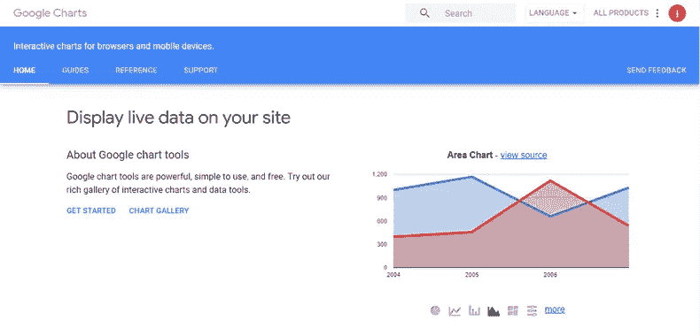

对于不需要复杂定制的简单项目，Google Charts 是一个很好的选择。它提供了许多预先构建的图表，如面积图、条形图、日历图、饼图、地理图等。所有图表都是交互式的，您可以在几分钟内将它们添加到您的页面上。

Google Charts 还带有各种定制选项，有助于改变图表的外观。图表使用 HTML5/SVG 呈现，为 iPhones、iPads 和 Android 提供跨浏览器兼容性和跨平台可移植性。它还包括 VML 支持旧版本的 IE 浏览器。

这里有一个很棒的使用谷歌图表的例子列表。

## 查尔特

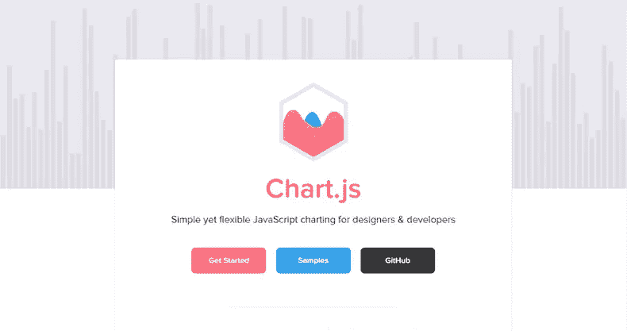

ChartJS 为图表提供了漂亮的平面设计。它使用 HTML5 Canvas 元素进行渲染，并支持所有现代浏览器(IE11+)。

默认情况下，ChartJS 图表是响应性的。它们在手机和平板电脑上运行良好。有 8 种不同类型的现成图表(折线图、条形图、雷达图、圆环图和饼图、极区图、气泡图、散点图、面积图)，还可以混合使用。所有图表都是动画和可定制的。

这里是用 ChartJS 构建的一个[精选的例子列表。](https://www.chartjs.org/samples/latest/)

## Chartist.js

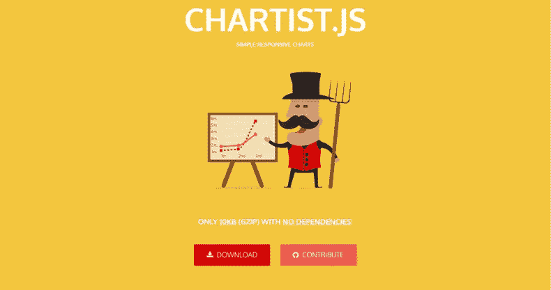

[charist . js](http://gionkunz.github.io/chartist-js/)提供漂亮的反应图表。就像 ChartJS 一样，Chartist.js 是一个因使用高价 JavaScript 图表库而受挫的社区的产物。它使用 SVG 来呈现图表。它可以通过 CSS3 媒体查询和 Sass 进行控制和定制。另外，请注意 Chartist.js 提供了仅在现代浏览器中有效的酷动画。

您可以在 [Chartist.js 示例页面](http://gionkunz.github.io/chartist-js/examples.html)探索和使用不同类型的图表。这些图表是交互式的，您可以随时编辑它们。

## 雷查尔兹

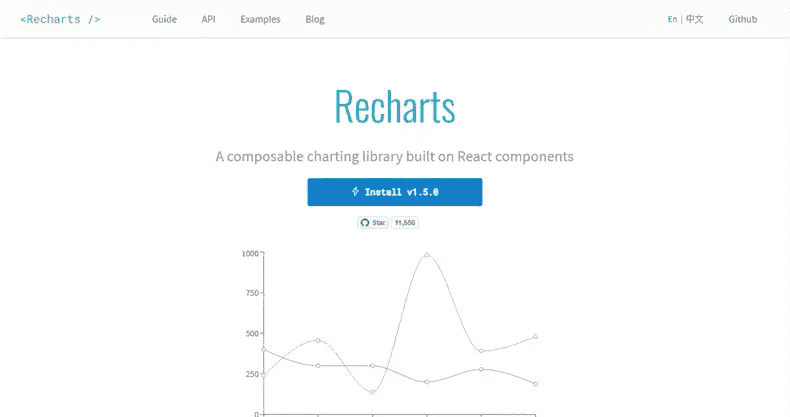

Recharts 是一个可组合的图表库，用于使用解耦的、可重用的 React 组件构建图表。它是建立在 SVG 元素和 D3.js 之上的。查看[示例列表](http://recharts.org/en-US/examples)。

## n3 图表

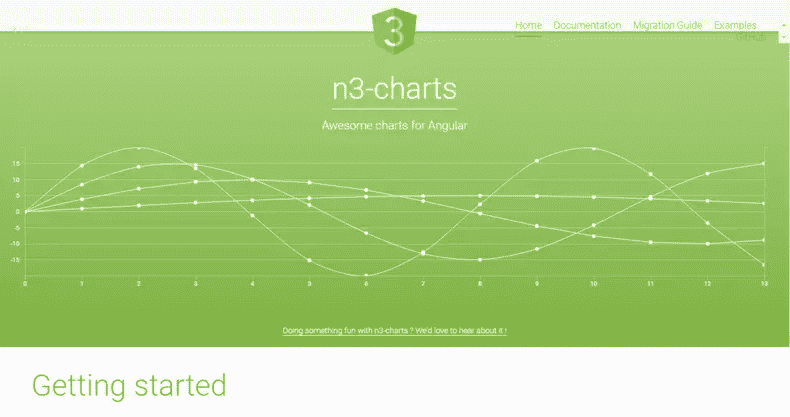

如果你是一个 Angular 开发者，你一定会发现 [n3-charts](http://n3-charts.github.io/line-chart) 极其有用和有趣。n3-charts 建立在 D3.js 和 Angular 之上。它以可定制的角度指令的形式提供各种标准图表。

查看使用 n3-charts 构建的图表列表[。](http://n3-charts.github.io/line-chart/#/examples)

## zing 聊天

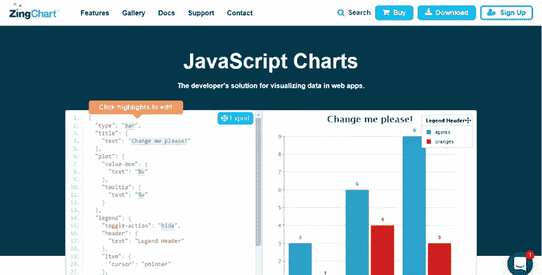

[ZingChart](https://www.zingchart.com/) 为快速创建图表提供了一个灵活、交互式、快速、可扩展的现代化产品。他们的产品被苹果、微软、Adobe、波音和思科等公司使用，并使用 Ajax、JSON、HTML5 快速提供漂亮的图表。

ZingChart 提供了超过 35 种响应图表类型和模块，也可以实时显示数据。它们可以通过 CSS 进行样式化和主题化，并且可以快速渲染大数据。

你可以看看他们的[丰富的例子](https://www.zingchart.com/gallery/)。

带有所有图表的品牌版本可以免费试用，但对于无水印的输出，你需要根据你的业务规模购买一个 ZingChart 的付费许可证。

## 高图表

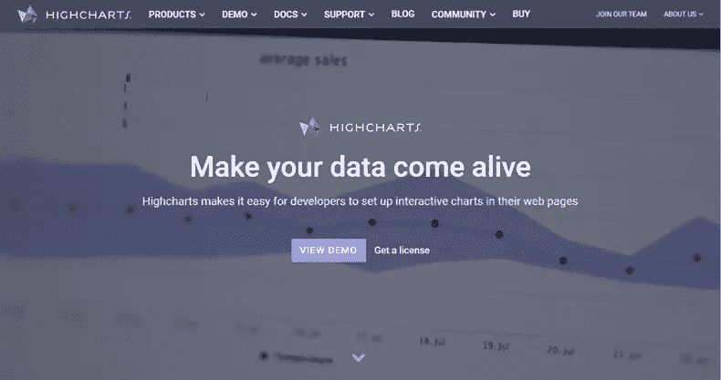

Highcharts 是另一个非常流行的构建图表的库。它装载了许多不同类型的酷动画，足以吸引许多眼球到你的网站。就像其他库一样，Highcharts 附带了许多预构建的图形，如样条、面积、面积线、柱形图、条形图、饼图、散点图等。图表反应灵敏，可随时移动。此外，Highcharts 还提供了一些高级功能，比如为图表添加注释。

使用 Highcharts 的最大优势之一是兼容旧浏览器——甚至可以追溯到 Internet Explorer 6。标准浏览器使用 SVG 进行图形渲染。在传统的 Internet Explorer 中，图形是使用 VML 绘制的。

大多数流行语言都有包装器(。NET、PHP、Python、R 和 Java)和框架(Angular、Vue 和 React)，以及针对 iOS 和 Android。

虽然个人使用 Highcharts 是免费的，但商业使用需要购买许可证。

## FusionCharts

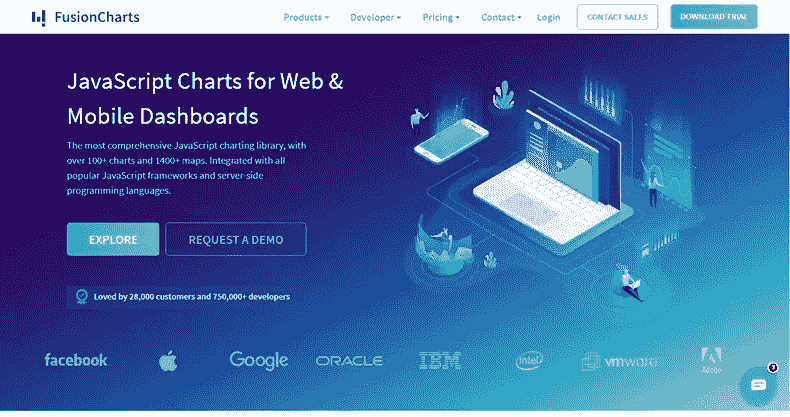

FusionCharts 是最古老的 JavaScript 图表库之一，发布于 2002 年。拥有超过 100+的图表和 1400+的地图，很容易说 FusionCharts 是最全面的 JavaScript 图表库。它提供了与所有流行的 JavaScript 框架和服务器端编程语言的集成。图表使用 HTML5/SVG 和 VML 呈现，以获得更好的可移植性和与旧浏览器的兼容性，甚至可以追溯到 Internet Explorer 6。这种向后兼容性使得它在很长一段时间内都是非常受欢迎的选择。您可以导出 JPG、PNG、SVG 和 PDF 格式的图表。

你可以在个人项目中免费使用 FusionCharts 的水印版本。但是，您需要购买商业许可证来删除水印。

## Flot

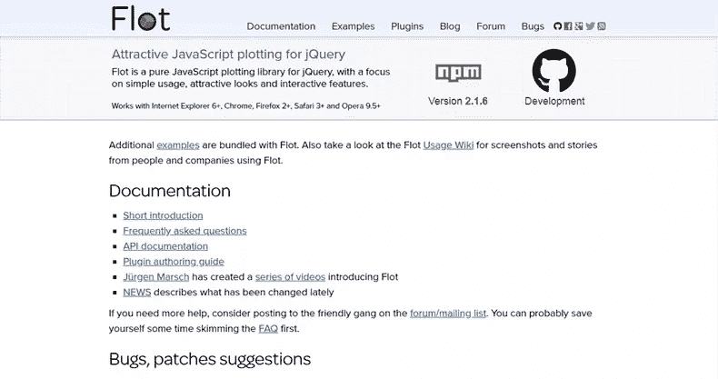

Flot 是一个用于 jQuery 的 JavaScript 图表库。它也是最古老和最受欢迎的图表库之一。

Flot 支持线条、点、填充区域、条以及它们的任意组合。它也兼容旧的浏览器——可以追溯到 IE6 和 Firefox 2。

Flot 完全免费使用。这里有一个使用 Flot 创建的示例图的[列表。](https://www.flotcharts.org/flot/examples/)

## amCharts

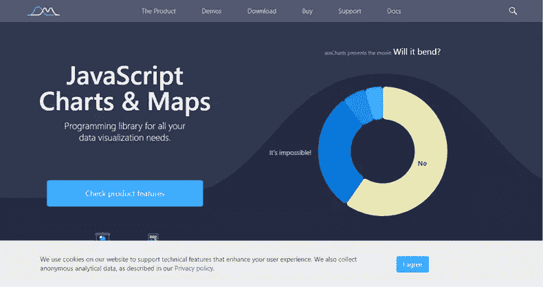

毫无疑问，amCharts 是最漂亮的图表库之一。它提供了图表和地理地图(地图图表)，允许高级数据可视化。

[地图图](https://www.amcharts.com/javascript-maps/)包印象非常深刻。它允许你用几行代码创建各种交互式地图。该软件包提供的一些重要功能包括地图投影、坐标转换和热图。有很多捆绑地图，你也可以自己制作。

amCharts 使用 SVG 来呈现适用于所有现代浏览器的图表。它提供了与 TypeScript、Angular、React、Vue 和普通 JavaScript 应用程序的集成。

查看使用 amCharts 创建的这个奇妙的[酷演示集合。](https://www.amcharts.com/demos/)

amChart 的免费版本会在每个图表的顶部留下一个到其网站的反向链接。

## 画布 js

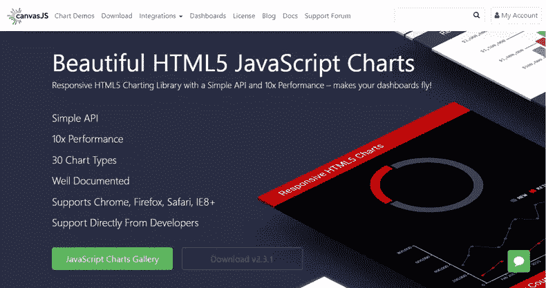

CanvasJS 是一个响应迅速的 HTML5 图表库，具有高性能和简单的 API。它支持 30 种不同的图表类型(包括折线图、柱形图、条形图、面积图、样条图、饼图、圆环图、堆积图等)。)，这些都是有据可查的。所有图表都包括交互式功能，如工具提示、缩放、平移、动画等。CanvasJS 可以与流行的框架(Angular、React 和 jQuery)和服务器端技术(PHP、Ruby、Python、ASP.Net、Node)集成。JS，Java)。

这里是 CanvasJS 图表示例的互动集合。

## 吐司 UI 图表

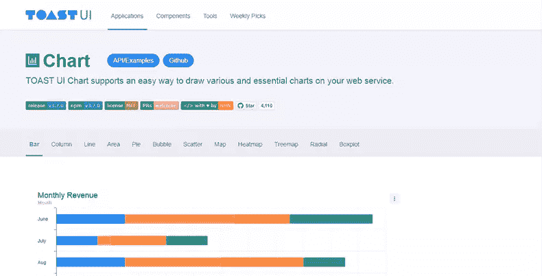

[TOAST UI Chart](https://ui.toast.com/tui-chart) 是一个开源的 JavaScript 图表库，支持包括 IE8 在内的传统浏览器。它包括所有常见的图表类型和地图，可以使用用户定义的主题进行自定义。这些图表也可以组合成组合图，例如柱形图与折线图或折线图与面积图等。查看完整的示例列表。

## AnyChart

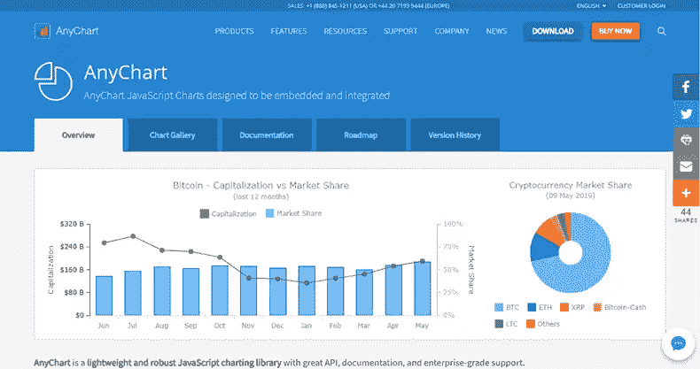

AnyChart 是一个轻量级的、健壮的 JavaScript 图表库，其图表被设计为嵌入和集成的。AnyChart 允许您显示 68 种现成的图表，并提供创建自己的图表类型的功能。您可以将图表保存为 PDF、PNG、JPG 或 SVG 格式的图像。

AnyChart 为用户提供了五种学习该库的资源(文档、API 参考、游乐场、Chartopedia 和 FAQ)。

注册后可以免费下载带水印的版本。然而，要摆脱品牌化，将 AnyChart 用于商业目的，就必须购买许可证。

## 结论

现在取决于您为未来的项目选择最好的图表库。喜欢完全控制自己图表的开发者肯定会选择 D3.js，上面几乎所有的库都有很好的栈溢出论坛支持。

如果你正在寻找生成现成图表的工具，请阅读 [5 篇创建惊人在线图表的工具](https://www.sitepoint.com/creating-great-online-charts/)文章。你也可以阅读[使用 D3.js](https://www.sitepoint.com/creating-simple-line-bar-charts-using-d3-js/) 创建简单的折线图和条形图来开始使用 D3.js。我们也有一个关于使用[谷歌图表和 Angular](https://www.sitepoint.com/creating-visualization-app-using-google-charts-api-angularjs/) 的专门系列，还有一本书:[用 D3](https://www.sitepoint.com/premium/books/introduction-to-data-visualization-with-d3/?utm_source=blog&utm_medium=articles) 进行数据可视化的介绍。

还有很多其他的图表和图形库。这里有一些更值得一看的:

*   GoJS 是一个 JavaScript 图表库，用于交互式流程图、组织结构图、设计工具、计划工具、可视化语言。
*   [C3.js](https://c3js.org/) 是基于 D3 的可复用图表库。
*   dimple 是一个面向对象的商业分析 API，由 D3 提供支持。
*   [Charted](https://www.charted.co/) ，by Medium，是一个自动可视化数据的工具。你只要给它一个数据文件的链接。(你可以在媒体上了解更多[。)](https://medium.com/data-lab/introducing-charted-15161b2cd71e)
*   如果你正在处理实时数据流，思慕雪图表会很有帮助。
*   Chartkick.js 是一个允许你用一行 JavaScript 创建漂亮图表的库。
*   Morris.js 是一个功能强大的库，界面简洁。它允许你轻松地创建好看的图表。它基于 jQuery 和 raphal JavaScript 库。

最后，这里有一些快速创建信息图的简单工具:

*   [infogram](https://infogram.com/) 可以在几分钟内轻松创建引人入胜的信息图表和报告。
*   Piktochart 是一个简单、直观的工具，可以帮助你表示各种数据。
*   easely 是一个简单的信息图表制作工具，可以让你可视化任何类型的信息。

如果你需要提高你的 JavaScript 技能，你也可以在我们的图书馆查阅各种 [JavaScript 书籍](https://www.sitepoint.com/premium/library?utm_source=blog&utm_medium=articles)。

## 分享这篇文章