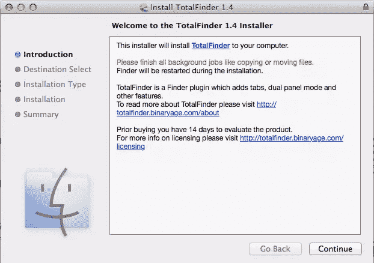
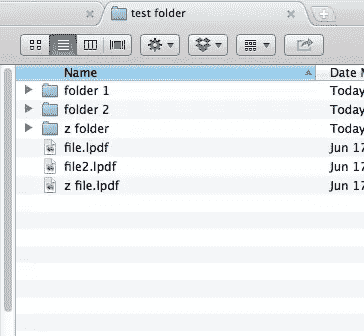
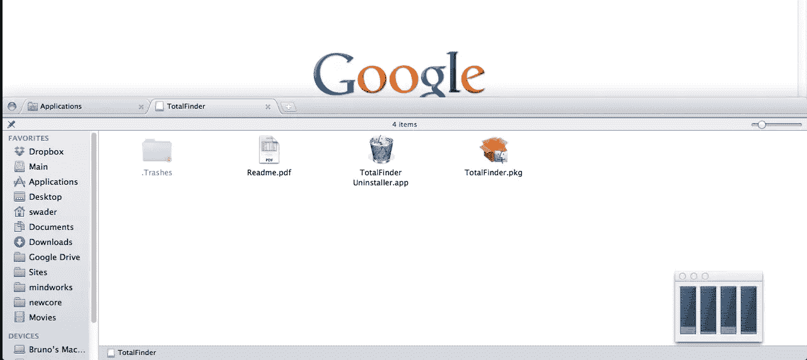
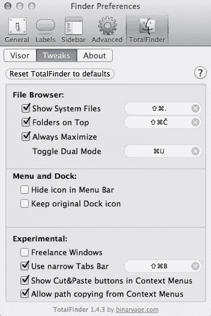
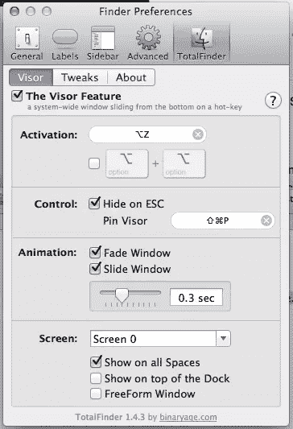
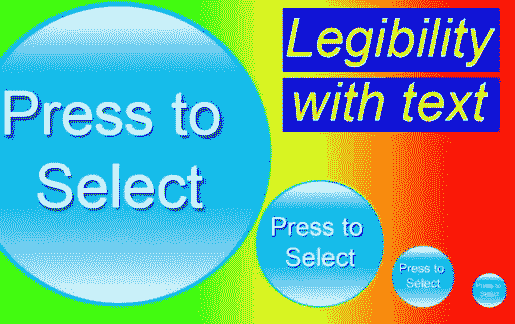

# 图标设计的最佳实践

> 原文：<https://www.sitepoint.com/best-practices-for-icon-design/>

图标是品牌拼图的重要组成部分，也是设计师赚取额外收入的绝佳方式。看起来大多数客户想要他们自己的定制图标，这比你想象的要容易。

但是，图标也可以创造一个可怕的混乱，如果他们做错了。它们在设计方案中有独特的、集中的功能。然而，我经常观察到计划不周的图标设计，要么让人困惑、分心，要么就是毫无意义。

这些技巧是基于我自己的经验，当我有机会定制图标时，它们对我很有帮助。像任何其他特定的设计元素一样，有一些通用规则可以让你远离麻烦。但是不要害怕打破这些——尤其是当你在做实验或者只是玩玩的时候。只要确保你确切地知道你为什么要打破这些常规，这样你就可以在向客户传达疯狂的想法之前退后一步，变得客观一些。

### 了解背景

并非所有图标的功能都一样。语境才是王道！有时候你需要为一个网站创建图标。在其他情况下，你正在构建一系列在软件中使用的图标。还有一些是系统托盘/dock 图标——PC 和/或 Mac。

你必须知道你设计图标的背景，并从那里开始。否则你会迷失在不相关的细节中，或者更糟，最终设计出完全不合适的东西。

### 从标准开始

我总是喜欢从一些标准开始。通常这意味着研究我真正喜欢的其他人设计的图标。因此，我花了一段时间收集我自己最喜欢的图标设计，并提出了一些最好的例子。

这给了我一个基线，也帮助我处理像图标这样的超小设计。我很容易感到沮丧，觉得自己的选择余地受到了极大的限制。当我提出一些我喜欢的标准时，我会变得兴奋，感觉精神焕发。

这也帮助我避开陷阱，打破我的框框。我保留了一些我最喜欢的，但是我也总是在开始之前去寻找一些新的想法。

### 品牌知名度

设计时要牢记品牌。你可能有一整个系列的网站图标，可以很容易地集成到软件包中。不要多此一举！用你所拥有的！

但是，即使你是从零开始，把基本的品牌元素摆在你面前总是一个好主意。我喜欢把商标、色板、任何特定的字体、小册子和网站都放在我面前。希望客户有一个明确的品牌计划，反映在这些营销材料中。

如果没有，不用担心。只需关注最好的品牌元素，并将其融入你的图标中。基本的颜色和形状是一个很好的选择，因为图标是如此简单。所以，这里不要太担心。在将品牌整合到图标设计中时，考虑高层次的颜色和形状。

### 一致的风格

当我设计图标时，我喜欢将图层样式保存在 Photoshop(或者任何你喜欢用来设计图标的软件)中。这让我可以快速地将相同的基本效果应用到我所有的图标上，以保持相似的外观和感觉。

阴影和倒影是我脑海中闪现的两个最简单的设计概念，我必须从一个图标到下一个图标不断重复。做一次，适用于他们所有人。没有必要再经历所有这些步骤。

这也为你的设计创造了一个清晰的模式，并使这个模式紧密而集中。如果一个图标上的全局灯与另一个图标上的全局灯相差 20 度，你可能会认为这没什么大不了的，但事实就是如此！好吧，也许只有最挑剔的用户会注意到，但是现在防止这种错误发生在图层样式上太容易了。

### 简单

避免有很多不同形状和想法的复杂设计。我见过很多整合了背景、多种形状和一个巨大的勾号的图标设计。太过分了！太多了！

保持图标简单。它们的功能是给用户一个快速的视觉参考。设计越简单，解读越快。当然，太简单也不好。但是大多数情况下的趋势是过多的设计元素走得太远。

看看你的图标，看看有没有什么不影响创意的可以去掉。如果有，就切！

### 图标应该是…图标

这又回到了不重新发明轮子的问题上——有很多定义明确的图标已经传达了它们各自的信息。将这些整合到您的设计中，节省您自己的时间，更不用说您的用户的精力了。

例如，我们都很熟悉如今几乎每个网站都使用的强制性 RSS 提要符号。你不用看就已经知道我在说什么了。所以当你要做一个客户 RSS 图标的时候，不要试图从零开始。实现那个明显的标志，增加你的品牌的触感，然后继续前进。

### 创建多个尺寸

不要忘记检查你的图标可以显示的尺寸。您可能需要为每种可能的尺寸进行设计。有些图标高达 512 x 512 像素。

这就是语境如此重要的地方。大多数图标是静态的——你确切地知道它们有多大，以及它们每次是如何显示的。但是有时候你要为一个不简单的环境设计。所以要知道你的图标会被如何使用，并做好相应的准备。

### 避免不必要的符号

我在图标设计中看到的一个巨大的、恼人的、明显的错误是添加了额外的符号。如果你必须在你的图标上加一个勾号或者一个巨大的 X，那就不要加这个图标。单独使用复选标记或 X。否则，你会打乱设计。

问问你自己是否所有的符号都是必要的。如果有，图标有必要吗？通常你会发现两者都不需要。就是没必要！在大多数情况下，如果你使用适当的符号，用户可以从上下文中猜出该做什么。

### 避免图标内部文本

另一个突出的问题是图标中文本的使用。为什么？真的吗？！你认为用户需要那么多指导吗？品牌这么重要，非要往图标里塞人物吗？不要！这是一个图标。保持简单。

这条规则有一个例外。非常大的图标失去了它们的图标价值——它们看起来更像巨幅图片。在这些罕见的情况下，您可能希望包含一些文本，以便从严格的用户体验角度来帮助人们。但是，这些应该是规则的例外，而不是图标设计的标准。

图标是网站可用性的重要组成部分。确保使用图标设计的最佳实践来帮助客户让他们的客户满意，并最终帮助你赚大钱。我很想看看你设计的一些图标，尤其是盒子外面的设计。

有什么自己的建议吗？欢迎在下面的评论中分享！

## 分享这篇文章