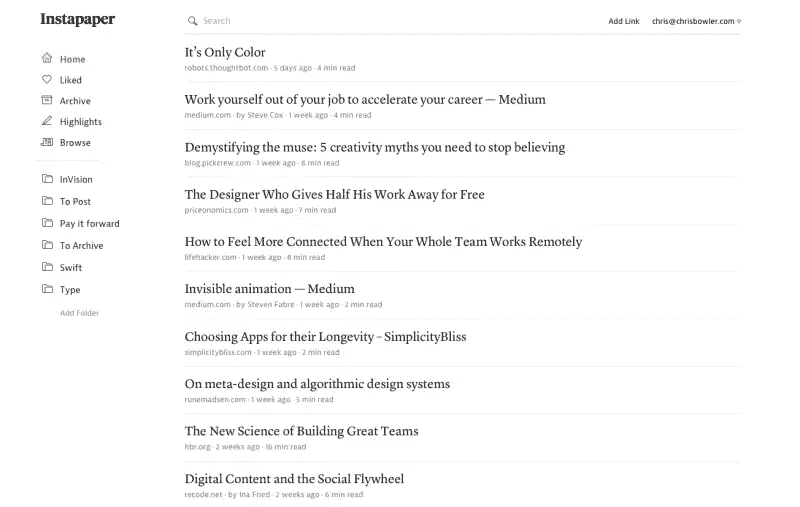
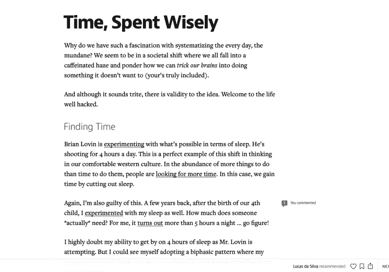
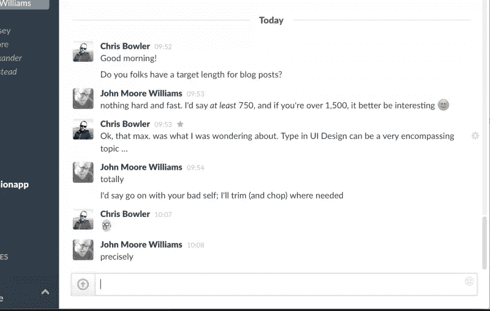
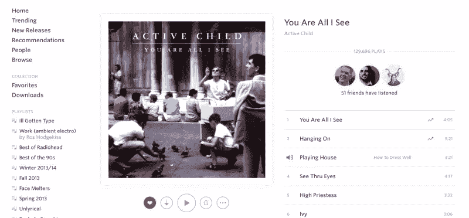

# 为你的用户界面选择最好的版式

> 原文：<https://www.sitepoint.com/best-typography-ui/>

沟通在设计中起着至关重要的作用。无论你是设计网站、移动应用还是可穿戴用户界面，你的作品都必须清楚地传达它们的意图和目的。因为文字在交流中起了很大的作用，所以你需要对排版有很深的理解。

当然，设计用户界面不同于设计电子书或博客主题。但是以类型为中心的设计原则仍然适用。毕竟屏幕上的交流是通过文字发生的，而文字就是语言的 UI。

正如 Oliver Reichenstein 在他的开创性文章中所说的那样， *[网页设计 95%是排版](https://ia.net/know-how/the-web-is-all-about-typography-period "ia.net")* :

> 优化排版就是优化可读性、可访问性、可用性(！)，整体图形平衡。

换句话说:优化你的排版也优化了你的用户界面。这里有 4 种方法可以做到这一点——另外还有 3 种漂亮的产品可以充分利用它们。

## 关于在用户界面(ui)中设置类型的 4 个提示

印刷大师 Robert Bringhurst 以这样一句话开始了他的巨著*印刷风格的要素*:

> 排版是为了尊重内容而存在的

每个界面都包括用户可以做出的一系列选择。你的类型应该支持决策过程，以一种不会增加用户认知负荷的方式尊重内容。优秀的排版吸引读者的是内容，而不是字体本身。

### 1.选择适合各种尺寸的字体

大多数用户界面需要不同大小的文本元素(按钮副本、字段标签、部分标题等)。选择适合多种尺寸和粗细的字体，以保持每种尺寸的可读性和可用性。

**例子**:未来，宇宙，侧面

### 2.选择一种字体容易识别的字体

许多字体很容易混淆相似的字体。大写的 I 和小写的 L 可能看起来一样。小写的 R 和 N 放在一起，很容易变成小写的 m。因此，选择一个能清楚区分这两种形式的字体，让你的用户明白一些事情。

**举例** : Clear Sans vs. Lato(看大写的 I 和小写的 L)

如果你[跳过 lorem ipsum](http://blog.invisionapp.com/10-ux-copywriting-tips-designers/ "10 UX COPYWRITING TIPS FOR DESIGNERS") 并在你的 Vision 原型中使用真正的副本，你会发现这样容易混淆的字母组合。

### 3.将文本视为用户界面

卡梅隆·摩尔(Cameron Moll)近十年来一直在宣扬这条信息，他说好的设计师把文本当作内容，伟大的设计师把文本当作 UI。

冒着听起来多余的风险，在设计界面时，这是千真万确的。当你的文本代表一个功能元素时，它就是 UI。UI 设计的所有实践都适用于你的类型。如果你不相信，就想想当你遇到一扇标有“推”的拉手门时的困惑。

### 4.考虑要做的工作

如果你不熟悉 JTBD，它是一个将你的设计聚焦于用户需求的框架。所以问问你自己你在帮助用户解决什么问题。这个问题的答案应该决定你的 UI 决策，包括类型。

正如蒂姆·布朗所说:

> 不同的字体做不同的工作。

Instapaper 的设计师们在将字体与要做的工作相匹配方面做得非常出色。

Instapaper 的网络和移动应用有两个功能:

1.  让人们保存网络内容以备后用
2.  给他们一个阅读的地方。

因为用户界面主要是基于文本的，并且专注于阅读，Instapaper 的设计师选择了两种非常不同的字体:文本中的衬线字体和内容的显示权重，以及用户界面中的无衬线字体 JAF·伯尼诺·桑斯。这在你想要享受的内容和帮助你完成工作的内容(UI 元素)之间建立了一个清晰的界限。

这些字体选择发挥了用户的期望，产生了难以置信的效果。从成千上万的书籍、杂志和报纸中，我们已经习惯于通过衬线字体的媒介来看到和消费长格式的内容。随着网络的出现，最近的无衬线风格真正发挥了它的作用，使它成为 UI 元素的自然选择。

## 向专业人士学习

令人欣慰的是，在排版一个漂亮、可用的用户界面方面，有很多网站可以启发和指导。以下是我最喜欢的三个。

## 中等

Medium 出色地阐释了“文本即 UI”的概念。作为一个阅读和写作的平台(各种长度的[文本)，Medium 赋予了 type 最高的优先权。其他写作平台和 CMSes 可以很好地遵循示例介质集。](https://medium.com/inside/blogging-on-medium-95f1546bcd7d)

发布的内容(设定在 [Freight Text Pro](http://www.dardenstudio.com/typefaces/freight_text) 和[JAF·伯尼诺·桑斯](http://justanotherfoundry.com/bernini-sans))华丽、易读，充满了深思熟虑的、多用途的治疗。(两种不同的 blockquote 风格？是的，请！)此外，写作体验与最终发布的形式完全相同，因此无需在各种模式之间切换——所见即所得。

功能部分呢？它们被设置在 Bernino 中，与内容标题一样，但是由于它们在 UI 应用程序中的尺寸较小，所以很容易区分。

## 松弛的

在这个例子中，文本仍然是内容的主要形式。作为一个团队交流平台，Slack 在交互和内容元素上都非常依赖文本。像 Buffer 一样，它坚持单一的字体( [Lato](http://www.latofonts.com/) )，但是充分利用了它。

通过对外壳、不同重量和颜色以及空白空间的深思熟虑的应用，Slack 的设计师们创造了一个既易于导航又易于阅读的平台。

## Rdio

作为一款音乐 app，Rdio 对文字的依赖最小。但即使在这里，我们也看到它被视为 UI 的一部分，字体( [Whitney](http://www.typography.com/fonts/whitney/overview/) )在各种尺寸下都工作得很好。

**先不说** : *拉托和惠特尼都有一个类似的大写“I”和小写“l”的问题，一定要经常检查你正在考虑的字体的完整字符集，并评估这对你的产品来说可能是一个多大的问题。*

### 在用户界面中设置类型

不管你项目的目的是什么，类型都会在你的 UI 中扮演一个至关重要的角色。设置得好，它会让你的用户受益，设置得不好，它会妨碍他们。但是有了这些指导方针和大量的实践，你会为你的类型和你的用户做出更好的决定。

## 分享这篇文章