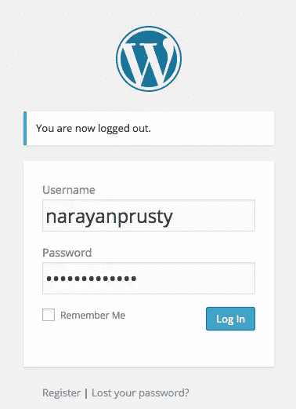
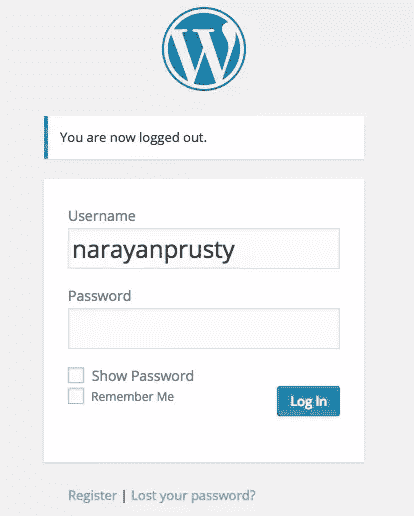
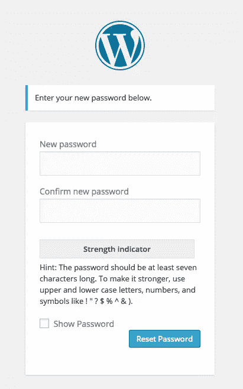
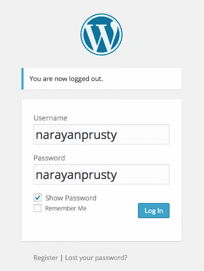
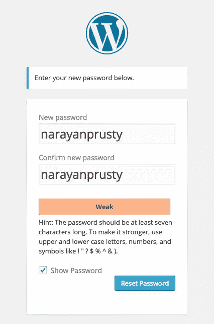

# WordPress 表单中更好的密码屏蔽

> 原文：<https://www.sitepoint.com/better-password-masking-in-your-wordpress-forms/>

密码屏蔽是开发人员使用的一种技术，用于防止用户在键入密码时有人读取屏幕上的密码。然而，当涉及到用户体验时，密码屏蔽最终会导致许多问题。在本文中，我们将概述由密码屏蔽引起的一些问题以及一些解决方案。

特别是，我们将关注与 WordPress admin 登录和密码重置表单上的密码屏蔽相关的用户体验问题。我们还将创建一个 WordPress 插件，在登录和密码重置表单中添加一个复选框，以显示或隐藏屏蔽密码字段中的文本。

## 什么是密码屏蔽？

密码屏蔽是一种隐藏密码字段中所有字符的做法。这样做是为了防止有人在用户键入密码时阅读屏幕上的密码。

以下是屏蔽密码字段的外观:



然而，在实践中，这可能导致许多现代计算设备的可用性问题，这些设备或者具有较小的键入键，或者使用触摸屏。

## 密码屏蔽导致的可用性问题

用户倾向于在键盘较大的设备上犯较少的打字错误，因为打字时手指更容易放进去。用户在使用按键较小的设备(如手机和平板电脑)时也容易犯更多的打字错误，因为他们的手指不太适合打字。

如果手机屏幕上有一个密码字段被屏蔽，用户无法检查输入的密码是什么(用户打算输入什么)，那么这可能会导致用户感到沮丧并离开您的网站，因为用户可能会因为较小的密钥而无意中多次输入错误的密码。

拥有人机交互博士学位的网站可用性顾问 Jakob Nielsen 曾经说过:

> 当用户输入密码时，可用性受到影响，他们得到的唯一反馈是一排子弹。通常情况下，屏蔽密码甚至不会增加安全性，但它会因登录失败而使您的业务付出代价。

从那时起，开发人员开始重新思考这个问题以及解决这个问题的潜在解决方案。

## 密码屏蔽导致的可用性问题的解决方案

一些开发人员提出了几种解决方案来解决手机密码屏蔽的可用性问题。以下是一些受欢迎的方法:

1.  **取消最后一个字符的屏蔽**:我们可以在用户输入时取消密码文件最后一个字符的屏蔽，让用户检查是否输入了正确的字符，从而使用户更容易理解。
2.  **解除字段焦点的屏蔽**:当用户将光标移动到密码字段上时，我们可以简单地解除密码的屏蔽。该方法仅适用于具有鼠标指针的设备，因此不适用于移动设备。
3.  **使用复选框**取消屏蔽:我们也可以让用户使用复选框取消屏蔽和屏蔽密码字段。以前的解决方案很好，但仅限于计算机。但是这种解决方案适用于所有设备，并且是目前解决这个问题的最佳方案。

在本教程中，为了更好地屏蔽 WordPress 登录和密码重置表单上的密码，我将在表单中添加一个复选框来隐藏或显示密码。

## 插件目录和文件

要开始插件开发，在你的 *wp-content/plugins* 目录下创建一个名为*密码屏蔽*的目录，然后在里面创建一个名为【password-masking.php】的文件和另一个名为*密码屏蔽. js* 的文件。

我们的目录结构应该如下所示

```
--password-masking
	-password-masking.php
	-password-masking.js 
```

在*password-masking.php*文件中，添加以下文本使插件可安装。

```
< ?php

/**
 * Plugin Name: Password Masking
 * Plugin URI: https://www.sitepoint.com/
 * Description: A plugin to add "show password checkbox" to Login and Password Reset Forms.
 * Author: Narayan Prusty
 */ 
```

我们需要将 *password-masking.js* 文件放入登录和密码重置页面。要让脚本文件入队，请将这段代码添加到您的 password-masking.php 文件中:

```
function pm_enqueue_scripts() 
{
    wp_register_script("pm-js", plugins_url("password-masking/password-masking.js"));
    wp_enqueue_script("pm-js");
}

add_action("login_enqueue_scripts", "pm_enqueue_scripts"); 
```

这里我们首先使用`wp_register_script`函数注册脚本，然后使用`wp_enqueue_script`进行排队。

`login_enqueue+scripts` action hook 用于将脚本和样式表加入管理员登录、注册和密码重置页面。

### 向登录表单添加复选框

为了给登录表单添加一个复选框，我们需要使用`login_form`动作钩子。这个钩子用于定制内置的 WordPress 登录表单，让我们添加新的字段。

将这段代码放在*password-masking.php*文件中，将复选框添加到登录表单中:

```
function display_login_checkbox() 
{ 
    ?>
        <p>
            <label for="passwordmask">
                <input name="passwordmask" type="checkbox" id="passwordmask" onclick="passwordMasking_LoginForm()"/> 
                Show Password
            </label>
        </p>    
    < ?php 
}

add_action("login_form", "display_login_checkbox"); 
```

这里我们添加了一个 id 为`passwordmask`的复选框。点击支票调用`passwordMasking_LoginForm()`功能。

现在，登录表单应该如下所示:



单击复选框不会取消密码字段的屏蔽，因为我们还没有为该功能编写 JavaScript 代码。

### 向密码重置表单添加复选框

要将复选框添加到密码重置表单，我们需要使用`resetpass_form`操作挂钩。这个钩子用来定制内置的 WordPress 密码重置表单，让我们添加新的字段。

将此代码放在*password-masking.php*文件中，以向密码重置表单添加一个复选框:

```
function display_password_reset_checkbox() 
{ 
    ?>
        <p>
            <label for="passwordmask">
                <input name="passwordmask" type="checkbox" id="passwordmask" onclick="passwordMasking_ResetForm()"/> 
                Show Password
            </label>
        </p>    
    < ?php 
}

add_action("resetpass_form", "display_password_reset_checkbox"); 
```

这里我们还添加了一个 id 为`passwordmask`的复选框。点击支票调用`passwordMasking_ResetForm()`功能。

现在，密码重置表单应该如下所示:



但是点击复选框不会取消密码字段的屏蔽，因为我们还没有为该功能编写 JavaScript 代码。

### 取消登录表单密码字段的屏蔽

当用户点击*显示密码*复选框时，要取消对登录表单密码字段的屏蔽，我们需要将密码字段的`type`属性改为`text`。

将此代码放在`password-masking.js`文件中以添加此功能:

```
function passwordMasking_LoginForm()
{
    var checkbox = document.getElementById("passwordmask");

    if(checkbox.checked)
    {
        document.getElementById("user_pass").type = "text";
    }
    else
    {
        document.getElementById("user_pass").type = "password";
    }
} 
```

这里，当用户点击复选框时，调用`passwordMasking_LoginForm()`。

在这里，如果密码字段没有被取消屏蔽，那么我们在复选框切换上屏蔽它，反之亦然。以下是登录表单上未屏蔽密码字段的外观:



### 取消密码重置表单的密码字段的屏蔽

为了在用户点击*显示密码*复选框时取消密码重置表单的密码字段的屏蔽，我们需要将密码字段的`type`属性更改为`text`。

将此代码放在`password-masking.js`文件中以添加此功能:

```
function passwordMasking_ResetForm()
{
    var checkbox = document.getElementById("passwordmask");

    if(checkbox.checked)
    {
        document.getElementById("pass1").type = "text";
        document.getElementById("pass2").type = "text";
    }
    else
    {
        document.getElementById("pass1").type = "password";
        document.getElementById("pass2").type = "password";
    }
} 
```

这里，当用户点击复选框时，调用`passwordMasking_ResetForm()`。

在这里，如果密码字段没有被取消屏蔽，那么我们在复选框切换上屏蔽它，反之亦然。以下是密码重置表单上未屏蔽的密码字段的外观:



## 结论

在本文中，我向您展示了如何轻松地构建一个插件，在登录和密码重置表单上添加一个*显示密码*复选框。我们还看到了屏蔽密码字段的可用性问题以及针对该问题的各种解决方案。

现在你可以继续在你的网站上的 WordPress 前端表单中使用这种技术。

你可以在这里获得[插件的完整副本。请在下面的评论中告诉我你的想法。](https://github.com/qnimate/password-masking)

## 分享这篇文章