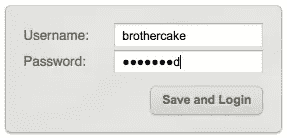

# 更好的密码#1:屏蔽密码字段

> 原文：<https://www.sitepoint.com/better-passwords-1-the-masked-password-field/>

密码字段。

我们都必须处理它们，但它们从来都不是一种乐趣。显然，它们必须以某种方式进行模糊处理——以防止路人窥探我们的密码——但当你看不到你输入的内容时，很容易变得犹豫不决，甚至紧张，不确定你是否输入了正确的信息。

我是一个经验丰富的打字员，但我仍然用一个手指输入密码！有些表格甚至要求你输入两次*，以确保你知道你输入了什么，并且你输入的是正确的。*

 *密码字段很烦人。一定有更好的方法。

## 平台解决方案

除了 Web 之外，已经出现了各种平台解决方案。Mac <abbr title="Operating System">OS</abbr> 无线密码栏旁边有一个“显示密码”复选框，允许你以纯文本方式查看密码；我们将在本系列的下一篇文章中讨论这个解决方案。

在本帖中，我们将探讨一种在手持设备中更常见的解决方案。最近的 Symbian 和 Android 设备做到了这一点，但可以说它在 iPhone 和 iPod touch 上更常见。

## 屏蔽密码字段

一个被屏蔽的密码域**隐藏了所有的字符*，除了最后一个字符***，该字符以纯文本显示。因此，您总是可以看到您键入的内容，但整个密码永远不会泄露，因此几乎不可能被偷偷读取:


**带有屏蔽密码字段的登录表单。**

我现在将向您展示一个脚本，它将这个行为添加到普通的`"password"`字段中。

剧本相当复杂。它的核心功能很简单，但是有几个与浏览器相关的和可用性的问题需要考虑，这些增加了一些复杂性。因此，虽然我会尽量让你对它如何工作有一个好的认识，但这不是一个<q>如何</q>的帖子，而是一个<q>是否</q>的概述。真正的本质在脚本本身，它被广泛地注释了什么做什么以及为什么做的细节。

看一下演示，抓住脚本。它适用于所有现代浏览器，包括:

*   **[蒙面密码演示](https://www.sitepoint.com/examples/password/MaskedPassword/demo.html)**
*   **[下载脚本](https://www.sitepoint.com/examples/password/MaskedPassword.zip)**

## 第一:标记

首先，我们需要一个`"password"`类型的字段。我们必须这样做作为一个渐进的增强，以便不支持或无脚本的浏览器仍然有一个正确的密码字段:

```
<label for="pword">Password:</label>
<input type="password" id="pword" name="pword" />
```

该脚本会将其转换为一个`"text"`字段，并创建第二个字段`"hidden"`。隐藏字段是我们存储普通的、未加密的密码版本的地方，而可见字段是用户输入的内容，也是显示屏蔽密码的地方。

这就是标记最终将变成的样子:

```
<label for="pword">Password:</label>
<span>
   <input type="hidden" name="pword" />
   <input type="text" class="masked" id="pword" autocomplete="off" />
</span>
```

您可以看到**只有隐藏字段保留了`name`属性**，因此它是唯一被提交的字段。可见字段是用户看到的，但是它的值对任何其他进程来说都是垃圾，所以我们阻止它被提交，并且(关键的)不允许 autocomplete 记住它(因为它记住的只是一系列点，没有办法解码它们)。

最初，我有一个优雅的过程来完成这种标记转换，但是很自然地，它在 <abbr title="Internet Explorer">IE</abbr> 中失败了。在 Internet Explorer 中，即使是最新版本，你也无法修改密码字段的`"type"`属性，或者设置在 <abbr title="Document Object Model">DOM</abbr> 中生成的*任何*表单字段的`"type"`。在 <abbr title="Internet Explorer">IE</abbr> 中创建表单域的唯一方法是用`innerHTML`将它们写在源文本中并注入页面！我知道这很难看，但这是成功的必要条件。

## 然后:事件

一旦我们有了标记，我们需要处理它的事件；我们必须能够响应*任何*类型的输入，无论是通过键盘、鼠标还是一些编程方式。有太多的方式，事实上，不可能提前满足所有人的需求*；但是我们可以追溯性地捕捉变化**，并在输入值后立即修改它。只要我们做得足够快，用户应该不会注意到差异。为了实现这一点，脚本使用了**四个事件监听器**。***

 ***前两个提供了坚实的基础，是最健壮的和跨浏览器兼容的；它们是:`onkeyup`捕捉主要的键盘输入，和`onchange`捕捉次要的输入，比如从鼠标粘贴。

然后我们用一些类似于`onchange`的非标准事件对它们进行补充，但这些事件会立即响应，而不是等待字段失去焦点；它们是:`oninput`(除了 <abbr title="Internet Explorer">IE</abbr> 之外，可以在最新版本的顶级浏览器中运行)，以及`onpropertychange`(仅限于 <abbr title="Internet Explorer">IE</abbr> )。但是，我们必须小心这些事件，因为它们也是由编程输入立即触发的；因此，我们必须注意，我们的代码不会通过引发一个它也会响应的事件来创建一个无限循环。

因此，随着事件侦听器的传播，我们已经覆盖了每个基础，并且可以通过任何方法响应用户输入，在大多数情况下几乎是即时的。当我们做出反应时，就是掩蔽发生的时候。

当新的输入到达文本字段时，第一个任务是从我们已经拥有的数据中推断出整个明文密码，再加上新的输入。例如，如果隐藏字段包含值`"passw"`，而文本字段现在有值`"●●●●wo"`，我们可以通过从第一个字母开始逐个字母计数来推断新值是`"passwo"`。一旦我们有了它，我们就对整个值进行编码，并将其写回可见字段，这样它现在显示为`"●●●●●o"`，同时用普通版本`"passwo"`更新隐藏字段。(点本身是一个 unicode 字符，`25CF`，这是大多数浏览器用于常规密码字段的字符。)

这是一个重复的、相互的过程:新的输入触发解码，解码触发重新编码，通过这个过程，我们不断地得到密码的屏蔽和明文版本；表单可以随时提交，隐藏字段将始终反映您可以看到的屏蔽值。

## 现在是抓住你的时候了！

正如我们刚刚看到的，掩码密码的编码和解码是通过逐个字符地比较两个值来实现的，但我们无法做到这一点，除非我们知道哪个字符等于哪个字符；例如，索引`[0]`处的点对应于同一索引处的字母。最终，我们**不允许用户在密码**的开头或中间输入字符，因为那会打破平衡；只有当输入被限制到末尾时，我们才能知道字符是如何等同的。

为了实现这一点，我们必须**限制插入符号的位置**，所以脚本有一个例程可以精确地做到这一点——只要字段有焦点，它就不断地强制插入符号位于末尾——这样您就可以从末尾编辑或选择，而不是从开头或中间。

我们还会遇到一些关于浏览器如何处理字段中包含的值的安全问题。由于我们正在处理的字段只是一个`"text"`字段，浏览器不会给予它特殊的考虑。对于 real `"password"`字段，值如何结转是有限制的；例如，用户在密码字段中的输入在软刷新后或返回历史记录时不会被保留；但是对于普通的文本字段，它是(或者可能是)。

因此，我们必须实现额外的行为来控制这一点。脚本将**从原始字段中删除任何默认值**，并且**还会触发`reset()`事件**来删除软刷新后的任何残留输入。(您还会记得我们不得不禁用字段的自动完成功能，因为浏览器试图记住的值只是一堆点。)

考虑到所有的事情，这个实现并不简单。正如我在开始所说的——它的核心很简单，但是魔鬼总是在细节中。

## 结论

这种 JavaScript 解决方案很可能无法在没有任何副作用的情况下实现。浏览器被设置为以比`"password"`字段更低的安全级别处理`"text"`字段，这种差异就是为什么需要额外的攻击来将屏蔽字段提升到相同的级别。但更基本的是，我们需要打破可见字段中的数据与其隐藏字段中的对应数据之间的物理链接，以消除输入限制，这实际上需要一个较低级别的实现(例如，能够将数据存储为单个字符的属性)。

我认为这种密码字段是一个好主意，但是浏览器应该把它作为一个`input`类型来实现。

## 分享这篇文章****