# 2015 年网页设计的大趋势

> 原文：<https://www.sitepoint.com/big-web-design-trends-for-2015/>

当你在考虑网页设计时，你必须考虑互联网带来的所有可能性。大胆地做，设计师可以在全球范围内推动人类互动和想象力的现有极限——就像在创意代理网站等更前沿的行业中经常看到的那样。

在这篇文章中，我们将总结 2015 年出现的一些最突出的网页设计趋势。正是在这里，我们可以找到真正的创新和新的机会——其中一些可能会彻底改变我们对“现代网站”的理解。

### 1.成功

[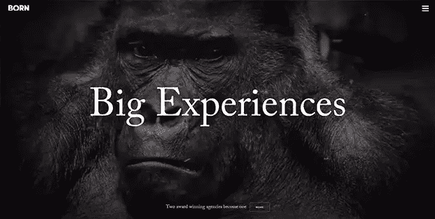](http://www.borngroup.com/ "borngroup.com") 
*网站途经*

“做大”似乎是当今网页设计最重要的原则。然而，对于许多人来说，主页——特别是在文件夹上方——仅仅由几个字叠加在一张图片或一段视频上是很难接受的。有时候，甚至连导航都被删除了，或者(至少)作为一个小图标隐藏起来了。

这种网页设计趋势的两种风格可以被称为“电影化”和“书籍封面”。第一个灵感来自电影和电视广告，而第二个增强了印刷书籍和目录封面的经典概念。

[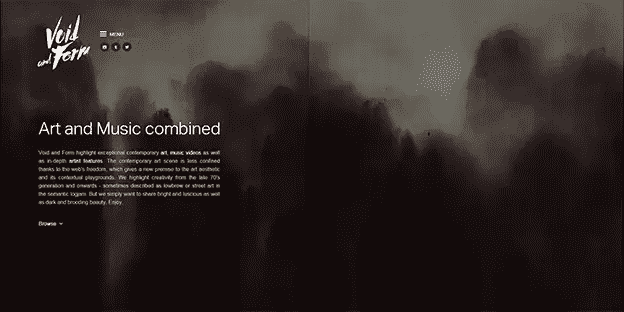](http://voidandform.com/ "voidandform.com") 
*书籍封面。网站通过[作废并形成](http://voidandform.com/)。*

这种趋势的原因既有视觉上的，也有实用上的。用户一登陆你的网站，你就能给他们最大的影响，而且更容易编码，所以它在手机和台式电脑显示器上都能很好地工作(不管显示设备的大小，相同的布局保持不变)。

全屏图片在去年开始流行(正如我们在 2014 年[网页设计趋势](http://99designs.com/designer-blog/2014/01/22/top-10-web-design-trends-for-2014/)文章中提到的)，但是随着高质量图片和更快技术的使用，我们看到网站将这些“书籍封面”布局推向了一个新的高度。

[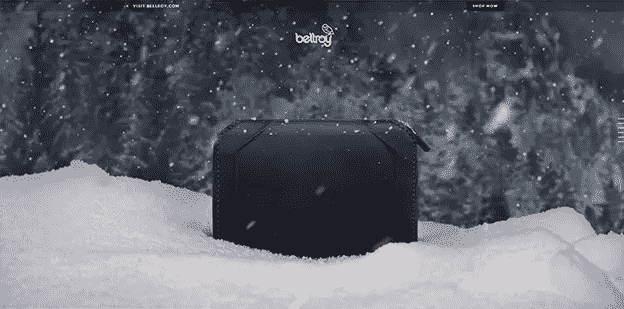](http://bellroy.com/live-life-outside "bellroy.com/live-life-outside") 
*受电影电视的启发。网站 via [bellroy](http://bellroy.com/live-life-outside) 。*

“电影化”趋势依赖于全屏(或几乎全屏)视频，上面覆盖一些文字和/或元素。我们最初在我们的文章“2013 年的[网页设计趋势”中提到了这种风格，当时它出现在一些代理网站上。](http://99designs.com/designer-blog/2013/02/21/web-design-trends-for-2013/ "Web design trends for 2013")

现在，这一趋势正在迅速升温。就在去年, [Paypal](https://www.paypal.com/) 用全屏视频背景更新了其主页——这是一个里程碑式的举动，有助于将这一概念带入主流。

### 2.多媒体体验

[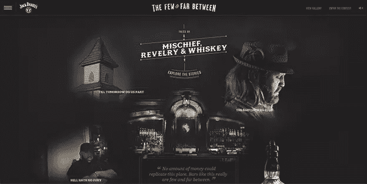](http://barstories.jackdaniels.com "Bar Stories Jack Daniles") **[杰克·丹尼尔的](//barstories.jackdaniels.com)提供了一个现代“多媒体体验”的*令人印象深刻的例子*

 *多媒体的概念已经相当过时了。这个词本身被如此频繁地使用和滥用，以至于几乎失去了它的意义。尽管如此，设计师和程序员大军仍在不断努力创造越来越吸引人的多媒体体验。

不久前，Flash 是这些实验的平台。目前，HTML5 <画布>元素最终将允许你在网站上创建几乎任何视觉效果。

[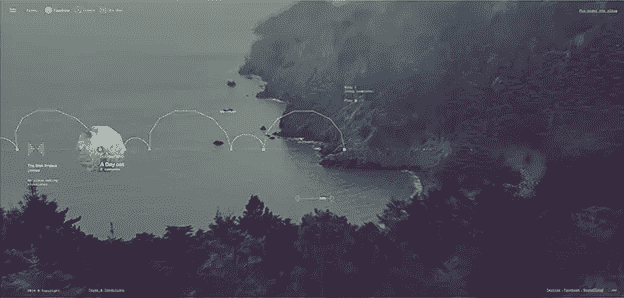](http://jviewz.com/ "jviewz.com") 
*网站经 DNA 项目通过 [j.viewz](http://jviewz.com "jviewz.com")*

用 HTML Canvas 构建界面的另一个值得注意的例子是社区驱动的 DNA 项目，由布鲁克林的音乐家 Jonathan Dagan(又名 j.viewz)开发。以一个高度视觉化的背景视频开场，j.viewz 告诉我们他打算如何通过他的个人实验(用户可以下载)和其他合作者上传的视频、音乐和反馈来构建他的新音乐专辑。

[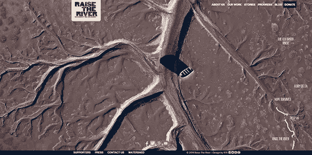](http://raisetheriver.org/ "raisetheriver.org")

*网站经[扬河](http://raisetheriver.org/)*

Raise the River 网站是另一个很棒的例子，不仅因为它贴切的视觉隐喻，还因为它的呈现方式。动画的速度和无法滚动几乎迫使用户喘口气，并适应页面时间线。

在设计界面时，我们通常会尽一切努力让用户能够使用。该网站显示，禁用用户一段时间有时可能会带来更好的体验。

### 3.视差效应突变

视差已经演变成许多不同的突变，但有一个共同点:设计师使用页面滚动或鼠标移动来激活页面的元素或属性。如果仔细观察，本文展示的大多数网站都使用这种逻辑。这里有一些额外的例子。

#### 滚动事件和手绘动画

[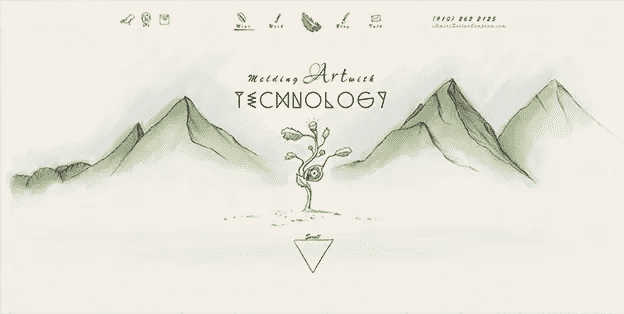](http://mintdesigncompany.com/ "mintdesigncompany.com") 
*网站经[薄荷设计公司](http://mintdesigncompany.com/)。*

很容易欣赏薄荷设计公司创造性地使用一个旧的 CSS 精灵技术。其结果是一个引人入胜的独特的公司网站，否则直截了当。

#### 创新滚动

[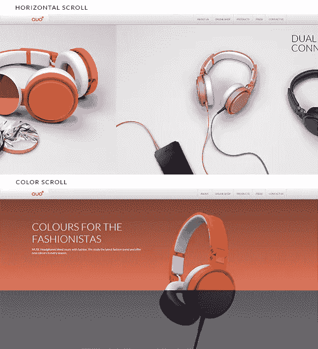](http://www.quoplus.com/ "www.quoplus.com")

*网站经[QUO+](http://www.quoplus.com/)*

QUO+ headset 页面通过垂直和水平滚动带您在他们的网站上进行一次疯狂、迷宫般的旅行，还有一个有趣的部分，您可以在其中“滚动”他们的产品颜色。 **

### 4.动画故事书

[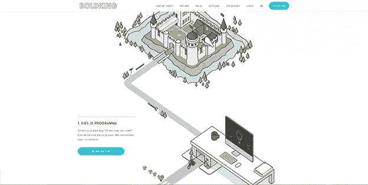](https://www.boldking.com/ "boldking.com") 
*网站经[加粗](https://www.boldking.com/)*

在这种类型的页面中，与第一个示例类似，当用户到达某个滚动位置时，动画序列开始。通常，只是一些元素滑入页面或使用淡入效果出现。

Boldking 产品页面(见上图)使用轻量级 SVG 和 Java 脚本来呈现描述其产品工作方式的视觉隐喻。不仅这个想法和动画令人惊叹，而且同样值得注意的是，它是在 1.5 MB 的总页面重量内实现的。有时候一个 JS 库就有这个大小。其中一个动画序列甚至是交互式的。

[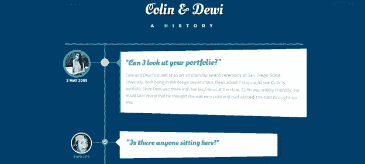](http://colinanddewi.com/ "colinanddewi.com") 
*网站经[科林和德威](http://colinanddewi.com/)*

科林和德维的婚礼网站是一个简单而有效的方法，让用户在阅读故事时保持专注。你一次只能看到故事的一个片段。要查看下一部分，您需要滚动到它。

这听起来像普通的滚动功能，但 3D CSS 动画——以及隐藏和显示文本片段——使故事更加引人入胜。 **

#### 鼠标移动引起的页眉和页面视差效果

*[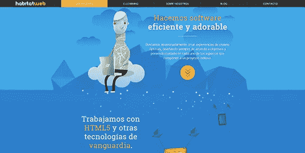 ](http://habitatweb.mx/ "habitatweb.mx")* 
*网站 via**[habitatweb](http://habitatweb.mx/)*

这种效果用于创建三维空间的幻觉，当适合页面的视觉叙事时效果很好，如[栖息地网络](http://habitatweb.mx/ "habitatweb.mx")(上图)或[archeéologie de la Grande guere](http://archeologie1418.culture.fr/)。

当有品味地使用时，这种效果可能会产生令人印象深刻的结果——尽管我们预测它可能不会变得太常见。如果它被广泛流行，它很容易被认为是俗气和令人讨厌的。 **

### 5.扁平化设计

[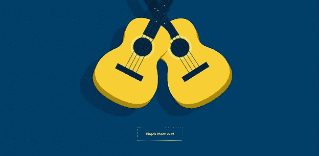](http://colinanddewi.com/ "colinanddewi.com")

*网站通过[科林和德威](http://colinanddewi.com/)*

在过去的三年里，平面设计多次被誉为“王者”。它仍然做得很好，并将永远保持下去——尤其是在图标、菜单和插图等较小的元素上。

这些元素不仅看起来很好(比几年前覆盖几乎每个网站的那些光滑的 web 2.0 图标好得多)，而且由于图标字体技术，它们很容易扩展和管理。icomoon.io 是一个在线服务的例子，它允许每个人免费轻松地创建自己的图标字体。

[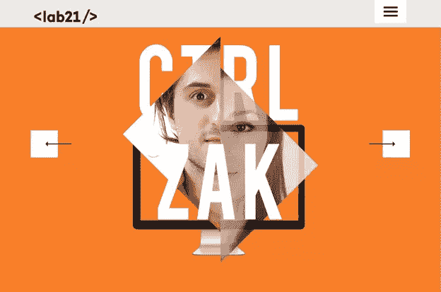](http://www.lab21.gr/ "lab21.gr")
*[Lab 21](http://www.lab21.gr/)把平面设计变成“折纸设计”。*

不过，值得注意的是，扁平化设计并不总是那么扁平。设计师通常会融入微妙的渐变、纹理和照片，以达到“哇”的效果。在我们看来，平面设计最好的部分不是墨水的平面，而是它如何向我们展示创造性的视觉隐喻。

扁平化设计不是用[外形](http://99designs.com/designer-blog/2013/10/23/turning-skeuomorphic-design-into-flat-design/)技术模仿物体(记事本图标看起来像现实生活中用纸和皮革装订的记事本)，而是试图通过一种合成的、吸引人的、有趣的视觉效果来传达记事本的概念，这种视觉效果在各种尺寸下都很好。

我们预测，这种趋势将变得更像拼贴画，并与其他视觉风格相融合，类似于本文前面提到的[ha bitatWeb](http://habitatweb.mx/)网站。

### 6.没有盒子了

网页设计师总是喜欢展示他们能够跳出框框思考——不止一种方式。人们可以把这种趋势称为“画一个盒子，证明你可以打破它”。矩形屏幕是所有网页设计的框架(据我们所知，我们还没有圆形显示器)。页面的每个 HTML 元素也是一个矩形。

但是设计师和大多数人一样，不喜欢被束缚。有三种不同的策略可以证明你不是矩形的奴隶——而且这三种策略似乎都在上升。

#### 创建页面布局，就像矩形从未存在过一样

[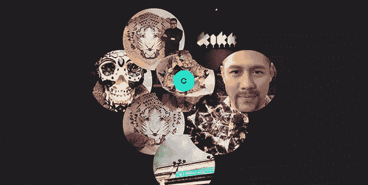](http://www.danparis.fr/ "www.danparis.fr") 
*用圆圈做成的菜单来导航丹的 Instagram 照片。网站 via [丹巴黎](http://www.danparis.fr/)。*

允许的形状有:圆形、六边形、不规则形状甚至菱形。

[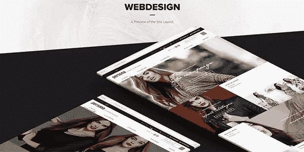](http://www.lorenzobocchi.com/en/design/persona/ "lorenzobocchi.com/projects/persona") 
*网站 via [洛伦佐·波奇](http://www.lorenzobocchi.com/en/design/persona/)*

洛伦佐·博奇的[轴测图](http://en.wikipedia.org/wiki/Axonometric_projection "en.wikipedia.org/wiki/Axonometric_projection")视图中倾斜的地平线和网站布局预览带来了空间和运动的感觉。

[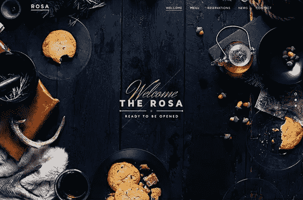](http://pixelgrade.com/demos/rosa/ "pixelgrade.com/demos/rosa") 
*网址:罗莎(via [Pixelgrade](http://pixelgrade.com/demos/rosa/) )*

在浏览罗莎餐厅主页时，你的感官受到了欺骗——你几乎可以感受到饼干的香味。使用现代版本的百年老技术[Trompe-l ' il 技术](http://en.wikipedia.org/wiki/File:Escaping_criticism-by_pere_borrel_del_caso.png "en.wikipedia.org/wiki/File:Escaping_criticism-by_pere_borrel_del_caso.png")并在显示器内模拟真实的桌面。比如拿一个木质的桌子背景，然后把所有的布局对象都放在上面。

[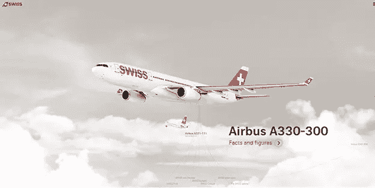](http://www.world-of-swiss.com/en "world-of-swiss.com/en") *网站经[瑞士航空](http://www.world-of-swiss.com/en "world-of-swiss.com/en")*

挑战矩形的终极方式是将用户置于一个无限的空间中，在这里滚动意味着飞翔，而不是，嗯…滚动。

[瑞士航空](http://www.world-of-swiss.com/en "world-of-swiss.com/en")挑战你对网站导航的理解。浏览他们的页面，你可以感受到我们对文档空间的理解是多么的传统。在这里，我们不是上下滚动，而是在云层间躲闪。【T2

### 7.瓷砖

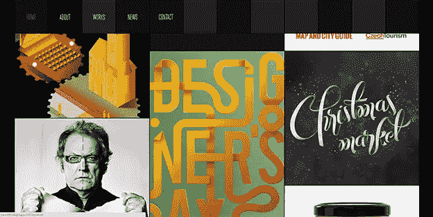

另一方面，如果你喜欢矩形，一个很酷的组织内容的方法是创建磁贴。出于某种原因，网页设计中的磁贴比 Windows 8 Metro 界面卖得更好。磁贴在响应性布局中工作良好，同时，仍然是形成令人印象深刻的布局的一种很酷的方式。

如果贴瓷砖变得太无聊，布局可能会被不规则的锯齿形边缘推得更远，推动对象或使文本跨越边缘。

### 8.导航部件

[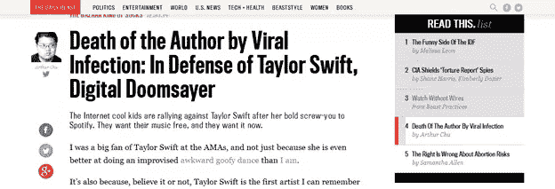](http://www.thedailybeast.com/ "thedailybeast.com")
*[每日野兽](http://www.thedailybeast.com/ "www.thedailybeast.com")导航小部件显示文章内的滚动位置。*

多年来，尝试导航一直是网页设计师最喜欢的游戏。当网站完全用 Flash 设计时,“玩”导航达到了顶峰。Flash 的衰落给我们带来了更安静的菜单，没有动画或古怪的交互性。

但更前卫的导航已经再次兴起，部分原因是新的网页设计潜力，以及现有导航模型在多种设备上使用的效率越来越低。由于 Java 的不断发展(通过框架和插件),以及所有重要浏览器对现代 CSS 更一致的解释，这使得 Java Script 的广泛使用变得更加容易。

这里有几个导航实验和趋势的例子。这些想法中的一些已经被广泛使用，而另一些正在向一种新的“现代”网页设计推进。

#### 粘性菜单

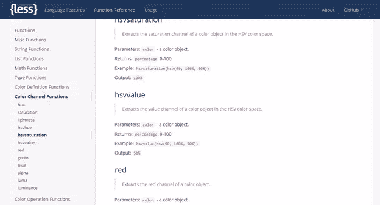

*这种类型的菜单在您滚动时会展开相关项目的子菜单。它在包含大量内容的单页纸上运行良好。少手动页面是我们见过的使用起来最舒适的“手动类型”网页之一。网站经[少抄送](http://lesscss.org/functions/#color-operations)。*

粘性菜单是一种当你滚动时粘在屏幕顶部或边缘的菜单。不管你喜不喜欢，它正在成为一个寻呼机的标准。

有时它与一个 *scrollspy* 脚本结合起来创建一个小部件，精确地显示你在页面上的位置。这很有用，尤其是对于长层次菜单。

#### 屏幕的四个角落都贴有粘性导航

[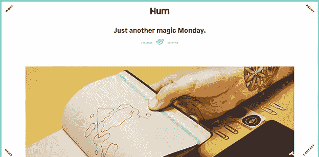](http://humcreative.com/about/ "humcreative.com/about")

*网站经[哼](http://humcreative.com/about/)*

#### 街景类型的导航

[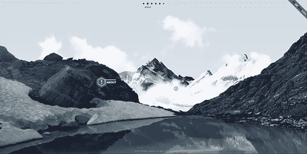](http://www.ohdeergames.com/ "ohdeergames.com")

*网站 via [哦鹿游戏](http://www.ohdeergames.com/)*

谷歌地图，尤其是街景，启发了 Oh Deer Games 的作者创建了类似于谷歌街景漫步的导航。时间会证明这是否会成为一种趋势。当然，这不是唯一一个探索街景风格导航或轴测图“飞越”视图的页面，在游戏中更为人所知。

这让我们想到了另一个值得注意的趋势…

### 9.整合谷歌地图

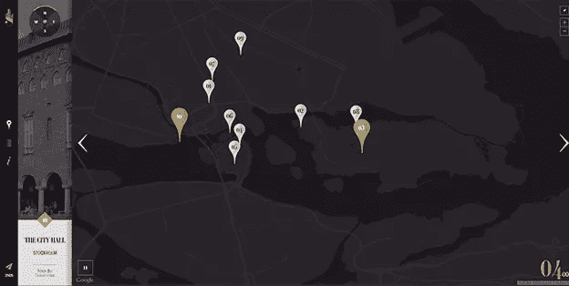

我们认为这是一种趋势，不仅因为它已经上升了一段时间(我们几乎在任何地方都可以看到)，而且因为谷歌提供的广泛使用的定制选项，它变得越来越有视觉趣味。

跟随这一趋势的最有趣的网站围绕地图概念建立它们的功能和视觉理念。当然，他们使用定制的谷歌地图来适应页面的外观和感觉。

### 10.混搭接口

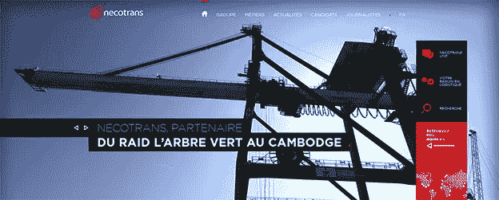
*网站经[necotrans](http://necotrans.com/)*

对单页纸的持续热爱带来了挑战，这些挑战可以通过创造性的、用户友好的和视觉上吸引人的方式来解决。挑战在于将大量信息和功能整合到一个页面上。该网页必须有一个干净的现代外观，易于导航。

解决方案可能是我们称之为 mashup 接口的东西:由许多“层”组成的布局，这些“层”根据所请求的功能或内容进行调整。实际上，这根本不是一个新概念——这是桌面应用程序的本质——但是到目前为止，它在主流互联网中还不是很流行。最近，这种界面的使用越来越多，它们变得越来越精致和实用。

Necotrans 网站似乎没有什么内容[在折叠上方，](http://en.wikipedia.org/wiki/Above_the_fold "en.wikipedia.org/wiki/Above_the_fold")只有一个覆盖在全屏照片上的单句。但右侧的小菜单允许在同一个屏幕区域内访问所有基本功能，为用户提供网站搜索小工具(随着你的键入出现结果)、定制的谷歌地图、新闻小工具和联系人表单。

### 11.最小化

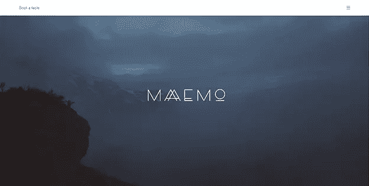

*网站经[Maemo](http://maaemo.no/)*

自 20 世纪 60 年代以来，经典的[吻](http://en.wikipedia.org/wiki/KISS_principle "en.wikipedia.org/wiki/KISS_principle")原则(“保持简单，愚蠢”或“保持简短和简单”)一直被用于军事、商业和政府中。然而，即使你可能努力简化你的设计，也可能有进一步推进这一过程的空间。

Maemo 餐厅用不可抗拒的力量，用尽可能简单的语言讲述它的故事，然后游客只需要一个简单的行动号召(“预订一张桌子”)，在峡湾上空盘旋的冷雾背景下，餐厅的名字就会出现。

向下滚动会带来一些随意布局的照片，很难找到水平和垂直排列。照片的主题似乎也很随意。尽管如此，浏览这个页面还是会带来强烈的感官体验。禁欲主义的形式突出了照片的质量，而极简主义让你仔细阅读他们在乎分享的几个句子，如智慧的话语。

这里能学到什么？你可以在视觉上保持安静。)的网页设计，并仍然实现了一个伟大的外观！尝试尽可能减少内容、形式和颜色，同时通过大而真实的视频增加趣味性。

### 12.全球等待

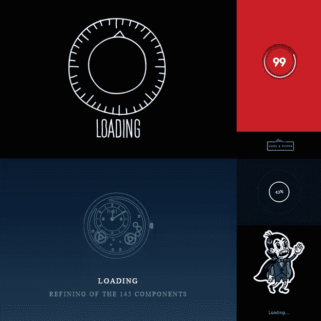
*图形预加载器的例子。*

你可能听过这个老笑话。在 20 世纪 90 年代，当 56k 调制解调器是访问互联网的主要方式时，“WWW”的首字母缩略词曾被开玩笑地翻译为“全球等待”。快速的网络速度让我们几乎忘记了这一点。

前所未有的速度使我们能够创建不久前还无法想象的网站，例如使用高清视频作为网站背景。但是每向前一步都要付出代价，在这种情况下，代价就是时间。特别是加载时间。

因此，我们可以看到视觉上引人入胜的预装者的回归。不像在 Flash 时代那样吸引人，那时它们变成了小游戏，但仍然是他们自己的艺术作品。

### 13.设计师自动化

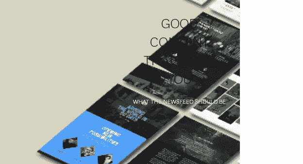

*一张 [grid.io](https://thegrid.io/) 网站的截图揭示了一个人类不可能犯的错误(黑色背景上不可读的黑色文字)。*

如果不花点时间提到“[网格](https://thegrid.io/)”，这篇文章就不完整——这是由[“不拘一格的设计师”](http://www.forbes.com/sites/anthonykosner/2014/10/15/the-grid-website-platform-automatically-adapts-design-to-make-your-content-shine/)提出的一个引人注目的想法，最近引起了一些热议。这是一种用人工智能来代替设计师和编码员的尝试,[。网页设计师会变得多余吗？这还有待观察。](//www.webdesignerdepot.com/2014/12/is-the-grid-a-better-web-designer-than-you/)

现在还不能测试这个系统，所以很难判断它的可用性。他们的网站似乎是其力量的唯一证明。一般来说，它在大多数分辨率下表现良好，但试图创造人工艺术似乎是时代的标志。例如，[绘画傻瓜](http://www.thepaintingfool.com/)创意软件还没有从美术馆中抹去画作。

### 结论

这 13 个网页设计趋势在过去的一年里逐渐流行起来，很可能会严重影响 2015 年网站的创建方式。尽管如此，如果我们用一句话来总结这一年，设计网站时要考虑的最重要的事情就是“内容第一”。

这句口头禅一直是正确的。但是现在，网页设计越来越注重美感，这暴露了很多设计前期的错误——概念、导航流程规划、线框、文案等等。当你用新技术拓宽你的视野时，一定不要忘记基础知识。

*[本文](http://99designs.com/designer-blog/tag/design-trends/ "Canonical link")原载于 [99designs 设计师博客](http://99designs.com/designer-blog/)。经许可转载。** 

## *分享这篇文章*