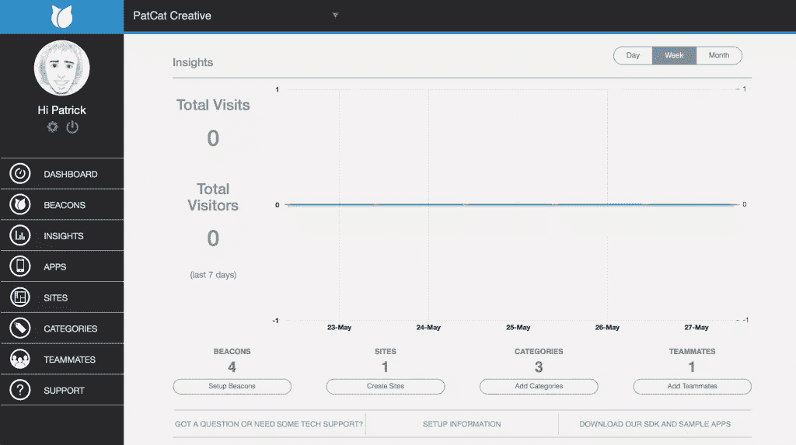
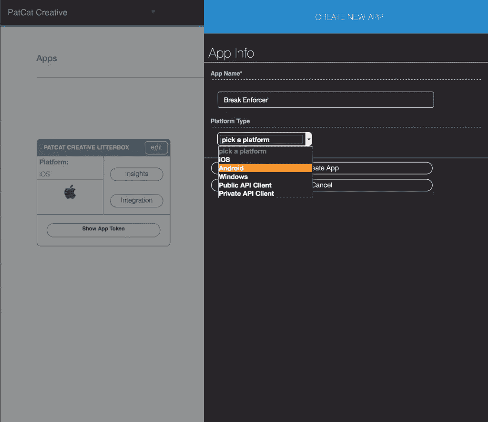
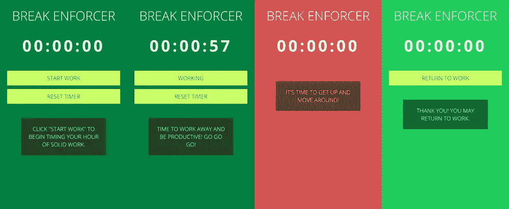
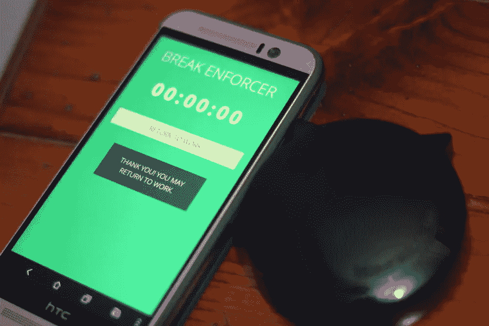

# Bluetooth Beacon 支持 Bluetooth 和 PhoneGap 的应用程序

> 原文：<https://www.sitepoint.com/bluetooth-beacon-enabled-apps-bluecats-phonegap/>

BLE 信标是一种让我今天成为开发者感到兴奋的技术。不仅有如此多的可能性，任何开发者都可以现在就开始为*开发*。不是预购，不是仍在开发中的产品，不是 Kickstarter…蓝牙信标已经在那里被使用！在本文中，我们将探讨如何开始使用 BLE 信标，将蓝猫信标云平台和 API 与 PhoneGap 配对。

## 什么是 BLE 信标？

BLE 代表蓝牙低能耗，指的是蓝牙无线网络技术，其设计功耗和成本都非常低。仅这两个因素就使它非常适合一系列新的互联设备，包括可穿戴设备、智能家居自动化以及本文中我们最感兴趣的内容——信标。

信标是一种蓝牙设备，几乎可以放置在任何地方，以跟踪用户在该空间中的位置。它们可以遍布整个建筑、广告牌、车内……几乎任何可以从了解用户位置中获益的地方。智能手机应用程序的潜在用途包括:

*   一个博物馆旅游移动应用程序，可以告诉每个用户在博物馆内的位置，并为他们提供相关内容。
*   当有应用程序的用户在附近时，互动广告牌会改变或移动！
*   一个智能手机自动化系统，知道你在哪个房间，并相应地运行某些事情。

## 蓝猫信标是如何适应的？

[蓝猫信标](http://bluecats.com/)是 BLE 信标，带有易于访问的 API(可在 Android、iOS 和 PhoneGap 上使用)和云平台来管理它们。几周前，我有幸见到了几个在 BlueCats beacons 工作的人，与他们的交谈让我跃跃欲试！老实说，我无法相信这项技术已经准备好实施了。

## 演示

我尝试了一下 BlueCats beacons，组装了一个简单的 PhoneGap 原型，使用他们的 API 注入了一些基于位置的功能。我做了一个原型倒计时器，用来提醒像我这样沉迷于电脑的灵魂每 30 分钟就从电脑前站起来活动活动。

与普通的倒计时器不同，这种计时器利用蓝猫信号的力量来知道你是否真的起床并移动到另一个房间。一旦计时器停止计时，用户必须起身，带着特定的信标走到另一个房间，以便重置计时器。作为一个额外的奖励，一旦他们回到他们的电脑，USB 信标识别他们已经回来，并自动为他们重新启动计时器。

## 准备我们的 PhoneGap 应用

首先，让我们使用常用的 PhoneGap 命令来准备我们的演示 PhoneGap 应用程序。如果您还没有 PhoneGap，请通过以下 npm 命令安装它:

```
sudo npm install -g phonegap
```

然后，我们将为此演示创建基线应用程序。我称它为“BreakEnforcer ”,但你可以随便叫它什么。当我们运行下面的命令时，PhoneGap 将设置我们所有的基础。

```
phonegap create BreakEnforcer
```

## 准备我们的蓝猫应用程序

如果你是蓝猫的新手，并且正在寻找一个好的开始方式，这个演示使用了来自[蓝猫 StarterPack](http://store.bluecats.com/collections/featured-products/products/bluecats-starterpack-with-usb) 的蓝猫信标。

要开始使用蓝猫平台，你必须建立一个蓝猫账户。您可以在 [BlueCats StarterPack 设置页面](http://app.bluecats.com/join/starterpack)注册 StarterPack。

一旦您的帐户设置完毕，请转到 [BlueCats 仪表板](https://app.bluecats.com)并登录。

从这里，您会看到一个看起来有点像这样的仪表板:



点击左侧的“应用”链接，转到[应用仪表板](https://app.bluecats.com/apps)，然后点击“创建新应用”。

在这里，我们可以输入应用程序的详细信息。我把我的应用程序命名为“Break Enforcer”。

选择测试应用的平台。我选择了 Android，因为我将在它上面测试一切。然而，因为我们正在使用 Phonegap，所以稍后为其他人轻松地重新创建应用程序应该足够简单。然后点击“创建应用程序”。



## 将我们的蓝猫应用添加到 PhoneGap

蓝猫有一个 PhoneGap 插件，我们将使用它来引入我们所有的蓝猫信标功能。要将它包含在我们的 PhoneGap 应用程序中，请在`BreakEnforcer`目录(或您称之为应用程序的任何东西)中运行以下命令:

```
phonegap plugin add https://github.com/bluecats/bluecats-phonegap.git
```

如果你打开 PhoneGap 应用程序的`plugins`文件夹，你会发现一个带有我们 bluetooth 功能的`com.bluecats.beacons`文件夹。

## 我们的准则

这个演示的所有代码都可以在 [GitHub](https://github.com/sitepoint-editors/BreakEnforcer) 上获得，供您查看并适应您自己的 beacon 创作！我将解释代码的主要部分以及它们是如何工作的。

注意:我们这里的所有代码都整齐地包含在`app`名称空间中，所以当调用函数等时，您需要记住这一点。

我们所有的代码都以一个`initialize()`函数开始。它运行两个功能，`bindEvents()`和`initCountdownTimer()`。`bindEvents()`启动我们的信标功能，而`initCountdownTimer()`专注于我们的定时器功能。

```
initialize: function() {
    this.bindEvents();
    this.initCountdownTimer();
  },
```

我把这些相对分开，所以如果你用这个作为一个完全不同的应用程序的基线，把计时器换成你自己的应该不会太难。

### 我们的信标功能

对于信标功能，我们将使用一个与你在 bluetooth 插件文件夹中找到的样本文件`plugins/com.bluecats.beacons/Samples/HelloBeacons/index.js`非常相似的结构。他们的设置非常干净，我认为最好保持一致！我们的示例更加简单，因为我们不会使用示例应用程序中的所有功能。我们将专注于跟踪我们到达信标的时间。还可以跟踪我们何时远离它们，或者确定哪个信标离我们最近——我们的应用程序不会担心这些。

回到代码！在`bindEvents()`中，我们设置了我们的事件监听器，当我们的手机/平板设备准备好时监听。我们通过`deviceready`事件对此进行跟踪。

```
document.addEventListener('deviceready', this.onDeviceReady, false);
```

在`deviceready`，我们运行两个信标相关的函数。我们将在下面逐一探讨。

```
onDeviceReady: function() {
    app.receivedEvent('received');
    app.watchBeacons();
  },
```

`receivedEvent()`功能是响应三种不同的信标相关事件的功能。看起来是这样的:

```
receivedEvent: function(event) {
    var parentElement = document.getElementById('deviceready'),
        listeningElement = parentElement.querySelector('.listening'),
        receivedElement = parentElement.querySelector('.received');

    listeningElement.setAttribute('style', 'display:none;');
    receivedElement.setAttribute('style', 'display:block;');

    if (event == 'apptokenrequired') {
      receivedElement.innerHTML = 'App token not set'
    } else if (event == 'bluecatspurring') {
      // We are on the look out for beacons
      receivedElement.setAttribute('style', 'display:none;');
    };

    console.log('Received Event: ' + event);
  },
```

最初，它选取我们的两个消息元素，`.listening`和`.received`。然后它隐藏了`.listening`元素，我们的三个事件类型开始发挥作用:

*   `'received'`–虽然我们的`receivedEvent()`代码没有直接引用这个事件字符串，但当我们最初发送它时，它会使我们的`.received`元素在我们的应用程序中可见。这是默认情况下表示“设备就绪”的元素。
*   `'apptokenrequired'`–这将我们的`.received`元素切换为“未设置应用令牌”。
*   当我们的应用程序准备寻找信标时，就会传入这个消息。当它这样做时，我们清除了信息，所以我们的信标观察是微妙地完成的。

如果我们回头看看我们的`onDeviceReady()`，为我们的信标运行的另一个函数是`watchBeacons()`函数。这将设置我们的应用程序通过 SDK 来观察蓝猫信标。

我们首先声明一个名为`watchIdForEnterBeacon`的变量，我们将使用它来分配引用我们的信标观察器的“观察 ID”。如果我们想停止通过名为`com.bluecats.beacons.clearWatch`的 SDK 调用监视信标，这就给了我们一个要清除的变量。

```
var watchIdForEnterBeacon = null;
```

接下来，我们将进行一项测试，以确保您添加了应用程序令牌。如果没有，它将运行`receivedEvent()`并显示一个错误。在生产环境中，您可以取消这个检查，因为到那时您不太可能错过这个步骤。这是蓝猫团队添加到样本中的一个聪明的检查，我喜欢并保存在那里！

```
if (blueCatsAppToken == 'BLUECATS-APP-TOKEN') {
    //BlueCats app token hasn't been configured
    app.receivedEvent('apptokenrequired');
    return;
  }
```

接下来，我们有两组选项可以用来调整信标监视的运行方式。首先，`sdkOptions`是我们可以传递给`com.bluecats.beacons.startPurringWithAppToken()` API 调用的选项。这就是启动 bluetooth SDK 并开始寻找蓝牙设备的原因，所以这些选项与此相关。我示例中的这个看起来是这样的:

```
var sdkOptions = {
    useLocalStorage: true
  };
```

基本上，我们要求它在本地缓存来自我们蓝猫账户的信标，以备我们无法访问互联网时使用。所有可能的选项包括:

*   我们是否应该将每次访问我们的信标记录到 BlueCats API 中？(对或错)
*   `useLocalStorage`–我们的本地信标缓存，如上所用(布尔值)。
*   我们应该在启动时缓存所有信标吗？(对或错)
*   `discoverBeaconsNearby`–我们是否应该缓存设备检测到的信标？(对或错)
*   `cacheRefreshTimeIntervalInSeconds`–以秒为单位检查 API 变更的频率。

接下来，我们有我们的`beaconWatchOptions`，我们将在 API 的`com.bluecats.beacons.watchEnterBeacon()`函数中使用它。这是我们每次进入信标范围时所观察和响应的，所以这些选项与此相关。

在我们的代码中，我们将`minimumTriggerIntervalInSeconds`设置为`5`,以减少回调的运行频率。我认为默认的每秒运行一次对于这个应用来说太频繁了，因为我们不会太频繁地进入新的信标。

我们还有一个空的`filter`选项。我不需要过滤应用程序会找到哪些信标，但是没有这个空 JSON 会导致错误，所以我在这里留了一个空对象。

```
var beaconWatchOptions = {
    minimumTriggerIntervalInSeconds: 5,
    filter: {}
  };
```

所有可能的选项包括:

*   `minimumTriggerIntervalInSeconds`–如上所述，回调之间的最小秒数。
*   `repeatCount`–触发器应该能够重复出现的频率。我们希望每次进入信标范围时都会发生这种情况，所以我们不设置这种情况，但是如果您想限制这种情况，这里有一个地方。
*   在`filter`中，我们有以下内容:
    *   `minimumProximity`和`maximumProximity`–我们希望触发这些呼叫的最小和最大距离。这些可以设置为一串`'BC_PROXIMITY_IMMEDIATE'` (~ < 0.5m)、`'BC_PROXIMITY_NEAR'` (~ < 3m)、`'BC_PROXIMITY_FAR'` (~ > 3m)和`'BC_PROXIMITY_UNKNOWN'`。
    *   `minimumAccuracy`–以米为单位的最小距离(默认值为 0)。
    *   `maximumAccuracy`–以米为单位的最大距离(默认为无限制)。
    *   `sitesNamed`–传入您在 SDK 帐户中定义的要在应用程序中使用的一系列站点(例如`['Fortress of Solitude', 'Batcave', 'The Watchtower']`)。
    *   `categoriesNamed`–传入您在 SDK 帐户中定义的要在应用程序中使用的类别数组(例如`['Memorial Statue', 'Bat-Poles']`)。

然后，我们有来自 bluetooth API 的`com.bluecats.beacons.startPurringWithAppToken()`调用，如前所述，它启动了我们的 bluetooth SDK。我们给它上面定义的`blueCatsAppToken`和`sdkOptions`，以及一个`purringSuccess()`回调函数(一旦它准备好访问信标)和一个`logError()`函数(如果发生错误)。

```
com.bluecats.beacons.startPurringWithAppToken(
    blueCatsAppToken, purringSuccess, logError, sdkOptions
  );
```

我们的`purringSuccess()`函数触发了`'bluecatsspurring'`事件，您会记得之前的事件。它还运行`watchBeaconEntry()`,我们接下来会讲到。

```
function purringSuccess() {
    app.receivedEvent('bluecatspurring');
    watchBeaconEntry();
  }
```

执行我们应用程序中最激动人心的部分——它会观察蓝猫信标并做出反应。最初，它检查我们是否已经获得了`watchIdForEnterBeacon`的手表 ID。如果是这样，我们先清除它。

```
function watchBeaconEntry() {
    if (watchIdForEnterBeacon != null) {
      com.bluecats.beacons.clearWatch(watchIdForEnterBeacon);
    };
```

然后，我们使用 BlueCats API 中的`com.bluecats.beacons.watchEnterBeacon()`设置信标观察器。当我们用一个信标穿过小路时，这个就会运行。在它里面，我们有一个回调函数，可以从我们找到的信标中访问`watchData`。

```
watchIdForEnterBeacon = com.bluecats.beacons.watchEnterBeacon(
      function(watchData){
        // Our response will be here
```

通过我们的`watchData`，我们将在`watchData.filteredMicroLocation.beacons`内接收到一系列信标。这个数组中的每一项都有信标上的全部信息。有很多潜在的信息，如果你想要完整的列表，请查看 GitHub 页面上的[蓝猫 PhoneGap 信标信息部分](https://github.com/bluecats/bluecats-phonegap#beacon)。

在我们的应用程序中，我们只关注一件事——灯塔的名字。我把我通过 USB 连接的信标称为“USBeecon”，把我在另一个房间的信标称为“BeaconBeta”(我还有另外两个信标，我分别命名为“BeaconAlpha”和“BeaconGamma”，但我喜欢“BeaconBeta”的颜色)。您可能会有自己的信标名称，更改下面的代码以匹配这些名称。

我们使用下划线. js 库来搜索信标阵列中的每一项，并查看信标是否有任何名称。如果信标具有“BeaconBeta”名称，那么它就是我们休息室中用户需要起身走向的那个。在这种情况下，`breakRoomBeacon`被设置为`true`。如果信标名为“USBeecon ”,则`computerBeacon`被设置为`true`。

```
var breakRoomBeacon = _.find(watchData.filteredMicroLocation.beacons, function(beacon) {
    return beacon.name == 'BeaconBeta';
  });

  var computerBeacon = _.find(watchData.filteredMicroLocation.beacons, function(beacon) {
    return beacon.name == 'USBeecon';
  });
```

下一段代码引用了我们的`timer`对象，它在我们的定时器上存储了信息。我将在本文稍后快速回顾一下，但基本上——我们有一个名为`state`的变量，它跟踪我们的计时器的状态(例如，它是否正在倒计时，它是否过期，我们是否正在休息……等等)。

如果它已经过期，并且我们在休息室的信标处，我们运行`app.runBreakMode()`将我们的应用程序设置为休息模式:

```
// Room was entered, break successful
  if (app.timer.state == 'expired' && breakRoomBeacon) {
    app.runBreakMode();
  }
```

如果我们休息了一会儿，又回到了电脑的 USB 信标上，我们将运行`app.startCountdownTimer()`再次自动启动计时器倒计时。

```
// Back at the computer
  else if (app.timer.state == 'breaksuccess' && computerBeacon) {
    app.startCountdownTimer();
  }
```

为了完成我们的`com.bluecats.beacons.watchEnterBeacon()`函数，我们的第二个和第三个变量是我们之前设置的`logError()`函数和`beaconWatchOptions`。

```
}, logError, beaconWatchOptions);
  }
```

我们的`logError()`函数非常简单，只做一个基本的控制台日志:

```
function logError() {
    console.log('Error occurred watching beacons');
  }
```

这就是我们涵盖的所有信标功能！接下来，我们将快速浏览一下定时器功能。我们不会深入讨论计时器上的所有内容，因为主要焦点是我们的信标。定时器功能主要是和`(new Date).getTime()`一起工作，并在上面启动/重启/停止我们的定时器。

### 我们的计时器功能

我们之前遇到信标时使用的名为`timer`的主要变量是我们的对象，它知道我们计时器的所有设置和状态。

```
timer: {
    targetDuration: (1 * 60 * 1000), // Minutes * 60 * 1000
    initialCount: 0,
    currentCount: 0,
    targetCount: 0,
    timeout: null,
    elem: null,
    toggleButton: null,
    restartButton: null,
    message: null,
    expired: false,
    state: ''
  },
```

解释其中的每一项应该可以很好地概述计时器的工作原理:

*   `targetDuration`–以毫秒为单位设置我们希望计时器倒计时的时间。我把它设定为`(30 * 60 * 1000)`，设定为 30 分钟。
*   当我们启动倒计时器时，我们将它设置为当时的时间。
*   每次我们检查倒计时器的时间时(每半秒)，我们将时间存储在这个变量中。
*   `targetCount`–在这个变量中，我们将`targetDuration`与`initialCount`相加，以知道我们倒计时的时间。
*   `timeout`–为了运行倒计时器的每一次滴答，我们使用了一个`setTimeout()`。我们每半秒运行一次(以防有一点延迟，PhoneGap 不能精确地每秒运行一次)。每半秒钟，我们对照预定时间检查当前时间，并更新计时器。我们存储一个对超时的引用，这样我们就可以在这个变量中清除它。注意:这可能会很耗电池，肯定会在未来的版本中进行优化(或者可以在后台进程中跟踪时间的原生应用程序)。
*   `elem`–我们实际的计时器，我们用每个滴答剩下的最后倒计时时间来更新它。
*   `toggleButton`和`restartButton`——这是我们启动计时器和重启计时器的两个按钮。
*   `message`–用于在定时器下方显示消息的元素。
*   `expired`–一个布尔值，表示定时器是否已到期。
*   `state`–定时器的状态，可以是:
    *   我们的计时器准备好开始了。
    *   我们的计时器开始计时了。
    *   我们的计时器已经倒数到三十分钟，它希望我们的用户休息一下。
    *   我们的计时器看到我们拿着灯塔走进另一个房间，又开心了。

计时器代码的其余部分应该是相对不言自明的，`app.countdown()`每 500 毫秒运行一次来倒计时计时器，如果计时器超时，它将状态设置为`'enforcer'`,并要求我们的用户起身进入另一个房间。

`app.setTimerState()`经常使用，并根据计时器的状态设置我们的应用程序。我们的按钮的功能，无论它们是否出现，我们在计时器下的应用程序消息，以及应用于整个应用程序来设计这些不同状态的类都在这里处理。

## 测试我们的 BLE 信标启用应用

PhoneGap 有一个开发者应用，允许在 iOS、Android 和 Windows Phone 上进行本地测试。我不能让它和蓝猫一起工作，我相信这是因为蓝猫需要一个第三方插件。在 Android 模拟器中测试蓝牙应用程序也不会起作用，因为模拟器不支持蓝牙。因此，为了测试我们的应用程序，我们需要使用一个实际的 Android 设备。

我们将介绍 PhoneGap for Android 的基础知识，但是如果您想了解更多信息或者希望在不同的平台上进行开发，请参见[PhoneGap 平台指南](http://docs.phonegap.com/en/edge/guide_platforms_index.md.html)(编译的步骤应该非常相似)。

我们使用以下命令添加 Android 作为我们应用的平台:

```
phonegap platform add android
```

运行成功后，我们运行 PhoneGap 的命令，使用 Cordova 构建我们的应用程序:

```
phonegap build android
```

如果您收到一个显示`uses-sdk:minSdkVersion 7 cannot be smaller than version 10 declared in library`的错误，您需要更新`config.xml`。该行:

```
<preference name="android-minSdkVersion" value="7" />
```

应该是:

```
<preference name="android-minSdkVersion" value="10" />
```

然后，通过 USB 连接您的 Android 设备(确保 [USB 调试和开发选项已启用](https://developer.android.com/tools/device.html))并运行:

```
phonegap run android
```

现在，您应该看到您的应用程序运行良好，并且能够测试您的 beacon 应用程序原型！





蓝猫和 Break Enforcer 在行动

## 结论

在发现 Bluetooth beaconss 之前，让应用程序连接到 Bluetooth beacon 比我预期的要简单得多，而且更适合大型企业项目！他们的 SDK 使得用 BLE beacons 进行开发变得非常容易，这个简单的原型应用只是冰山一角。

如果你想了解更多关于 bluetooth PhoneGap SDK 的功能，请访问他们的 GitHub 页面。如果你喜欢尝试本地开发，他们的[开发者页面](http://bluecats.com/developers.html)有你需要的一切！

我总是非常渴望看到和听到人们从演示代码中创造出来的东西，如果你确实用 bluetooth beacons 做出了很棒的东西，请告诉我！在评论里留言或者在 Twitter 上联系我( [@thatpatrickguy](http://www.twitter.com/thatpatrickguy) )，我很乐意去看看！

## 分享这篇文章