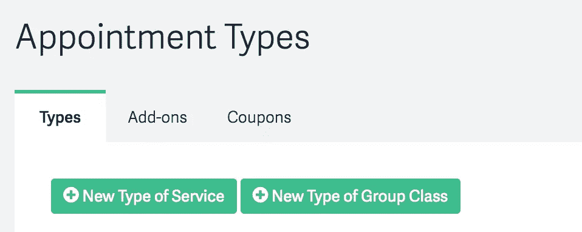
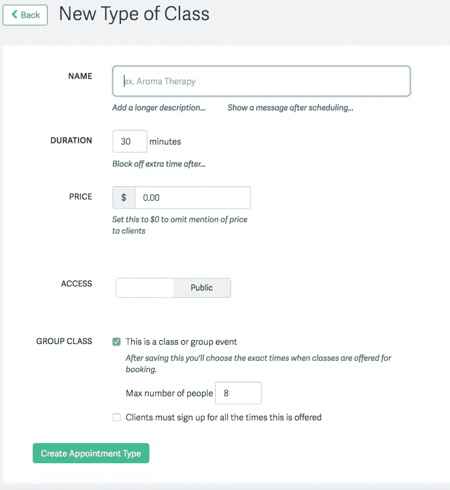
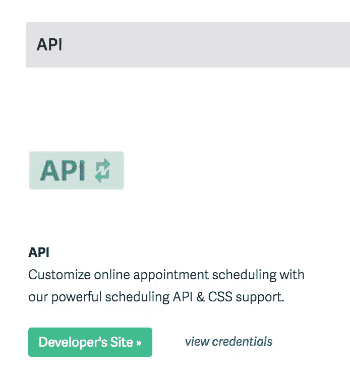
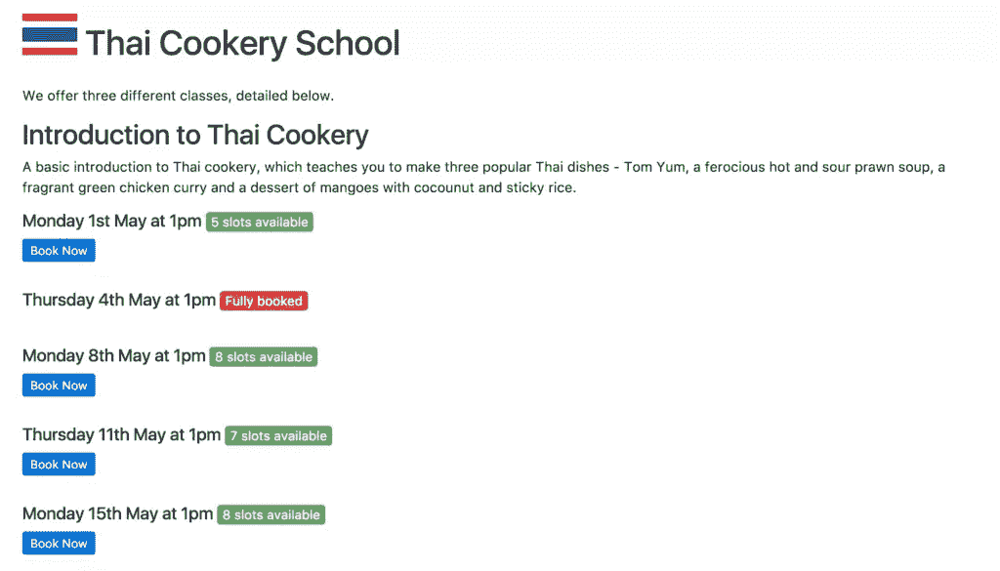

# 如何建立一个具有敏捷调度的排课系统

> 原文：<https://www.sitepoint.com/booking-cookery-classes-with-acuity-scheduling-and-lumen/>


*本文由[视敏调度](http://synd.co/2p0Jfpq)赞助。感谢您对使 SitePoint 成为可能的合作伙伴的支持。*

我最近写了一篇关于建立一个在线课程预订系统的文章。教人开车是相对独特的，因为它保证是一对一的课程——或者至少，如果你发现自己分享了教练的时间，那么你完全有权利感到被亏待了。

然而，大多数其他类型的课程往往有多个参与者。除非他们在网上授课，否则出于后勤方面的考虑，他们很可能会限制学生人数。

烹饪课通常对学生人数有明确的限制——你只能教你拥有的烹饪站或炊具数量。这将是本文的主题——管理烹饪课上的那些“位置”。这些原则对于其他各种形式的教学都是一样的。

和以前一样，我们将利用 [Acuity Scheduling](http://synd.co/2p0Jfpq) 来管理我们课程的预订，以及所有需要的事情。

本教程的所有代码都可以在 Github 上获得。

## 我们将要建造的

Thanchanok 提供泰国烹饪课程。这里有一门普通的入门课程，还有两门更专业的课程——一门涵盖了各种各样的泰国咖喱酱，另一门专门讲述了她成长的地区——清迈附近酷热的北部地区。她拥有一个特别装修的厨房来教授这些课程。每个都有八个烹饪台。她通常每周上四节课——其中两节是入门课，正如你所料，这是她最受欢迎的课程。

目前，她的网站包括一个电子邮件地址和电话号码，用于预订，但有一些问题。首先，人们很容易忘记更新网站，以表明它已被预订一空，这有时会让潜在的参与者失望，并对该公司留下不好的印象。

第二，她不得不依靠老式的纸笔来管理她的学生名单，以及他们的联系方式和他们是否提前支付了学费。她非常希望在她的网站上添加一个功能，允许人们查看课程可用性以及在线预订，然后帮助她的课程安排和与会者名单。这就是我们在本教程中要做的。

就面向公众的网站而言，我们来分解一下需求:

*   该网站需要显示所有即将到来的课程。
*   如果一节课已经订满了，就需要说出来。
*   未被完全预订的课程应显示可用位置的数量。
*   访问者应该能够在有空位的课程上预订一个位置。

通过将所有这些与 Acuity Scheduling 集成，我们可以有效地处理后端需求，而无需自己开发:

*   每个即将到来的课程的预定人数。
*   与会者名单及其联系方式。
*   不断更新即将到来的课程和预订。
*   Thanchanok 的日历，都在一个地方。

让我们开始吧。

## 设置紧急调度

如果你还没有，你需要做的第一件事就是在 [Acuity Scheduling](http://synd.co/2p0Jfpq) 注册。免费试用将完全足以跟进。

接下来我们需要做的是设置这三个类。在 Acuity 术语中，这些是**预约类型**。

如果您刚刚注册，请点击屏幕顶部的**创建您的预约类型**按钮，或者点击侧边栏上**业务设置**下的**预约类型**。

接下来，点击**新类型组类**按钮。



你需要给这个类命名。出于本教程的目的，我们称它们为**泰国烹饪入门**、**泰国咖喱酱**和**北方风味**，但是你可以随便叫它们。



以分钟为单位输入持续时间，例如 180 分钟，并根据需要提供价格。为了使事情简单，我们将不包括付款。

点击**创建预约类型**按钮保存信息。一旦我们创建了约会类型——即课程——我们需要提供一些日期和时间。为此，点击**提供等级**按钮。


输入课程开始的日期和时间。如果这是一个常规的事情，那么你可以把它设置为周期性的——这允许你批量输入多个日期。Thanchanok 每周下午 1 点提供两次入门课，另外两次课程每周一次。

接下来，转到**约会类型**并检查新创建的类的三个 URL。它们包含一个`id`查询参数，我们很快就会用到，所以现在记下来。

Acuity 方面的最后一步是为我们的集成获取 API 凭证:

1.  点击工具条上**业务设置**下的**集成**。
2.  点击 **API** 向下滚动到页面的相关部分。
3.  点击**查看凭证**。



复制并粘贴用户 ID 和 API 密钥供以后使用。

## 开始实施

出于本教程的目的，我们将使用 [Lumen](http://synd.co/2p9pufB) ，尽管无论您选择什么样的框架，其原理都是一样的。

首先从命令行创建项目:

```
composer create-project --prefer-dist laravel/lumen thaicookery 
```

在名为`.env`的项目文件夹中创建一个文件，并添加以下行，适当地替换这些值:

```
ACUITY_USER_ID=your_user_id
ACUITY_API_KEY=your_api_key
APP_DEBUG=true 
```

这将允许您检索用户 ID 和 API 密钥，如下所示:

```
$userId = env( 'ACUITY_USER_ID' );
$apiKey = env( 'ACUITY_API_KEY' ); 
```

正如我前面暗示的，我们将通过 API 与 Acuity Scheduling 集成。有了 SDK，这就更容易了。
在[开发者网站](https://developers.acuityscheduling.com/docs/sdks)上有 Node.js 和 PHP 的 SDKs 我们将使用 PHP 的[版本。它在 Packagist 上可用，所以我们只需使用 Composer 安装它:](https://github.com/AcuityScheduling/acuity-php)

```
composer require acuityscheduling/acuityscheduling 
```

现在我们需要使 Acuity Scheduling SDK 在整个站点中可用。实现这一点的理想方式是使用服务提供者将其注入到应用程序的服务容器中。

打开`app/Providers/AppServiceProvider.php`并在文件顶部添加一条`use`语句:

```
use AcuityScheduling;
```

然后将以下内容添加到`register()`方法中:

```
$this->app->singleton( 'AcuityScheduling', function ( $app ) {
    return new AcuityScheduling( [
        'userId' => env( 'ACUITY_USER_ID' ),
        'apiKey' => env( 'ACUITY_API_KEY' ),
    ] );
} ); 
```

现在通过打开`bootstrap/app.php`并取消注释下面一行来注册服务提供者:

```
$app->register(App\Providers\AppServiceProvider::class); 
```

下一步是定义在站点上显示它们的类。实际上，您可能会将它们存储在数据库中，但出于本练习的目的，我们将简单地将它们硬编码到一个数组中，作为基本控制器的属性——您将在`app/Http/Controllers/Controller.php`中找到这一点。

创建数组，确保替换您自己的约会类型 id:

```
protected $classes = [
    [
        'name'  =>  'Introduction to Thai Cookery',
        'key'   =>  'introduction-to-thai-cookery',
        'description' => 'A basic introduction to Thai cookery, which teaches you to make three popular Thai dishes - Tom Yum, a ferocious hot and sour prawn soup, a fragrant green chicken curry and a dessert of mangoes with cocounut and sticky rice"',
        'acuity_id' => 3027517,
    ],
    [
        'name'  =>  'Thai Curry Pastes',
        'key' => 'thai-curry-pastes',
        'description' => 'Pestle and mortar at the ready, as we take a look at Thai curry pastes, the foundation of all Thai curries. Specifically, the course teaches you to make red, green and Panang curry pastes. We will also be cooking a roast duck red curry with sticky rice.',
        'acuity_id' => 3027529,
    ],
    [
        'name'  =>  'Taste of the North',
        'key' => 'taste-of-the-north',
        'description' => 'An in-depth look at the cusine of the North of Thailand.',
        'acuity_id' => 3027535,
    ],
]; 
```

正如您可能从代码中了解到的那样，我们正在定义一个关键字，用于以 SEO 友好的方式识别每个课程，以及每个课程的一些基本信息和所有重要的约会类型 ID，使我们能够与 Acuity 集成。

现在所有这些都设置好了，是时候与 Acuity Scheduling 集成了。

## 列出类别及其可用性

我们需要做的第一件事是列出课程，以及每堂课的开课日期。我们已经在 Acuity 端设置了所有这些，以及我们的元数据，所以下一步是调用 API 来获得可用性。这个端点就是 [`availability/classes`](http://synd.co/2py52YJ) 。SDK 使得称之为轻而易举。

给你指定月份的课程。默认情况下，它只包含那些有可用槽的类，尽管您可以覆盖这种行为。我们会这样做，但是适当地标记没有可用插槽的插槽。

创建一个新的控制器类— `app/Http/Controllers/HomeController` —并添加以下方法:

```
/**
 * Get the available classes for the given month
 *
 * @param Carbon $month
 * @return array
 */
public function getAvailablity( $month )
{
    return app( 'AcuityScheduling' )->request(
        'availability/classes',
        [
            'query' => [
                'month' => $month->format( 'Y-m' ),
                'includeUnavailable' => 'true',
            ],
        ]
    );
} 
```

现在是主页。创建一个名为`index()`的新方法，我们将从获取当前和下个月的可用性开始:

```
/**
 * The homepage
 *
 * @return \Illuminate\View\View
 */
public function index( )
{
    // Get the dates for this month...
    $availability = $this->getAvailablity( Carbon::now( ) );

    // ...and next month
    $availability += $this->getAvailablity( Carbon::now( )->addMonth( ) );

} 
```

这将返回一组结果。在我们渲染之前，让我们利用卢蒙的收藏做两件事:

1.  “注入”一个代表每个类的日期和时间的 Carbon 实例；这是一个名为`time`的结果属性
2.  按类对结果进行分组；这由`appointmentTypeID`属性表示

下面是代码:

```
// Now go through and inject the date as a Carbon instance, then group by the class
$instances = collect(
    $availability
)->map( function( $instance ) {
    $instance[ 'date' ] = Carbon::parse( $instance[ 'time' ] );
    return $instance;
} )->groupBy( 'appointmentTypeID' ); 
```

最后，返回页面:

> 为了简洁起见，这里没有包括布局模板，但是您可以从 GitHub 获取一个副本[。](http://synd.co/2pZ8kW4)

```
// Return the rendered homepage
return view( 'home.index', [ 'classes' => $this->classes, 'instances' => $instances ] ); 
```

现在在`resources/views/home/index.blade.php`中创建一个新文件:

```
@extends( 'layouts.default' )

@section( 'content' )

<p>We offer three different classes, detailed below.</p>

@foreach( $classes as $class )
    <h2>{{ $class[ 'name' ] }}</h2>
    <p>{{ $class[ 'description' ]  }}</p>
    <ul class="instances">
    @foreach( $instances->get( $class[ 'acuity_id' ] ) as $instance )
        <li>
            <h5>
                <time datetime="{{ $instance[ 'date' ]->toIso8601String( ) }}">{{ $instance[ 'date' ]->format( 'l jS F') }} at {{ $instance[ 'date' ]->format( 'ga') }}</time>
                @if ( $instance[ 'slotsAvailable' ] == 0 )
                    <span class="badge badge-danger">Fully booked</span>
                @elseif ( $instance[ 'slotsAvailable' ] < 2 )
                    <span class="badge badge-warning">Only {{ $instance[ 'slotsAvailable' ] }} available</span>
                @else
                    <span class="badge badge-success">{{ $instance[ 'slotsAvailable' ] }} slots available</span>
                @endif
            </h5>

            @if ( $instance[ 'slotsAvailable' ] > 0 )
                <a href="/{{ $class[ 'key' ] }}/{{ $instance[ 'date' ]->toIso8601String( ) }}/{{ $instance[ 'calendarID' ] }}/book" class="btn btn-primary btn-sm">Book Now</a>
            @endif
        </li>
        @endforeach
    </ul>
@endforeach

@stop 
```

代码应该相对简单。我们正在遍历可用的类并显示关于它们的信息。然后，我们浏览并列出实际的课程以及提供一些可用性信息的标签，最后显示一个按钮，用于预订有可用位置的课程。

您可以将我们到目前为止所做的工作进行一次旋转——启动终端并输入:

```
php -S localhost:8000 -t public/
```

建立主页的最后一步是定义路线——打开`routes/web.php`。根据你安装的 Lumen 版本(我用的是 5.4)，路由定义可能在`app/Http/routes.php`中。用以下内容替换默认路由:

```
$app->get( '/', 'HomeController@index' ); 
```

现在，我们将构建一个预订表单。在`app/Http/Controllers/ClassesController`中创建另一个新控制器:

```
<?php

namespace App\Http\Controllers;

use Illuminate\Http\Request;
use Carbon\Carbon;

class ClassesController extends Controller
{

     /**
      * The booking page
      *
      * @param string $key
      * @param string$date
      * @param integer $calendarId
      * @return \Illuminate\View\View
      */
     public function book( $key, $date, $calendarId )
     {
         $class = collect( $this->classes )->where( 'key', $key )->first( );

         return view(
             'classes.book',
             [
                 'class' => $class,
                 'date' => Carbon::parse( $date ),
             ]
         );

     }

 } 
```

非常简单的东西，而且不言自明。现在是预订表格——这个放在`resources/views/classes/book.blade.php`里，看起来像这样:

```
@extends( 'layouts.default' )

@section( 'content' )

    <p>You are booking a place on <strong>{{ $class[ 'name' ] }}</strong> on <time datetime="{{ $date->toIso8601String( ) }}">{{ $date->format( 'l jS F') }} at {{ $date->format( 'ga') }}</time></p>

    <form method="post">
        <div class="form-group">
            <label>Please enter your forename</label>
            <input name="firstName" placeholder="Your forename" class="form-control" required>
        </div>
        <div class="form-group">
            <label>Please enter your surname</label>
            <input name="lastName" placeholder="Your surname" class="form-control" required>
        </div>
        <div class="form-group">
            <label>Please enter your e-mail address</label>
            <input type="email" name="email" placeholder="Your e-mail address" class="form-control" required>
        </div>
        <button type="submit" class="btn btn-primary">Book Now</button>
    </form>

@stop 
```

这只是询问 Acuity Scheduling 为了进行预订而需要的信息。

现在我们需要创建一个方法来实际进行预订。SDK 再一次让这变得异常简单。我们只需要从 URL 和请求的组合中获取相关信息。代码如下:

```
/**
 * POST callback for making the booking
 *
 * @param string $key
 * @param string$date
 * @param integer $calendarId
 * @param Request $request
 * @return \Illuminate\View\View
 */
public function confirmBooking( $key, $date, $calendarId, Request $request )
{
    $class = collect( $this->classes )->where( 'key', $key )->first( );

    $appointment = app( 'AcuityScheduling' )->request('/appointments', array(
        'method' => 'POST',
        'data' => array(
            'appointmentTypeID' => $class[ 'acuity_id' ],
            'calendarId'        => $calendarId,
            'datetime'          => $date,
            'firstName'         => $request->input( 'firstName' ),
            'lastName'          => $request->input( 'lastName' ),
            'email'             => $request->input( 'email' ),
        )
    ) );

    // Return the rendered homepage
    return view( 'classes.booking-confirmation', compact( 'class', 'appointment' ) );
} 
```

下一步是创建确认页面—`resources/views/classes/booking-confirmation.blade.php`:

```
@extends( 'layouts.default' )

@section( 'content' )

    <div class="alert alert-success" role="alert">
        <strong>Your booking is confirmed!</strong> Your booking reference is {{ $appointment[ 'id' ] }}.
    </div>

@stop 
```

如您所见，Acuity 的结果应该包括一个`id`属性，我们将它用作预订参考。

最后，定义这两条路线:

```
$app->get( '/{key}/{date}/{calendarId}/book', 'ClassesController@book' );
$app->post( '/{key}/{date}/{calendarId}/book', 'ClassesController@confirmBooking' ); 
```

就是这样！最终结果应该是这样的:



## 包扎

[Acuity Scheduling](http://synd.co/2p0Jfpq) 让管理和预订课程的过程变得非常简单。使用 API 允许您与新的或现有的网站集成，让您完全控制外观和感觉。在本教程中，我们已经做到了这一点，提供了可用性的“实时”概述，并允许用户在线预订。

当然，还有更多的事情要做——例如，我们还没有做很多验证或错误处理，也没有加入支付机制。这是一个可选的练习。

*该内容由[通过辛迪加广告赞助](http://synd.co/1EqdFWZ)。*

## 分享这篇文章