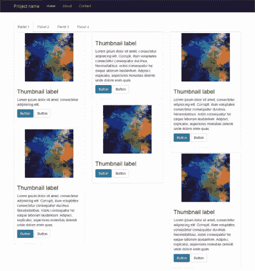
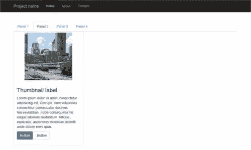

# 让引导标签和砖石一起玩

> 原文：<https://www.sitepoint.com/bootstrap-tabs-play-nice-with-masonry/>

**[Bootstrap](http://getbootstrap.com/) 是最广泛采用的开源前端框架之一。将 Bootstrap 包含在您的项目中，您将能够很快生成响应迅速的 web 页面。如果你尝试过将 Masonry 与[Bootstrap Tabs widget](http://getbootstrap.com/docs/4.0/components/navs/#tabs)(Bootstrap 提供的众多 JavaScript 组件之一)一起使用，你很可能会发现一些令人讨厌的行为。**

在[砖石网站](http://masonry.desandro.com/)上，我们读到砖石是…

> 一个 JavaScript 网格布局库。它通过根据可用的垂直空间将元素放置在最佳位置来工作，有点像泥瓦匠在墙上安装石头。

我做到了，这篇文章强调了问题是什么，以及您可以做些什么来解决它。

## 引导选项卡说明

Bootstrap Tabs 组件包括两个关键的相关部分:一个选项卡式导航元素和许多内容面板。在页面加载时，第一个面板应用了类`.active`。这使面板在默认情况下可见。这个类通过 JavaScript 使用，通过选项卡式导航链接触发的事件来切换面板的可见性:如果`.active`出现，则面板可见，否则面板隐藏。

如果你有一些网页内容最好以单个块的形式呈现，而不是全部塞在一个地方，Bootstrap tabs 组件可能会派上用场。

## 为什么是石工？

在某些情况下，每个面板中的内容都适合显示在响应式网格布局中。例如，一系列产品、服务和投资组合项目是可以以网格格式显示的内容类型。

但是，如果网格单元的高度不同，可能会发生如下所示的情况。


两行内容之间有一个很宽的间隙，布局看起来不完整。

如今，Bootstrap 通过全新的卡组件解决了等宽问题，该组件基于 Flexbox。只需将`card-deck` [类添加到一组卡组件](http://getbootstrap.com/docs/4.0/components/card/#card-decks)中，就足以实现等宽列。

如果你希望你的卡片长度不均匀，你可以使用 [CSS3 多栏布局](https://www.w3.org/TR/css-multicol-1/)。(毕竟即使有一些[浏览器支持](https://caniuse.com/#search=columns)的 bug，总体来说还是挺好的。)这是卡组件附带的新[卡列](http://getbootstrap.com/docs/4.0/components/card/#card-columns)选项的基础。然而，如果您仍然喜欢 Masonry JavaScript 库提供的开箱即用的漂亮动画，以及它广泛的浏览器兼容性，JavaScript 在这种情况下仍然是一个可行的选择。

## 设置演示页面

启动并运行一个演示页面有助于展示如何将引导标签与 Masonry 集成在一起并不像人们预期的那样简单。

这篇文章的[演示页面](https://codepen.io/SitePoint/pen/GQoVey)基于[入门模板](http://getbootstrap.com/docs/4.0/examples/starter-template/)，可在 Bootstrap 网站上获得。

下面是引导选项卡组件的标记框架:

```
<ul class="nav nav-tabs" id="myTab" role="tablist">

  <!-- nav item 1 -->
  <li class="nav-item">
    <a class="nav-link active" id="home-tab" data-toggle="tab" href="#home" role="tab" aria-controls="home" aria-selected="true">Home</a>
  </li>

  <!-- nav item 2 -->
  <li class="nav-item">
    <a class="nav-link" id="profile-tab" data-toggle="tab" href="#profile" role="tab" aria-controls="profile" aria-selected="false">Profile</a>
  </li>

  <!-- nav item 3 -->
  <li class="nav-item">
    <a class="nav-link" id="contact-tab" data-toggle="tab" href="#contact" role="tab" aria-controls="contact" aria-selected="false">Contact</a>
  </li>
</ul> 
```

`nav nav-tabs`类负责赋予标签特有的外观。`href`属性的值形成了单个选项卡与其对应的选项卡式内容之间的关系。例如，`#home`的`href`值创建了带有`id="home"`的选项卡内容的关系:单击特定的选项卡会显示带有`home`的`id`值的`div`内的内容。

此外，请注意 Bootstrap 如何关注可访问性属性，如`role`、`aria-controls`等。

下面的代码片段说明了选项卡式内容的结构:

```
<!-- content 1 -->
<div class="tab-pane fade show active" id="home" role="tabpanel" aria-labelledby="home-tab">
  <h3>Tab 1 Content</h3>
<div class="card-group">

  <!-- first card -->
  <div class="card">
    
    <div class="card-body">
      <h5 class="card-title">Card title</h5>
      <p class="card-text">Card text here.</p>
      <p class="card-text">Last updated 3 mins ago</p>
    </div>
  </div>

  <!-- second card -->
  <div class="card">
    <!-- card markup here -->
  </div&lgt;

  <!-- third card -->
  <div class="card">
    <!-- card markup here -->
  </div>

  </div>
</div> 
```

只需为每个选项卡式内容部分添加一个类似的结构，与上面编码的选项卡元素相对应。

完整代码，请查看 [CodePen 演示](https://codepen.io/SitePoint/pen/GQoVey)。

## 添加砖石库

点击*下载 masonry.pkgd.min.js* 按钮可以[从官网下载 Masonry](http://masonry.desandro.com/) 。

为了避免布局问题，该库的作者建议将 Masonry 与 [imagesLoaded 插件](http://imagesloaded.desandro.com/)一起使用。

砖石不需要 [jQuery 库](http://jquery.com/)工作。然而，因为引导 JavaScript 组件已经使用了 jQuery，所以我会让自己的生活更轻松，并以 jQuery 的方式初始化 Masonry。

下面是使用 jQuery 和 imagesLoaded 初始化 Masonry 的代码片段:

```
var $container = $('.masonry-container');
$container.imagesLoaded( function () {
  $container.masonry({
    columnWidth: '.card',
    itemSelector: '.card'
  });   
}); 
```

上面的代码缓存了将所有卡片元素包装在一个名为`$container`的变量中的`div`。

接下来，用几个推荐的选项在`$container`上初始化圬工。`columnWidth`选项表示水平网格的一列的宽度。在这里，通过使用它的类名，它被设置为单个卡片项目的宽度。`itemSelector`选项指示哪些子元素将被用作项目元素。这里也设置为单卡项。

现在是测试代码的时候了。

## 哎呀！隐藏的面板是怎么回事？

在一个不使用引导标签的网页上，上面的代码非常有效。然而，在这种情况下，你很快就会意识到一种滑稽的行为发生了。

首先，它看起来很好，因为默认活动选项卡面板内的网格显示正确:



但是，如果您单击选项卡式导航链接来显示隐藏面板的内容，会发生以下情况:



查看源代码可以发现，Masonry 已经如预期的那样启动了，但是每个项目的位置没有被正确计算:网格项目都像一副纸牌一样堆叠在一起。

这还不是全部。调整浏览器窗口的大小会使网格项正确定位。

### 让我们修复布局错误

由于意外的布局错误在单击选项卡式导航链接后变得明显，所以让我们更仔细地研究一下由引导选项卡触发的事件。

[事件列表](http://getbootstrap.com/javascript/#tabs)很短。在这里。

*   **show.bs.tab** 在选项卡显示时触发，但在新选项卡显示之前
*   标签显示后，标签显示时触发
*   当要显示一个新的标签页时，hide.bs.tab 触发(因此前一个活动标签页将被隐藏)
*   在一个新标签被显示后触发(因此前一个活动标签被隐藏)。

因为标签显示后布局会变得混乱，所以请使用`shown.bs.tab`事件。下面是代码，您可以将它放在前面的代码片段下面:

```
$('a[data-toggle=tab]').each(function () {
  var $this = $(this);

  $this.on('shown.bs.tab', function () {
    $container.imagesLoaded( function () {
      $container.masonry({
        columnWidth: '.card',
        itemSelector: '.card'
      });   
    });  
  });
}); 
```

下面是上面代码中发生的情况:

[jQuery `.each()`](http://api.jquery.com/jquery.each/) 函数遍历每个选项卡式导航链接，并监听`shown.bs.tab`事件。当事件触发时，面板变得可见，并且在所有图像完成加载后，砖石被重新初始化。

## 测试代码

如果您一直在跟进，请在浏览器中启动您的演示，或者尝试下面的 CodePen 演示来查看结果:

在 [CodePen](https://codepen.io) 上通过 SitePoint ( [@SitePoint](https://codepen.io/SitePoint) )看到笔[自举标签和砖石](https://codepen.io/SitePoint/pen/GQoVey/)。