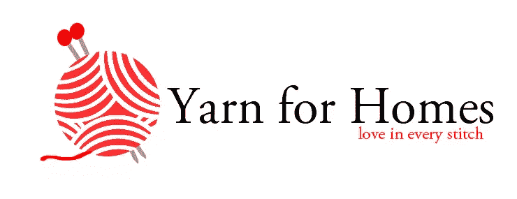
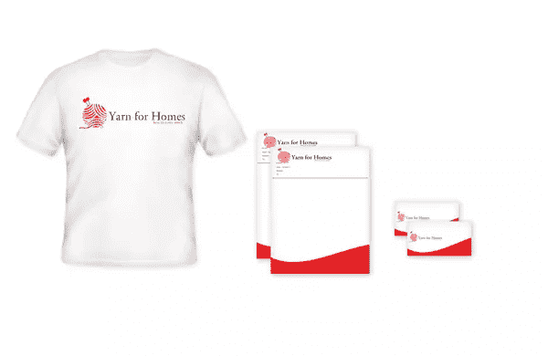

# 非营利组织的品牌原则

> 原文：<https://www.sitepoint.com/branding-principles-for-nonprofits/>

到目前为止，我们大多数人都知道品牌推广过程有多困难。品牌设计中最微小的缺陷都会被复制到成千上万的横幅、名片和其他营销工具上。品牌需要努力。你在广告或产品上看到的不仅仅是一个公司名称或一个狡猾的标志——品牌远不止这些。这不仅是公司愿景和目标的融合，也代表和定义了公司服务的员工和客户群体。从根本上说，品牌是公司整体的外部感知，即“企业形象”

自然地，当我们想到已经成功开展品牌活动的公司时，我们会想到像可口可乐和苹果这样的巨头，而不是像 ONE 和 UNICEF 这样的非营利组织。像其他公司和组织一样，非营利组织也必须创建自己的品牌，就像营利性实体一样。非营利组织的品牌是他们成功的关键，因为一个成功的品牌活动给了组织一个声音。为这样的非营利组织创造一个成功的品牌和身份可以让那些组织之外的人通过他们的事业很容易地识别这个组织。今天，我将通过创建一个虚构的、基于公益事业的非营利组织，与你分享一些专门针对非营利组织的品牌化技巧。

### 非营利原则

在为非营利组织设计品牌材料时，请记住以下一些品牌原则:

*   请记住，非营利组织服务于社区，依靠会员费和捐款，所以在选择品牌时，应该考虑社区和原因。
*   非营利组织，十有八九想要有所作为，有他们想要传播的愿景/信息，试着在你的设计中融入这些信息和目标。
*   不要过度设计，保持简单。非营利组织不是要有吸引人的品牌，而是要帮助那些需要它的人。
*   在设计之前，决定你选择的品牌材料是什么。一些材料可能比其他材料更适合一些非营利组织。
*   大多数非营利组织在某种形式的人道主义层面上工作，所以要确保你的品牌能培养一种强烈的情感联系。
*   保持一致，不要为不同的实施调整您的品牌元素。一致性创造信任，并允许人们将一个组织与另一个组织区分开来。
*   请记住，大多数非营利组织都会开展某种形式的志愿者或慈善活动，当你制作品牌宣传材料时，请记住这一点，比如帽子和 t 恤

对于这篇文章，我选择将我虚构的非营利组织命名为 *Yarn for Homes* 。下面，我列出了该组织的目标/愿景，口号，当然，还有他们的标志。我将描述我所做的选择，以及组织的愿景、目标和社区对这些选择的影响。

**目标/愿景:**Yarn for Homes(YFH)的主要目标是为无家可归的贫困家庭提供毛毯、帽子、围巾等手工制品。

**广告语:**“爱在每一针。”

**Logo:**

### 颜色选择

颜色影响决策，吸引或排斥，可以成就或破坏你的设计。显然，颜色的选择——不管是好是坏——会对你的品牌产生巨大的影响。正如你在上面看到的，YFH 的标志由三种主要颜色组成，红色、白色和黑色(织针上的灰色只是一种强调色)。

非营利组织必须在情感层面上与它所服务的社区建立联系。大多数人都知道红色是一种强烈的颜色，会刺激感官，这也是我使用这种颜色的主要原因。在这里，颜色代表激情，因为 YFH 以富有同情心的方式对待那些需要帮助的人。也是我提到针线活首先想到的颜色。我通过[负空间](https://www.sitepoint.com/a-solid-understanding-of-negative-space/ "A Solid Understanding of Negative Space")使用的白色，创造了纱线球上纱线股的幻觉。白色被用作平衡器，同时白色通常是与纯洁和美好联系在一起的颜色，这也是所有慈善机构努力追求的目标。

该组织的名称是黑色的，与设计形成对比，因为黑色意味着优雅、成熟和力量。被红色元素包围的黑色字体表示该组织拥有同情的力量。

### 象征主义

符号的使用很重要，必须小心谨慎，为非营利组织提供正确的印象。想想非营利组织，比如穆斯林援助组织和解放儿童组织。穆斯林援助组织使用新月形的月亮，这是一个具有伊斯兰意义的象征，而自由儿童组织则使用两个孩子似乎在世界各地牵着手的形象。这两个符号不仅在情感上很有力量，而且也反映了他们各自组织的工作。

出于几个原因，YFH 简单地使用了一团纱线这个简单的符号。YFH 是一个为有需要的人提供手工刺绣的组织，因此有了纱线。纱线有各种形状，包括拉长的线股，但我用了一个球作为它的球形，因为 YFH 在全球范围内工作，而不仅仅是在一个特定的地区。YFH 的工人和志愿者也分布在世界各地，所以圆形也代表了他们的整体。这些针没有任何特定的象征意义；他们只是更多地用来完成一个纱线球的形象。

### 排印

字体的选择取决于你的非营利组织，取决于你的团体的目标，字体可以是有趣的，优雅的，甚至是前卫的。对于 YFH，我用的是 Adobe Garmond Pro 字体。加蒙德字体被广泛认为是印刷媒体中易于阅读的字体。它也是环保的，因为与许多其他字体相比，它使用更少的墨水。这两个属性都很重要，因为非营利组织依赖印刷媒体制作小册子、横幅、传单、商业和贺卡，以及其他纸质媒体。Adobe Garmond Pro 的外观不仅时尚且易于使用，还散发出一致的感觉，这提供了一种干净而精致的外观，而又不太花哨。

### **品牌材料创意**

对于品牌材料的想法，考虑你的非营利组织做什么，记住大多数非营利组织依靠印刷媒体，所以考虑小册子，信头，当然还有名片。下面，我迅速拿出一件 t 恤、信笺和名片设计作为例子。

### 结论

发起一个成功的非营利品牌活动并不困难，在创建品牌材料时也是如此。永远要考虑到你的非营利组织所服务的社区，在你设计的时候要记住你的组织的成员和目标。

你为非营利组织做过设计吗？你是否遇到过一些在营利性部门中没有的独特挑战？

## 分享这篇文章