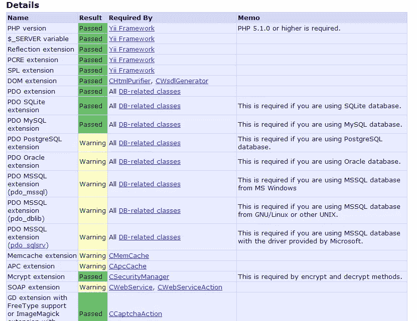
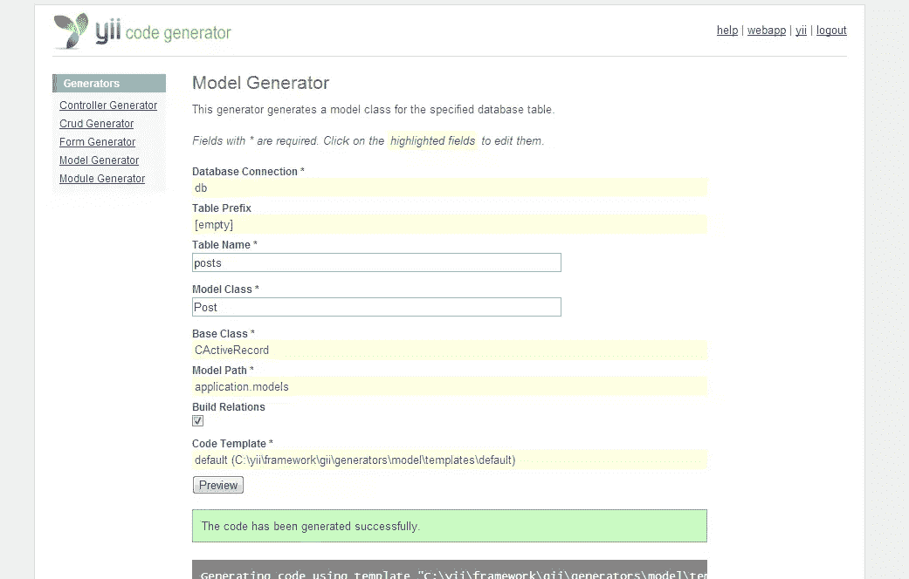

# 用 Yii 在几分钟内构建一个 CRUD 应用程序

> 原文：<https://www.sitepoint.com/build-a-crud-app-with-yii-in-minutes/>

Yii 是一个快速、安全的高性能框架，非常适合 Web 2.0 应用程序。它支持约定胜于配置，这意味着如果你遵循它的指导方针，你将会比其他情况下编写更少的代码(更少的代码意味着更少的错误)。此外，它提供了许多现成的便利特性，比如搭建、数据访问对象、主题化、访问控制、缓存等等。在本文中，我将介绍使用 Yii 创建 CRUD 系统的基础知识。

## 入门指南

我假设您的系统上已经安装了 Apache、PHP (5.1 或更高版本)和 MySQL，所以第一步是下载框架文件。前往 Yii 官方网站下载最新的稳定版本，在撰写本文时是 1.1.13。

解压缩 ZIP 文件以获得文件夹`yii-1.1.13.e9e4a0`(版本标识符可能因您下载的版本而异)，并将其重命名为`yii`，然后将文件夹移动到您的 web 可访问根目录。对我来说，这是`C:\wamp\www`，所以框架文件的位置将是`C:\wamp\www\yii`。在整篇文章中，我将把它称为`<YiiRoot>`,这样即使您自己的设置不同，您也可以很容易地理解。

接下来，我们应该检查我们的系统将支持 Yii 的哪些特性。在浏览器中访问*http://localhost/yii/requirements/*查看框架的需求细节。因为我们将使用 MySQL 数据库，所以您应该启用 MYSQL PDO 扩展。



我们希望快速检查 Yii 的需求，这就是为什么我们把文件放在可访问的目录中，但是建议把 Yii 文件放在 web 根目录之外。检查后，请随意将它移到其他地方。

## 走向

每个 web 应用程序都有一个目录结构，Yii 应用程序也需要在 web 根目录中维护一个层次结构。为了创建一个具有合适目录结构的框架应用程序，我们可以使用 Yii 的命令行工具 *yiic* 。导航到 web 根目录并键入以下内容:

```
<YiiRoot>frameworkyiic webapp yiitest
```

这将用最少的所需文件创建一个名为`yiitest`的框架应用程序。在里面你会发现`index.php`，它是一个入口脚本；它接受用户请求并决定哪个控制器应该处理该请求。

Yii 基于 MVC 和 OOP 原则，所以你应该很熟悉这些主题。如果您不熟悉 MVC，请阅读 SitePoint 系列文章[MVC 模式和 PHP](https://www.sitepoint.com/the-mvc-pattern-and-php-1/ "The MVC Pattern and PHP, Part 1") ，其中提供了很好的介绍。

Yii 网址看起来像*http://localhost/yiitest/index . PHP？r=controllerID/actionID* 。例如，在博客系统中，URL 可以是*http://localhost/yiitest/index . PHP？r=post/create* 。`*post*`是控制器 ID，`*create*`是动作 ID。入口脚本根据 id 决定调用哪个控制器和方法。

ID 为 post 的控制器必须命名为`PostController`(ID 从类名中去掉后缀“controller”并将第一个字母转换为小写)。动作 ID 是以类似方式存在于控制器内部的方法的 ID；在`PostController`内部会有一个名为`actionCreate()`的方法。

可能有几个视图与一个控制器相关联，所以我们将视图文件保存在`protected/views/*controllerID*`文件夹中。我们可以在上面描述的目录中为我们的控制器创建一个名为`create.php` it 的视图文件，然后简单地通过为`actionCreate()`编写下面的代码将这个视图呈现给用户:

```
public function actionCreate()
{
    $this->render('create');
}
```

必要时还可以向视图传递额外的数据。这是按如下方式完成的:

```
$this->render('create', array('data' => $data_item));
```

在视图文件中，我们可以通过`$data`变量访问数据。

该视图还可以访问指向呈现它的控制器实例的`$this`。

此外，如果你喜欢用户友好的 URL，你可以在`protected/config/main.php`中取消如下注释:

```
'urlManager'=>array(	
    'urlFormat'=>'path',
    'rules'=>array(
        '<controller:w+>/<id:d+>'=>'<controller>/view',
        '<controller:w+>/<action:w+>/<id:d+>'=>'<controller>/<action>',
        '<controller:w+>/<action:w+>'=>'<controller>/<action>',
    )
```

这些 URL 将看起来像是*http://localhost/yiitest/controller id/actionID*。

## 开发 CRUD 应用程序

现在你已经知道了重要的 Yii 约定，是时候开始学习 CRUD 了。在这一节中，我们将开发一个简单的系统，用户可以在其中对博客文章执行 CRUD 操作(创建、检索、更新和删除)。

### 第一步

创建 MySQL 数据库`yiitest`，并在其中创建一个名为`posts`的表。为了我们的目的，这个表只有 3 列:`id`、`title`和`content`。

```
CREATE TABLE posts (
    id INTEGER NOT NULL PRIMARY KEY AUTO_INCREMENT,
    title VARCHAR(100),
    content TEXT
)
```

打开应用程序的配置文件(`protected/config/main.php`)，取消对以下内容的注释:

```
'db'=>array(
'connectionString' => 'mysql:host=localhost;dbname=testdrive,
'emulatePrepare' => true,
'username' => 'root',
'password' => '',
'charset' => 'utf8',
)
```

将 *testdrive* 替换为我们数据库的名称，即 *yiitest* 。显然，您还应该为 Yii 连接提供必要的凭证。

### 第二步

在 Yii 中，每个数据库表都应该有一个相应的类型为`CActiveRecord`的模型类。好处是我们不必直接处理数据库表。相反，我们可以使用对应于表中不同行的模型对象。例如，`Post`类是 posts 表的模型。这个类的一个对象表示表`posts`中的一行，并具有表示列值的属性。

为了快速生成模型，我们将使用 Yii 的基于 web 的工具 gii。这个工具可以用来为 CRUD 操作生成模型、控制器和表单。要在项目中使用 gii，请在应用程序的配置文件中找到以下内容，取消注释并添加密码。

```
'gii'=>array(
'class'=>'system.gii.GiiModule',
'password'=>your password to access gii,	
'ipFilters'=>array('127.0.0.1','::1'),
)
```

然后用以下网址访问 gii:*http://localhost/yiitest/index . PHP？r=gii* 。如果你使用用户友好的网址，网址是:*http://localhost/yiitest/gii*。

点击模型生成器。gii 将询问您表的名称；输入“posts”作为表名，使用“Post”作为模型名。然后单击 Generate 创建模型。



检查`protected/models`，你会在那里找到文件`Post.php`。

### 第三步

现在点击 CRUD 生成器。输入型号名称“Post”。控制器 ID 将自动填充为“post”。这意味着一个新的控制器将以`PostController.php`的名字生成。

点击生成。该过程将生成控制器和几个视图文件，这些文件具有 CRUD 操作所需的格式。


现在你有了一个全新的 CRUD 应用程序！点击“立即尝试”链接进行测试。要管理帖子，您需要以管理员/管理员身份登录。

要创建一个新帖子，你需要访问*http://localhost/yiitest/post/create*，要更新一个特定的帖子，只需将浏览器指向*http://localhost/yiitest/post/update/postID*。
同样，你可以列出所有的帖子，删除部分或全部。

## 结论

在开发 Web 2.0 项目时，Yii 非常强大。事实上，我们刚刚看到了在几分钟内创建一个全功能的 CRUD 系统是多么容易！显然 Yii 可以帮你省去很多辛苦的工作，因为你不用从头开始。Yii 为我们提供了基础，我们可以在合适的时候扩展它。

## 分享这篇文章