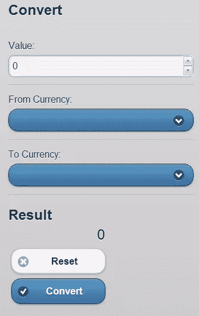

# 用 jQuery Mobile 和 Cordova 构建一个货币转换器:2

> 原文：<https://www.sitepoint.com/build-a-currency-converter-with-jquery-mobile-and-cordova-part-2/>

在本系列的介绍文章[中，我展示了即将构建的“货币转换器”应用的需求和所涉及的技术。我还构建了一个文件结构，并概述了应用程序的每个组件及其用途。在本文中，我们将深入探讨应用程序的布局和功能，我将向您展示管理应用程序界面的两个 HTML 页面和 CSS 文件的源代码。
](https://www.sitepoint.com/build-a-currency-converter-with-jquery-mobile-and-cordova/ "Build a Currency Converter with jQuery Mobile and Cordova: Introduction")

### 主页

默认情况下，界面加载页面的方式不同于使用 AJAX 的第一次初始页面加载；这就是为什么我们必须包含所有的 JavaScript 和 CSS 文件。正如我在第一篇文章中指出的，我们正在开发的应用程序非常简单；入口点是`index.html`，也是用户真正会与之交互的唯一页面。它包含用户将用来把货币从一种货币转换成另一种货币的表单。该表单将有一个字段来写货币金额、转换货币和转换货币。

我将尽可能使用新的 HTML5 标签，并且*金额*字段最适合使用新的`<input type="number">`。除了新的输入类型，我将利用`min`将其设置为零，因为我们不会转换负的货币量。我还将使用属性`pattern`，并用值范围`[0-9]*`设置它。因此，当用户将“焦点”放在该字段上时(通过触摸它)，将显示数字键盘，而不是字母键盘。您可以在下面看到创建这一简化功能的特定代码部分:

```
<input type="number" id="from-value" name="from-value" pattern="[0-9]*" value="0" min="0" max="999999999999999" />
```

剩下的两个字段是使用经典的`<select>`标签实现的。它们将使用 JavaScript 函数动态填充，我将在本系列的下一部分中描述该函数。

对于货币计算的输出，我使用了新的`<output>`元素。这有一个非常有趣的属性(至少对我来说)，叫做`for`，它允许你指定在计算中涉及哪些元素来获得你所拥有的结果。因此，我指定了金额的 id、“from”货币和“to”货币字段，如下面的代码片段所示。

```
<output id="result" name="result" for="from-currency-value from-currency-type to-currency-type">0</output>
```

最后一个有趣的变化是[布局网格系统](http://jquerymobile.com/demos/1.2.0/docs/content/content-grids.html "jQuery Mobile Layout Grids")，我用它来设计重置和提交按钮。默认情况下，框架将按钮设计为占据所有空间，并且不允许在同一行上有其他元素。然而，我希望这两个按钮在同一水平线上，并划分总宽度。要在 jQuery Mobile 中构建这种两列布局，您必须创建一个具有类`ui-grid-a`的包装器，然后将类`ui-block-a`应用于第一列，将`ui-block-b`应用于第二列。考虑下面的例子:

```
<div class="ui-grid-a">
  <div class="ui-block-a">
    <input id="reset-button" type="reset" value="Reset" data-icon="delete" data-theme="c" />
  </div>
  <div class="ui-block-b">
    <input id="submit-button" type="submit" value="Convert" data-icon="check" />
  </div>
</div>
```

现在，你可能想知道为什么我增加了两个额外的容器。原因是由于 jQuery Mobile 将一个`<input>`字段与其他元素包装在一起，以增加美观性(这会占用空间)，因此如果每个按钮占用 50%的宽度，样式增加的宽度会迫使按钮位于不同的行上，如下面的截图所示。



现在您已经知道了页面的所有主要元素，是时候向您展示页面的全部代码了。

```
<!DOCTYPE html>
<html>
  <head>
    <meta charset="UTF-8" />
    <meta name="viewport" content="width=device-width, initial-scale=1">
    <title>Currency converter</title>
    <link rel="stylesheet" href="css/jquery.mobile-1.2.0.min.css" type="text/css" media="all" />
    <link rel="stylesheet" href="css/style.css" type="text/css" media="all" />
    <script src="js/jquery-1.8.3.min.js"></script>
    <script src="js/jquery.mobile.config.js"></script>
    <script src="js/jquery.mobile-1.2.0.min.js"></script>
    <script src="cordova.js"></script>
    <script src="js/jquery.auderoTextChanger.min.js"></script>
    <script src="js/translation.js"></script>
    <script src="js/currency.js"></script>
    <script src="js/settings.js"></script>
    <script src="js/functions.js"></script>
    <script>
      $(document).on('pagebeforecreate orientationchange', updateIcons);
      $(document).one('deviceready', initApplication);
    </script>
  </head>
  <body>
    <div id="home-page" data-role="page">
      <header data-role="header">
        <h1>Currency converter</h1>
        <a href="#" id="update-button" data-icon="refresh" data-iconpos="notext" class="ui-btn-right">Update data</a>
      </header>
      <div data-role="content">
        <p id="app-description">
          Currency Converter is a simple app that helps you convert from a currency to another. You can
          update the exchange rates every time you want so you'll have always an up-to-date conversion.
        </p>
        <label id="last-update-label">Last update rates:</label>
        <span id="last-update"></span>
        <form id="form-converter" name="form-converter" action="#">
          <h2 id="convert-title">Convert</h2>
          <div data-role="fieldcontain">
            <label for="from-value" id="from-value-label">Value:</label>
            <input type="number" id="from-value" name="from-value" pattern="[0-9]*" value="0" min="0" max="999999999999999" />
          </div>
          <div data-role="fieldcontain">
            <label for="from-type" id="from-type-label">From Currency:</label>
            <select id="from-type">
            </select>
          </div>
          <div data-role="fieldcontain">
            <label for="to-type" id="to-type-label">To Currency:</label>
            <select id="to-type">
            </select>
          </div>

          <h2 id="result-title">Result</h2>
          <output id="result" name="result" for="from-value from-type to-type">0</output>

          <div class="ui-grid-a">
            <div class="ui-block-a">
              <input id="reset-button" type="reset" value="Reset" data-icon="delete" data-theme="c" />
            </div>
            <div class="ui-block-b">
              <input id="submit-button" type="submit" value="Convert" data-icon="check" />
            </div>
          </div>
        </form>
      </div>
      <footer data-role="footer">
        <h3 id="copyright-title">Created by Aurelio De Rosa</h3>
        <a id="credits-button" href="aurelio.html" data-icon="info" data-iconpos="notext" data-prefetch="prefetch" data-transition="flip" class="ui-btn-right">Credits</a>
      </footer>
    </div>
  </body>
</html>
```

除了我已经概述的页眉和页脚，我还使用了新的 HTML5 `<header>`和`<footer>`标签，而不是通用的`<div>` 标签。这两个元素内部都有一个链接:页眉的链接将执行货币汇率更新，而页脚的链接将简单地将用户带到信用页面(`aurelio.html`)，这个页面没什么特别的，只是一个关于……嗯，我的~~垃圾邮件~~页面。

此外，`<header>`中的链接以及`<footer>`中的链接都使用属性`data-iconpos="notext"`。这告诉 jQuery Mobile 隐藏链接的文本，因为在小屏幕上可能需要太多空间。然而，正如您在第 19 行看到的，我为`pagebeforecreate`和`orientationchange`事件附加了一个名为`updateIcons()`的处理程序。这个函数将以编程方式测试屏幕的宽度，如果找到一个足够大的屏幕，这个属性将被删除，元素的文本将被显示。

关于这个页面，您应该知道的最后一件事是对`deviceready`事件使用一个处理程序`initApplication()`，该事件在 Cordova 完全加载时被触发。它是设置应用程序的函数，但是它的功能将在本系列文章的下一部分中说明。

### 学分页面

虽然页面`aurelio.html`非常简单，但有几个事实值得一提。首先是使用了两个新的 HTML5 标签:`<figure>`和`<article>`。当然，解释 HTML5 超出了本系列的范围，所以我给你一个非常简单的总结。`<figure>`元素<q cite="http://dev.w3.org/html5/markup/figure.html">表示一个内容单元，可选地带有一个标题，它是自包含的。</q>使用元素`<figcaption>`提供描述的标题。关于`<article>`元素，它<q cite="https://www.w3.org/TR/html5/sections.html#the-article-element">表示页面的一个组件，由文档、页面、应用程序或站点中的自包含组合组成。</q>要强调的第二个事实是应用于页面上联系人列表的所有链接的属性`target="_blank"`的使用。它将用于为所有这些链接附加一个处理程序；*如何*和*为什么*将在本系列的下一篇文章中解释。

学分页面的完整来源如下。

```
<!DOCTYPE html>
<html>
  <head>
    <meta charset="UTF-8" />
    <meta name="viewport" content="width=device-width, initial-scale=1">
    <title>Aurelio De Rosa</title>
  </head>
  <body>
    <div id="aurelio-page" data-role="page">
      <header data-role="header">
        <a href="#" data-icon="back" data-iconpos="notext" data-rel="back" title="Go back">Back</a>
        <h1>Aurelio De Rosa</h1>
      </header>
      <div id="content" data-role="content">
        <div class="person">
          <figure class="photo">
            
            <figcaption>Aurelio De Rosa</figcaption>
          </figure>
          <article>
            <p>
              I'm an Italian web and app developer who have a bachelor degree in Computer Science and more than
              5 years' experience programming for the web using HTML5, CSS3, JavaScript, and PHP. I mainly use the
              LAMP stack and frameworks like jQuery, jQuery Mobile, Cordova (PhoneGap), and Zend Framework.
              My interests also include web security, web accessibility, SEO, and WordPress.
            </p>
            <p>
              Currently I'm self-employed working with the cited technologies, and I'm also a regular contributor to the
              SitePoint network, where I write articles about the topics I usually work with and more. The articles can
              be found on the following websites of the network:
              <a href="https://www.sitepoint.com/author/aderosa/" target="_blank">BuildMobile.com</a>,
              <a href="https://www.sitepoint.com/author/aderosa/" target="_blank">PHPMaster.com</a>,
              <a href="https://www.sitepoint.com/author/aderosa/" target="_blank">JSPro.com</a> and
              <a href="https://www.sitepoint.com/author/aderosa/" target="_blank">SitePoint.com</a>.
            </p>
          </article>
          <article>
            <h2>Contacts</h2>
            <ul data-role="listview" data-inset="true">
              <li>
                <a href="http://www.audero.it" target="_blank">
                  
                  Visit my website: www.audero.it
                </a>
              </li>
              <li>
                <a href="mailto:aurelioderosa@gmail.com" target="_blank">
                  
                  Drop me an email: aurelioderosa@gmail.com
                </a>
              </li>
              <li>
                <a href="mailto:a.derosa@audero.it" target="_blank">
                  
                  Drop me an email (alternative address): a.derosa@audero.it
                </a>
              </li>
              <li>
                <a href="https://twitter.com/AurelioDeRosa" target="_blank">
                  
                  Follow me on Twitter (@AurelioDeRosa)
                </a>
              </li>
              <li>
                <a href="http://it.linkedin.com/in/aurelioderosa/en" target="_blank">
                  
                  View my profile on LinkedIn
                </a>
              </li>
              <li>
                <a href="https://bitbucket.org/AurelioDeRosa" target="_blank">
                  
                  Visit my repository on BitBucket (AurelioDeRosa)
                </a>
              </li>
            </ul>
          </article>
        </div>
      </div>
    </div>
  </body>
</html>
```

### 风格调整

默认情况下，jQuery Mobile 会截断`<header>`和`<footer>`中的长标题，并在截断文本的末尾添加省略号。然而，这种方法也适用于其他类型的元素，如按钮。我非常不喜欢这种行为，所以在非常短的样式表中，叫做`style.css`，我在[上一篇文章](https://www.sitepoint.com/build-a-currency-converter-with-jquery-mobile-and-cordova/ "Build a Currency Converter with jQuery Mobile and Cordova: Introduction")中提到过，我通过应用规则`white-space: normal !important;`来改变它。除此之外，我只是把我的照片放在了演职员表页面的中央，并对计算结果应用了一些样式。

样式表的来源如下:

```
.ui-header .ui-title,
.ui-footer .ui-title,
.ui-btn-inner *
{
   white-space: normal !important;
}

.photo
{
   text-align: center;
}

#result-title
{
   margin-bottom: 0.2em
}

#result
{
   display: block;
   font-size: 1.5em;
   text-align: center;
}
```

### 结论

在本系列的第二部分中，我描述了两个基本的 HTML 页面并概述了每个页面的要点。虽然这个应用程序非常小，但由于使用了几个新的 HTML5 标签和属性，标记是语义丰富的。除了这些元素，最重要的特性可能是[jQuery Mobile layout grid system](http://jquerymobile.com/demos/1.2.0/docs/content/content-grids.html "jQuery Mobile Layout Grids")，它允许您创建响应迅速且等距的多栏布局。由于业务逻辑还没有完成，这些文件目前不是很有用。此外，如果您尝试使用 Cordova 包装它们，只要您访问`aurelio.html`中的一个外部链接，然后使用 back 按钮返回，您就会看到信用页面将丢失框架的样式增强，以及应用的任何自定义样式。这个问题将在本系列的下一篇文章中讨论，我将向您展示这些问题的解决方案，并且我还将描述一些支持“货币转换器”应用程序的 JavaScript 文件。

## 分享这篇文章