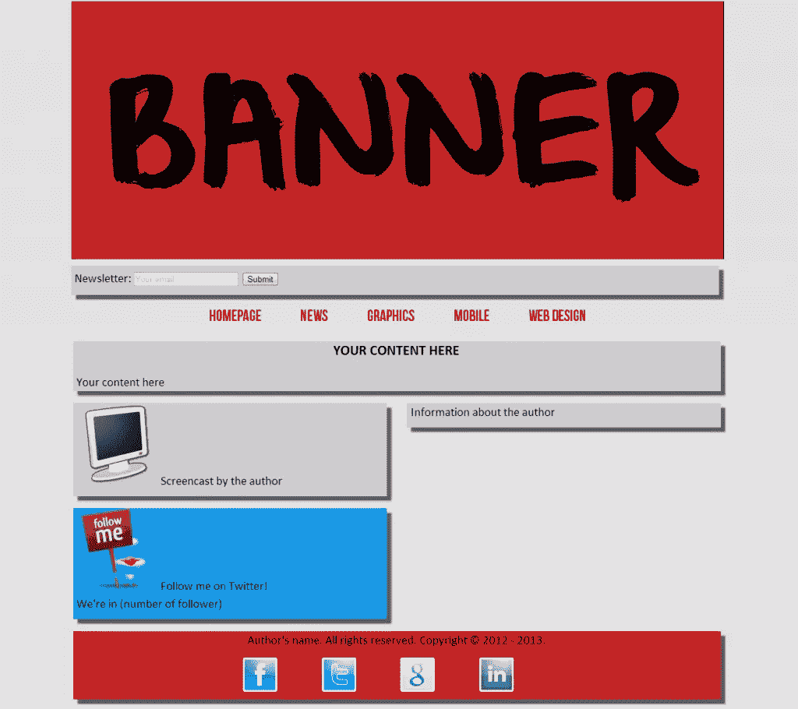

# 构建一个响应迅速、移动友好的网站:CSS

> 原文：<https://www.sitepoint.com/build-a-responsive-mobile-friendly-website-from-scratch-css-stylesheet/>

在本系列的上一篇文章中，我展示了如何从头开始构建一个网站，特别关注 HTML 代码及其主要元素。

现在是时候介绍第一个 CSS 规则了，以便对我们网站的主页将显示的图形风格有一个大致的了解，特别是对于 pc 桌面版本。

首先，在看一下为了给我们的主页创建一个特殊的设计我们必须应用的规则之前，让我们看看它将如何出现在我们的浏览器窗口中(我的默认浏览器是 Chrome，但是，通过应用一些特定的规则，你将能够在所有现代网络浏览器中获得相同的结果)。

我们的完全可定制的网站的主页应该看起来或多或少如下:

[](https://www.sitepoint.com/wp-content/uploads/2013/04/website-screenshot-desktop-version.png) 正如你所看到的，我想象了一面非常大的横幅，让设计师以清晰和积极的方式表达他所有的创造力和所选择的颜色(我真的很喜欢它们！).话虽如此，让我们深入研究一下代码。

至于 HTML 部分，在这种情况下，我们将从布局的上部到底部逐步进行。第一部分的代码(包括横幅、时事通讯栏和菜单的元素)将一段接一段地显示，并附有非常简短的评论，就像页面的其他项目一样。

第一个是 banner 元素，其样式代码如下:

```
#banner
{
   width: 100%;
   margin-top: 0.2em;
}
```

这些首要规则简单易懂。为了将横幅从浏览器窗口的顶部隔开，我们应用了 0.2em 的边距，并让我们的横幅图像覆盖浏览器窗口的整个宽度，我们将相应的规则设置为 100%。

让我们继续我们的时事通讯盒的样式规则。在这种情况下，我们必须注意放在 id 上的规则和为类考虑的规则，因为为了个人清楚起见，我已经决定不为实质上表示相同部分的元素选择不同的名称。因此，我们为该课程设置了一种背景颜色(这将是盒子的颜色和 0.2 em 的页边距——你会在这篇文章中找到为什么对响应式网站使用这种度量更好的原因，这篇文章将简要概述网页设计中最常用的单位),以稍微隔开新闻快递盒和上面的横幅。

id“newsletter-box”，也就是我们将在其中找到输入字段和提交按钮的空间，有三个简单的规则来定义包含上述元素的框的间距。如你所见，有一个 id(“手机简讯箱”)似乎不适合我们正在分析的版本。实际上，并不是这样:因为当从 pc 桌面版本转换到平板电脑版本或手机版本时，视图会发生变化，所以我们必须向样式表“建议”如何执行和显示页面元素。

在这种情况下，你将在下一篇文章中看到，当我们讨论设置响应性思维的规则时，描述时事通讯栏的所有元素的配置将完全改变。我们现在要做的是避免在 pc 桌面版本中出现移动显示器。为了达到这个结果，我们简单地将规则设置为“显示”none 参数。

我想说的一个很好的效果是我应用于白盒的转换，用户在白盒中插入电子邮件以接收新闻。给元素设置一个过渡，产生的效果是盒子的放大；我做的另一件事是指出这要持续的时间。这是一个 CSS3 规则，它创建了一个简单而轻盈的动作，输出非常令人愉快。

最后一个要讨论的规则是当点击时事通讯框时应用的宽度:设置为 17em，这个框会比平常大。

```
.newsletter-box
{
   background-color: #c32526;
   margin-top: 0.2em;
}

#newsletter-box
{
   margin-top: 0.5em;
   height: 1.8em;
   padding: 0.3em;
}

#mobile-newsletter-box
{
   display: none;
}

#newsletter-email
{
   width: 12em;
   -webkit-transition: all 1s;
   -moz-transition: width 1s;
   -o-transition: width 1s;
   -ms-transition: width 1s;
   transition: width 1s;
}

#newsletter-email:focus
{
   width: 17em;
}
```

现在让我们继续分析我们的导航栏。为了删除菜单列表中的默认项目符号，我们将参数设置为 none，而为了使其居中，我们求助于众所周知的规则“text-align: center”。然后，我们将填充和边距规则更改为适合我们目的的大小。为了让列表中的元素一个接一个地水平显示，我们将默认设置“block”改为“inline ”,并且在这种情况下，指定边距参数。

现在，是时候看看应用于链接元素的规则了:作为字体，我选择了“Bebas Neue”(你可以在这里下载)。我设置了 1.3 em 的字体大小，用“文本修饰:无”的规则去掉了下划线，并设置了我喜欢的颜色。当光标在菜单项上移动时，这种颜色会发生变化，此外，当用户单击他希望访问的页面的链接时，会出现 3D 效果，您可以在菜单链接上设置规则“位置:相对”并在同一元素的活动状态上设置参数 top 和 left 来获得这种效果。这样，你会有一个轻微的移动，给你一个可点击的 3D 按钮的印象。

```
ul.menu-list
{
   list-style-type: none;
   padding: 0;
   margin: 1em 0em;
   text-align: center;
}

li.menu-item
{
   display: inline;
   margin: 0em 1.5em;
}

a.menu-item-link
{
   font-family: &amp;quot;Bebas Neue&amp;quot;,Calibri,Arial,Helvetica,sans-serif;
   font-size: 1.3em;
   text-decoration: none;
   color: #c31f05;
position: relative;

}

a.menu-item-link:hover
{
   color: #000000;
}

a.menu-item-link:active
{
   top: 0.1em;
   left: 0.1em;
}

#menu-select
{
   display: none;
}
```

现在，转到常规部分，即应用于诸如标题、段落、图像、框外观等元素的规则。这是我思考、计划和实现的布局规则的规范代码。

```
body
{
   max-width: 1024px;
   margin: 0 auto;
   font-family: &amp;quot;Cwmagic&amp;quot;,Calibri,Arial,Helvetica,sans-serif;
   background-color: #E3E3E3;
   font-size: 1.2em;
   line-height: 1.5em;
}

img
{
   border: 0em;
}

h1,
h2,
h3
{
   text-align: center;
}

.float-left
{
   float: left;
}

.float-right
{
   float: right;
}

.clear-both
{
   clear: both;
}

.shadow
{
   -webkit-box-shadow: 0.4em 0.4em 0.2em #5C5B5B;
   -moz-box-shadow: 0.4em 0.4em 0.2em #5C5B5B;
   -o-box-shadow: 0.4em 0.4em 0.2em #5C5B5B;
   -ms-box-shadow: 0.4em 0.4em 0.2em #5C5B5B;
   box-shadow: 0.4em 0.4em 0.2em #5C5B5B;
   margin-right: 0.4em !important;
}

.long-box,
.small-box
{
   background-color: #cdcdcd;
   padding: 0em 0.3em;
   margin: 0em;
   margin-bottom: 1em;
}

.small-box
{
   width: 47%;
}

p
{
   margin-top: 0;
   margin-bottom: 0.5em;
}
```

至于第一部分的规则我就不一一解释了，特别是因为几乎都是一样的。我希望你注意的唯一一件事是类向左浮动，向右浮动和清除两者；事实上，我更喜欢创建一个类来“识别”这些规则，并将它们应用于 HTML 代码中的元素，而不是重复这些元素。另一个值得注意的元素是 CSS3 规则“ [shadow](http://www.css3.info/preview/box-shadow/ "box-shadow") ”。

> 这个属性允许设计者轻松地在框元素上实现多个投影(外部或内部)，指定颜色、大小、模糊和偏移的值。
> 
> 它可以接受逗号分隔的阴影列表，每个阴影由 2-4 个长度值(依次指定阴影的水平偏移、垂直偏移、可选模糊距离和可选扩散距离)、可选颜色值和可选“插入”关键字(创建内部阴影，而不是默认的外部阴影)定义。
> 
> 随着 Mozilla (Firefox)、Webkit (Safari/Chrome/Konqueror)、Opera 和 IE9 平台预览版都提供了该规范的体面实现，浏览器支持最近正在增长。

让我们以应用于页脚元素的规则来结束本文，即页脚本身和包含链接到最重要的社交网络个人资料的图标的栏。

```
#main-footer
{
   background-color: #c32526;
   text-align: center;
}

.social-bar a
{
   text-decoration: none;
   margin-right: 3em;
}
```

最后，让我们看看如何在 CSS 样式表中管理字体，记住 Internet Explorer 需要不同的字体格式，即“eot”。这是代码。

```
/*
 ***********************************
     FONT FOR INTERNET EXPLORER
 ***********************************
*/
@font-face
{
   font-family: &amp;quot;Bebas Neue&amp;quot;;
   src: url(../css/bebasneue.eot);
}

@font-face
{
   font-family: &amp;quot;Palatino Linotype&amp;quot;;
   src: url(../css/pala.eot);
}
/*
 ***********************************
       FONT FOR OTHER BROWSERS
 ***********************************
*/
@font-face
{
   font-family: &amp;quot;Bebas Neue&amp;quot;;
   src:
      local(&amp;quot;Bebas Neue&amp;quot;),
      local(&amp;quot;Bebas Neue&amp;quot;),
      url(&amp;quot;../css/bebasneue.ttf&amp;quot;);
}

@font-face
{
   font-family: &amp;quot;Palatino Linotype&amp;quot;;
   src:
      local(&amp;quot;Palatino Linotype&amp;quot;),
      local(&amp;quot;Palatino Linotype&amp;quot;),
      url(&amp;quot;../css/pala.ttf&amp;quot;);
}
```

## 结论

在这篇文章中，我们看到了为网站创建简单布局的基本规则。在关注了 pc 桌面版本之后，在下一部分我们将会看到哪些规则适用于使这种布局具有响应性。

## 分享这篇文章