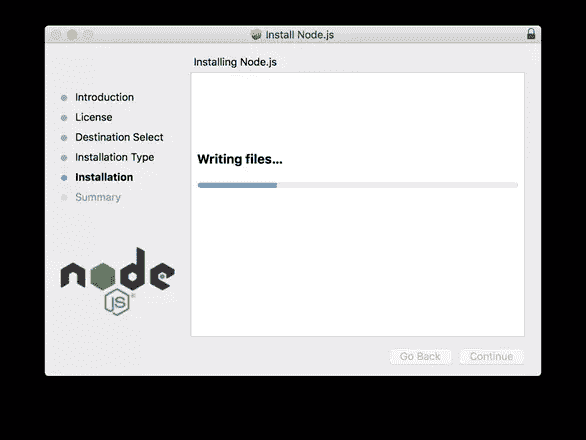
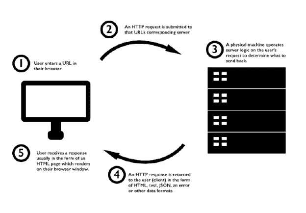
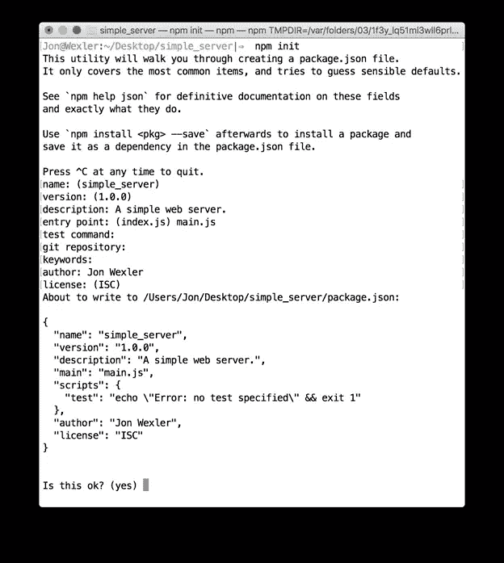
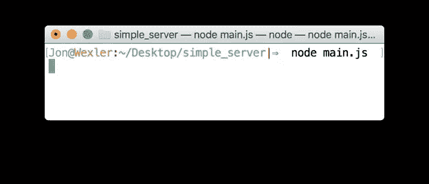
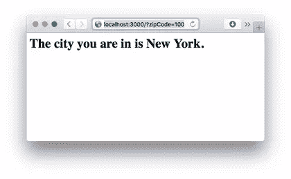

# 如何用 Node.js 构建一个简单的 Web 服务器

> 原文：<https://www.sitepoint.com/build-a-simple-web-server-with-node-js/>

*以下节选自[manning.com](https://www.manning.com/)出版的《用 Node.js *获取编程》一书。你可以使用代码 **fccwexler** 在这里以 37%的折扣购买这本书[。](https://livebook.manning.com/#!/book/get-programming-with-node-js/chapter-1/)**

 **本文是使用 Node.js 的实用介绍。我们将回顾 Node.js 的安装，了解 npm，然后我们将构建 Node.js 模块并直接开始初始化 web 服务器。当你阅读的时候，请随意在家跟随！**

## 安装 Node.js

Node.js 越来越受欢迎，越来越受支持。因此，要下载的新版本部署得非常频繁，因此保持最新版本以了解它们如何对您正在构建的应用程序有益或产生其他影响非常重要。在撰写本文时，要下载的 Node.js 版本是 7.6 或更高版本。

*注意:Node.js 7.6 版本支持 ES6 语法。ES6 (ECMAScript 2015)是 JavaScript 的最新更新，对定义变量、函数和 OOP 代码进行了语法改进。要跟上 JavaScript 的更新，请随着开发的进展下载 Node.js 的最新稳定版本。*

有几种下载和安装 Node.js 的方法，都列在 [Node.js 主站点](https://nodejs.org)上。

因为 Node.js 是独立于平台的，所以您可以在 macOS、Windows 或 Linux 上下载并安装它，并期望获得完整的功能。

安装 Node.js 最简单的方法是进入[下载链接](https://nodejs.org/en/download/)，按照说明和提示下载 Node.js 最新版本的安装程序。

*注意:当您安装 Node.js 时，您还会获得 npm，即外部库(其他人编写的多个代码文件)的 Node.js 生态系统，它可以导入到您未来的项目中。在下一节中，您将了解更多关于 npm 的内容。*


*图一。Node.js 安装程序页面*

下载安装程序文件后，从浏览器的下载面板或计算机的下载文件夹中双击该文件。安装程序将打开一个如图 1 所示的新窗口，并将所有必需的文件和核心 Node.js 库写入您的系统。可能会要求您接受许可协议，或者允许安装程序将 Node.js 安装到您的计算机上。按照提示点击安装。



*图二。Node.js 写入你的机器*

### 终点站和你的路

您将主要在计算机的终端上工作，这是一种内置软件，用于在没有图形界面的情况下在计算机上导航和运行命令。这本书教授如何使用 Unix 终端(Bash)命令。如果你是 Windows 用户，可以使用 Windows 的 CMD 终端窗口(你可能需要在整本书中查找相应的命令)。您可以参考这个比较 Windows 和 Unix 命令的表格。为了在 Windows 上更容易，您可以从 git-scm.com 下载并安装一个名为 GitBash 的附加 Bash 终端。

记下您的 Node.js 和 npm 版本在计算机上的安装位置。此信息显示在安装程序的最后一个窗口中。安装程序会尝试将这些目录位置添加到系统路径中。

您计算机的 PATH 变量是终端在开发中寻找资源的第一个地方。可以把它想象成你的计算机的索引，用来快速找到你需要的工具。通过将这些工具的原始文件路径或目录位置添加到 path 变量中,“终端”找到它们不会有任何问题。如果您在终端中启动 Node.js 时遇到任何问题，请遵循这里的安装步骤。

### 确保一切安装正确

现在您已经安装了 Node.js，让我们使用终端来确保所有的东西都安装正确。打开终端(或 GitBash)，在提示符下键入以下命令:`node-v`。

这个命令的输出应该显示您刚刚安装的 Node.js 的版本。类似地，您可以通过在命令提示符下运行命令`npm -v`来检查您已经安装的 npm 的版本。

*注意:如果您的终端响应一个错误或者没有任何响应，可能是您的 Node.js 安装不成功。如果出现错误，尝试将该错误复制并粘贴到搜索引擎中，以寻找常见的解决方案，或者尝试重复安装过程。*

现在您已经安装了 Node.js 并且您的终端正在运行，您需要一个地方来编写代码。尽管文本编辑器有许多不同的形式，也可以用来制作非代码文件，但专门为开发人员设计的文本编辑器通常预先打包了有用的工具和插件。我推荐安装 Atom 文本编辑器，你可以在 [atom.io](https://atom.io/) 下载。

*提示:如果您忘记了安装 Node.js 或 npm 的位置，您可以打开一个命令窗口，在提示符下键入`which node`或`which npm`来查看相应的位置。在 Windows 命令行提示符下，使用`where`代替`which`。*

## 规划您的应用

假设您想要为您所在城市的社区支持农业(CSA)俱乐部构建一个应用程序。通过这个应用程序，用户可以订阅从当地农场和经销商那里接收食物。该应用程序确保您的社区获得健康食品并保持联系。您计划使用 Node.js 来构建这个 web 应用程序，并且您想从验证用户的邮政编码开始，看看他们是否住得足够近，可以进行交付。问题是:您是否需要构建自己的工具来实现这一点？

幸运的是，答案是否定的，npm 可以用来安装 Node.js 包，这是其他人编写的代码库，您可以用它来为您的应用程序添加特定的功能。事实上，有一个基于邮政编码验证位置的包。我们将仔细看看这个包，以及如何安装它。

## 创建 Node.js 模块

Node.js 应用程序最终由许多 JavaScript 文件组成。为了让您的应用程序保持有序和高效，这些文件需要在必要时能够访问彼此的内容。每个文件的代码都是相互关联的，称为一个模块。让我们再看看我们的应用程序，给它添加一些积极的信息。您可以使用以下代码创建一个名为`messages.js`的文件:

```
let messages = ["You are great!", "You can accomplish anything!", "Success is in your future!"]; 
```

将这些消息与您将要编写来显示它们的代码分开，将使您的代码更有条理。要在另一个文件中管理这些消息，您需要更改`let`变量定义以使用 exports 对象，如下所示:

```
exports.messages =["You are great!", "You can accomplish anything!", "Success is in your future!"]; 
```

就像其他 JavaScript 对象一样，您在 Node.js exports 对象上添加了一个`messages`属性，该属性可以在模块之间共享。

*注意:`exports`对象实际上是`moduleobject`的一个属性。`module`既是 Node.js 中代码文件的名称，也是它的一个全局对象。使用`exports`实际上是`module.exports`的简写。*

另一个 JavaScript 文件需要(导入)该模块。您可以通过创建另一个名为`printMessages.js`的文件来测试这一点，该文件的目的是遍历消息，并用清单 1 中的代码将它们记录到您的控制台。首先，通过使用`require`对象和模块的文件名(带有或不带有. js 扩展名)来请求本地模块。然后，通过在`printMessages.js`中设置的变量来引用模块的数组。

**清单 1。将消息记录到`printMessages.js`** 中的控制台

```
const messageModule = require(’./messages’); 1

messageModule.messages.forEach( (m) =&gt; { 2

  console.log(m);

}); 
```

1.  需要本地`messages.js`模块。
2.  通过`messageModule.messages`引用模块的数组。

`require`是另一个 Node.js 全局对象，用于本地引入其他模块的方法和对象。Node.js 解释`require('./messages');`在项目目录中寻找一个名为`messages.js`的模块，并允许`printMessages.js`中的代码使用添加到 exports 对象中的任何属性。

接下来，我们将使用 npm，这是另一个向项目添加模块的工具。

## 运行 npm 命令

随着 Node.js 的安装，您还获得了*节点包管理器* (npm)。顾名思义，npm 负责管理应用程序中的外部包(其他人已经构建并在线提供的模块)。在整个应用程序开发过程中，npm 将用于安装、删除和修改这些包。在您的终端中输入`npm -l`会弹出一个 npm 命令列表，并附有简要说明。

清单 2 包含一些您可能想了解的 npm 命令。

**清单 2。要了解的 Npm 命令**

*   `npm init`。初始化 Node.js 应用程序并创建一个`package.json`文件
*   `npm install <package>`。安装 Node.js 包。
*   `npm publish`。将您构建的包保存并上传到 npm 包社区。
*   `npm start`。运行 Node.js 应用程序(假设`package.json`文件设置为使用该命令)。`npm stop`将退出正在运行的应用程序。

当使用`npm install <package>`时，将`--save`附加到您的命令会将该包作为应用程序的依赖项进行安装。添加`--global`将软件包全局安装到您的电脑上，以便在“终端”中的任何地方使用。这些命令扩展称为标志，分别有`-S`和`-g`的简写形式。`npmuninstall <package>`反转安装动作。如果项目需要，`npm install express -S`可以用来安装 Express.js 框架，而`npm install express-generator -g`可以用来安装 Express.js 生成器作为命令行工具。

### 模块和包

在使用 Node.js 进行开发的过程中，您会经常听到模块和包这两个术语。你需要知道的是:

*   **模块**是单独的 JavaScript 文件，包含属于单个概念、功能或库的代码。
*   **包**可能包含多个模块或单个模块。软件包用于将提供相关工具的文件组合在一起。

*注意:“依赖”是由一个应用程序或另一个模块使用的 Node.js 模块。如果软件包被视为应用程序依赖项，则必须在应用程序成功运行之前安装它(安装在应用程序指定的版本上)。*

如果你想在你的应用程序中加入一些功能，你可以在 npmjs.com 网站上找到一个软件包来完成这项任务。让我们继续添加根据邮政编码查找用户位置的功能。

为此，我们需要安装 [`cities`包](https://www.npmjs.com/package/cities)，用来将文本地址转换成位置坐标。然而，在成功安装软件包之前，我们仍然缺少这个项目中的一样东西。我们需要正确初始化 Node.js 项目，并创建一个 npm 用来安装`cities`的`package.json`文件，这将在下一节中完成。

> **快速检查练习**:如果你想在你的电脑上全局安装一个包，你用哪个标志？

## 初始化 Node.js 应用程序

每个 Node.js 应用程序或模块都将包含一个`package.json`文件来定义特定项目的属性。该文件位于项目的根级别。通常，这个文件是您指定当前版本的版本、应用程序的名称和主应用程序文件的地方。该文件对于 npm 将任何软件包在线保存到节点社区非常重要。

首先，创建一个名为`zip_connection`的文件夹，在终端中导航到您的项目目录，并使用`npm init`命令初始化您的应用程序。系统会提示您填写项目名称、应用程序版本、简短描述、启动应用程序的文件名(入口点)、测试文件、git 存储库、您的姓名(作者)和许可证代码。现在，只要确保输入你的名字并按下`enter`接受所有的默认选项。一旦您确认了所有这些更改，您应该会在项目目录中看到一个新的`package.json`文件，类似于清单 3 中的内容。

**清单 3。您的`zip_connection`项目**中的`package.json`文件的结果

```
{
  "name": "zip_connection",
  "version": "1.0.0",
  "description": "An app to promote locally sourced food.",
  "main": "printMessages.js",
  "scripts": {
    "test": "echo \"Error: no test specified\" &amp;&amp; exit 1"
  },
  "author": "Jon Wexler",
  "license": "ISC"
} 
```

这个例子`package.json`包含名称、版本、描述、起始文件、定制脚本、作者和许可证。

现在，您的应用程序有了保存和管理应用程序配置和包的起点。您应该能够通过导航到您的项目文件夹并在终端中运行以下命令来安装`cities`:

```
npm install cities --save 
```

同样，在这个安装中，您的项目文件夹将会获得一个名为`node_modules`的新文件夹。您刚刚安装的 cities 包的代码内容位于这个文件夹中。

*提示:`--save`标志将把`cities`包保存为这个项目的依赖项。现在检查您的`package.json`文件，看看这个包是如何列在依赖项下的。因为您的`node_modules`文件夹会变大，所以不建议在您在线共享项目代码时包含它。然而，任何下载这个项目的人都可以输入`npm install`来自动安装这个文件中列出的所有项目依赖项。*

通过将清单 4 中的代码行添加到`main.js`来测试这个新包。我们将从要求本地安装的`cities`包开始，并使它在这个文件中可用。然后我们将使用`cities`包中的`zip_lookup`方法根据邮政编码找到一个城市。结果存储在一个名为`myCity`的变量中。

**清单 4。在`main.js`** 实施城市包

```
const cities = require(’cities’);
var myCity = cities.zip_lookup(10016);
console.log(myCity); 
```

上面的代码执行以下操作:

1.  需要`cities`包。
2.  存储使用`zip_lookup`方法得到的城市。
3.  将结果记录到您的控制台。

来自该邮政编码的结果数据被打印到控制台，如清单 5 所示。

**清单 5。在终端**运行`main.js`的样本结果

```
{ zipcode: ’10016’,
  state_abbr: ’NY’,
  latitude: ’40.746180’,
  longitude: ’-73.97759’,
  city: ’New York’,
  state: ’New York’ } 
```

cities `zip_lookup`方法返回一个带有坐标的`JavaScript`对象。

> **快速检查练习**:哪个终端命令用`package.json`文件初始化 Node.js 应用？

## 在 Node.js 中构建简单的 Web 服务器

技术社区对 Node.js 及其使用 JavaScript 作为服务器端语言赞不绝口，这正是我们现在要做的:构建它！

本节涵盖了`http`模块的一些基本功能，这是一个 Node.js 代码库，用于处理互联网上的请求。通过几个简单的步骤，您将把几行 JavaScript 转换成一个应用程序，您可以在 web 浏览器上与它进行通信。Web 服务器是大多数 Node.js web 应用程序的基础。它们允许你加载图片和 HTML 网页给你的应用程序的用户。

让我们考虑一下我们正在开发的连接来自同一个邮政编码的用户的应用程序。在您交付完整的应用程序之前，社区可能希望看到一个简单的网站，它可以灵活地在将来改进和添加功能。你认为建造一个原型需要多长时间？

使用 Node.js，您可以使用`http`模块在几个小时内构建一个具有足够功能的 web 服务器。

### 了解 web 服务器

在开始之前，让我们讨论一些重要的 web 服务器概念。毕竟，如果你提前对结果有明确的预期，最终产品的外观和感觉会好很多。

#### Web 服务器和 HTTP

一个**网络服务器**是一个软件，它被设计成通过加载或处理数据来响应互联网上的请求。将 web 服务器想象成一个银行出纳员，其工作是处理您的存款、取款请求，或者只是查看您帐户中的钱。正如银行出纳员遵循一个协议来确保他们正确地处理您的请求一样，web 服务器遵循超文本传输协议(HTTP)，这是一个全球通用的标准系统，用于通过 internet 查看网页和发送数据。

客户端(您的计算机)和服务器通信的一种方式是通过使用 HTTP 动词。这些动词表示正在提出什么类型的请求。例如，用户是在尝试加载一个新的网页，还是在更新个人资料页面中的信息？用户与应用程序交互的环境是请求-响应周期的重要组成部分。

下面是您将遇到的两种最广泛使用的 HTTP 方法:

*   `GET`。此方法用于向服务器请求信息。通常，服务器会以您可以在浏览器上查看的内容进行响应(例如，单击链接以查看网站的主页)。
*   `POST`。此方法用于向服务器发送信息。服务器可能会在处理您的数据(例如填写和提交注册表单)后，通过 HTML 页面进行响应，或者将您重定向到应用程序中的另一个页面。

想想当你去 google.com 时会发生什么。在幕后，您实际上是在向 Google 的服务器发出请求，而服务器反过来会向您发送响应，呈现他们著名的“Google Search”登录页面。这种请求-响应关系为用户和应用程序之间的通信提供了通道。请注意，在图 3 中，一束数据是如何以请求的形式发送到应用程序的服务器的，一旦服务器处理了请求，它就以响应的形式发回一束数据。这就是你在互联网上的大部分互动是如何进行的。



*图 3。网络服务器根据请求向您的浏览器发送网页、图像和其他资源*

当您输入想要在浏览器中看到的 URL 时，一个 HTTP 请求被发送到别处的物理计算机。该请求包含一些信息，表明您是要加载网页还是要向该计算机发送信息。

你可能会用许多华而不实的东西构建一个奇特的应用程序，但是核心是 web 服务器，在互联网上处理它的通信。实践越多，这些概念就越有意义。现在，让我们开始构建我们的 web 服务器。

> **快速检查练习**:web 服务器从客户端收到什么，它发回什么？

### 用 npm 初始化应用程序

要开始使用 Node.js web 应用程序，首先需要在终端上初始化项目文件夹中的项目。打开一个终端窗口，用`mkdir`创建一个名为`simple_server`的新目录。你可以用`npm init`初始化项目。

*注意:npm 代表节点包管理器。您的节点项目依赖这个工具来安装和构建 Node.js 应用程序。*

运行`npm init`命令会启动一个创建`package.json`文件的提示(图 4)。正如提示所解释的，您将在这个文件中逐步完成 Node.js 应用程序的最基本设置的配置。



*图 4。填写 Node.js 初始化器提示*

现在，您可以添加`main.js`作为入口点，一个简短的描述，您的名字作为作者，并选择使用缺省值，方法是点击`enter`键，直到到达提示的末尾。

然后会要求您通过预览您的`package.json`文件来确认您的设置。按`enter`确认并返回常规终端提示。

### 编写应用程序代码

当您在本文开始时安装 Node.js 时，也安装了核心库。在这个库中有一个叫做`http`的模块，我们之前已经讨论过了。这是您将用来构建您的 web 服务器。我们还将使用另一个名为`url`的核心模块来检查我们在 web 浏览器中访问的 URL 的内容。

*注意:记住，Node.js 中的模块是打包的代码库，为您的应用程序提供特定的功能。在这里，`http`模块帮助您使用 HTTP 进行网络通信。*

在您的文本编辑器中，创建一个名为`main.js`的新文件，并将其保存在包含上面创建的`package.json`文件的项目文件夹中。这个文件将作为应用程序的核心文件，也是应用程序向用户提供网页的地方。在下面的应用程序中，我们将使用`cities`包根据提供的邮政编码确定一个城市。我们将从 URL 的末尾获取邮政编码，即查询参数。该参数跟随 URL 路径，以一个问号和一个键值对开始。在我们的例子中，我们将使用 zipCode 作为键，并为它提供一些 zip code 值。例如，如果我访问`http://localhost:3000/?zipCode=10016`，我将提取邮政编码 1006，并发现城市是纽约！

在我们分析将要构建的内容的每个方面之前，让我们看一下所有的代码。第一行代码要求您导入名为`http`和`url`的特定 Node.js 核心模块。我们将这两个模块与`cities`模块一起保存为常量，因为我们不希望这个值像普通变量那样变化。我们使用`http`变量作为对`http`模块的引用来创建一个服务器。在 ES6 中，通常构造一个回调函数，其参数在括号中，后跟`⇒`而不是`function`关键字。在这个代码块中，我们使用回调函数中的 response 参数将内容发送回用户的请求。第一行使用一个`writeHead`方法为响应的 HTTP 头定义一些基本属性。在本例中，我们返回 200 响应代码和`html content-type`来表示服务器成功接收到请求，并将以 HTML 的形式返回内容。这段代码使用服务器实例 server，并运行`listen`方法来指示服务器已经准备好接收端口 3000 上的传入请求。在提交响应之前，我们使用`url`模块在请求的 URL 末尾使用`url.parse(request.url, true).query;`提取查询。

使用一个`if`语句，我们检查是否有一个邮政编码参数可以和`query.zipCode`一起使用。如果有，我们在我们的`cities.zip_lookup(query.zipCode)`行和链`.city`中使用它的值从结果中提取城市的名称。否则，我们将城市设置为“未找到”。最后，我们向用户的屏幕返回一些 HTML，其中包含一些文本和与所提供的邮政编码相关联的城市。

**清单 6。简单的 web 应用程序代码为`main.js`**

```
const cities = require(’cities’);
const url = require(’url’);
const http = require(’http’);
const app = http.createServer((request, response) =&gt; {
  var city, query;
  query = url.parse(request.url, true).query;
  if (query.zipCode) city = cities.zip_lookup(query.zipCode).city;
  else city = "not found"
  response.writeHead(200, {"Content-Type": "text/html"});
  response.write(`&lt;h1&gt;The city you are in is ${city}.&lt;/h1&gt;`);
  response.end();
});

app.listen(3000); 
```

*   `const cities = require(’cities’);`:需要必要的模块。
*   `const app = http.createServer((request, response) =&gt;`:设置服务器，提取查询参数。
*   `if (query.zipCode) city = cities.zip_lookup(query.zipCode).city;`:从邮政编码中查找城市结果。
*   `response.writeHead(200, {"Content-Type": "text/html"});`:设置响应。
*   `app.listen(3000);`:告诉服务器监听端口 3000。

这就是它所有的荣耀！没那么可怕。只用几行代码，你也可以构建一个这样的 web 服务器。试试看！

*注意:如果你不指定端口号，你的操作系统会为你选择一个端口。这个端口号将很快用于通过您的 web 浏览器确认您的 web 服务器正在运行。*

### Node.js 中的回调

Node.js 如此快速高效的部分原因是它使用了回调。回调对 JavaScript 来说并不陌生，但是它们在 Node.js 中被广泛使用，因此值得一提。

一个**回调**本质上是一个匿名函数(一个没有名字的函数),一旦另一个函数完成，它就会被调用。回调的好处是，在运行其他代码之前，您不必等待原始函数完成处理。

考虑将一张照片上传到你银行的手机应用程序，将一张支票虚拟存入你的银行账户。回拨相当于几天后收到通知，让你知道支票已经核实并存入。在这段时间里，你可以正常生活。

在`http` web 服务器的例子中，来自客户端的输入请求是在滚动的基础上被接收的，并随即将请求和响应作为 JavaScript 对象传递给回调函数。

警告:方法名区分大小写。例如，使用 createserver()将会引发错误。

`createServer()`方法生成一个新的`http.Server`实例，这是一个内置的 Node.js 类，带有评估 HTTP 通信的工具。有了这个新创建的服务器实例，您的应用程序就可以接收 HTTP 请求和发送 HTTP 响应了。`createServer()`中的参数是一个回调函数，每当服务器中发生某个事件时就会被调用。例如，一旦服务器正在运行并且您的应用程序的根 URL(主页)被访问，一个 HTTP 请求事件将触发这个回调并允许您运行一些自定义代码。在这种情况下，服务器将返回一个简单的 HTML 响应。

*注意:200 是“OK”的 HTTP 状态代码，用于指示在 HTTP 响应头中返回内容时没有问题。要获得其他 HTTP 状态代码的列表，请在 Node.js REPL shell 中输入`http.STATUS_CODES`。*

就在那一行的下面，你用`write()`在响应中写一行 HTML，用`end()`结束响应。你必须以`end()`结束你的回复，告诉服务器你不再写内容了。如果不这样做，将会使连接处于打开状态，以便在响应中发送更多的信息，服务器最终将不会认为响应是完整的。

有了这些代码，就可以从终端启动 Node.js 应用程序了。

> **快速检查练习**:为什么要用 const 而不是 var 来存储应用程序中的 HTTP 服务器？

## 运行应用程序

最后一步很简单:使用终端导航到项目目录，并在终端窗口中运行节点`main.js`。接下来，打开任何浏览器到地址`localhost:3000`。您不会在终端窗口中看到服务器已经启动的任何指示，但是您很快会在浏览器中看到一切都正常工作。您的终端窗口应该类似于图 5。



*图 5。运行基本 Node.js 服务器*

首先，浏览器窗口应该显示没有找到城市。接下来，通过访问`http://localhost:3000/?zipCode=10016`，尝试添加一个邮政编码作为查询参数。浏览器窗口应该将城市显示为纽约，如下图所示。恭喜你！您的第一个 Node.js web 应用程序已经启动并运行。这是一个大项目，而且将会越来越大，越来越好。



*图 6。你在纽约！*

要停止应用程序，请在您的终端窗口中输入`Ctrl` + `C`。您也可以关闭终端窗口，但是您可能无法正确关闭应用程序，并且它可能会继续在后台运行(需要更多的命令行技巧来终止该进程)。

> **快速检查练习**:当你在服务器运行的情况下导航到`localhost:3000`时，你希望你发出什么类型的 HTTP 请求？

## 摘要

在本文中，我们安装了 Node.js，了解了 npm 和创建 Node.js 模块，Node.js 具有内置功能，可以通过`http`模块创建 web 服务器。我们通过`package.json`文件配置了一个新的 Node.js 应用程序。使用`http`模块和`createServer()`，我们用最少的努力创建了一个 web 服务器，这是用 Node.js 构建健壮应用程序的垫脚石，我们可以通过终端运行它。最后，我们在我们的`http`服务器中使用了`cities`包，通过城市的邮政编码来定位城市，并用城市名来响应用户的浏览器。

希望您对学习 Node.js 的兴趣比本文开始时更大。如果你想了解更多，请下载免费的*Get Programming with node . js*的[第一章](https://livebook.manning.com/#!/book/get-programming-with-node-js/chapter-1/)，并在 Slideshare.net 上观看这张幻灯片。你可以使用代码 **fccwexler** 在这里以 37%的折扣购买《T4》这本书。

## 分享这篇文章