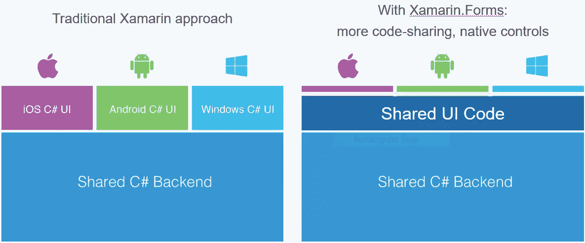
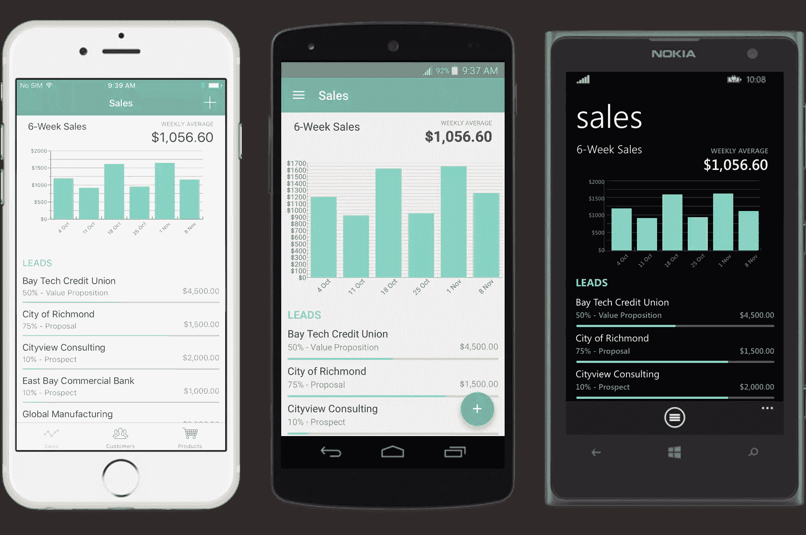
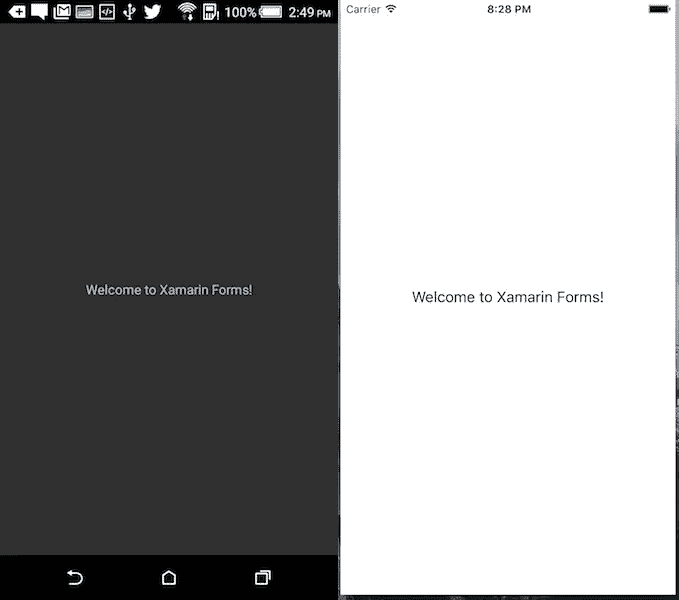
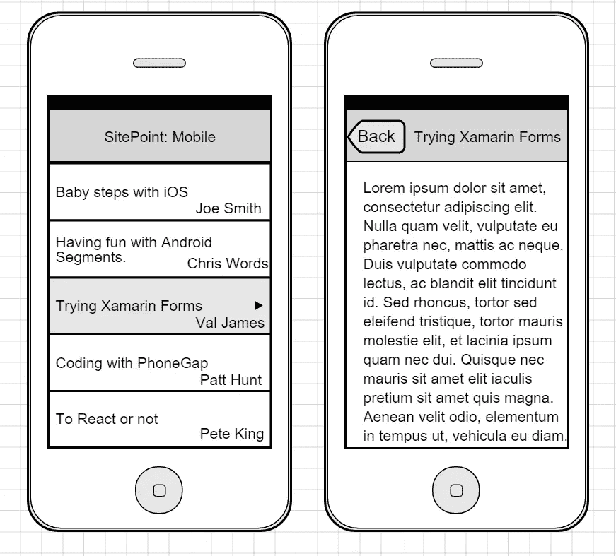
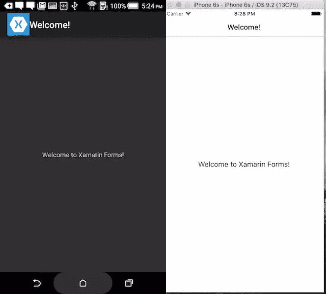
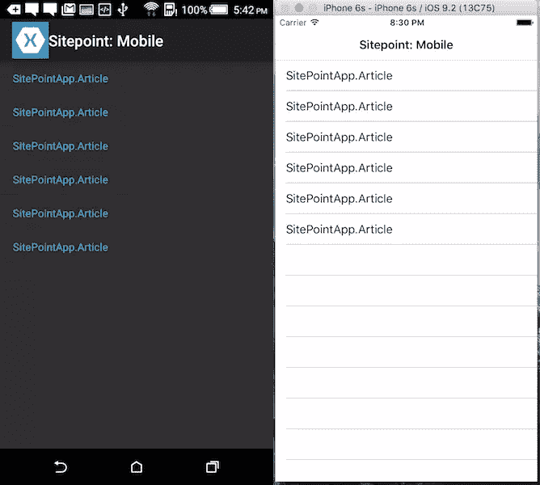
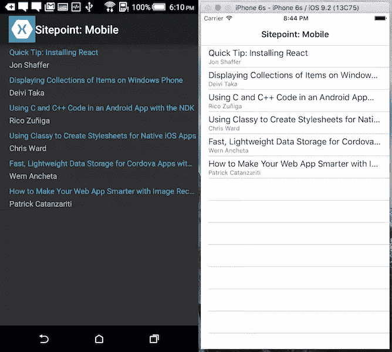
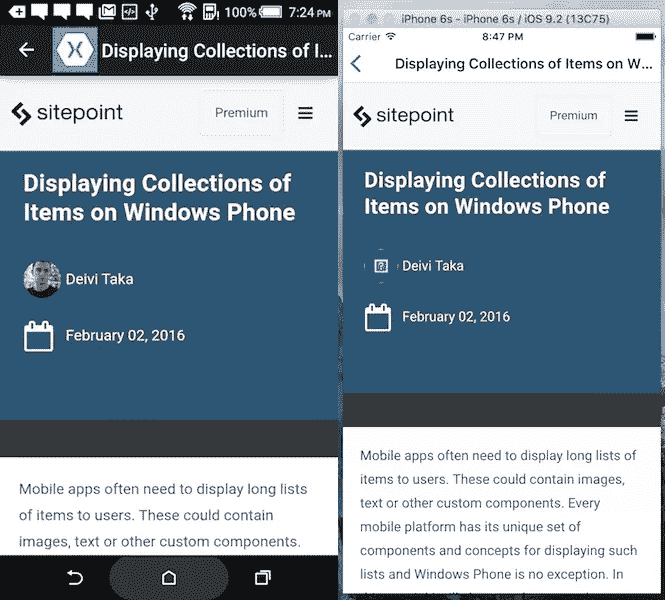

# 用 Xamarin 表单构建跨平台 Android 和 iOS 用户界面

> 原文：<https://www.sitepoint.com/build-cross-platform-android-ios-uis-xamarin-forms/>

*这篇文章由[阿德里安·桑杜](http://www.adriansandu.com/)进行了同行评审。感谢 SitePoint 的所有同行评审员使 SitePoint 的内容尽可能做到最好！*

Xamarin 旨在提供一种解决方案，允许公司和开发者进行本地和跨平台开发。使用 Xamarin，开发人员可以针对 Android、iOS 和 Windows(移动)10，使用单一的行业标准语言 C#。代码库的某些方面是特定于平台的，例如 UI 层，迫使程序员为每个平台重复开发它们。

随着微软最近对 Xamarin 的收购，它可能会成为微软和开发者跨平台战略的一个更好的支持、集成和重要的部分。

2014 年，Xamarin 推出了 [Xamarin Forms](https://xamarin.com/forms) (XF)。XF 引入了一个抽象层，它允许开发者使用 [XAML](https://en.wikipedia.org/wiki/Extensible_Application_Markup_Language) (可扩展应用程序标记语言)声明和/或代码来声明 UI。



使用 XF，程序员现在能够使用相同的代码和定义来定义和创建面向多个平台的移动应用程序。XF 将这些指令转换成特定于平台的代码和用户体验。使用这种方法，应用程序可以获得用户熟悉的原生用户体验、控件和模式。



与通过代码创建 UI 相比，XAML 使 UI 的创建具有声明性和简洁性，但这并不是入门的必要条件。拥有 XAML 相关技术背景的开发者，如 [WPF](https://en.wikipedia.org/wiki/Windows_Presentation_Foundation) (用于开发 Windows 桌面应用)或 Windows Phone / Windows Store 应用，会有宾至如归的感觉，因为许多概念都是相似的。

#### 我应该用 Xamarin 还是 Native？

使用 Xamarin 的优势是能够在不同平台之间共享代码，同时利用 C#功能和框架的力量，如[异步等待](https://developer.xamarin.com/samples/mobile/AsyncAwait/)、 [LINQ](https://msdn.microsoft.com/en-us/library/bb397926.aspx) 和[反应式扩展](https://components.xamarin.com/view/rxforxamarin)。缺点是您依赖于另一个抽象层，这可能会引入依赖于 Xamarin 来修复的错误和问题，无论何时新版本的平台可供开发人员使用。

#### 我应该使用 Xamarin 形式还是 Xamarin？

Xamarin maps 映射 iOS 和 Android 的 API。它给了你与原生开发时相同的能力，并且(Xamarin 声称)没有任何性能损失。对于 Xamarin 表单，额外的抽象层阻碍了您获得 pixel 完美设计实现的能力，并且对性能有轻微的影响(特别是在 Android 上，Xamarin 正在严格改进)。如果您的应用程序很复杂，您应该考虑 Xamarin Forms 是否适合您的需要。

既然已经设置了上下文，让我们开始编写第一个 XF 应用程序。

有一个小问题需要解决。要使用 Xamarin，你需要获得一个[执照](https://store.xamarin.com/)。Xamarin 提供了一个试用期，我强烈建议您使用它来遵循本教程。请注意，免费的 [Xamarin 初级版](https://xamarin.com/starter)不提供 Xamarin 表单。

## 环境设置

XF 应用可以使用 [Xamarin Studio](http://www.xamarin.com/Studio) 或者[微软 Visual Studio](https://www.visualstudio.com/en-us/visual-studio-homepage-vs.aspx) 开发(只在 Windows 上可用)。

事情不像我们希望的那么容易。苹果需要一台 Mac 来构建 iOS 应用程序，而微软需要一台运行 Windows 的机器来构建其平台。

为了提供帮助，Xamarin 提供了一个构建代理，您可以将其安装在 Mac 计算机上，并用于在 Windows 计算机上构建 iOS 应用程序。另一种选择是在虚拟机中使用 Mac 和主机 Windows。

在本教程中，我将使用 Visual Studio，但 Xamarin Studio 将允许您完成相同的步骤，因为我没有使用任何 Visual Studio 特定的功能。

[下载 Xamarin](https://xamarin.com/download) 并安装。您将创建的最终项目可在 [GitHub](https://github.com/sitepoint-editors/Xamarin-Forms) 上获得。

在 Visual Studio 2015 中，通过*文件*菜单创建一个新项目。在模板下，定位 *Visual C#* 节点，选择*跨平台*选项。

这应该会列出几个选项:

*   **空白应用(原生可移植/原生共享)**–该模板将创建一个由 Xamarin.iOS 和 Xamarin 组成的“解决方案”。Droid 和 Windows Phone 项目。这些项目类型超出了本教程的范围。
*   **空白 App (Xamarin。表单可移植/ Xamarin。表单共享)**–这些模板将创建两种风格的 Xamarin 表单解决方案。我将在下面讨论不同之处。
*   **类库(Xamarin。forms)**–这个模板将创建一个可以从任何 Xamarin 引用的类库。表单项目。
*   **UI 测试 App (Xamarin。UI test/Cross-Platform)**–该模板将使用 Xamarin 的 UI 自动化测试特性创建一个项目。这超出了本教程的范围。

选择**空白 App (Xamarin。Forms Portable)** ，它将创建一个由 4 个项目组成的解决方案，每个平台一个，以及一个 PCL 库，可以从所有这些平台特定的项目中引用。

### 便携式与共享

当使用**共享**选项时，Visual Studio 为每个平台创建一个项目，以及一个您可以向其中添加文件和资源的特殊项目。所有项目都被认为是特定于平台的项目的一部分，从而创建了一个单点，在这个单点上，更改会对其余的项目产生影响。

当使用 **Portable** 选项时，Visual Studio 为每个平台创建一个项目和一个可移植类库(PCL)。每个项目都可以引用一个 PCL。编译器将强制使用对 PCL 配置的每个成员都通用的类型。

如果可能，请始终使用便携选项。虽然这两种选择都是可行的，但 PCL 使开发更容易，并使代码更整洁。使用共享选项，您最有可能使用宏来定义特定于平台的代码。

### 安装和更新 Xamarin 表单

更新解决方案的 [nuget](https://www.nuget.org/) 包。Xamarin。Forms 通过 nuget 安装到解决方案中，这允许 Xamarin。表单团队定期发布更新。

当在 Windows 上运行时，启动特定于 Windows 的项目应该是最容易的，但是设置 Android 项目更复杂，需要设置物理设备或仿真器。Xamarin 提供了一个 Android 模拟器作为单独的[下载](https://xamarin.com/android-player)。微软也提供了一个 [Android 模拟器](https://www.visualstudio.com/en-us/features/msft-android-emulator-vs.aspx)，还有一个由 Android Toolkit 安装提供的不推荐的 Android 模拟器。

在 PCL 项目中， *App.cs* 包含当前输出代码:

```
// The root page of your application
MainPage = new ContentPage
{
    Content = new StackLayout
    {
        VerticalOptions = LayoutOptions.Center,
        Children = {
            new Label {
                HorizontalTextAlignment = TextAlignment.Center,
                Text = "Welcome to Xamarin Forms!"
            }
        }
    }
};
```

这段代码创建了一个`ContentPage`页面( [XF 提供了几种页面类型](https://developer.xamarin.com/guides/xamarin-forms/controls/pages/)，包括 NavigationPage 和 TabbedPage)。然后它添加了一个`StackLayout`布局( [XF 提供了几种布局](https://developer.xamarin.com/guides/xamarin-forms/controls/layouts/)，包括网格、绝对和相对)。最后，它创建了一个负责显示简单文本的`Label`控件( [XF 提供了许多有用的控件](https://developer.xamarin.com/api/namespace/Xamarin.Forms/)，包括输入和映射)。

`Text`和`HorizontalTextAlighnment`属性使用值<q>将文本水平居中，欢迎使用 Xamarin 表单！</q>。`MainPage`是 App 对象的属性，在应用程序启动时创建，是任何 Xamarin Forms 应用程序的根对象。



我不会在特定平台项目中讨论生成的代码，这将在未来的特定平台教程中讨论。

## 创建应用程序

现在已经准备好用 XF 编写第一个应用程序了。在本教程中，您将创建以下应用程序:



该应用程序有两个独立的页面，内置的`NavigationPage`将用于在它们之间导航。第一页有一个与 SitePoint 域相关的文章列表，例如 Mobile。点击一个列表项将导航到一个包含显示文章内容的`WebView`控件的页面。`NavigationPage`将允许用户导航回文章列表。为了简单起见，文章列表被硬编码到应用程序中，因为执行 HTTP 操作超出了本教程的范围。

首先在应用程序中添加一个 <q>[模型](https://en.wikipedia.org/wiki/Domain_model)</q> 层。

模型层将包含列表中显示的文章列表。但是首先您需要定义文章对象。创建 *Article.cs* 并添加:

```
public class Article
{
  public string Title { get; set; }
  public string Author { get; set; }
  public string ArticleUrl { get; set; }
}
```

该应用程序在列表中显示文章的标题和作者，第二页将导航到 URL，因此对于该应用程序来说，一个简单的类就足够了。接下来，是一个新的 *DataService.cs* 类来提供文章列表。

```
public static class DataService
{
    public static IList<Article> GetArticles()
    {
        return new List<Article>
        {
            new Article
            {
                Title = "Quick Tip: Installing React",
                Author = "Jon Shaffer",
                ArticleUrl = "https://www.sitepoint.com/quick-tip-installing-react-native/"
            },
            new Article
            {
                Title = "Displaying Collections of Items on Windows Phone",
                Author = "Deivi Taka",
                ArticleUrl = "https://www.sitepoint.com/displaying-collections-of-items-on-windows-phone/"
            },
            new Article
            {
                Title = "Using C and C++ Code in an Android App with the NDK",
                Author = "Rico Zuñiga",
                ArticleUrl = "https://www.sitepoint.com/using-c-and-c-code-in-an-android-app-with-the-ndk/"
            },
            new Article
            {
                Title = "Using Classy to Create Stylesheets for Native iOS Apps",
                Author = "Chris Ward",
                ArticleUrl = "https://www.sitepoint.com/using-classy-to-create-stylesheets-for-native-ios-apps/"
            },
            new Article
            {
                Title = "Fast, Lightweight Data Storage for Cordova Apps with LokiJS",
                Author = "Wern Ancheta",
                ArticleUrl = "https://www.sitepoint.com/fast-lightweight-data-storage-for-cordova-apps-with-lokijs/"
            },
            new Article
            {
                Title = "How to Make Your Web App Smarter with Image Recognition",
                Author = "Patrick Catanzariti",
                ArticleUrl = "https://www.sitepoint.com/how-to-make-your-web-app-smarter-with-image-recognition/"
            }
        };
    }
}
```

到目前为止，没有影响用户界面的变化，所以运行应用程序应该看起来和默认的空白应用程序一样。

打开 *App.cs* ，用一个`NavigationPage`包装已有`ContentPage`的创建。

```
MainPage = new NavigationPage(new ContentPage
{
    Title = "Welcome!",
    Content = new StackLayout
    {
        VerticalOptions = LayoutOptions.Center,
        Children = {
            new Label {
                HorizontalTextAlignment = TextAlignment.Center,
                Text = "Welcome to Xamarin Forms!"
            }
        }
    }
});
```

将第一页作为参数显示，因为它本身没有任何内容。根据平台的不同，它可能会提供用于导航的用户界面。注意，我为`ContentPage`的`Title`添加了一个值，因为在某些平台上`NavigationPage`可以向用户显示这个值。

现在，应用程序看起来应该是这样的:



现在您已经准备好开始编码第一个页面，它将替换默认的`ContentPage`，使它成为启动时显示的页面。打开*添加新项目*菜单项，选择*表单内容页面*代码模板，命名为*文章视图*。我介绍的关键组件是`ListView`控件，它显示包含数据的行列表。

在构造函数中，将默认实现替换为:

```
public ArticlesView()
{
    Title = "Sitepoint: Mobile";
    Content = new ListView
    {
        ItemsSource = DataService.GetArticles(),
    };
}
```

`ListView`有一个名为`ItemsSource`的属性，其中分配了一个项目列表，然后为列表中的每个项目创建一个单元格，使用前面创建的`DataService`为页面提供项目。

更改 *App.cs* 以在应用加载时显示此页面。

```
MainPage = new NavigationPage(new ArticlesView());
```

如果您现在运行该应用程序，您将看到显示列表的新页面。它已经为`DataService`提供的每篇文章创建了单元格，但是这对用户还没有帮助。



您需要指定`ListView`应该如何显示每个项目。当与 XAML 一起使用时，`ListView`在这方面大放异彩，但是也可以用代码来完成。修改 *ArticlesPage.cs* 的构造函数中的代码:

```
public ArticlesView()
{
    Title = "Sitepoint: Mobile";
    var listView = new ListView();

    var textCell = new DataTemplate(typeof(TextCell));
    textCell.SetBinding(TextCell.TextProperty, "Title");
    textCell.SetBinding(TextCell.DetailProperty, "Author");
    listView.ItemTemplate = textCell;
    listView.ItemsSource = DataService.GetArticles();

    Content = listView;
}
```

这将为`ListView`的`ItemTemplate`属性设置一个`DataTemplate`，这是对`ListView`如何显示每个单元格的指令。它使用内置的`TextCell`(Xamarin 还提供了其他功能，比如`ImageCell`和`CustomCell`，允许开发人员指定在单元格级别显示任何内容)。创建`DataTemplate`的关键方面是数据绑定，您需要指定两条指令将来自`Article`对象的值绑定到`TextCell`的`Text`和`Detail`属性。

现在，当您运行应用程序时，您将看到显示的正确数据:



第一个页面完成后，您现在可以创建第二个页面，再次使用`ContentPage`，这次命名为 *ArticleContentPage.cs* 。在这个页面上起重要作用的是`WebView`控件(Xamarin Forms 平台的一部分)，它将呈现所提供的 URL 的内容。

```
public class ArticleContentPage : ContentPage
{
    private WebView _webView;
    public ArticleContentPage()
    {
        Content = _webView = new WebView();
    }
}
```

此时没有其他事情要做，因为您不知道用户在第一页选择了哪篇文章。在导航前第一页设置的构造函数后添加一个`Article`属性。

```
public ArticleContentPage()
{
    ...
}

public Article Article { get; set; }
```

切换回第一页( *ArticlesPage.cs* )，您需要知道用户何时选择了一篇文章。`ListView`定义了一个`ItemSelected`事件，它将被注册到。

```
public ArticlesView()
{
  Title = "Sitepoint: Mobile";
  var listView = new ListView();
  ...
  listView.ItemSelected += ListView_ItemSelected;
  Content = listView;
}

private void ListView_ItemSelected(object sender, SelectedItemChangedEventArgs e)
{
  // Check that there is a selected item
  if (e.SelectedItem == null) return;

  // Set the item as the article to display in the next page
  var page = new ArticleContentPage {Article = e.SelectedItem as Article};
  Navigation.PushAsync(page, true);

  // Clear the selected item in the list
  var listView = sender as ListView;
  listView.SelectedItem = null;
}
```

事件处理程序有两部分，第一部分处理导航本身。第二个清除当前选择，所以当用户导航回列表时，列表不包含任何选择的项目，如果用户选择，它可以再次被选择。这样做的一个副作用是事件处理程序被再次调用，这次是用一个`null`标识的`SelectedItem`。针对这种情况的保护被添加在该方法的开始。

为了导航，每个页面都可以访问实现模态和非模态导航的`Navigation`属性帮助器。

#### 平台特定导航

导航是在受支持的平台上创建抽象层被证明是一项困难任务的领域之一。

需要注意的是，iOS 上的非模态导航需要`NavigationPage`存在，而 Android 和 Windows 都不需要。

拼图的最后一块是处理 *ArticleContentPage.cs* 上的导航并呈现文章。每个页面都提供了一些方法，当页面出现或消失时，可以重写这些方法来进行处理。

```
protected override void OnAppearing()
{
    base.OnAppearing();
    Title = Article.Title;
    _webView.Source = new UrlWebViewSource {
        Url = Article.ArticleUrl
    };
}
```

在这种情况下，访问`WebView`实例并将其 source 设置为文章的 URL。这足以让`WebView`开始渲染:



有了这些最后的步骤，您就有了一个可以在所有支持的平台上工作的有用的应用程序，而不需要编写任何特定于平台的代码。

## 包扎

在本教程中，我介绍了使用 Xamarin 提供的解决方案来构建跨平台应用程序的背景和优点，以及 Xamarin 如何进一步增加特定于平台的 Xamarin 解决方案的抽象层。

我还解释了如何设置开发人员环境和构建真实的 Xamarin 表单应用程序。

感谢您抽出时间，希望您喜欢本教程，并发现它很有用。请在下面添加您的意见和问题。

## 分享这篇文章