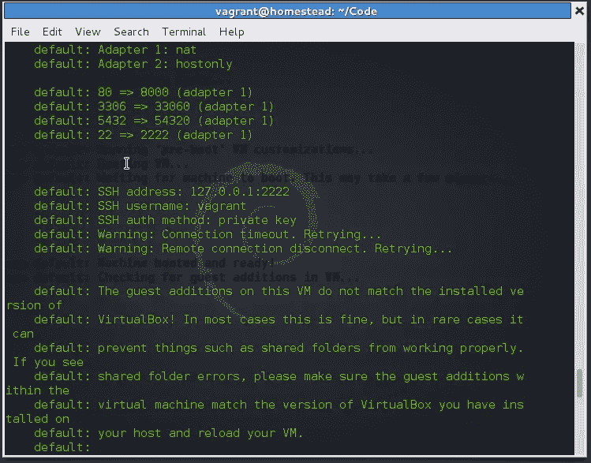
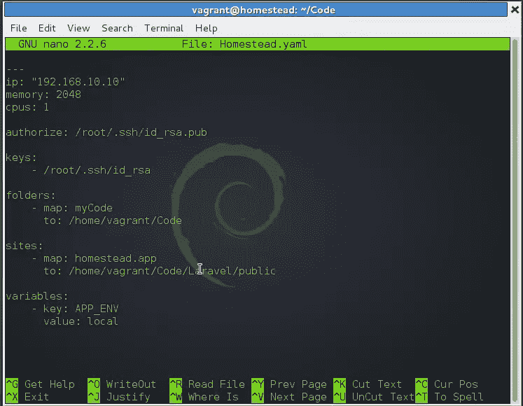
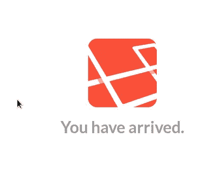

# 在《流浪》中用 Laravel 和 EmberJS 构建一个新的 App

> 原文：<https://www.sitepoint.com/build-new-app-laravel-emberjs-vagrant/>

如今，一切都变成了网络应用。即使是简单的网站也有一个依赖 REST Api 的移动应用。网络应用随处可见——在笔记本电脑、台式机、平板电脑、手机上，以及最近的智能手表等可穿戴设备上。一切都变得更小更快——前端与后端分离，只通过 API 与服务器通信。

## 我们将建造什么？

在这个系列中，我们将创建一个照片上传应用程序。对于前端，我们将使用 [EmberJs](http://emberjs.com) 和[基金会 5](http://foundation.zurb.com/) 。EmberJs 是一个前端框架，具有与 REST Apis 良好集成的特点。Foundation 5 将帮助我们快速制作前端原型。对于托管，我们将使用 [Heroku](http://heroku.com) 的免费层(关于 Heroku 上 PHP 的更多信息，见[这里](https://www.sitepoint.com/8-heroku-addons-production-ready-apps/))。对于后端，我们将使用 [Laravel](https://www.sitepoint.com/blog/) 。源代码将在本系列的最后一部分中以最终形式提供。你可以在这里下载第 1 部分[的代码。](https://github.com/sitepoint-examples/sitepoint-RESTAPI-laravel-emberJs-part1)

## 我们开始吧

用 PHP 启动一个新项目的好方法是使用[流浪者](https://www.sitepoint.com/blog/)。流浪者给了我们从一个项目到另一个项目进行大量实验的空间。如果我想对一个项目使用 Apache，对另一个项目使用 Nginx，我可以有不同的 PHP 版本。如果出现问题，我会恢复我所有的工作，然后简单地`vagrant up`恢复——而且我从来不会用各种其他的安装来污染我的主机操作系统。

最简单的开始方式是遵循这个[快速提示](https://www.sitepoint.com/quick-tip-get-homestead-vagrant-vm-running/)，它将带你完成一个快速安装过程，并在几分钟内向你展示一个工作的 Laravel 应用程序，这样你就可以开始动手了。如果你仍然不相信为什么你应该使用宅基地和流浪汉，见[这里](https://www.sitepoint.com/6-reasons-move-laravel-homestead/)。



我的 Homestead.yaml 是这样的。



现在机器正在运行，我们必须安装 Laravel。首先，让我们使用 ssh 与机器建立连接。

```
vagrant ssh
```

然后导航到将托管我们的应用程序的文件夹。

```
cd Code
```

这里我们需要下载 Laravel，然后用 Composer 安装依赖项。

```
git clone https://github.com/laravel/laravel Laravel
cd Laravel
composer install
```

Composer 安装完所有包后，在浏览器中搜索 **localhost:8000** 进行测试。如果你做了所有正确的事，你会看到这个:



示例应用程序的文件现在可以在浮动虚拟机和您的主机操作系统中使用，以便用您最喜欢的 ide 进行编辑。

## Heroku

除非另有说明，以下操作都是在使用`vagrant ssh`登录时在虚拟机内部执行的。关于 Heroku 流浪和安装插件的更详细的概述，见[本帖](https://www.sitepoint.com/8-heroku-addons-production-ready-apps/)，否则，见下文。

如果您在 Heroku 上还没有帐户，请点击[此链接](https://id.heroku.com/signup)创建一个帐户，并下载 [Heroku 工具箱](https://toolbelt.heroku.com/)。这是一个客户端 cli，它简化了我们使用 Heroku 的工作。我们可以从这个命令行界面安装[插件](https://addons.heroku.com/)，创建新项目，在 git 的帮助下，我们还可以推动每一个变化。在 Heroku 上创建帐户并安装了 [Heroku Toolbelt](https://toolbelt.heroku.com/) 之后，你必须登录才能开始使用它。

```
heroku login
```

执行这个命令后，我们就与 Heroku 建立了连接。现在我们可以开始在那里创建一个新项目。

要在 Heroku 上使用 Laravel，我们需要做一些小的改动。首先，创建一个文件，命名为`Procfile`。将这一行添加到文件中。

```
web: vendor/bin/heroku-php-apache2 public
```

这是一个配置文件。Heroku 需要它知道自己在对付什么。这样，我们指定了 PHP 和 Apache。我们也可以用 python，java，ruby，scala 等等。安装 [Heroku Toolbelt](https://toolbelt.heroku.com/) 时，工长也安装。它用于在本地执行**过程文件**，帮助您维护[开发/生产奇偶校验](http://12factor.net/dev-prod-parity)。如果你对 Procfile 还能做什么感兴趣，请点击 Heroku 官方文档的链接。

如果你想用 Nginx 代替，请看这篇文章。

在 Laravel 的文件夹中逐一执行这些命令

```
git init
    git add .
    git commit -m "initing"
```

第二步是从`.gitignore`上取下`Composer.lock`。在我们完成 git 之后，让我们回到 Heroku。

```
heroku create
```

这在 Heroku 上创建了一个新项目。

```
git push heroku master
```

这会把一切都推到 Heroku 身上。我们来测试一下。如果一切顺利，那么我们将看到 Laravel 的标志，我们也看到了当我们在[家园改进](https://www.sitepoint.com/quick-tip-get-homestead-vagrant-vm-running/)测试它。

如果你对 rsa 密钥有疑问，请阅读本文。如果你想在 Heroku 上了解更多关于 PHP 的知识，请看[这里](https://devcenter.heroku.com/articles/getting-started-with-php)和[这里](https://www.sitepoint.com/8-heroku-addons-production-ready-apps/)。

## 安装前端包

我们将使用 Bower 进行前端包安装。你可以自由使用任何你想要的东西，甚至可以从 Github 或者官方网页下载 zip 文件。导航到 Laravel 文件夹中的 public 文件夹。

```
cd public
```

没有必要安装 Bower，因为 Homestead 预装了 **nodeJs** 、 **npm** 和 **Bower** 。

```
bower init
```

然后安装软件包:Foundation 5、EmberJs 和 Ember Data。Ember data 是 Ember 使用的库，是独立的。它将帮助我们使用 REST Api 作为 REST 适配器。

```
bower install --save zurb/bower-foundation components/ember components/ember-data
```

Bower 已经为我们安装了一切，包括所有的依赖项。

## 前端骨架

让我们开始构建我们项目的基础。Bower 已经安装了依赖项，并将它们放在`bower_components`中。我们还需要一个文件夹来存放静态文件。在公共目录中创建一个名为`static`的文件夹。然后在里面创建三个文件夹:`js`、`css`和`img`。在`js`文件夹中创建一个`app.js`文件，在`css`文件夹中创建一个`style.css`文件。

当我用 Laravel 开始一个新项目时，我总是做的第一件事是为安全密码散列生成一个密钥。

```
php artisan key:generate
```

在`app/views`中创建一个新视图。称之为`index.php`。这将是登录页面。我们需要导入该文件中的所有 javascript 库和样式。

```
<!doctype html>
    <html class="no-js" lang="en">
    <head>
        <meta charset="utf-8" />
        <meta name="viewport" content="width=device-width, initial-scale=1.0" />
        <title>Webapp with EmberJs and Laravel4</title>
        <link rel="stylesheet" href="/bower_components/foundation/css/foundation.css" />
        <link rel="stylesheet" href="/static/css/style.css" />
    </head>
    <body>

        <h1>A blank app</h1>

        <script src="/bower_components/jquery/dist/jquery.js"></script>
        <script src="/bower_components/foundation/js/foundation.min.js"></script>
        <script src="/bower_components/handlebars/handlebars.js"></script>
        <script src="/bower_components/ember/ember.js"></script>
        <script src="/static/js/app.js"></script>
        <script> $(document).foundation(); </script>
    </body>
    </html>
```

这是视图的框架，我们可以在此基础上构建。这是一个单页应用程序，使这个文件成为整个应用程序中的唯一视图。我们将要用 Ember 构建的所有东西都将只存在于这个文件中。

要使用`index.php`视图，我们还必须改变位于`app`文件夹中的`routes.php`文件。将文件更改为:

```
Route::get('/', function()
    {
    	return View::make('index');
    });
```

在您的浏览器中测试它。打开`localhost:8000`。将出现一个带有标题的空白页。如果我们查看检查器(ctrl+shift+i)，没有错误。每个文件加载没有问题。把所有的改动上传到 Heroku，看看在那里行不行。

```
git add .
    git commit -m "testing"
    git push heroku master
```

## 数据库配置

在处理不同的环境时，使用 Laravel 进行数据库配置很容易。我们必须以一种既能在家园又能在 Heroku 上工作的方式来配置它。在 Heroku 上，创建 app 时没有安装 [Postgresql](https://addons.heroku.com/heroku-postgresql) ，所以我们必须使用 toolbelt 来安装。这个插件不需要你有信用卡:

```
heroku addons:add heroku-postgresql
```

在`/app/config/database.php`中，将默认键改为指向 postgres。

```
'default' => 'pgsql',
```

Heroku 和 Homestead 上的 Postgres 使用不同的配置值。那么如何在每种情况下使用这些值呢？从最初的[快速提示](https://www.sitepoint.com/quick-tip-get-homestead-vagrant-vm-running/)中，我们知道默认的 Postgres 端口是 54320，我们开发环境的用户/通行证组合是`homestead` / `secret`。

我们必须改变生产环境的值(在本例中是 Heroku)。

在`/app/config`中创建一个名为`production`的新文件夹。复制位于`/app/config/local`中的`database.php`，并将其放入生产配置文件夹中。也放一份在`testing`文件夹里。当您想要测试您的应用程序时，您也必须为该环境配置数据库。Laravel 默认将 Homestead 的配置存储在`local/database.php`文件夹中。

Heroku 将 postgres 的配置存储为一个环境变量。最后，文件应该看起来像这样。

```
<?php

    $url = parse_url(getenv("DATABASE_URL"));   // Get the environment variable 
                                                // and return it as an array
    return array(

    	'connections' => array(

    		'mysql' => array(
    			'driver'    => 'mysql',
    			'host'      => 'localhost',
    			'database'  => 'homestead',
    			'username'  => 'homestead',
    			'password'  => 'secret',
    			'charset'   => 'utf8',
    			'collation' => 'utf8_unicode_ci',
    			'prefix'    => '',
    		),

    		'pgsql' => array(
    			'driver'   => 'pgsql',
    			'host'     => $url["host"],
    			'database' => substr($url["path"], 1),
    			'username' => $url["user"],
    		    'password' => $url["pass"],
    			'charset'  => 'utf8',
    			'prefix'   => '',
    			'schema'   => 'public',
    		),

    	),

    );
```

现在 psql 已经准备好使用迁移和种子来填充数据了。使用迁移更容易维护代码和进行一些更改。

```
php artisan migrate:make create_users_table
```

将在`/app/database/migrations`中创建一个文件。将该模式添加到`up`方法中:

```
public function up()
	{
        Schema::create('users', function($table)
        {
            $table->increments('id');
            $table->string('username');
            $table->string('password');
            $table->timestamps();
        });
	}
```

另外，在“down”方法中添加这一行:

```
public function down()
	{
        Schema::dropIfExists('users');
	}
```

Artisan 是缩短开发时间的好工具。迁徙和播种只是一点工匠的魔法。

```
php artisan migrate
```

这将对每个迁移文件执行`up`方法，并创建该方法中定义的模式。另一方面，`php artisan migrate:reset`将执行`down`方法，并且在大多数情况下将恢复`up`方法所做的所有更改。如果您使用`up`方法创建一个模式，那么恢复`down`方法中的所有内容。

数据库现在有一个名为`users`的简单结构的表。使用种子，数据库将被数据填充。毕竟，每次数据库发生变化时，通过运行一个命令将数据保存在数据库中比手动操作要好。

在`/app/database/seeds/`文件夹中创建`UserTableSeeder.php`。

```
/* /app/database/seeds/UserTableSeeder.php */

    class UserTableSeeder extends Seeder {

        public function run()
        {

            Eloquent::unguard();

            DB::table('users')->delete();

            User::create(array(
                'username' => 'foo',
                'password' => Hash::make('password')
            ));

        }

    }
```

seeder 类必须扩展`Seeder`类。此外，将这段代码添加到`/app/database/seed/DatabaseSeeder.php`中，因为 artisan 在运行`php artisan db:seed`时不包含自定义文件。相反，您必须使用`php artisan db:seed --class=UserTableSeeder`来使用那个特定的类。我更喜欢运行`php artisan db:seed`，让`DatabaseSeeder`做所有的工作。

```
/* /app/database/seeds/DatabaseSeeder.php */

    class DatabaseSeeder extends Seeder {

    	public function run()
    	{   
            $this->call('UserTableSeeder');
    	}

    }
```

这只会在`users`表中添加一个用户。测试应用程序需要更多的用户。我们将在第 2 部分中处理这个问题。

在位于`/app/database/seeds`的`DatabaseSeeder.php`中插入该代码片段后，运行以下命令:

```
php artisan db:seed
```

在`users`表中创建了一个包含我们的值的新行。

## 又是 Heroku

我们有一个数据库，里面有一个关于家园的简单表格。但是这些改变能在 Heroku 上实现吗？用 git 在线推送代码，了解一下。

```
git add .
    git commit -m "adding database"
    git push heroku master
```

后来在 Heroku 处决了工匠。

```
heroku run php artisan migrate
    heroku run php artisan db:seed
```

将`heroku run`放在任何 php/artisan 命令之前，它就会工作。由于此环境处于生产模式，屏幕上将出现一个问题。点击回车键，用户表将被创建和植入。如果您有更多的种子和迁移文件，这个问题会出现得更频繁。


## 包扎

在本文中，我们为我们的应用程序构建了一个框架。它现在运行在我们的本地环境和 Heroku 上。在处理本地开发和云开发的情况下，您可能会花费大量的时间来处理配置，并在两个不同的环境中保持一致。接下来，我们将完成数据库的创建。我们将用一个假的数据生成器创建一些种子，并且我们将使用一个文件系统库来处理本地文件。敬请期待！

## 分享这篇文章