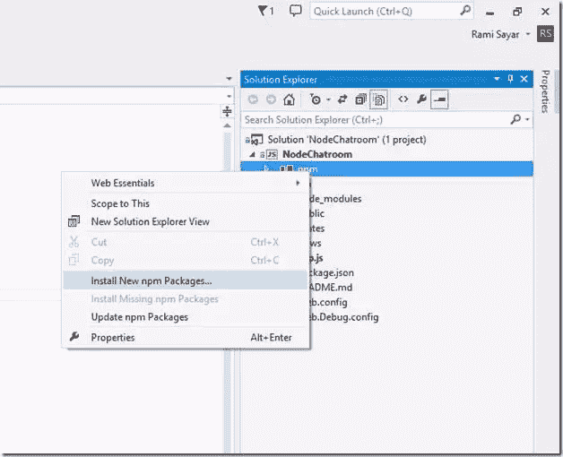
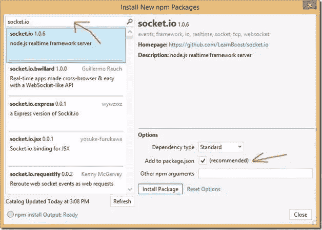
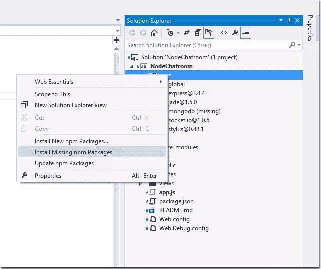

# 构建一个 Node.js 支持的聊天室 Web 应用程序:Node、MongoDB 和 Socket

> 原文：<https://www.sitepoint.com/build-node-js-powered-chatroom-web-app-node-mongodb-socket/>

本文是微软网站开发技术系列的一部分。感谢您对使 SitePoint 成为可能的合作伙伴的支持。

这个 [Node.js](http://nodejs.org/?WT.mc_id=12833-DEV-sitepoint-othercontent) 教程系列将帮助您构建一个完全部署在云中的 Node.js 支持的实时聊天室 web 应用程序。在这个系列中，你将学习如何在你的 Windows 机器上设置 [Node.js](http://nodejs.org/?WT.mc_id=12833-DEV-sitepoint-othercontent) (或者如果你在 Mac 上只学习概念)，如何用 [Express](http://expressjs.com/?WT.mc_id=12833-DEV-sitepoint-othercontent) 开发 web 前端，如何将 Node.js Express 应用部署到 [Azure](http://azure.microsoft.com/en-us/pricing/free-trial/?WT.mc_id=12779-DEV-sitepoint-link) ，如何使用 [Socket。IO](http://socket.io/?WT.mc_id=12833-DEV-sitepoint-othercontent) 添加实时层，以及如何一起部署。

教程将使用可选的 [Visual Studio](https://www.visualstudio.com/en-us/products/visual-studio-community-vs?WT.mc_id=12779-DEV-sitepoint-link) 和 [Node.js Tools for Visual Studio 插件](http://nodejstools.codeplex.com/releases/view/119433?WT.mc_id=12833-DEV-sitepoint-othercontent)作为开发环境。我提供了这两个工具的免费下载链接。这是一篇初级到中级水平的文章——你应该了解 HTML5 和 JavaScript。

> [第一部分——node . js 简介](https://www.sitepoint.com/build-node-js-powered-chatroom-web-app-getting-started/)
> 
> [第二部分——欢迎使用 Node.js 和 Azure 表达](https://www.sitepoint.com/build-node-js-powered-chatroom-web-app-expess-azure/)
> 
> 第 3 部分——用 Node.js、Mongo 和 Socket 构建后端。IO
> 
> [第 4 部分——用 Bootstrap 构建聊天室用户界面](https://www.sitepoint.com/build-node-js-powered-chatroom-web-app-chatroom-ui-bootstrap/)
> 
> [第 5 部分——用网络套接字连接聊天室](https://www.sitepoint.com/build-node-js-powered-chatroom-web-app-connecting-websockets)
> 
> [第六部分——压轴和调试远程 Node.js 应用](https://www.sitepoint.com/build-node-js-powered-chatroom-web-app-debugging-remotely/)

## 第 3 部分——用 Node.js，Socket 构建聊天室后端。木卫一和蒙哥

欢迎来到 Node.js 实践教程系列的第 3 部分:构建 Node.js 支持的聊天室 web 应用程序。在这一部分中，我将向您展示如何使用现有的基于 express 的 Node.js 应用程序创建一个支持 WebSocket 的聊天室后端。

## 什么是 WebSockets？什么是插座。木卫一？

[WebSocket](http://en.wikipedia.org/wiki/WebSocket) 是一种协议，旨在允许 web 应用程序通过 TCP 在 web 浏览器和 web 服务器之间创建全双工通道(即进行双向通信)。它完全兼容 HTTP，并使用 TCP 端口号 80。WebSocket 使 web 应用程序变得实时，并支持客户端和服务器之间的高级交互。它受到包括 Internet Explorer、Google Chrome、Firefox、Safari 和 Opera 在内的多种浏览器的支持。

[插座。IO](http://socket.io/) 是一个 JavaScript 库和 Node.js 模块，可以让你简单快速地创建实时双向的基于事件的通信 app。它大大简化了使用 WebSockets 的过程。我们将使用套接字。IO v1.0 来制作我们的聊天室应用。

## 正在添加套接字。IO 到 package.json

`package.json`是一个保存与项目相关的各种元数据的文件，包括它的依赖项。npm 可以使用该文件下载项目所需的模块。看看 package.json 的这个[交互解释](http://browsenpm.org/package.json)和它能包含什么。

让我们添加插座。IO 对项目的依赖。有两种方法可以做到。

1.  如果您一直在学习本系列教程，并且在 Visual Studio 安装程序中有一个项目，请右键单击项目的 npm 部分，然后选择“安装新的 npm 包…”



窗口打开后，搜索“socket.io”，选择顶部的结果并选中“Add to package.json”复选框。单击“安装软件包”按钮。这将安装套接字。IO，并将其添加到 package.json 文件中。



**package.json**

```
{
  "name": "NodeChatroom",
  "version": "0.0.0",
  "description": "NodeChatroom",
  "main": "app.js",
  "author": {
    "name": "Rami Sayar",
    "email": ""
  },
  "dependencies": {
    "express": "3.4.4",
    "jade": "*",
    "socket.io": "^1.0.6",
    "stylus": "*"
  }
}
```

1.  如果您使用的是 OS X 或 Linux，您可以通过在项目文件夹的根目录下运行以下命令来实现与上面相同的操作。

```
npm install --save socket.io
```

## 正在添加套接字。IO 到 app.js

下一步是添加插座。IO 到`app.js`。您可以通过替换以下代码来实现这一点…

```
http.createServer(app).listen(app.get('port'), function(){
  console.log('Express server listening on port ' + app.get('port'));
});
```

…具有:

```
var serve = http.createServer(app);
var io = require('socket.io')(serve);

serve.listen(app.get('port'), function() {
    console.log('Express server listening on port ' + app.get('port'));
});
```

这将在一个名为`serve`的变量中捕获 HTTP 服务器，并传递该 HTTP 服务器，以便`Socket.IO`模块可以连接到它。最后一个代码块采用了`serve`变量，并执行了启动 HTTP 服务器的`listen`函数。

## 记录用户的加入和离开

理想情况下，我们希望记录用户加入聊天室。下面的代码通过 WebSocket 将在每个事件上执行的回调函数连接到我们的 HTTP 服务器来完成这个任务。在回调函数中，我们调用`console.log`来记录用户连接。我们可以在调用`serve.listen`之后添加这个代码。

```
io.on('connection', function (socket) {
    console.log('a user connected');
});
```

为了在用户断开连接时做同样的事情，我们必须为每个套接字挂上`disconnect`事件。将以下代码添加到前面代码块的控制台日志之后。

```
socket.on('disconnect', function () {
        console.log('user disconnected');
    });
```

最后，代码将如下所示:

```
io.on('connection', function (socket) {
    console.log('a user connected');
    socket.on('disconnect', function () {
        console.log('user disconnected');
    });
});
```

## 广播在聊天频道上接收的消息

插座。IO 给了我们一个名为`emit`的函数来发送事件。

通过在回调中使用`broadcast`标志调用`emit`，在`chat`通道上接收的任何消息都将被广播到该套接字上的所有其他连接。

```
socket.on('chat', function (msg) {
    socket.broadcast.emit('chat', msg);
});
```

最后，代码将如下所示:

```
io.on('connection', function (socket) {
    console.log('a user connected');
    socket.on('disconnect', function () {
        console.log('user disconnected');
    });
    socket.on('chat', function (msg) {
        socket.broadcast.emit('chat', msg);
    });
});
```

## 将消息保存到 NoSQL 数据库

聊天室应该将聊天信息保存到一个简单的数据存储中。通常，在 Node 中有两种方式保存到数据库中；您可以使用特定于数据库的驱动程序，也可以使用 ORM。在本教程中，我将向您展示如何将消息保存到 MongoDB。当然，您可以使用您喜欢的任何其他数据库，包括像 PostgreSQL 或 MySQL 这样的 SQL 数据库。

您应该确保有一个 MongoDB 可以连接。您可以使用第三方服务来托管您的 MongoDB，如 MongoHQ 或 MongoLab。看看这个[教程](http://azure.microsoft.com/en-us/documentation/articles/store-mongolab-web-sites-nodejs-store-data-mongodb/)，看看你如何[在 Azure](http://azure.microsoft.com/en-us/documentation/articles/store-mongolab-web-sites-nodejs-store-data-mongodb/) 中使用 MongoLab 插件创建一个 MongoDB。当你读到“创建应用程序”这一节时，你可以停止阅读，只要确保将`MONGOLAB_URI`保存在你以后可以方便访问的地方。

一旦您创建了一个 MongoDB，并且拥有了数据库的`MONGOLAB_URI`——在您已经复制到剪贴板的连接信息下——您将希望确保应用程序可以使用 URI。将敏感信息(如 URI)添加到代码或源代码管理工具的配置文件中并不是最佳做法。您可以将该值添加到 Azure Web 应用程序的配置菜单中的连接字符串列表中(例如在您使用的教程中)，也可以将其添加到应用程序设置列表中(名称为`CUSTOMCONNSTR_MONGOLAB_URI`)。在您的本地机器上，您可以将它添加到名为`CUSTOMCONNSTR_MONGOLAB_URI`且值为 URI 的环境变量中。

下一步是在我们的项目中添加对 MongoDB 的支持。您可以通过将下面一行添加到`package.json`中的 dependencies 对象来实现。确保将您的更改保存到文件中。

```
"mongodb": "^1.4.10",
```

在解决方案资源管理器中右键单击项目的 npm 部分，显示右键上下文菜单。从内容菜单中单击“安装缺失的包”来安装 MongoDB 包，以便它可以作为一个模块使用。



我们希望导入该模块，以便能够在 app.js 中使用 MongoDB 客户端对象。

```
var mongo = require('mongodb').MongoClient;
```

我们想使用我们在`CUSTOMCONNSTR_MONGOLAB_URI`环境变量中的 URI 连接到数据库。连接后，我们希望将收到的聊天消息插入套接字连接中。

```
mongo.connect(process.env.CUSTOMCONNSTR_MONGOLAB_URI, function (err, db) {
    var collection = db.collection('chat messages');
    collection.insert({ content: msg }, function(err, o) {
        if (err) { console.warn(err.message); }
        else { console.log("chat message inserted into db: " + msg); }
    });
});
```

正如您在上面的代码中看到的，我们使用了`process.env`对象来获取环境变量值。我们进入数据库中的一个集合，用对象中的内容调用`insert`函数。

每条消息现在都保存在我们的 MongoDB 数据库中。

## 发出最近收到的 10 条消息

当然，我们不希望用户在加入聊天室后感到失落，所以我们应该确保将收到的最后 10 条消息发送到服务器，这样至少我们可以给他们一些上下文。为此，我们需要连接 MongoDB。在这种情况下，我避免用一个到数据库的连接来包装所有的套接字代码，这样即使服务器失去了数据库连接，我仍然可以让服务器工作。

我们还希望对我的查询进行排序，并将其限制在最后 10 条消息，我们将使用 MongoDB `generated _id`因为它包含一个时间戳(尽管在更具可伸缩性的情况下，您会希望在聊天消息中创建一个专用的时间戳)，我们将调用`limit`函数将结果限制在 10 条消息。

我们将从 MongoDB 流式传输结果，这样当它们到达时，我可以尽快将它们发送到聊天室。

```
mongo.connect(process.env.CUSTOMCONNSTR_MONGOLAB_URI, function (err, db) {
    var collection = db.collection('chat messages')
    var stream = collection.find().sort({ _id : -1 }).limit(10).stream();
    stream.on('data', function (chat) { socket.emit('chat', chat.content); });
});
```

上面的代码完成了前面段落中解释的工作。

## 部署到 Azure

可以按照过去的教程(比如 [part 2](http://blogs.msdn.com/b/cdndevs/archive/2014/09/11/a-chatroom-for-all-part-2-welcome-to-express-with-node-js-and-azure.aspx) )重新部署到 Azure。

## 结论

总之，我们有一个聊天系统，能够将通过 WebSockets 接收到的消息广播给所有其他连接的客户端。系统将消息保存到数据库中，并检索最后 10 条消息，以便为每个加入聊天室的新用户提供上下文。

### 请继续关注第 4 部分！

第 4 部分—用 Bootstrap 构建聊天室 UI 在这里是。你可以通过关注[我的推特账号](https://twitter.com/ramisayar?WT.mc_id=12833-DEV-sitepoint-othercontent)来了解这篇文章和其他文章的最新动态。

### Azure 上节点的更多学习

为了更深入地学习 node，我的课程可以在微软虚拟学院的这里[找到。](http://www.microsoftvirtualacademy.com/training-courses/building-apps-with-node-js-jump-start?WT.mc_id=12833-DEV-sitepoint-othercontent)

或者类似节点题材的一些较短格式的视频:

*   六部分系列:用 node 构建应用程序。JS

*   [漫步穿越节点(Coding4Fun)](http://channel9.msdn.com/coding4fun/blog/A-Stroll-Through-Node?WT.mc_id=12833-DEV-sitepoint-othercontent)

本文是微软网站开发技术系列的一部分。我们很高兴与你分享斯巴达项目的[和它的](http://blogs.msdn.com/b/ie/archive/2015/01/22/project-spartan-and-the-windows-10-january-preview-build.aspx?WT.mc_id=12833-DEV-sitepoint-othercontent)[新渲染引擎](http://blogs.msdn.com/b/ie/archive/2015/02/26/a-break-from-the-past-the-birth-of-microsoft-s-new-web-rendering-engine.aspx?WT.mc_id=12779-DEV-sitepoint-link)。在 [modern 获得免费虚拟机或在您的 Mac、iOS、Android 或 Windows 设备上进行远程测试。即](http://modern.ie/?utm_source=SitePoint&utm_medium=other&utm_campaign=SitePoint) *。*

## 分享这篇文章