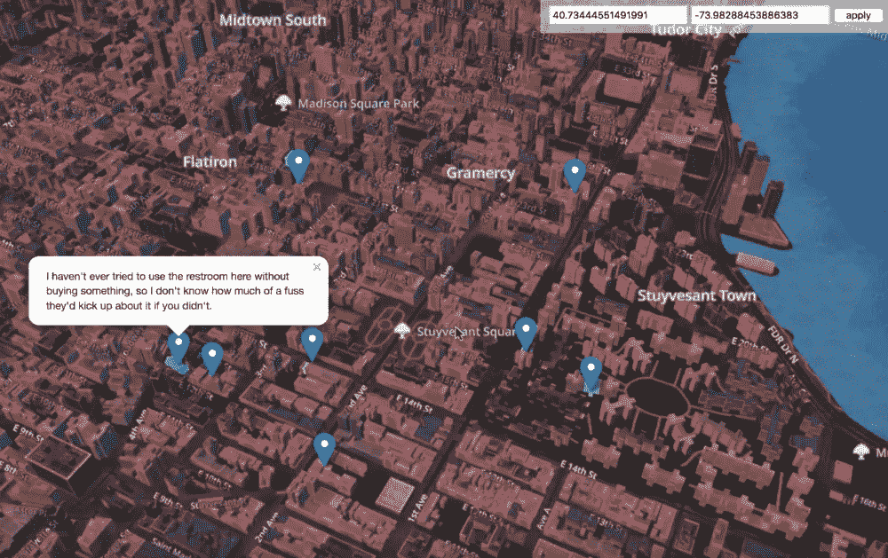
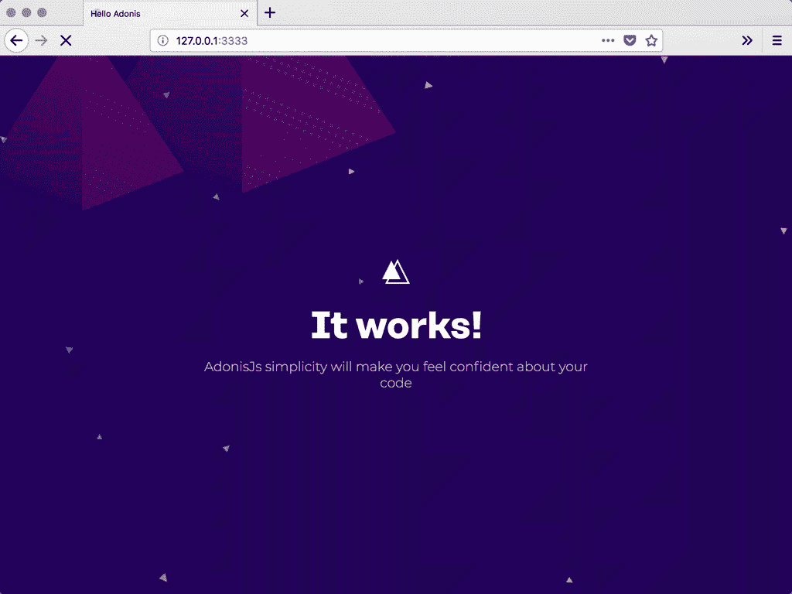
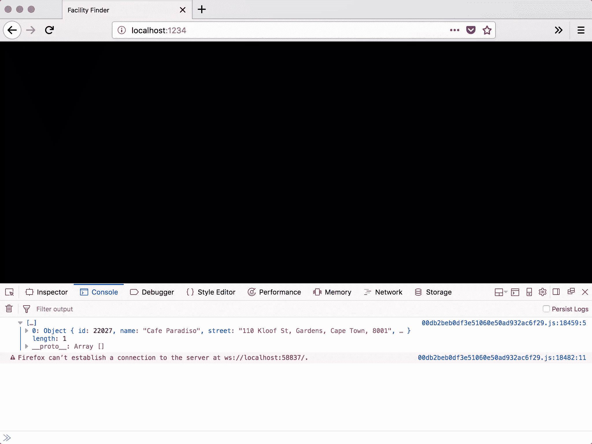

# 使用 WRLD 制作乔治·克斯坦萨的浴室探测器

> 原文：<https://www.sitepoint.com/build-seinfeld-bathroom-finder/>

*本文由 [WRLD 3D](https://www.wrld3d.com/) 赞助。感谢您对使 SitePoint 成为可能的合作伙伴的支持。*

“在这个城市的任何地方？在城市的任何地方:我会告诉你最好的公共厕所。”

这是乔治·克斯坦萨 1991 年对杰瑞·宋飞说的话。在那一集的*宋飞*；有远见的乔治在他的时代之前发明了一个应用程序——浴室发现者！如果你是一个经常旅行的人，一个父母，或者只是知道一个干净整洁的空间对于一些“宁静”的重要性的人，你会理解这个想法的效用。


所以，这次在我们 WRLD 系列的第二个教程中，我们将构建一个…姑且称之为“设施查找应用程序”。

 <font size="2"> *一起先睹为快*</font>

> 这不是第一次有人尝试这样做了。2010 年，bathroomreview.ca 就是这么做的(正如《福布斯》杂志所描述的那样)。但该网站已不再运营。

我们在上一个教程中涉及了相当多的内容，这一次，我们将重复使用其中的一些内容。例如，我们将使用 ParcelJS 来构建静态文件，但是我们不会详细讨论如何再次设置它。我们还将突出显示建筑物，并根据它们对用户的意义设置适当的天气条件和时间。如果你不确定这些是如何工作的，请参考前面的教程。

在本教程中，我们将讨论以下主题:

*   创建一个简单的服务器端 API(缓存位置数据和处理 CORS 请求)。
*   如果在用户的 10 米范围内没有缓存位置，则从[refugerestrooms.org](https://www.refugerestrooms.org)请求公共设施数据。我们将使用[谷歌距离矩阵 API](https://developers.google.com/maps/documentation/distance-matrix/intro) 来计算兴趣点之间的距离。
*   突出带有公共设施的建筑，颜色与其等级相匹配。绿色代表好，红色代表坏。每栋建筑都将有一个信息卡，用于额外的信息(如如何到达浴室)。

最后，我们将谈一谈如何将这类应用转化为可行的业务。这才是问题的关键，不是吗？WRLD API 提供了在真实世界的地图中可视化真实世界数据的工具。我们的工作是研究如何将这项技术用于商业应用！

> 本教程的代码可以在 Github 上找到[。它已经在 Firefox、Node 和 macOS 的现代版本上进行了测试。](https://github.com/assertchris-tutorials/sitepoint-wrld-tutorial-two)

## 获取设施数据

让我们从学习如何获取设施数据以及获取数据的形式开始。我们将使用 refugerestrooms.org 作为数据来源。通过查看[文档](https://www.refugerestrooms.org/api/docs/#!/restrooms/GET_version_restrooms_by_location_format)，我们了解到我们可以通过纬度和经度进行搜索。事实上，我们可以提出以下请求，并查看离我的位置很近的一组设施:

```
curl https://www.refugerestrooms.org/api/v1/restrooms/by_location.json? ↵
    lat=-33.872571799999996&lng=18.6339362 
```

我们还可以指定一些其他参数(比如是否根据可访问的和/或男女通用的设施进行过滤)，但这给我们提供了一种将坐标插入搜索并获得附近位置的方法。

但是，我们不能只从浏览器调用它。出于各种安全原因，这是不允许的。还有性能原因。如果 10 个人提出同样的要求，站在相距 10 米的地方会怎么样？向同一个远程服务器发送 10 个请求是一种浪费，因为我们可以通过缓存代理更快地为其提供服务。

相反，我们将建立一个简单的 AdonisJS 缓存 API。我们的浏览器应用程序将向 AdonisJS API 发送请求，如果没有“附近”的数据；它将向避难所 API 发送一个请求。我们不能在 AdonisJS 的细节上花太多时间，所以你必须查阅文档来了解细节。

> 我也差不多写完了一本关于它的书，所以那是了解它如何工作的最好地方！

创建新的 AdonisJS 应用程序的最简单方法是安装命令行工具:

```
npm install --global @adonisjs/cli 
```

这将全局启用`adonis`命令行。我们可以用它来创建一个新的应用程序框架:

```
adonis new proxy 
```

这需要一点时间，因为它安装了一些东西。完成后，您应该会看到一条运行开发服务器的消息。这可以通过以下方式实现:

```
adonis serve --dev 
```

在你的浏览器中打开 http://127.0.0.1:3333，迎接你的应该是这样的美景:



### 创建迁移和模型

让我们在数据库中讲述搜索数据的故事。AdonisJS 支持几种不同的引擎，但是为了简单起见，我们将使用 SQLite。我们可以安装适当的驱动程序，使用:

```
npm install --save sqlite3 
```

接下来，我们来做一个迁移和模型。我们只对用于搜索的坐标和返回的 JSON 感兴趣。如果坐标足够接近用户正在搜索的位置，我们将重用现有的搜索响应，而不是重新请求搜索数据。

我们可以使用`adonis`命令行工具来创建迁移和模型:

```
adonis make:migration search
adonis make:model search 
```

这会创建几个文件。第一个是迁移，我们可以向其中添加三个字段:

```
"use strict"

const Schema = use("Schema")

class SearchSchema extends Schema {
    up() {
        this.create("searches", table => {
            table.increments()
            table.string("latitude")
            table.string("longitude")
            table.text("response")
            table.timestamps()
        })
    }

    down() {
        this.drop("searches")
    }
}

module.exports = SearchSchema 
```

> 这是来自`proxy/database/migrations/x_search_schema.js`

我们添加了`latitude`、`longitude`和`response`字段。前两个作为`string`是有意义的，即使它们包含浮点数据，因为我们想用它们进行子字符串搜索。

接下来，让我们创建一个 API 端点:

```
"use strict"

const Route = use("Route")

// we don't need this anymore...
// Route.on("/").render("welcome")

Route.get("search", ({ request, response }) => {
    const { latitude, longitude } = request.all()

    // ...do something with latitude and longitude
}) 
```

> 这是来自`proxy/start/routes.js`

每个 AdonisJS 路径都在`routes.js`文件中定义。这里，我们注释掉了最初的“欢迎”路线，并添加了一个新的“搜索”路线。闭包是用上下文对象调用的；它可以访问`request`和`request`对象。

我们可以期望搜索请求提供`latitude`和`longitude`查询字符串参数；我们可以用`request.all`得到这些。我们应该检查一下，看看我们是否有任何模糊相关的坐标。我们可以通过使用`Search`模型来做到这一点:

```
const Search = use("App/Models/Search")

const searchablePoint = (raw, characters = 8) => {
    const abs = Math.abs(parseFloat(raw))
    return parseFloat(abs.toString().substr(0, characters))
}

Route.get("search", async ({ request, response }) => {
    const { latitude, longitude } = request.all()

    const searchableLatitude = searchablePoint(latitude)
    const searchableLongitude = searchablePoint(longitude)

    // console.log(searchableLatitude, searchableLongitude)

    const searches = await Search.query()
        .where("latitude", "like", `%${searchableLatitude}%`)
        .where("longitude", "like", `%${searchableLongitude}%`)
        .fetch()

    // console.log(searches.toJSON())

    response.send("done")

    // ...do something with latitude and longitude
}) 
```

> 这是来自`proxy/start/routes.js`

我们从导入`Search`模型开始。这是我们创建的数据库表的代码表示(使用迁移)。我们将使用它来查询数据库中的“附近”搜索。

在此之前，我们需要一种搜索近似坐标的方法。`searchablePoint`函数获取一个原始坐标字符串并创建一个绝对浮点值，从字符串的前面删除可选的`-`。然后，它返回坐标字符串的第一个`8`字符。这将把`-33.872527399999996`缩短为`33.872527`。然后，我们可以在 SQL“where like”子句中使用这 8 个字符，以返回具有相似坐标字符串的所有搜索。

AdonisJS 使用了`async`和`await`关键字，效果很好。像`Search.query`这样的方法返回承诺，所以我们可以`await`它们的结果，同时仍然编写 100%的异步代码。

> 我跳过了很多 AdonisJS 的细节，我真的不喜欢这样做。如果你在纠结这个问题。在 Twitter 上跟我说话，我会给你指出正确的方向。

### 匹配附近的位置

现在我们已经获得了“附近”的位置，我们可以比较它们与用户所站位置的相对距离。如果您还没有 Google API 密匙，请参考之前的教程，了解如何获得一个。我们即将成为谷歌距离矩阵服务:

```
https://maps.googleapis.com/maps/api/distancematrix/json? ↵
    mode=walking& ↵
    units=metric& ↵
    origins=-33.872527399999996,18.6339164& ↵
    destinations=-33.872527399999997,18.6339165& ↵
    key=YOUR_API_KEY 
```

距离矩阵服务实际上允许多个起点，因此我们可以将您之前的所有搜索组合成一个较长的起点字符串:

```
const reduceSearches = (acc, search) => {
    const { latitude, longitude } = search
    return `${acc}|${latitude},${longitude}`
}

Route.get("search", async ({ request, response }) => {
    const { latitude, longitude } = request.all()

    // ...get searches

    const origins = searches
        .toJSON()
        .reduce(reduceSearches, "")
        .substr(1)

    // console.log(origins)

    response.send("done")

    // ...do something with latitude and longitude
}) 
```

> 这是来自`proxy/start/routes.js`

我们可以将搜索结果转换成一个对象数组。这很有用，因为我们可以减少数组，将每个搜索的纬度和经度组合成一个字符串。该字符串将以`|`开头，因此我们需要从索引`1`开始获取该字符串。

我是浏览器`fetch` API 的粉丝，所以我们安装一个 NodeJS polyfill:

```
npm install --save node-fetch-polyfill 
```

使用这个 polyfill，我们可以从 Google 获取一个距离列表:

```
"use strict"

const fetch = use("node-fetch-polyfill")

const Env = use("Env")
const Route = use("Route")
const Search = use("App/Models/Search")

const searchablePoint = (raw, characters = 8) => {
    // ...
}

const reduceSearches = (acc, search) => {
    // ...
}

Route.get("search", async ({ request, response }) => {
    const { latitude, longitude } = request.all()

    // ...get origins

    const key = Env.get("GOOGLE_KEY")

    const distanceResponse = await fetch(
        `https://maps.googleapis.com/maps/api/distancematrix/json? ↵
            mode=walking&units=metric&origins=${origins}& ↵
            destinations=${latitude},${longitude}&key=${key}`,
    )

    const distanceData = await distanceResponse.json()

    // console.log(distanceData)

    response.send("done")

    // ...do something with data
}) 
```

> 这是来自`proxy/start/routes.js`

`fetch`返回一个承诺，所以我们可以`await`它。响应有一个`json`方法，它将原始响应序列化为一个 JSON 数组或对象。然后给出组合的原点坐标(所有类似于起点的东西的坐标)，我们得到一个所有距离的列表。响应对象的顺序与原点坐标的顺序相同。随着我们的继续，这将变得有用…

> AdonisJS 提供了自己的`.env`文件支持。我们可以放弃之前教程的`env.example.js`和`env.js`文件；并且只使用已经存在的`.env`和`.env.example`。我已经给两个都加了`GOOGLE_KEY`，你也应该加了。然后，我们可以使用`Env.get`来获取值。

我们可以检查这些结果，看它们是否在所请求坐标的 10 米范围内:

```
Route.get("search", async ({ request, response }) => {
    const { latitude, longitude } = request.all()

    // ...get distance data

    for (let i in distanceData.rows) {
        const { elements } = distanceData.rows[i]

        if (typeof elements[0] === "undefined") {
            continue
        }

        if (elements[0].status !== "OK") {
            continue
        }

        const matches = elements[0].distance.text.match(/([0-9]+)\s+m/)

        if (matches === null || parseInt(matches[1], 10) > 10) {
            continue
        }

        response.json(JSON.parse(searchRows[i].response))
        return
    }

    // ...cached result not found, fetch new data!
}) 
```

> 这是来自`proxy/start/routes.js`

我们可以遍历距离行，对每一行进行一些检查。如果原点坐标无效，距离矩阵服务可能会为该行返回一个错误。如果元素格式不正确(未定义或错误)，那么我们跳过该行。

如果有有效的测量值(以`n m`的形式表示，其中`n`为 1-10)；然后我们返回该行的响应。我们不需要请求新的避难所数据。在可能的情况下，我们没有缓存附近的坐标；我们可以要求新的数据:

```
Route.get("search", async ({ request, response }) => {
    const { latitude, longitude } = request.all()

    // ...check for cached data

    const refugeResponse = await fetch(
        `https://www.refugerestrooms.org/api/v1/restrooms/by_location.json? ↵
            lat=${latitude}&lng=${longitude}`,
    )

    const refugeData = await refugeResponse.json()

    await Search.create({
        latitude,
        longitude,
        response: JSON.stringify(refugeData),
    })

    response.json(refugeData)
    return
}) 
```

> 这是来自`proxy/start/routes.js`

如果没有缓存的搜索，我们请求一组新的避难所结果。我们可以原封不动地退回它们；但不是在将搜索保存到数据库之前。第一个请求应该比后续请求稍慢。我们本质上是将避难所 API 处理卸载到距离矩阵 API 上。现在，我们还有一种管理 CORS 权限的方法。

## 在浏览器中获取结果

让我们开始在浏览器中使用这些数据。尝试建立一个 ParcelJS 构建链(或者回顾一下我们之前做这件事的教程)。这包括将 WRLD SDK 安装并加载到一个`app.js`文件中。它应该是这样的:

```
const Wrld = require("wrld.js")

const tester = async () => {
    const response = await fetch(
        "http://127.0.0.1:3333/search? ↵
            latitude=-33.872527399999996&longitude=18.6339164",
    )

    const data = await response.json()

    console.log(data)
}

tester() 
```

> 这是来自`app/app.js`

您应该能够用下面的命令捆绑它:

```
parcel index.html 
```

您的文件夹结构应该如下所示:


这与我们在上一个教程中制作的文件夹结构相同。您也可以复制所有这些，用上面看到的内容替换`app.js`的内容。`tester`函数是为了证明我们还不能从缓存代理服务器请求数据。为此，我们需要[启用 AdonisJS CORS 层](http://adonisjs.com/docs/4.0/cors):

```
"use strict"

module.exports = {
    /*
    |--------------------------------------------------------------------------
    | Origin
    |--------------------------------------------------------------------------
    |
    | Set a list of origins to be allowed...
    */
    origin: true,

    // ...rest of the CORS settings
} 
```

> 这是来自`proxy/config/cors.js`

如果我们将`origin`设置为`true`，所有 CORS 请求都将成功。在生产环境中，您可能希望提供一个有条件返回 true 的闭包；以便您可以限制谁可以向该 API 发出请求。

如果刷新浏览器，就会打开 ParcelJS 提供的 URL 现在，您应该能够在控制台中看到结果:



> 不要理会那个警告。这只是 ParcelJS 热模块更换有一个时刻…

从这一点开始，我们可以开始使用缓存代理服务器来查找距离一组坐标最近的设施。我们来添加地图吧！

## 与 WRLD 融合

让我们从将第一个教程中的`env.js`和`env.example.js`文件添加到`app`文件夹开始。然后我们可以使用这些来再次渲染地图:

```
const Wrld = require("wrld.js")
const env = require("./env")

const keys = {
    wrld: env.WRLD_KEY,
}

// ...tester code

window.addEventListener("load", async () => {
    const map = Wrld.map("map", keys.wrld, {
        center: [40.7484405, -73.98566439999999],
        zoom: 15,
    })
}) 
```

> 这是来自`app/app.js`

我们到了，回到了帝国大厦。如果我们能从离用户更近的地方开始会更好。如果我们能提供一种方法，用自定义坐标覆盖地理位置。让我们进入 HTML5 地理定位 API:

```
window.addEventListener("load", async () => {
    let map

    navigator.geolocation.getCurrentPosition(
        position => {
            const { latitude, longitude } = position.coords

            map = Wrld.map("map", keys.wrld, {
                center: [latitude, longitude],
                zoom: 15,
            })
        },
        error => {
            map = Wrld.map("map", keys.wrld, {
                center: [40.7484405, -73.98566439999999],
                zoom: 15,
            })
        },
    )
}) 
```

> 这是来自`app/app.js`

我们可以使用`getCurrentPosition`来获得用户的最佳坐标。如果用户拒绝地理位置数据的请求，或者出现其他问题，我们可以默认一组已知的坐标。

> 没有记录的错误参数，但我喜欢把参数放在那里，使代码更清晰。

这就是自动位置检测。现在，如果我们想用自定义坐标覆盖它呢？我们可以在 HTML 中添加一些表单输入，并用一些 Javascript 将它们作为目标:

```
<body>
    <div id="map"></div>
    <div class="controls">
        <input type="text" name="latitude" />
        <input type="text" name="longitude" />
        <input type="button" name="apply" value="apply" />
    </div>
    <script src="./app.js"></script>
</body> 
```

> 这是来自`app/index.html`

```
.controls {
    position: absolute;
    top: 0;
    right: 0;
    background: rgba(255, 255, 255, 0.5);
    padding: 10px;
} 
```

> 这是来自`app/app.css`

```
window.addEventListener("load", async () => {
    let map

    const latitudeInput = document.querySelector("[name='latitude']")
    const longitudeInput = document.querySelector("[name='longitude']")
    const applyButton = document.querySelector("[name='apply']")

    applyButton.addEventListener("click", () => {
        map.setView([latitudeInput.value, longitudeInput.value])
    })

    navigator.geolocation.getCurrentPosition(
        position => {
            const { latitude, longitude } = position.coords

            latitudeInput.value = latitude
            longitudeInput.value = longitude

            map = Wrld.map("map", keys.wrld, {
                center: [latitude, longitude],
                zoom: 15,
            })
        },
        error => {
            map = Wrld.map("map", keys.wrld, {
                center: [40.7484405, -73.98566439999999],
                zoom: 15,
            })
        },
    )
}) 
```

> 这是来自`app/app.js`

我们首先获取对我们添加的新元素`input`的引用。当点击`applyButton`时，我们想要重新将地图居中。当地理定位数据成功时，我们可以用适当的纬度和经度填充这些输入。

现在，突出显示附近的设施建筑怎么样？

```
let map
let highlightedFacilities = []

const highlightFacilities = async (latitude, longitude) => {
    for (let facility of highlightedFacilities) {
        facility.remove()
    }

    highlightedFacilities = []

    const facilitiesResponse = await fetch(
        `http://127.0.0.1:3333/search?latitude=${latitude}&longitude=${longitude}`,
    )

    const facilitiesData = await facilitiesResponse.json()

    for (let facility of facilitiesData) {
        // console.log(facility)

        const color =
            facility.upvote >= facility.downvote
                ? [125, 255, 125, 200]
                : [255, 125, 125, 200]

        const highlight = Wrld.buildings
            .buildingHighlight(
                Wrld.buildings
                    .buildingHighlightOptions()
                    .highlightBuildingAtLocation([
                        facility.latitude,
                        facility.longitude,
                    ])
                    .color(color),
            )
            .addTo(map)

        highlightedFacilities.push(highlight)
    }
}

window.addEventListener("load", async () => {
    // ...add button event

    navigator.geolocation.getCurrentPosition(
        position => {
            const { latitude, longitude } = position.coords

            // ...create map

            map.on("initialstreamingcomplete", () => {
                highlightFacilities(latitude, longitude)
            })
        },
        error => {
            // ...create map

            map.on("initialstreamingcomplete", () => {
                highlightFacilities(40.7484405, -73.98566439999999)
            })
        },
    )
}) 
```

> 这是来自`app/app.js`

当我们创建地图，或者改变它的焦点时，我们可以调用`highlightFacilities`函数。这将接受一个`latitude`和`longitude`，删除所有之前高亮显示的建筑，并高亮显示缓存代理搜索返回的所有建筑。

我们为获得 50%以上支持的建筑选择绿色亮点；其余部分用红色突出显示。这样更容易找到更好的设施。

我们甚至可以用地图的当前中心来更新覆盖输入，这样用户就可以在地图区域附近平移并找到新的浴室。我们也可以让突出显示的建筑更清晰一些；通过添加地图标记并在按下/单击时显示弹出窗口:

```
let map
let highlightedFacilities = []
let highlighterMarkers = []

const highlightFacilities = async (latitude, longitude) => {
    for (let facility of highlightedFacilities) {
        facility.remove()
    }

    highlightedFacilities = []

    for (let marker of highlighterMarkers) {
        marker.remove()
    }

    highlighterMarkers = []

    const facilitiesResponse = await fetch(
        `http://127.0.0.1:3333/search?latitude=${latitude}&longitude=${longitude}`,
    )

    const facilitiesData = await facilitiesResponse.json()

    for (let facility of facilitiesData) {
        const location = [facility.latitude, facility.longitude]

        // ...add highlight color

        const intersection = map.buildings.findBuildingAtLatLng(location)

        let marker

        if (intersection.found) {
            marker = L.marker(location, {
                elevation: intersection.point.alt,
                title: facility.name,
            }).addTo(map)
        } else {
            marker = L.marker(location, {
                title: facility.name,
            }).addTo(map)
        }

        if (facility.comment) {
            marker.bindPopup(facility.comment).openPopup()
        }

        highlighterMarkers.push(marker)
    }
}

window.addEventListener("load", async () => {
    // ...add button event

    navigator.geolocation.getCurrentPosition(
        position => {
            const { latitude, longitude } = position.coords

            // ...create map

            map.on("panend", event => {
                const { lat, lng } = map.getBounds().getCenter()

                latitudeInput.value = lat
                longitudeInput.value = lng
            })
        },
        error => {
            // ...create map

            map.on("panend", event => {
                const { lat, lng } = map.getBounds().getCenter()

                latitudeInput.value = lat
                longitudeInput.value = lng
            })
        },
    )
}) 
```

> 这是来自`app/app.js`

我们可以在创建地图的地方添加`panend`事件。当用户开始平移时，地图会停止移动。我们得到可见的地图边界，并从中得到中心。

然后，在`highlightFacilities`函数中，我们添加了标记和可选的弹出窗口(如果有推荐显示的话。这使得发现突出显示的建筑物，以及找到关于它们包含的设施的任何附加信息变得更加容易。

## 添加气氛

最后，让我们给地图视图添加一些大气效果。首先，我们可以在缓存代理中添加一个“天气状况”端点:

```
Route.get("condition", async ({ request, response }) => {
    const { latitude, longitude } = request.all()

    const key = Env.get("OPENWEATHER_KEY")

    const weatherResponse = await fetch(
        `http://api.openweathermap.org/data/2.5/weather? ↵
            lat=${latitude}&lon=${longitude}&appid=${key}`,
    )

    const weatherData = await weatherResponse.json()

    response.json(weatherData)
}) 
```

> 这是来自`proxy/start/routes.js`

这需要创建一个[开放气象地图](https://openweathermap.org/)账户。我们在那里得到的 API 密钥需要添加到`.env`和`.env.example`中。然后，我们可以开始在浏览器中请求这些数据。如果该地区的天气与 WRLD 天气预设之一相匹配；我们可以把它应用到地图上。我们还可以使用浏览器的时间来设置时间:

```
const Wrld = require("wrld.js")
const env = require("./env")

const keys = {
    wrld: env.WRLD_KEY,
}

let map
let highlightedFacilities = []
let highlighterMarkers = []

const highlightFacilities = async (latitude, longitude) => {
    // ...highlight buildings and add markers

    try {
        const weatherResponse = await fetch(
            `http://127.0.0.1:3333/condition? ↵
                latitude=${latitude}&longitude=${longitude}`,
        )

        const weatherData = await weatherResponse.json()

        if (weatherData.weather && weatherData.weather.length > 0) {
            const condition = weatherData.weather[0].main.toLowerCase()

            switch (condition) {
                case "snow":
                    map.themes.setWeather(Wrld.themes.weather.Snowy)
                    break
                case "few clouds":
                case "scattered clouds":
                case "broken clouds":
                    map.themes.setWeather(Wrld.themes.weather.Overcast)
                    break
                case "mist":
                    map.themes.setWeather(Wrld.themes.weather.Foggy)
                    break
                case "shower rain":
                case "rain":
                case "thunderstorm":
                    map.themes.setWeather(Wrld.themes.weather.Rainy)
                    break
                default:
                    map.themes.setWeather(Wrld.themes.weather.Clear)
                    break
            }
        }

        const time = new Date().getHours()

        if (time > 5 && time <= 10) {
            map.themes.setTime(Wrld.themes.time.Dawn)
        } else if (time > 10 && time <= 16) {
            map.themes.setTime(Wrld.themes.time.Day)
        } else if (time > 16 && time < 21) {
            map.themes.setTime(Wrld.themes.time.Dusk)
        } else {
            map.themes.setTime(Wrld.themes.time.Night)
        }
    } catch (e) {
        // weather and time effects are entirely optional
        // if they break, for whatever reason, they shouldn't kill the app
    }
}

const latitudeInput = document.querySelector("[name='latitude']")
const longitudeInput = document.querySelector("[name='longitude']")
const applyButton = document.querySelector("[name='apply']")

const initMapEvents = async (latitude, longitude) => {
    map.on("initialstreamingcomplete", () => {
        highlightFacilities(latitude, longitude)
    })

    map.on("panend", event => {
        const { lat, lng } = map.getBounds().getCenter()

        latitudeInput.value = lat
        longitudeInput.value = lng
    })

    applyButton.addEventListener("click", () => {
        map.setView([latitudeInput.value, longitudeInput.value])
        highlightFacilities(latitudeInput.value, longitudeInput.value)
    })
}

window.addEventListener("load", async () => {
    navigator.geolocation.getCurrentPosition(
        position => {
            // ...create map

            initMapEvents(latitude, longitude)
        },
        error => {
            // ...create map

            initMapEvents(latitude, longitude)
        },
    )
}) 
```

> 这是来自`app/app.js`

我借此机会将所有地图创建后的代码转移到一个可重用的`initMapEvents`函数中。此外，我在`highlightBuildings`函数中添加了天气和时间效果；因为这是改变这些事情最合理的地方。如果用户输入沙漠的坐标，我们不希望地图继续下雪…

> 不幸的是，如果不做更多的工作，一天中的时间将总是相对于用户的浏览器，但我不认为这是必要的，我们这样做的本教程。

[https://www.youtube.com/embed/kFxB-1KXp3o](https://www.youtube.com/embed/kFxB-1KXp3o)

## 摘要

这是一个有趣的项目。更重要的是，这是你可以做的事情，并将其转化为一项业务(希望比乔治的各种业绩更成功)。也许你已经发现了人们需要一个应用程序来寻找的另一种东西。如果你有合适的权限和账户限制(比如 OpenWeatherMap、Google、Refuge 和 WRLD)，你可以创建任何种类的 finder 应用。

在我看来，有几种方法可以从这样的应用程序中赚钱。你可以在 iOS 和 Android 商店出售。你可以将它构建到 React 原生应用中，甚至只是一个简单的 web 应用包装器。

或者，你可以在屏幕上显示广告。用户可以付费删除这些广告，但你可能还需要考虑一下账户登录和/或恢复购买。

无论哪种方式，这都是你可以构建的实用的东西；不到 200 行代码。更进一步，为每个兴趣点添加方向。也许甚至允许用户过滤感兴趣的点，以便只显示关闭的 3…

WRLD 有你需要的大部分工具。

## 分享这篇文章