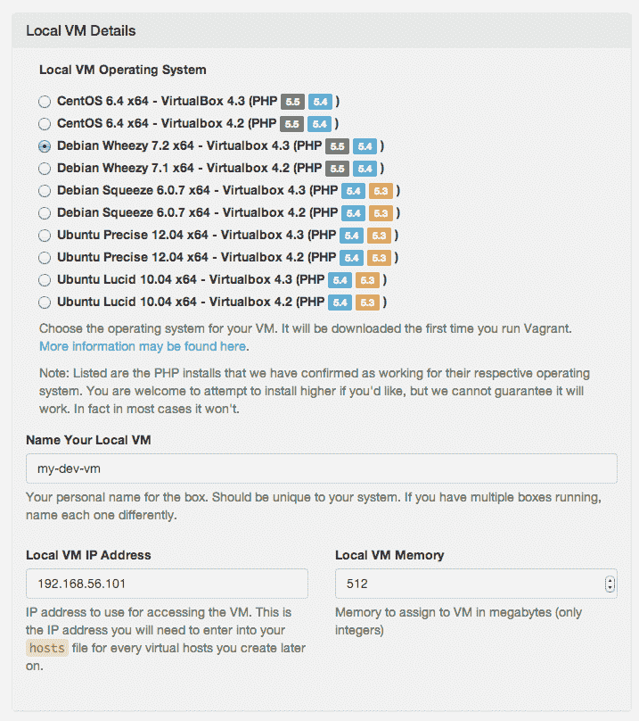
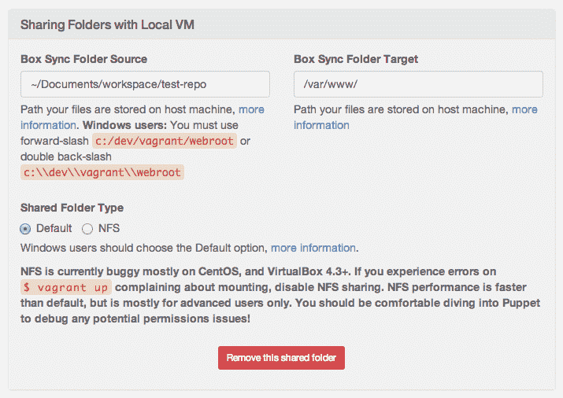
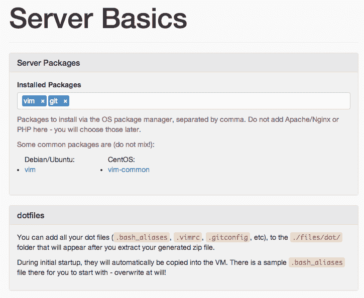
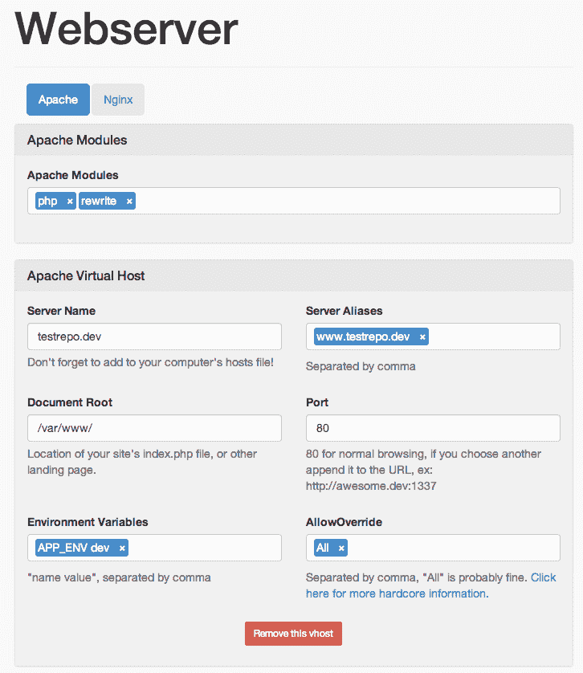
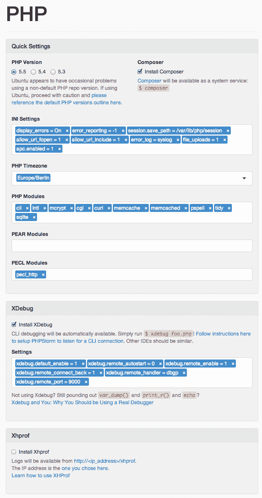
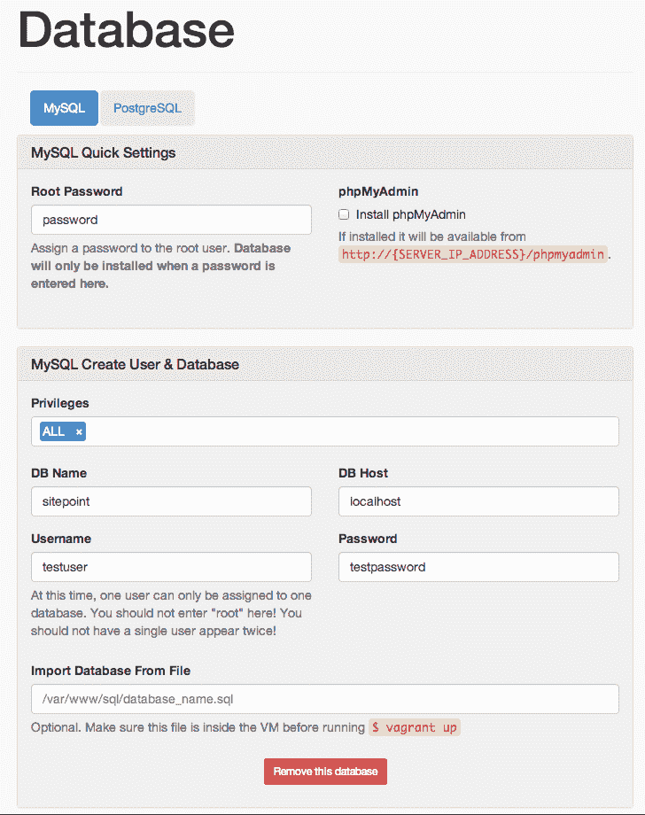

# 使用 puppet 轻松构建虚拟机

> 原文：<https://www.sitepoint.com/build-virtual-machines-easily-puphpet/>

创建和管理开发环境是否会让您感到沮丧、减慢您的速度，或者分散您对开发的注意力？您是否因为开发和部署环境不同而遇到问题？如果是这样，我已经为你找到了解决方案——噗噗！

## 介绍

我不能代表你，但是我对软件开发的一个讨厌的地方是环境。无论是为具有不同需求的不同项目创建和维护它们；确保整个开发团队的环境平等，(特别是当他们在远程时)；或者在开发、测试和生产等环境之间。在所有这些方面，这可能是一项艰巨的任务，尤其是手动完成*时。*

 *众所周知，选项的数量、选择的多样性、IT 经理、团队领导或客户的需求都会带来压力。它们可以(也确实)将我们拉向多个方向，通常是同时。

有数据库选择，如 *MySQL* 、 *PostgreSQL* 、 *Oracle* 和 *SQLServer* 。有 NoSQL 的选择，如*卡珊德拉*、 *Hadoop* 和 *Redis* 。有 web 服务器选择，如 *Apache* 和 *Nginx* 这个清单还在继续。

当我们没有一个专门的系统管理团队时(比如我们是一个独立的自由职业者或者在一个非常小的团队中)，维护开发环境所花费的时间变得非常宝贵——我们变成了开发人员。

为了结束这种痛苦并尽可能提高整个过程的效率，我开始学习[流浪者](http://www.vagrantup.com/) & [傀儡](http://puppetlabs.com/puppet/what-is-puppet)。从与同事的讨论和互联网研究来看，这两个工具似乎是创建可重用环境的**标准。如果您不熟悉这些优秀的工具，下面是它们各自手册的两个简短摘录:**

流浪汉:

> 创建和配置轻量级、可重复和可移植的开发环境。流浪者将改变你的工作方式

木偶:

> Puppet 是一款 IT 自动化软件，可帮助系统管理员在基础设施的整个生命周期中管理基础设施，从供应和配置到编排和报告。使用 Puppet，您可以轻松地自动化重复性任务，快速部署关键应用程序，并主动管理变化，从数十台服务器扩展到数千台服务器，无论是在内部还是在云中。

然而，像现代世界的大多数人一样，我很不耐烦。像你一样，我也有很多事情要做，而且我并不想成为一名古鲁。我觉得必须有一种方法来快速达到速度，但不会成为一个爱好者。

## Enter PuPHPet

经过进一步的搜索，我发现了这篇文章的主题， [PuPHPet](https://puphpet.com/) ，一个优秀的 GUI 工具，提供了一个简单的向导，它创建了一个木偶驱动的流浪者配置，**可以立即使用**。

几个月前，胡安·特雷米尼奥、[普佩特](https://puphpet.com/)开始着手在{W，M，L}AMP 等栈上为 PHP 开发人员创建完美定制的环境，这非常简单。

它侧重于 5 个领域:

*   部署目标(内存、ip 地址、端口转发)
*   服务器基础
*   PHP(模块、库、配置设置)
*   数据库(PostgreSQL、MySQL)
*   网络服务器(Apache 2，Nginx)

无论您是想让 PHP 5.5 运行 PostgreSQL 和 Nginx，还是让 PHP 5.4 运行 Apache 2 和 MySQL，您都可以快速创建和下载配置，只需几分钟。

诚然，一个环境有比这些选择更多的东西；但是，公平地说，它还处于早期阶段，而且它已经提供了，它确实做得很好。

使用 PuPHPet，您将在半小时内启动并运行，您所要做的就是运行:

```
vagrant up
```

没错。在未压缩的 PuPHPet 归档文件中，您只需运行该命令，稍等片刻，就可以开始了。不相信我？让我们一起从头到尾来一遍这个过程。

在我们完成后，我全心全意地鼓励你玩你的心满意足，改变选项，添加删除包和更多，看看你会发现什么。我相信你会印象深刻的。

## 所需软件

在我们开始之前有一句警告。我刚开始时面临的最大问题之一是同时拥有正确版本的 vagger 和 VirtualBox。看起来好像我只能完成一部分，剩下的必须手动完成。从来都不清楚是哪里出了问题，也不清楚这个过程有多完整。

因此，如果你发现事情不工作，尝试两个软件包的不同版本。我目前运行的是[流浪者 1.3.5](http://downloads.vagrantup.com/tags/v1.3.5) 和 [VirtualBox 4.3.2](https://www.virtualbox.org/wiki/Downloads) ，它们每次都运行得完美无缺。

首先，安装这两个软件包的副本。

## 创建配置

安装好之后，打开[【https://puphpet.com】](https://puphpet.com)。你可以在顶部看到，有四个初始选择:*本地*、*数字海洋*、 *Rackspace* 和*亚马逊网络服务*。选择本地，因为我们在本教程中不使用这些在线服务。

在“本地虚拟机详细信息”下，我们可以指定虚拟机的:
–操作系统
–主机名
–IP 地址
–内存分配

对于今天的例子，我们使用的是带有 VirtualBox 4.3 的 Debian Wheezy 7.2 x64。这使得我们可以使用 PHP 5.5 或 5.4。您可以随意保留其余三个设置，或者调整为最适合您的设置。

接下来是**本地虚拟机转发端口**。我还没有对其进行配置，但是如果您想要在您的主机上设置一些端口以转发到来宾 VM 上的端口，那么根据需要在这里对它们进行配置。



### 与本地虚拟机共享文件夹

在这里，我们开始看到流浪者和木偶提供的力量和灵活性。在**框同步文件夹源**中，您指定一个本地目录，该目录将映射到访客虚拟机上由**框同步文件夹目标**指定的位置。我保留了这两个选项以及共享文件夹类型的默认值。

如果您想在虚拟机上设置多个自定义目录，这个选项非常方便。假设您在`~/Documents/workspace/your-project`下有一个现有的工作副本。您可以将其直接映射到 VM web 服务器的 web 根目录中的一个目录。这样，您可以在本地开发，无需同步或复制到虚拟机。



### 服务器基础

如果有你需要可用的特定包，比如 *git* 、 *subversion* 、 *vim* 等，那么就在这里列出来。需要记住的一点是，您需要知道您选择的操作系统中指定的包名。当您键入时，弹出窗口中不提供任何列表。



### 网络服务器

Apache(2)还是 Nginx？对于本教程，我将使用 Apache。配置选择简单明了。首先通过在 Apache Modules 字段中键入来指定要安装和启用的模块。这将弹出一个可用选项列表供您选择，有助于确保流程无误。

接下来是虚拟主机的配置。您的应用程序的服务器名称和别名是什么？首先指定它们，然后指定根目录和端口。我们要做的是为**文档根**设置与我们在**框同步文件夹目标**中指定的目录相同的目录，以保持简洁明了。除非您有特殊需要，否则保留默认端口 80。

最后两个设置，*环境变量*和 *AllowOverride* ，仅在应用程序需要时更改。今天，默认值是好的。



### 服务器端编程语言（Professional Hypertext Preprocessor 的缩写）

这里只有几个选项，但对我们的需要来说已经足够好了。我保留了 PHP 5.5 的默认设置(你为什么想要其他的呢？).我还选择了作曲家。如果你没有使用过 Composer，或者不确定所有这些大惊小怪的是什么，请阅读本·拉姆齐的[这篇精彩的文章，或者在 SitePoint 上阅读](http://benramsey.com/blog/2013/11/the-fall-of-pear-and-the-rise-of-composer/)[这篇关于 Composer](https://www.sitepoint.com/re-introducing-composer/) 的文章。

在 **INI 设置**下，我接受了默认，然后添加了 *allow_url_fopen* 、 *allow_url_include* 、 *error_log* 、 *file_uploads* 和 *apc.enabled* 。您也可以这样做，或者浏览并从大量列表中进行选择。

我已经把我的 PHP 时区改成了欧洲/柏林，因为那离我最近。但是请根据您的位置选择最合适的。对于 PHP 模块，我的列表是 *cli* ， *intl* ， *mcrypt* ， *cgi* ， *curl* ， *memcached* ， *memcache* ， *pspell* ， *tidy* 和 *sqlite* 。滚动列表，添加您需要的(或想要的)。对于**梨**和 **Pecl** 模块，我让它们保持原样。

我选择安装 Xdebug，采用默认设置，但不安装 Xhprof。XDebug 非常优秀，所以我强烈推荐你使用它。



### 数据库ˌ资料库

好了，我们现在开始认真了。对于今天的例子，我选择了 MySQL，将 root 密码设置为**密码**，并保留所有特权。数据库名为**站点点**，用户名为**测试用户**，密码为**测试密码**。我在这里保持了简单的选择，以免使情况过于复杂。我没有在虚拟机负载上运行的 SQL 脚本，所以保留为空。



### 创建并下载配置


现在，只需点击超大按钮**继续，使其成为**。您将看到下载出现在您的下载目录中。完成后，将档案和 cd 解压到终端的目录中。从那里，运行`vagrant up`。

这就开始了构建虚拟机的过程。如果您还没有下载一个 Box 文件，或者没有一个与您指定的操作系统相匹配的文件，那么在它被下载之后，您需要等待一段时间，然后才能构建 VM。如果一切正常，您将看到如下输出:

```
✗ vagrant up
Bringing machine 'default' up with 'virtualbox' provider...
[default] Importing base box 'debian-wheezy72-x64-vbox43'...
[default] Matching MAC address for NAT networking...
[default] Setting the name of the VM...
[default] Clearing any previously set forwarded ports...
[default] Creating shared folders metadata...
[default] Clearing any previously set network interfaces...
[default] Preparing network interfaces based on configuration...
[default] Forwarding ports...
[default] -- 22 => 2222 (adapter 1)
[default] Running 'pre-boot' VM customizations...
[default] Booting VM...
[default] Waiting for machine to boot. This may take a few minutes...
[default] Machine booted and ready!
[default] Configuring and enabling network interfaces...
[default] Mounting shared folders...
[default] -- /vagrant
[default] -- /var/www
[default] -- /tmp/vagrant-puppet/manifests
[default] Running provisioner: shell...
[default] Running: /var/folders/_w/k6fxbl615w700lgkrtt0vb3w0000gn/T/vagrant-shell20131126-3538-kid3ga
stdin: is not a tty

 ____        ____  _   _ ____      _      generated using
|  _ \ _   _|  _ \| | | |  _ \ ___| |_   ___ ___  _ __ ___
| |_) | | | | |_) | |_| | |_) / _ \ __| / __/ _ \| '_ ` _ \
|  __/| |_| |  __/|  _  |  __/  __/ |_ | (_| (_) | | | | | |
|_|    \__,_|_|   |_| |_|_|   \___|\__(_)___\___/|_| |_| |_|

Created directory /.puphpet-stuff
Running initial-setup apt-get update
Finished running initial-setup apt-get update
[default] Running provisioner: shell...
[default] Running: /var/folders/_w/k6fxbl615w700lgkrtt0vb3w0000gn/T/vagrant-shell20131126-3538-1116fzj
stdin: is not a tty
Downloading http://apt.puppetlabs.com/puppetlabs-release-wheezy.deb
Finished downloading http://apt.puppetlabs.com/puppetlabs-release-wheezy.deb
Running update-puppet apt-get update
Finished running update-puppet apt-get update
Updating Puppet to latest version
dpkg-preconfigure: unable to re-open stdin: No such file or directory
Finished updating puppet to latest version: Puppet v3.3.2
Created empty file /.puphpet-stuff/update-puppet
...
Info: Creating state file /var/lib/puppet/state/state.yaml
Notice: Finished catalog run in 436.21 seconds
```

这表明一切进展顺利。

### 检查一切正常

现在虚拟机已经构建好了，登录并检查它。为此，在同一个目录中，运行`vagrant ssh`。一旦进入，为了快速确认一切正常，运行`sudo netstat -tlnp`。这将显示正在运行的服务。它应该给出与以下内容匹配的输出

```
Active Internet connections (only servers)
Proto Recv-Q Send-Q Local Address               Foreign Address         State       PID/Program name
tcp        0      0 0.0.0.0:111             0.0.0.0:*               LISTEN      1643/rpcbind    
tcp        0      0 0.0.0.0:39284           0.0.0.0:*               LISTEN      1678/rpc.statd  
tcp        0      0 0.0.0.0:22              0.0.0.0:*               LISTEN      2643/sshd       
tcp        0      0 127.0.0.1:5432          0.0.0.0:*               LISTEN      13637/postgres  
tcp        0      0 127.0.0.1:25            0.0.0.0:*               LISTEN      2399/exim4      
tcp6       0      0 :::111                  :::*                    LISTEN      1643/rpcbind    
tcp6       0      0 :::80                   :::*                    LISTEN      31623/apache2   
tcp6       0      0 :::22                   :::*                    LISTEN      2643/sshd       
tcp6       0      0 ::1:5432                :::*                    LISTEN      13637/postgres  
tcp6       0      0 ::1:25                  :::*                    LISTEN      2399/exim4      
tcp6       0      0 :::37887                :::*                    LISTEN      1678/rpc.statd
```

您可以看到 Apache 和 PostgreSQL 正在运行。如果您在`/etc/apache2/sites-enabled/`下查看，您会看到您的虚拟主机的配置，使用一个伪随机名称。如果您已经将主机名添加到本地机器上的`/etc/hosts`中，那么您可以在浏览器中打开主机名并查看结果页面。

## 我们完了！

所以你有它。好吧，第一次，像任何事情一样，它可能看起来像许多步骤来执行。但是随着你越来越熟悉，你会变得更快。更重要的是，你不需要每次都从头再来。

如果您将`puppet/hieradata/common.yaml`拖到 puphpet.com 上，它将自动填写表格以匹配包含的配置。然后调整以符合你的需求。所以一旦你做了第一个，后面的会更快更容易。

## 想法？

你怎么想呢?你是否热衷于使用它，把手工构建虚拟机的日子抛在脑后？请在评论中分享你的想法。

## 分享这篇文章*