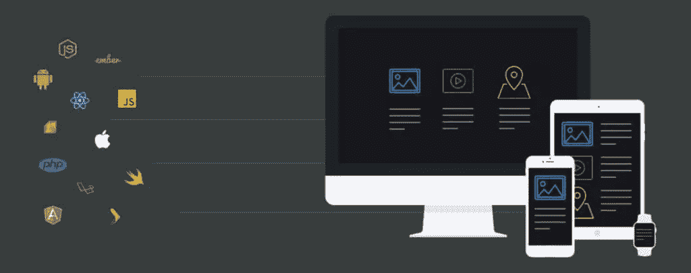
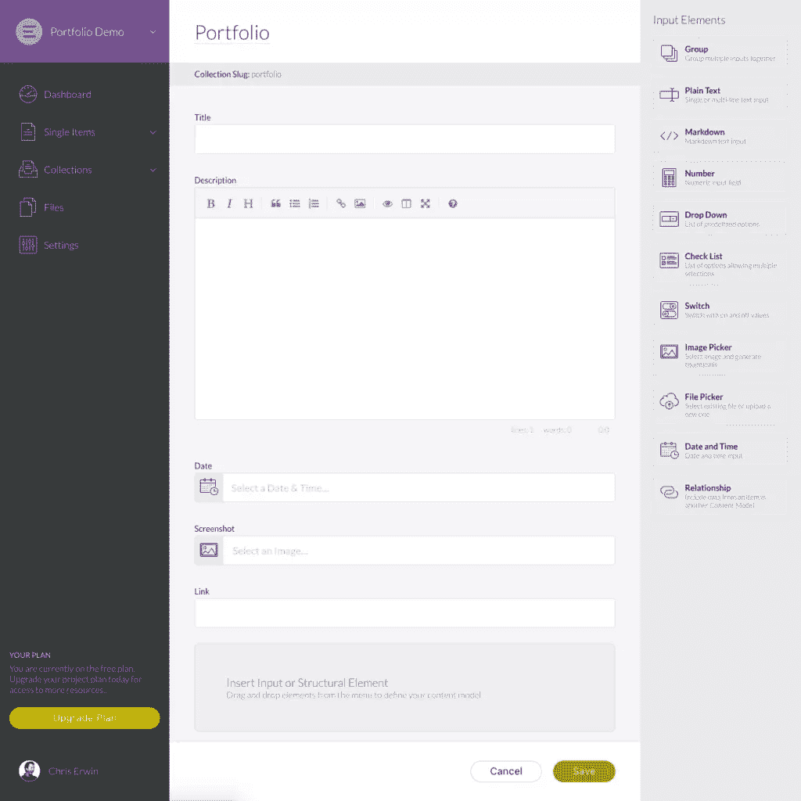

# 砍掉你的头！使用无头 CMS 构建更好的 Web 应用

> 原文：<https://www.sitepoint.com/build-web-apps-with-a-headless-cms/>

“无头 CMS”是一种相对较新的工具，但它是什么呢？有什么不同？那么，如何开始使用呢？



传统的 CMS 通常有两个主要组件:创建和管理内容的后端和显示内容的前端。前端几乎总是使用过时的技术、工具和库构建的网站。

无头 CMS 采取了一种不同的方法，只有一个后端，你可以在那里创建和管理你的内容。它们通常通过一个健壮的 API 来交付您的内容，该 API 允许您以一种开发人员友好的方式轻松地检索您的内容。这种关注点的分离意味着 CMS 只做一件事:管理你的内容。无头 CMS 并不规定你如何或在哪里显示你的内容。您可以使用几乎任何编程语言、框架或库将您的内容交付到任何设备或平台。

* * *

**寻找更多 CMS 话题？看看这些伟大的链接:**

*   使用现代平面文件 CMS Grav 构建更快的网站
*   [6 个非 Jekyll 的静态博客生成器](https://www.sitepoint.com/6-static-blog-generators-arent-jekyll/)
*   [使用 Statamic CMS 构建无数据库网站](https://www.sitepoint.com/building-database-free-websites-with-statamic-cms/)
*   [使用 Perch CMS 构建快速、可扩展的网站](https://www.sitepoint.com/building-lightning-fast-extensible-websites-with-perch-cms/)
*   [Craft CMS 简介](https://www.sitepoint.com/introduction-to-craft-cms/)
*   [CMS 内容组织结构:树 vs 刻面 vs 标签](https://www.sitepoint.com/cms-content-organization-structures-trees-vs-facets-vs-tags/)
*   [keystone js:WordPress 的最佳 Node.js 替代品](https://www.sitepoint.com/keystonejs-best-node-js-alternative-wordpress/)
*   [MODX:你没用过的最好的 CMS？](https://www.sitepoint.com/modx-the-best-cms-youve-never-used/)

查看 [SitePoint Premium](https://www.sitepoint.com/premium) 获取更多书籍、课程和免费视频。

* * *

## 用元素构建一个简单的投资组合网站

让我们来看看我们将如何使用 [Elemeno](https://elemeno.io) 构建一个简单的投资组合网站，Elemeno 是一个受欢迎的无头 CMS，由您的 truly 共同创建。我们将使用一个典型的 Node.js 开发栈，但是同样的原则可以应用于任何语言或框架。

我们将使用的工具包括:

*   [Node.js](https://nodejs.org) ，服务器端 JavaScript 运行时环境
*   [Express](https://expressjs.com/) ，一个 web 框架
*   [Pug](https://pugjs.org) ，一个模板库(原名 Jade)
*   [Elemeno](https://elemeno.io) ，一个无头 CMS

我们将首先在 Elemeno 上建立我们的项目。Elemeno 是一个托管产品，所以不需要安装任何东西，也不需要设置任何数据库。简单地[创建一个账户](https://elemeno.io/create-account)，如果你还没有，那么创建一个新项目。您可以通过选择开发计划 100%免费开始，该计划将完全符合我们对该演示的需求。

### 定义内容模型

下一步是定义我们的内容模型。您可以将内容模型视为创建内容时将显示的输入模板。Elemeno 有两种不同类型的内容模型:**单曲**和**合集**。集合允许您从同一个内容模型创建许多项目。这非常适合收集产品、文章或项目。Singles 允许您从内容模型中创建单个项目。这对于联系信息或关于我们的页面来说非常理想。

对于我们简单的 portfolio 站点，我们将创建一个集合来存储关于我们项目的信息。我们将需要确定我们想要为每个项目显示什么信息，以及什么类型的输入最适合捕获这些信息。对于我们的投资组合，每个项目将有:

*   标题(纯文本)
*   描述(降价)
*   日期(日期和时间)
*   截图/照片(图像拾取器)
*   URL(纯文本)

在 Elemeno 上创建收藏时，首先要在屏幕最上方给你的收藏起一个名字。我们称我们的收藏为“作品集”。您将看到我们的集合从屏幕左侧的一个“title”输入开始，在右侧是一个输入元素列表。要定义我们的内容模型，我们只需将输入元素从列表中拖放到左侧的空白板上。这些输入正是您在为您的投资组合创建内容项目时将看到的内容。

放置每个输入元素后，单击输入以更改其设置。我们将为每个输入设置“标签”,其他选项暂时保留默认设置。

我们的投资组合现在应该是这样的:



一旦我们对我们所拥有的感到满意，我们可以点击“保存”按钮来创建收藏。

### 创建项目

现在我们已经定义了我们的投资组合集合，我们可以开始创建项目了。只需点击“创建第一个项目”按钮即可开始。填写每个输入，然后单击“立即保存并发布”按钮来创建我们的投资组合项目。接下来，再创建几个项目，稍微充实一下我们的作品集。

现在我们已经准备好进入代码，开始构建我们的站点。首先，我们需要确保为我们的开发环境安装了 Node.js 和 NPM。您可以通过打开终端并输入以下命令来进行简单的检查:

```
node -v 
```

您应该看到您安装的版本显示出来，或者如果节点没有安装，则显示`command not found: node`。如果需要安装 Node，只需[从 Node.js 网站下载安装程序](https://nodejs.org/en/download/)。

首先创建一个新目录来存储我们的项目文件，然后在终端窗口中导航到该文件夹。我们的项目需要几个节点包，因此我们将使用 NPM 通过输入以下命令来安装它们:

```
npm install elemeno express pug 
```

我们将创建一个名为`server.js`的新文件，并从包含我们刚刚下载的包开始:

```
var Elemeno = require('elemeno'),
    express = require('express'),
    pug = require('pug'); 
```

我们将创建一个新的 Express 应用程序，只需调用 Express:

```
var app = express(); 
```

现在我们需要创建一个名为`views`的新目录来保存我们所有的 Pug 模板文件。然后我们将配置 Express 来告诉它我们的模板在哪里，以及我们正在使用哪个模板引擎。注意:您可以根据个人喜好使用任何其他支持的模板引擎。

```
app.set('views', './views');
app.set('view engine', 'pug'); 
```

我们现在可以为我们的登录页面创建路线。我们将通过在`server.js`内定义我们所有的路线来让事情变得简单美好。为了定义我们的第一条路线，我们将使用:

```
app.get('/', function(req, res) {
    res.render('index.pug');
}); 
```

这只是告诉 Express 当有人向我们的根用户发出请求时，我们想要呈现我们的 T2 模板。

下一步是在我们的`views`目录中创建`index.pug`模板。创建一个新文件，保存为`index.pug`,现在我们只需简单地填充如下内容:

```
h1 Hello World! 
```

现在回到`server.js`，我们只需要告诉 Express 它应该监听哪个服务器端口:

```
app.listen(3000, function () {
    console.log('Portfolio listening on port 3000');
}); 
```

现在，你可以在终端窗口输入`node server`并按回车键来启动并运行我们的网站。

瞧啊。我们有一个超级基本的节点网站。在你的网络浏览器中进入`localhost:3000`，你应该会看到我们超级棒的“你好，世界！”消息。

### 包括内容

现在让我们把 Elemeno 的内容放到我们的网站上。我们将首先创建一个 API 密钥，它将允许我们从我们的投资组合网站访问内容。转到 Elemeno 上的设置屏幕，找到 API 密钥部分，然后单击“创建 API 密钥”按钮。我们将我们的密钥命名为“网站”,并将其他设置保留为默认值。我们将看到我们的新 API 密钥被列出，单击它以查看详细信息并复制“访问令牌”值。

回到我们的`server.js`文件，我们将在文件顶部附近创建一个 Elemeno 客户端的新实例:

```
var Elemeno = require('elemeno'),
    express = require('express'),
    pug = require('pug');

var app = express();
var elemeno = new Elemeno('PASTE-ACCESS-TOKEN-HERE'); 
```

粘贴我们从 Elemeno 复制的访问令牌。现在，在我们的索引路径中，我们将从我们的投资组合集合中获取一个项目列表

```
app.get('/', function(req, res) {
    elemeno.getCollectionItems('portfolio', function(err, response) {
        res.render('index.pug', {projects: response.data});
    });
}); 
```

我们将投资组合集合的 slug】传递给`getCollectionItems`函数。该函数将返回一个对象数组，代表集合中的项目。然后，我们呈现 Pug 模板并传递返回的数据。

### 实现模板中的数据

我们的下一步是在 Pug 模板中实现这些数据。打开`index.pug`模板并创建一个简单的`for in`循环来显示我们的项目列表。

```
for project in projects
    h1= project.title
    div!= project.content.description.html
    img(src= project.content.screenshot.imageUrl)
    p: a(href= project.content.link) Visit Site 
```

如果您不熟悉 Pug 模板，这看起来会有点奇怪，但是基本上每一行都定义了我们想要输出的标签，以及该标签的内容。我们使用点符号来访问从 Elemeno 返回的每个 portfolio 对象的嵌套结构。作为参考，我们投资组合中的一个项目的结构类似于:

```
{
  "id": "123e4567-e89b-12d3-a456-426655440000",
  "slug": "google",
  "title": "Google",
  "dateCreated": "2017-07-11T14:28:49.772Z",
  "dateUpdated": "2017-07-11T14:28:49.772Z",
  "datePublished": "2017-07-11T14:28:49.772Z",
  "published": true,
  "content": {
    "description": {
      "markdown": "The best little search engine that ever existed",
      "html": "<p>The best little search engine that ever existed</p>"
    },
    "date": "2005-07-11T04:00:00+00:00",
    "link": "http://google.com",
    "screenshot": {
      "dateCreated": "2017-07-11T14:25:04.950Z",
      "dateUpdated": "2017-07-11T14:25:04.950Z",
      "title": "google.png",
      "fileSize": "65941",
      "mimeType": "image/png",
      "metaData": {
        "width": 580,
        "colors": {
          "palette": null,
          "dominant": {
            "rgb": {
              "b": 232,
              "g": 233,
              "r": 233
            },
            "hex": "E9E9E8",
            "isLight": true
          }
        },
        "height": 407,
        "alternativeText": null,
        "copyrightInformation": null
      },
      "tags": [],
      "imageUrl": "https://d1o9o9r2qlybfc.cloudfront.net/full/08c3f6dd-b6da-4241-bdd0-288799b1e1a4.png",
      "thumbnails": {}
    }
  }
} 
```

我们可以通过返回到运行节点服务器的终端窗口，在键盘上点击`Control + C`来重启服务器。这将停止我们的节点服务器。我们可以通过键入`node server`并按回车键再次启动服务器。

接下来，我们将创建一个项目详细信息页面，这样我们就不会在主页上直接显示所有内容。在`views`目录中创建一个名为`details.pug`的新模板。在这个文件中，我们创建了如下内容:

```
h1= project.title
div!= project.content.description.html
img(src= project.content.screenshot.imageUrl)
p: a(href= project.content.link) Visit Site 
```

我们将更新我们的索引模板，以便只列出项目名称和到详细视图的链接:

```
for project in projects
    ul
        li: a(href='/view/' + project.slug) #{project.title} 
```

请注意我们是如何将`project.slug`包含在详细信息页面的 URL 中的。这将允许我们确定在详细信息页面上获取哪个投资组合项目。

现在我们需要在我们的`server.js`文件中为我们的细节视图定义一条新的路线

```
app.get('/view/:slug', function(req, res) {
    var slug = req.params.slug;

    elemeno.getCollectionItem('portfolio', slug, function(err, response) {
        res.render('details.pug', {project: response.data});
    });
}); 
```

这里你可以看到我们用一个动态参数`:slug`定义了我们的路由路径。这意味着如果我们向`/views/ANYTHING`发出一个`GET`请求，它将被这个路由处理。我们从 URL 中提取出`slug`参数，并设置为一个新的变量`slug`，然后将它传递给我们的`getCollectionItem`函数。注意这个函数从集合中获取一个单独的条目，所以我们需要同时传递集合段和条目段。这个函数返回一个代表我们请求的项目的对象。我们呈现我们的`details.pug`模板，并传递我们的投资组合项目的数据。

我们现在可以重新启动我们的服务器，我们将有一个主页链接到我们的详细信息页面，所有的内容都将从 Elemeno 中提取。如果我们在 Elemeno 上创建一个新的投资组合项目，然后刷新我们的投资组合主页，我们将看到新项目也列在那里。

最后一步将有助于处理我们试图访问不存在于我们的投资组合集合中的项目的任何情况。我们将在 details route 中构建一个简单的错误处理程序，它将显示一条错误消息，而不是使我们的服务器崩溃:

```
app.get('/view/:slug', function(req, res) {
    var slug = req.params.slug;

    elemeno.getCollectionItem('portfolio', slug, function(err, response) {
        if (err) {
            return res.render('404.pug');
        }

        res.render('details.pug', {project: response.data});
    });
}); 
```

然后，我们在我们的`views`目录中创建一个简单的`404.pug`模板，并显示错误消息:

```
h1 Oops! that project does not exist 
```

我们可以重新启动我们的服务器，如果我们尝试访问一个不存在的项目，我们应该得到新的 404 页面。

## 包扎

就是这样！我们有一个简单的网站从一个无头 CMS 拉内容。我们的网站非常粗糙，在设计和用户体验方面还有很多不足之处。但是，您可以看到从 Elemeno 这样的无头 CMS 访问内容是多么容易，而且几乎可以使用任何编程语言、模板引擎或框架。我们可以很容易地使用不同的模板引擎，如 EJS，灰尘，或手柄。除了 Express，我们还可以使用不同的框架，比如 Koa、哈比神或 Sails。我们可以使用完全不同的编程语言来代替 Node，比如 Ruby、PHP 或 Python。我们可以建立一个移动应用、手表应用或某种 Arduino 原型，而不是一个网站。

无头 CMS 允许您轻松管理内容，同时允许您使用自己喜欢的工具和技术在多个设备上构建项目。你的 CMS 不应该规定你在哪里或者如何构建你的项目。

我在 GitHub 上分享了这个简单组合网站的完整版本: [Elemeno 组合演示](https://github.com/elemenohq/portfolio-demo)。随意叉，自己做！

## 分享这篇文章