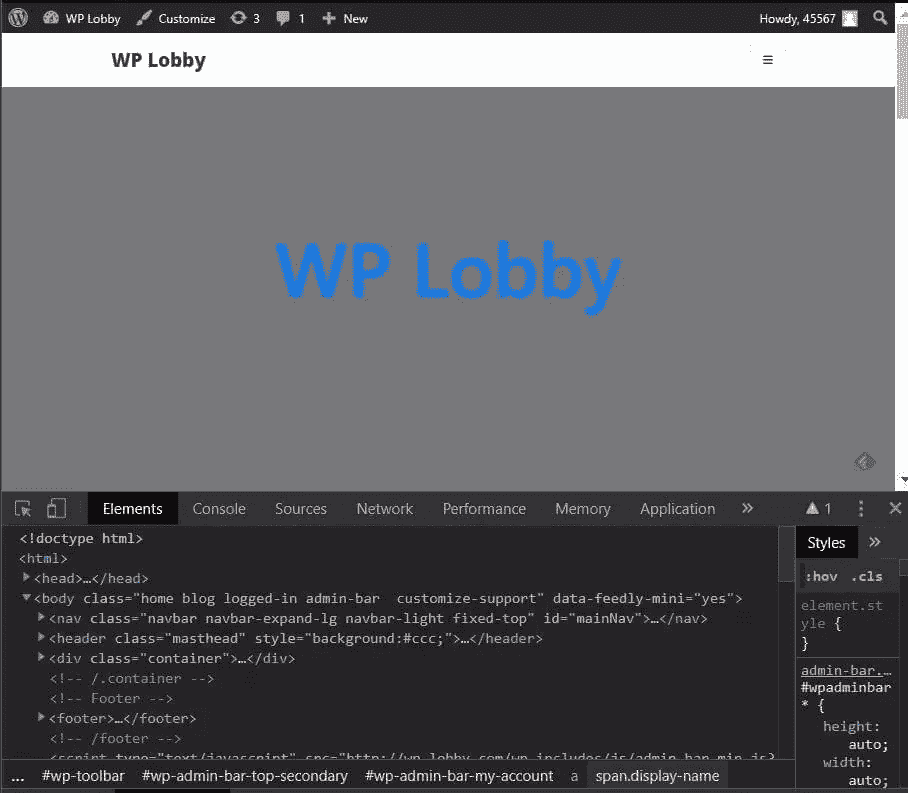
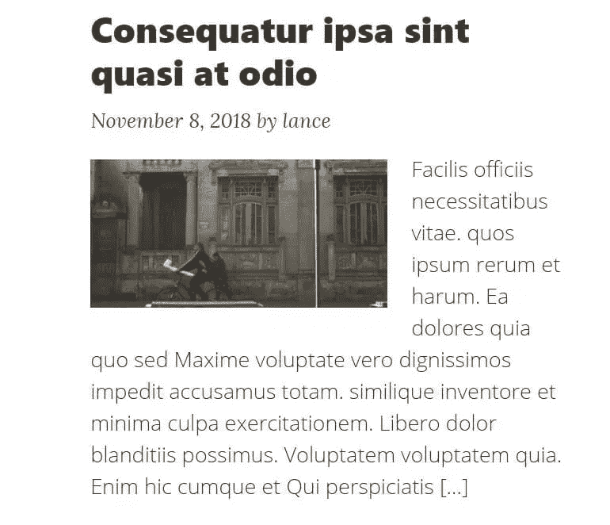
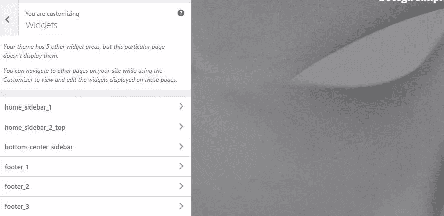
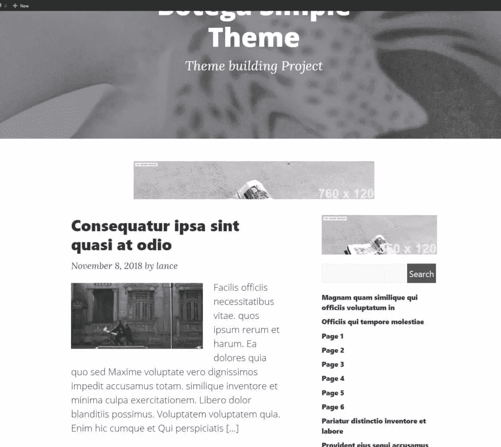
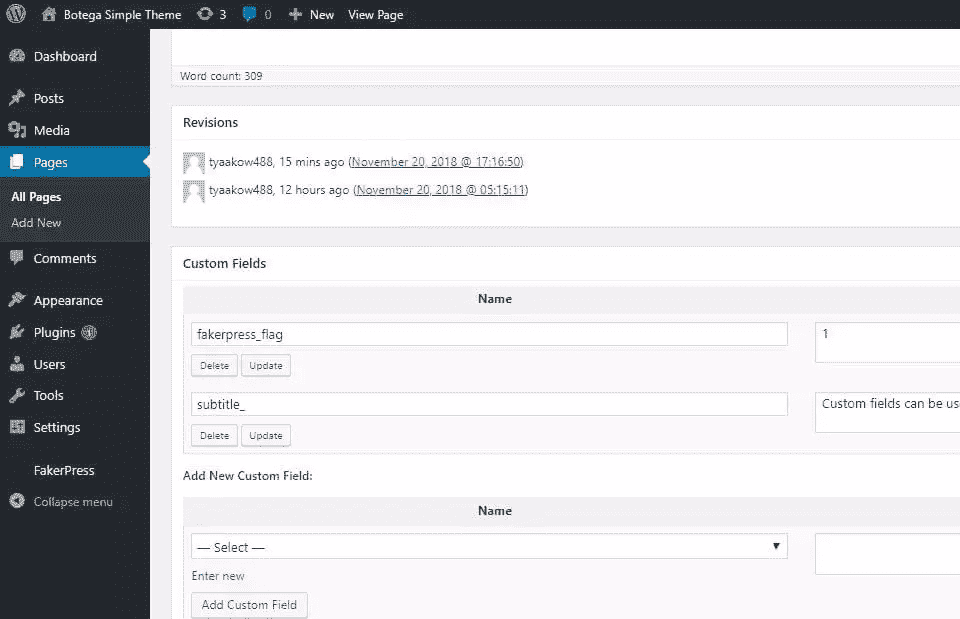
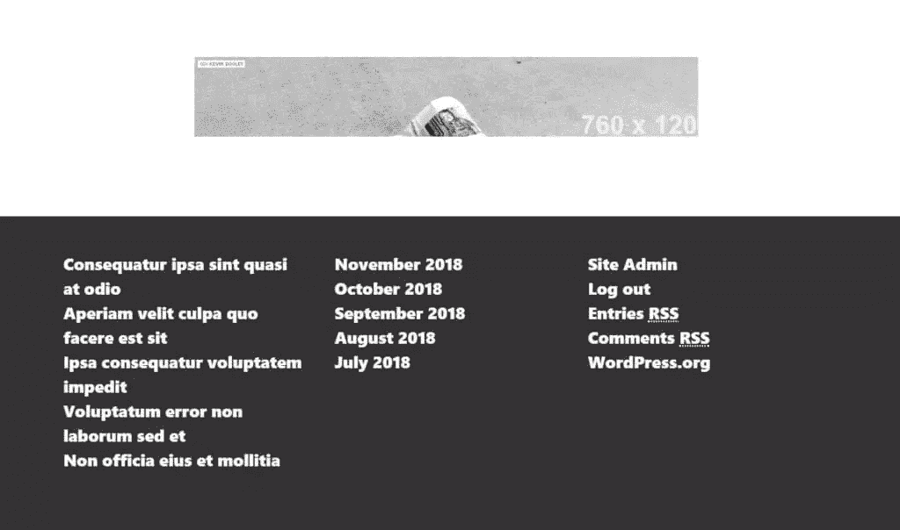
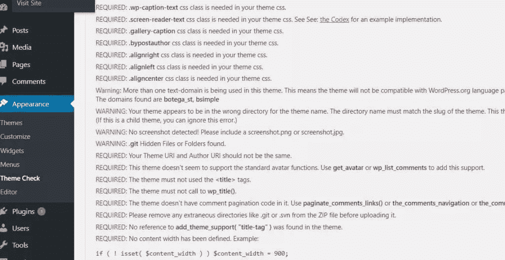

# 如何从头开始构建 WordPress 主题:最后的步骤

> 原文：<https://www.sitepoint.com/build-wordpress-theme-from-scratch-final/>

在这篇文章中，我们将从头开始构建一个 WordPress 主题，重点是改进我们的模板，添加元信息，文章缩略图，侧边栏，用户友好控件等等。

这是关于构建 WordPress 主题的第三部分，也是最后一部分。第 1 部分介绍了 WordPress 主题，在第 2 部分我们[构建了一个基本主题](https://www.sitepoint.com/build-wordpress-theme-from-scratch-basics)。我们利用 StartBootstrap 的[干净博客模板来给我们的 WordPress 主题添加风格。到目前为止我们写的代码可以在 GitHub](https://startbootstrap.com/template-overviews/clean-blog/) 上获得[。](https://github.com/tyaakow/wordpress-theme-guide/tree/part-1)

到目前为止，我们已经添加了`single.php`、`page.php`、`archive.php`和`index.php`模板，但是我们为这部分任务留下了最终完成的任务。我们引入了`functions.php`——一个 WordPress 用来自动包含特定于我们主题的功能的文件，我们给它添加了功能。我们在我们的`header.php`中添加了一个动态头函数，并且我们将该功能分离到我们的`functions.php`中。理想情况下，这应该被组织到一个单独的文件中——可能在我们的主题中的一个`inc`文件夹中——以保持整洁。

在第 2 部分中，我们还介绍了部分音— `footer.php`和`header.php`。

## 完善模板

在上一篇文章中，我们把我们的`<body>`标签——开始的那个——分成了`header.php`,并且我们给它添加了`<?php body_class(); ?>`。这给`body`添加了一些语义类，告诉我们是否在`page`、`post`，我们是否登录，等等——使我们能够根据访问的页面和其他事情来设计网站的不同元素。

如果我们访问主页并打开浏览器控制台来检查这些类，我们会发现这些类中缺少当前的模板信息:



为了能够改变 WordPress 显示的内容，我们需要知道使用的是什么文件。在我们的例子中，`index.php`被用作默认的回退模板。[这张信息图](https://developer.wordpress.org/files/2014/10/wp-hierarchy.png)展示了所用模板的层级结构。当覆盖或创建主题时，它会非常方便。

在上一篇文章中，我们开始改进`archive.php`循环，向输出的文章添加元信息和帖子缩略图。我们将把这个循环分离到一个单独的文件中，包含在`archive.php`和`index.php`中，并完成对它的提炼。

首先，我们将用一行请求部分文件的内容替换两个文件`while`和`endwhile`之间的中的内容*，因此`index.php`看起来像这样:*

```
<?php
/**
 * @package Botega_Scratch_Theme
 */

get_header(); ?>

    <?php
    if ( have_posts() ) : while ( have_posts() ): the_post();

                get_template_part( 'partials/content', get_post_type() );

        endwhile;
    endif;
    ?>

<?php get_footer(); ?> 
```

完成后，我们将把在`archive.php`中替换的内容放入`partials/content.php`文件中:

```
<div <?php post_class( 'post-preview' ); ?> id="post-<?php the_ID(); ?>">

<header class="entry-header">
    <?php
    if ( is_singular() ) :
        the_title( '<h1 class="entry-title">', '</h1>' );
    else :
        the_title( '<h2 class="entry-title"><a href="' . esc_url( get_permalink() ) . '" rel="bookmark">', '</a></h2>' );
    endif;

    if ( 'post' === get_post_type() ) :
        ?>
        <div class="entry-meta">
            <?php
            bsimple_posted_on();
            bsimple_posted_by();
            ?>
        </div><!-- .entry-meta -->
    <?php endif; ?>
</header><!-- .entry-header -->

        <a class="post-thumbnail" href="<?php the_permalink(); ?>" aria-hidden="true" tabindex="-1">
            <?php
            the_post_thumbnail( 'post-thumbnail', array(

            ) );
            ?>
        </a>

        <?php the_excerpt(); ?>

</div> 
```

一旦我们将这些更改上传到服务器，我们会看到我们的首页现在，在帖子列表的每个帖子中，都有元信息—日期和作者链接:


这意味着我们的部分作品。

## 帖子缩略图

我们可以看到，我们的假帖子一般没有任何图片，也没有具体的*特色图片*。如果我们去 WordPress 仪表盘，试着把*特色图片*添加到我们的帖子/页面，我们会看到在最右边的工具条中没有文件上传字段。(对于不熟悉 WordPress 的人来说，更多关于这个功能的信息可以在这里阅读[。)](https://codex.wordpress.org/Post_Thumbnails)

默认情况下，在 WordPress 主题中不启用文章缩略图。这是一个需要在新主题中专门打开的功能。大多数主题都启用了它。

为此，我们将`add_theme_support( 'post-thumbnails' );`行包含到我们的`functions.php`中。

现在缩略图已启用。

现在我们可以使用`wp-cli`命令`wp site empty --allow-root`清空 WordPress 安装中的所有内容(或者我们可以从 WordPress 仪表板手动完成)，并用 FakerPress 重新填充它。它应该用从互联网上抓取的特色图片来填充帖子和页面。(我们需要像以前一样重新创建顶部菜单，并向其分配页面和帖子。)

一个提示:如果我们正在构建供销售的主题，或者通常是将向更广泛的受众发布的主题，我们可能想要使用 Automattic 提供的*主题单元测试数据*，因为它可以提供测试更广泛的案例和主题细节的内容。

我们可以为 FakerPress 指定图像大小，但这很可能会导致混乱的外观。

当我们构建一个主题时，用来实现完美、标准化外观的技术之一是指定*缩略图大小*。这些是标准尺寸，WordPress 会调整所有上传图片的尺寸。我们将使用 WordPress*[add _ image _ size()](https://developer.wordpress.org/reference/functions/add_image_size/)*函数来添加我们的主题将使用的几个图像尺寸:

```
add_image_size( 'list-thumb-1', 730, 400, true);
add_image_size( 'small-list-thumb-1', 400, 200, true);
add_image_size( 'small-list-thumb-2', 300, 200, true);
add_image_size( 'small-list-thumb-3', 220, 140, true); 
```

然后我们将使用[*【post _ thumbnail()*](https://developer.wordpress.org/reference/functions/the_post_thumbnail/)在我们的【T0:

```
<a class="post-thumbnail" href="<?php the_permalink(); ?>" aria-hidden="true" tabindex="-1">
    <?php
    the_post_thumbnail( 'small-list-thumb-1');
    ?>
</a> 
```

为了在我们的存档或博客列表中获得格式良好的*摘录*，我们将增加字体大小，但为此，我们将减少*the _ extract()*输出的字数:

```
# functions.php
function custom_excerpt_length( $length ) {
    return 40;
}
add_filter( 'excerpt_length', 'custom_excerpt_length', 999 ); 
```

为了能够浮动图像(我们刚刚提到的缩略图)和摘录，我们将以下内容添加到 css 中的父元素选择器:

```
.home .post-preview.post {
    overflow: hidden;
} 
```

(这里我们不包括对主题本身不重要的较小的风格调整。)

现在，我们可以增加字体大小，通过浮动图像(和`a`父元素一起)，让摘录浮动在图像周围:



我们稍后还会在单个帖子/页面上使用`post_thumbnails`。

## 主题边栏

[主题侧边栏](https://developer.wordpress.org/themes/functionality/sidebars/)是主题中的 widgetized 区域。它们需要在 WordPress 系统中注册，这样我们就可以在这些区域放置不同的小部件。一旦我们这样做了，我们就在模板文件中打印或者输出这些小部件。

我们将在我们的主题中注册一些侧栏，可以在主题的 [GitHub 库中看到。我们通过将以下代码添加到我们的`functions.php`中来做到这一点:](https://github.com/tyaakow/wordpress-theme-guide)

```
// Register custom sidebars
function sidebar_register() {

    $args = array(
        'name'          => __( 'home_header', 'bsimple' ),
        'description'   => __( 'home_header', 'bsimple' ),
        'id'            => 'h_h',
        'class'         => 'home_header',
        'before_widget' => ' <div class="dyn-sidebar side sidebar">',
        'after_widget'  => '</div>',
        'before_title'  => '<h2 class="widgettitle">',
        'after_title'   => '</h2>',
    );
    register_sidebar($args);

    $args = array(
        'name'          => __( 'archive_sidebar_1', 'bsimple' ),
        'description'   => __( 'Archive Sidebar no 1', 'bsimple' ),
        'id'            => 'a_s_1',
        'class'         => 'archive_sidebar_1',
        'before_widget' => ' <div class="dyn-sidebar side sidebar">',
        'after_widget'  => '</div>',
        'before_title'  => '<h2 class="widgettitle">',
        'after_title'   => '</h2>',
    );
    register_sidebar($args);

    $args = array(
        'name'          => __( 'bottom_center_sidebar', 'bsimple' ),
        'description'   => __( 'Bottom Center Sidebar', 'bsimple' ),
        'id'            => 'b_c_s',
        'class'         => 'bottom_center_sidebar',
        'before_widget' => '<div id="bottom-center-sidebar">',
        'after_widget'  => '</div>',
        'before_title'  => '<h2 class="widgettitle">',
        'after_title'   => '</h2>',
    );
    register_sidebar($args);

}
add_action( 'widgets_init', 'sidebar_register' ); 
```

这里，我们展示如何注册两个侧边栏。关于`register_sidebar()`功能的更多细节可以在 wordpress.org 的[中找到。](https://developer.wordpress.org/reference/functions/register_sidebar/)

我们注册了 11 个侧边栏，但是我们不需要在所有页面模板或网站位置中输出所有这些。如果它们是在当前定制的页面中输出的，则可以在 widgets 下的*定制器*中访问它们:



下面是`footer.php`中侧边栏或小部件区域的实际输出示例，这意味着它可以全局显示:

```
<?php if ( is_active_sidebar( 'b_c_s' ) ) : ?>
    <div class="row b_c_s"><div class="col-lg-8 mx-auto  top-widget col-md-10 ">
<?php    get_sidebar( 'BottomCenterSidebar' ); ?>
    </div></div>
<?php endif; ?> 
```

这里，我们使用在上面的`bottom_center_sidebar`的`register_sidebar`函数中使用的侧边栏 ID。

我们还根据是否有带有活动小部件的侧栏来决定主页上中心内容容器的宽度(`is_active_sidebar()`):

```
# index.php
<div class="row">
        <?php if ( (is_home() && is_active_sidebar( 'h_s_1' )) || (is_archive() && is_active_sidebar( 'archive_sidebar_1' )) ) { ?>
            <div class="col-lg-7 col-md-9">
        <?php } else { ?>
            <div class="col-lg-12 col-md-10 mx-auto">       
        <?php } ?>

            <?php
            if ( have_posts() ) : while ( have_posts() ): the_post();
                        get_template_part( 'partials/content', get_post_type() );
                endwhile;
            endif;
            ?>

        </div>

            <?php if ( (is_home() && is_active_sidebar( 'h_s_1' )) || (is_archive() && is_active_sidebar( 'archive_sidebar_1' )) ) { ?>
                <div class="col-lg-4 offset-lg-1 col-md-10 col-sm-12 arch- sidebar-side-cont">

            <?php }

            if ( is_home() ) :
            get_sidebar( 'HomeSidebar1' );
            elseif ( is_archive() ) :
                get_sidebar( 'ArchiveSidebar1' );
            endif;
            ?>

            <?php if ( (is_home() && is_active_sidebar( 'h_s_1' )) || (is_archive() && is_active_sidebar( 'archive_sidebar_1' )) ) { ?>
            </div>
            <?php } ?>

    </div> 
```

我们输出依赖于这些条件的引导类，确保主题不会看起来是空的，如果我们忽略了为像 *home* 这样的页面设置小部件。

在我们用小部件和图像填充这些小部件区域之后，我们得到的是:



主题进展顺利。当然，读者会根据自己的喜好调整样式。

## 定制 API

当我们谈到样式时，我们将提到定制器 API，并展示如何使用它来提供对标题背景图像的用户友好的控制。

下面是我们如何在主题中创建新的*面板*、*部分*和*控件*(再次使用`functions.php`)的示例:

```
function register_customizer_controls( $wp_customize ) {
    // Create custom panel.
    $wp_customize->add_panel( 'basic_stylings', array(
        'priority'       => 70,
        'theme_supports' => '',
        'title'          => __( 'Basic Stylings', 'bsimple' ),
        'description'    => __( 'Set main website headers.', 'bsimple' ),
    ) );

    // Add section
    $wp_customize->add_section( 'frontpage_settings' , array(
        'title'      => __( 'Frontpage Settings','bsimple' ),
        'panel'      => 'basic_stylings',
        'priority'   => 20,
    ) );

    // Add setting.
    $wp_customize->add_setting( 'frontpage_header_bg_img', array(
        'default'     => get_stylesheet_directory_uri() .img/basic_header_bg.jpg',
    ) );

    // Add control.
    $wp_customize->add_control( new WP_Customize_Image_Control(
        $wp_customize, 'frontpage_background_image', array(
              'label'      => __( 'Add Home Header Background Image Here, the width should be approx 1900px', 'bsimple' ),
              'section'    => 'frontpage_settings',
              'settings'   => 'frontpage_header_bg_img',
              )
    ) );

}

add_action( 'customize_register', 'register_customizer_controls' ); 
```

这里主要是`customize_register`钩，以及`$wp_customize`法的顺序(`add_panel`、`add_section`、`add_setting`、`add_control`)。秩序很重要。WordPress Codex 有一个定制 API 的[详细参考。](https://codex.wordpress.org/Theme_Customization_API)

一旦我们在`functions.php`中添加了我们的设置和控件，我们就将下面的代码添加到我们创建的`bsimple_scripts()`函数的底部，以对我们的脚本和样式进行排队:

```
$css = '';
$home_header_bg_image = get_theme_mod( 'home_header_bg_img' , get_stylesheet_directory_uri() .img/basic_header_bg.jpg'  );
$frontpage_header_bg_image = get_theme_mod( 'frontpage_header_bg_img' , get_stylesheet_directory_uri() .img/basic_header_bg.jpg'  );
$global_header_bg_image = get_theme_mod( 'global_header_bg_img' , get_stylesheet_directory_uri() .img/basic_header_bg.jpg'  );

$css .= ( !empty($home_header_bg_image) ) ? sprintf('
#main_header.phome {
    background: url(%s) no-repeat center;
}
', $home_header_bg_image ) : '';

$css .= ( !empty($frontpage_header_bg_image) ) ? sprintf('
#main_header.pfront {
    background: url(%s) no-repeat center;
}
', $frontpage_header_bg_image ) : '';

$css .= ( !empty($global_header_bg_image) ) ? sprintf('
#main_header.pglobal {
    background: url(%s) no-repeat center;
}
', $global_header_bg_image ) : '';

if ( $css ) {
    wp_add_inline_style( "bsimple-style"  , $css );
} 
```

我们已经在头部容器中添加了`phome`、`pfront`和`pglobal`类。现在我们使用[*WP _ add _ inline _ style()*](https://codex.wordpress.org/Function_Reference/wp_add_inline_style)和`bsimple-style`句柄来输出我们刚刚创建的定制器设置。我们使用`get_theme_mod()`来获取我们注册的每个设置。

这样，我们可以为标题设置图像，我们在指南的*第 2 部分*中将这些图像分成了`dynamic_header()`函数:

```
if(!function_exists('dynamic_header')){

function dynamic_header(){

    global $post;

    ?>

    <?php if (is_home()){ ?>

        <header class="masthead phome" id="main_header">
            <div class="overlay"></div>
            <div class="container">
                <div class="row">
                    <div class="col-lg-8 col-md-10 mx-auto">
                        <div class="site-heading">
                        <h1 class="site-title"><?php bloginfo( 'name' ); ?></h1>
                        <span class="subheading"><?php bloginfo( 'description', 'raw' );?></span>
                        </div>
                    </div>
                </div>
            </div>
        </header>
        <!-- etc. --> 
```

## 单页和帖子

WordPress 模板层次结构帮助我们定位访问时加载的准确 URL 和 post，这样我们就可以自动地为每个 URL 和 post 设计 HTML 输出。很多时候，我们不需要创建所有的模板。

为所有的帖子或页面添加一个通用的背景图片没有多大意义。因此，我们的定制策略将适用于档案、博客帖子列表、首页，甚至可能适用于术语。但是对于特定的页面和文章，我们可能需要单独设置图片。

我们如何做到这一点？

在我们的`dynamic_header()`函数中，我们已经确定了*页面*的标题，所以现在我们将使用内嵌样式和`get_the_post_thumbnail_url()`函数来设置页面的*特色图像*作为标题背景:

```
<?php } else if (is_page()){

    ?>

    <header class="masthead ppage" id="main_header" style="background-image:url(<?php echo get_the_post_thumbnail_url($post, "full" ); ?>)">
        <div class="overlay"></div>
        <div class="container">
            <div class="row">
                <div class="col-lg-8 col-md-10 mx-auto">
                    <div class="site-heading">
                    <h1 class="site-title"><?php the_title() ?></h1>
                    <span class="subheading"><?php echo get_post_meta($post->ID, "subtitle_", true);?></span>
                    </div>
                </div>
            </div>
        </div>
    </header> 
```

现在，用户可以为每一页设置标题图像。我们可以对`is_single()`的情况做同样的事情，它将对所有的帖子应用相同的解决方案——包括定制的帖子类型。

这一行将允许用户向每个页面添加一个自定义字段，名为`subtitle_`，它将输出到页面标题:

```
 <span class="subheading"><?php echo get_post_meta($post->ID, "subtitle_", true);?></span> 
```



如果我们没有看到自定义字段部分，我们可以通过编辑屏幕右上角的*屏幕选项*来启用它:


完成后，我们将看到我们的`subtitle_`元字段显示在单页的页面标题下方:


所有这些东西——以及风格——也可以应用于*帖子*。

我们现在也需要格式化`single.php`和`page.php`中的输出。

由于本指南的篇幅限制，我们将创建我们将在这两个模板中使用的内容，但其结构将允许读者根据需要更具体地调整和定制这些模板:

```
<?php
/**
 *
 * @package Botega Simple Theme
 */

get_header(); ?>

    <div class="col-lg-10 mx-auto col-md-10 col-md-offset-1 single-container">

<?php if ( have_posts() ) : ?>

<?php while ( have_posts() ) : the_post(); ?>

<?php get_template_part( 'partials/content', 'single' ); ?>

<?php endwhile; // End of the loop. ?>

<?php endif; ?>

</div>
<!-- /.col-lg-8.col-lg-offset-2.col-md-10.col-md-offset-1 -->

<?php get_footer(); ?> 
```

这里我们使用单列布局，10/12 宽，以`mx-auto`类居中。我们使用部分`content-single.php`来输出实际内容。

在这个部分中，我们使用`the_content()`和`wp_link_pages()`:

```
<?php
/**
 * Template part for displaying single posts.
 *
 * @package Botega Simple Theme
 */

?>

<?php

the_content();

wp_link_pages();

?> 
```

现在我们有了单页和帖子的基本最小值，但更多可以使用 WordPress 函数添加。我们可以自动指定我们希望 WordPress 在单个帖子、单个页面和属于特定类别的页面中输出的细节。

## 全局小部件和页脚

我们为页脚创建了三个小部件(侧栏)区域，并将输出添加到`footer.php`。我们还在`footer`标签上方添加了一个部分——或者小部件区域。这些小部件并不特定于主页、页面或归档，而是全球性的。一旦我们向它们分配了小部件，它们将在整个站点范围内显示:

```
<?php
/**
 * Footer template partial
 *
 * @package Botega_Scratch_Theme
 *
 */

?>

    <?php if ( is_active_sidebar( 'b_c_s' ) ) : ?>
     <div class="row b_c_s"><div class="col-lg-8 mx-auto  top-widget col-md-10 ">
    <?php    get_sidebar( 'BottomCenterSidebar' ); ?>
     </div></div>
    <?php endif; ?>

  </div>
  <!-- /.container -->

  <!-- Footer -->
  <footer id="footer">
    <div class="container">
      <div class="row">
     <div class="col-lg-4 col-sm-12" id="f_1">  <?php  get_sidebar( 'Footer1' ); ?> </div>
     <div class="col-lg-4 col-sm-12" id="f_2">  <?php  get_sidebar( 'Footer2' ); ?> </div>
     <div class="col-lg-4 col-sm-12" id="f_3">  <?php  get_sidebar( 'Footer3' ); ?> </div>

      </div><!-- /.row -->
    </div><!-- /.container -->
  </footer><!-- /footer -->

<?php wp_footer(); ?>

</body>
</html> 
```

我们得到的是一个简单的底部和页脚区域，我们可以用小部件填充它:



我们现在有了一个最小但功能强大的主题，可以用来显示内容。

本指南到此为止，但是下一件事，一个潜在的主题构建者可能想要做的是确保所有的用例都被覆盖，并且主题是 100%全功能的。为此，安装[主题检查插件](https://wordpress.org/plugins/theme-check/)，以及其他工具，检查我们的主题缺少什么，并确保一切都符合标准:



## 结论

本指南旨在全面介绍 WordPress 主题构建。希望它介绍了所有基本的 WordPress 主题构建概念，并展示了它们是如何结合在一起的。

但是仍然有一些东西需要学习——比如评论部分、作者模板、404 页和许多其他的小细节，如果我们想在这个主题上更加专业的话。

这个系列的初始代码可以在 GitHub [这里](https://github.com/tyaakow/wordpress-theme-guide/tree/part-1)获得，我们在本指南中构建的主题的最终版本可以在[这里](https://github.com/tyaakow/wordpress-theme-guide/tree/final)获得。

在这些基础上，在全面的 [WordPress Codex](https://codex.wordpress.org) 的帮助下，可以建立更多的东西。

* * *

这个系列中有三篇文章是关于从头开始构建 WordPress 主题的:

*   [理解主题的结构](https://www.sitepoint.com/build-wordpress-theme-from-scratch-first-steps/)
*   [主题基础知识](https://www.sitepoint.com/build-wordpress-theme-from-scratch-basics)
*   **提炼主题**

## 分享这篇文章