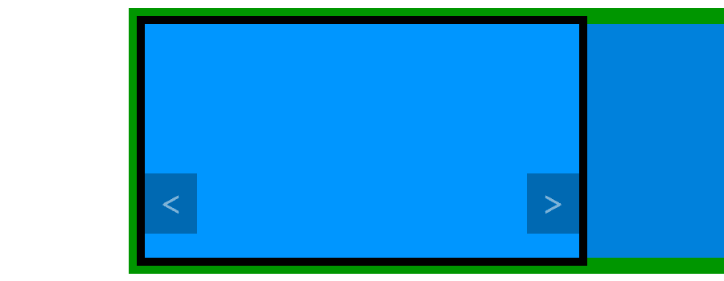

# 构建一个 WordPress Carousel 插件:第 2 部分

> 原文：<https://www.sitepoint.com/building-a-wordpress-carousel-plugin-part-2/>

carousel 不仅仅是一个链接列表，它的存在是为了以一种更吸引人的方式将链接显示为项目。在我们的[上一篇文章](https://www.sitepoint.com/building-a-wordpress-carousel-plugin-part-1/)中，我们看到了如何创建一个 carousel，以及如何显示我们需要的 HTML 元素。现在是时候构建和设计我们的 WordPress carousel 插件了。

我们的轮播目前是一个简单的链接列表，到本文结束时，我们将有一个正确格式化的轮播。我们将了解如何应用我们需要的样式，以获得我在第 1 部分的示例图像中展示的结果。当然，有许多属性你可以自定义，网站不必在世界各地都一样！

首先，我们将看看如何在 WordPress 中将 CSS 文件正确链接到网页。然后我们将样式化我们的元素，这将展示一些在许多不同情况下有用的 CSS 技巧。

## 链接外部 CSS 文件

为了使我们的 carousel 的样式尽可能灵活和简单，我们将内联样式的使用限制为只有一个属性，即每个项目的背景。对于所有其他样式，我们将使用外部 CSS 文件(样式表)。您可以为文件选择自己的名称(例如 carousel.css ),并将其放在插件的文件夹中(或子目录中)。

为了包含这个文件，我们将使用`wp_enqueue_style()`函数，正如我们在关于[的文章中所描述的包含脚本](https://www.sitepoint.com/including-javascript-in-plugins-or-themes/)的正确方法。

我们不能随便调用这个函数，它必须在调用`wp_head()`之前被调用(不像脚本，我们不能在页脚包含 CSS 文件！).我们可以使用`wp_enqueue_scripts`，当 WordPress 包含脚本**和**当前页面的样式(在前端)时调用它，所以它非常适合这个应用程序。

下面的代码必须出现在插件的主文件中。

```
function enqueue_carousel_style() {
    wp_enqueue_style('carousel', plugin_dir_url(__FILE__) . 'carousel.css');
}
add_action('wp_enqueue_scripts', 'enqueue_carousel_style');
```

`wp_enqueue_style()`函数接受(至少)两个参数，样式名和对应文件的 URI。`plugin_dir_url()`函数会给我们插件所在文件夹的 URL，因为我的`carousel.css`文件位于这个文件夹的根目录下，我没有子目录可以添加到这里，但是如果你使用子目录的话，你必须把它连接起来。

注意，我们没有在函数中测试任何东西。WordPress 将在每个页面中包含我们的 CSS 文件。如果你在所有页面上显示你的旋转木马，这不是一个问题。然而，如果你只在某些页面上显示你的轮播(例如，只在主页上)，你应该在包含 CSS 文件之前测试访问者是否在正确的页面上(例如，用`is_home()`)。

现在是时候编辑我们的 CSS 文件了。

## 让我们设计我们的旋转木马吧！

### 旋转木马的大小

我们从主容器的大小开始，即由`#carousel`标识的`div`。您可以在这里设定您想要的尺寸。因为我们使用的图像不会调整大小，所以固定大小是个好主意。

```
#carousel {
    width: 900px;
    height: 350px;
}
```

稍后，我们将向该容器添加第三个属性，`overflow`。目前我们不会使用它，这样我们可以看到我们的项目是如何在页面上布置的。

每个项目将填充我们刚刚创建的整个块。以下规则适用于项目本身(类名为`carousel-link`的`a`标签)及其父项。

```
#carousel ul,
#carousel ul li,
#carousel ul li a.carousel-link {
    display: block;
    width: 100%;
    height: 100%;
}
```

### 定位链接

#### 当我们向右走时会发生什么？

现在我们必须考虑我们想要做什么。当我们想要建造一个旋转木马时，有许多可能性。我建议将带有`float`属性的项目放在一个大容器中:它必须足够大，能够在一行中包含我们所有的项目。

当用户想要查看另一个图像时，我们移动这个容器，将下一个项目与`#carousel` `div`对齐。这个`div`将属性`overflow`设置为`hidden`，这样我们就看不到其他链接了。

下面是我们想要做的一个方案。在绿色部分，你可以看到一个大容器，里面有我们所有的链接。为了让我们看到右边的链接，容器移到左边，反之亦然。黑色边框代表`#carousel` `div`:在这个边框之外，一切都是看不见的。



#### 容器的大小

首先，容器:我们不会创建另一个 HTML 元素，因为`ul`元素非常适合我们的目的。我们看到这个容器必须足够大，以便在一行中包含我们所有的链接。目前情况并非如此，我们的项目和容器都有 900 像素的宽度。

为了改变这一点，我们将把容器的宽度增加到`500%`。由`#carousel`标识的`div`具有 900 像素的宽度，因此`500%`的宽度将允许我们连续显示五个链接。

```
#carousel ul {
    width: 500%;
}
```

这里可能会出现一个潜在的问题:条目的数量是可变的，例如，我们的脚本实际上只能显示三个条目。这不是一个真正的问题，因为我们将项目的数量限制为最多五个，所以即使只有三个，他们都将适合，空白空间不会干扰旋转木马的操作。

如果您选择另一个限制，您必须更改该宽度(例如，如果您想显示 10，则更改为`1000%`)。当你不想要任何限制时，问题就出现了。在这种情况下，您必须根据包含要显示的项目数量的`$n`变量，在`ul`标签的`style`属性中设置宽度。

```
<ul style="width: <?php echo $n * 100; ?>%;">
```

#### 定位链接

现在我们需要修正标签的宽度。目前它们被设置为`100%`，所以它们将占据我们容器的整个宽度，这个宽度是我们容器的五倍长。

```
#carousel ul li {
    float: left;
    width: 900px;
}
```

`li`标签现在有了合适的宽度，并且是浮动的。如果您现在测试我们的传送带，您将看到正确的结果，五个项目彼此相邻。您现在可以将`overflow`属性添加到`#carousel`中，以隐藏不应该可见的项目。

```
#carousel {
    overflow: hidden;
}
```

#### 项目的名称和描述

项目的名称可以根据您的需要进行设计。在这里，我将描述我如何创建你在本教程的前一部分看到的样式。

提醒一下，项目的名称显示在`a.carousel-link`元素的`strong`标签中。可以获得带有背景色的条带，但是我们希望该条带占据整个宽度。为此，我们可以将`display`设置为`block`。`padding`和`color`属性完成了样式。

```
#carousel ul li a.carousel-link strong {
    display: block;
    padding: 10px 20px;
    background-color: rgba(0, 0, 0, 0.3);
    color: #FFFFFF;
}
```

与名称一样，您可以个性化项目的描述。在这里，我选择使用下面的 CSS 将它显示在名字下面的右边。

```
#carousel ul li a.carousel-link em {
    display: block;
    padding: 0 20px;
    text-align: right;
    color: #3D3D3D;
    text-shadow: 0 0 5px #FFFFFF;
}
```

`display`属性的`block`值允许`em`标签使用所有可用的宽度。然后，我们将文本靠右对齐，并进行一些填充，这样文本就不会紧贴边缘。我在这里选择了深灰色作为文字颜色。为了确保文本总是可读的，即使是在黑暗的图像上，我添加了一个白色的文本阴影。

#### 设计箭头的样式

最后一步是正确显示箭头。根据您希望在哪里显示这些箭头，这里有几个选择。

我使用下面列出的属性来实现示例项目的效果。我们将箭头转换成块，以便能够修改它们的大小，然后固定这个大小，并对箭头进行样式化。我们还使用了一个有用的技巧来垂直对齐文本(箭头)，我们将`line-height`属性设置为我们给`height`的相同值，然后文本将垂直居中。

```
#carousel ul li a.carousel-prev,
#carousel ul li a.carousel-next {
    display: block;
    height: 75px;
    padding: 0 20px;
    background-color: rgba(0, 0, 0, 0.3);
    line-height: 75px;
    font-weight: bold;
    font-size: 45px;
    color: rgba(255, 255, 255, 0.5);
}
```

为了再现圆角，我们将使用`border-radius`，但不是在所有的角上，传送带侧面的角不应该是圆角。这就是为什么我们将使用`border-radius`的‘子属性’,它允许我们选择圆角。

```
#carousel ul li a.carousel-prev {
    border-top-right-radius: 10px;
    border-bottom-right-radius: 10px;
}

#carousel ul li a.carousel-next {
    border-top-left-radius: 10px;
    border-bottom-left-radius: 10px;
}
```

最后，我个人喜欢按钮和链接有悬停效果。这里我选择只修改箭头的颜色。

```
#carousel ul li a.carousel-prev:hover,
#carousel ul li a.carousel-next:hover {
    color: #FFFFFF;
}
```

既然 CSS3 允许我们轻松地进行软过渡，为什么不使用它们呢？

```
#carousel ul li a.carousel-prev,
#carousel ul li a.carousel-next {
    transition-property: color;
    transition-duration: 0.5s;
}
```

#### 定位箭头

箭的样式就这么多了。现在我们需要把它们放在我们想要的地方。我们将使用绝对定位，有一点小技巧:我们不知道转盘本身的位置，所以我们不能定位屏幕角落的箭头。相反，我们将使用转盘角，更准确地说是`li`标签角。

让我们将`position`设置为`absolute`来定位我们的箭头。

```
#carousel ul li a.carousel-prev,
#carousel ul li a.carousel-next {
    position: absolute;
    bottom: 50px;
}

#carousel ul li a.carousel-prev {
    left: 0;
}

#carousel ul li a.carousel-next {
    right: 0;
}
```

如果您尝试这样做，箭头将位于屏幕两侧。我们必须使用一个不太为人所知的绝对定位选项。箭头元素相对于其最近的父元素定位。这里，我们的箭头没有任何定位的父对象，所以它们是相对于屏幕定位的。

问题是箭头父母在正确的地方:我们不想移动他们中的任何一个。诀窍在于使用相对定位，而不改变其他任何东西。我们将把相对定位应用于`li`标签，它是我们的箭头的最近的父元素。

```
#carousel ul li {
    position: relative;
}
```

然后箭头被放置在离它们最近的父标签`li`的旁边，这就是我们想要的。

## 下一步是什么？

我们的 carousel 需要的 HTML 元素被显示出来，现在，它们也被样式化了。问题是我们的 carousel 完全没用，因为它只显示了第一项(没有 CSS 它会更有用！).

这就是为什么我们需要添加最后一样东西:JavaScript。在本教程的下一部分(也是最后一部分),我们将让箭头像预期的那样工作，当点击箭头时，链接将会滚动。这是好事，对吧？

## 分享这篇文章