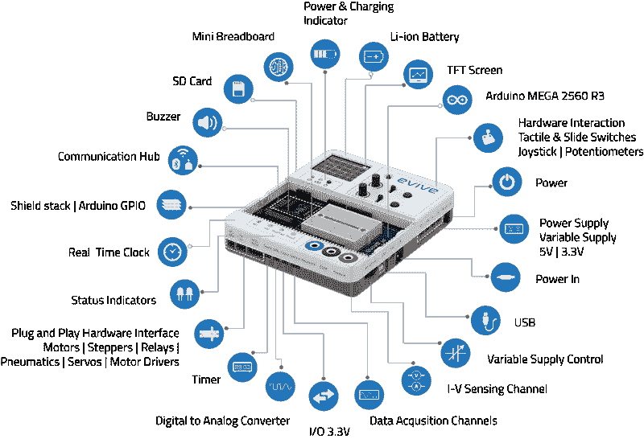
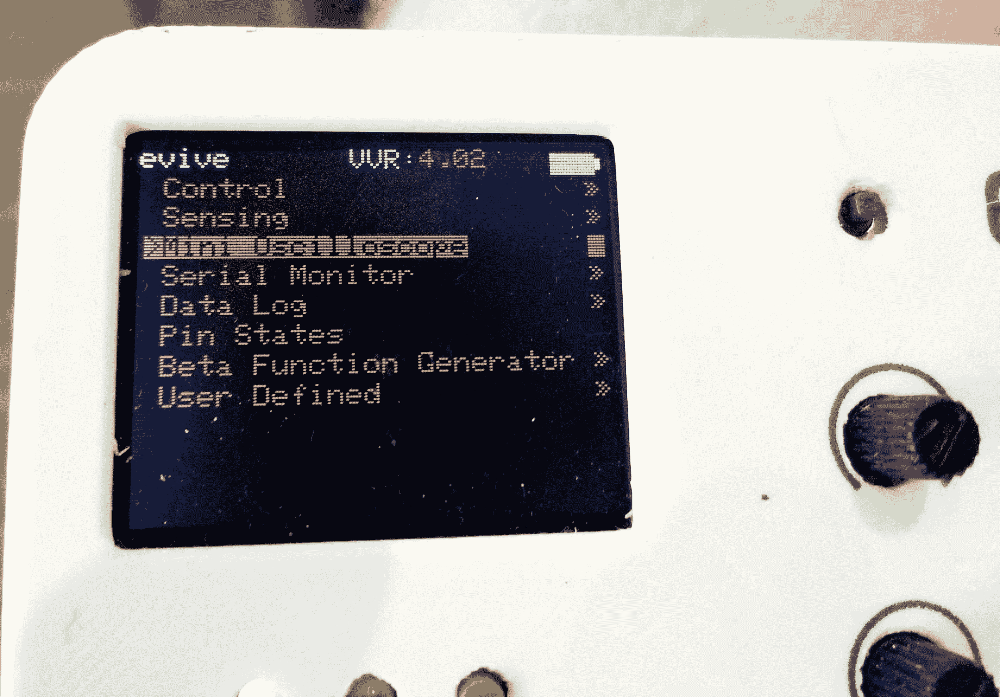
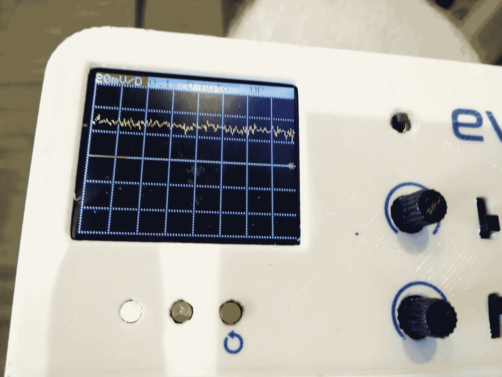
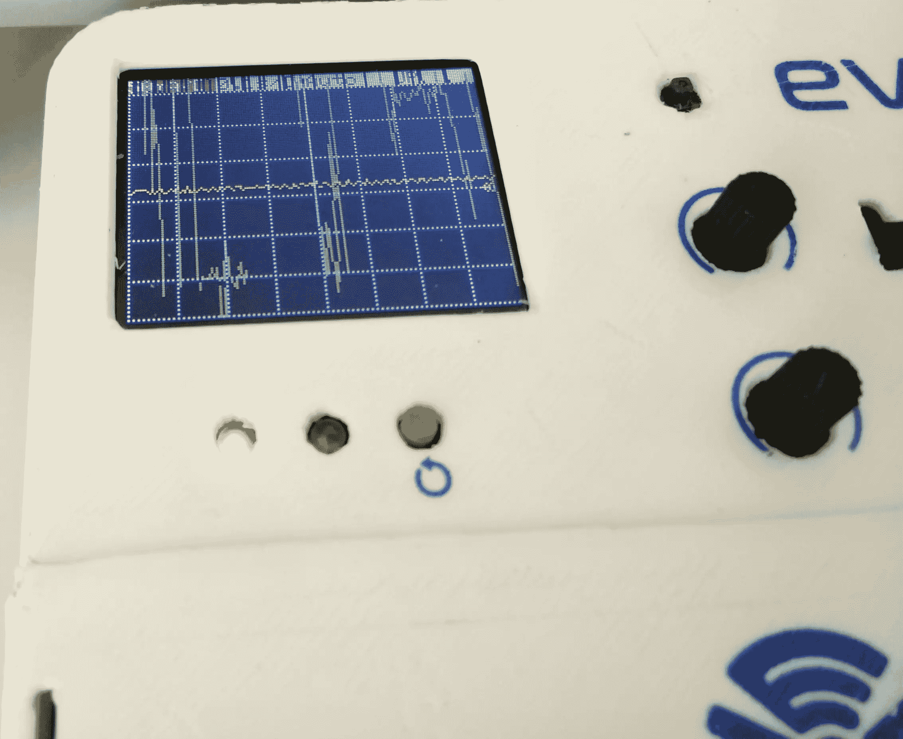
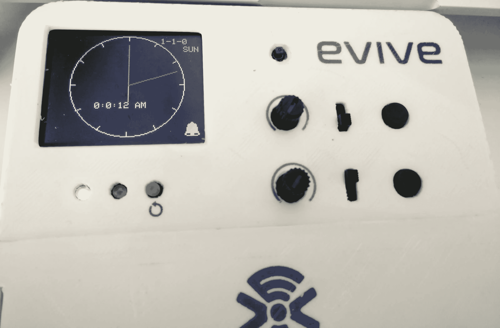

# 探索 Evive:一个书本大小的物联网设备

> 原文：<https://www.sitepoint.com/building-an-all-in-one-book-sized-iot-device-with-evive/>

evive 旨在减少覆盖在工作台上的传感器、电路板和电缆的复杂缠结。这是一个紧凑的一体化小型书籍大小的设备，能够读取和输出各种传感器和触发数据。内置包括功率传感器、多个电机通道、伏特计探头和两个模数转换器。如果这还不够，evive 的核心是一个 Arduino Mega，它通过一个迷你试验板、通信模块(Wi-Fi、蓝牙和 XBee)、IC、SPI 和串行引脚提供了巨大的扩展可能性。

您可以通过板载开关、电位计和屏幕界面与所有这些数据点进行交互。这个接口有一组默认的选项和方法来与硬件交互，但是你可以通过上传你自己的代码来定制。

## 定做的

举个简单的例子，当使用内置电池时，电压会轻微波动。我启动了内置示波器，提高了分辨率，瞧，一张即时图表就出来了。

我记得当我还是个孩子的时候，我玩我祖父的旧伏特计，将探针插入物体中，看看它们带有什么电荷。现在我可以用 evive 做同样的事情。这是我在无线鼠标中读取充电电池的电量:

如果你对硬件项目感兴趣，我想你会了解 evive 的工作原理和潜力，以及它对你的项目有多有用，但它的独特之处之一是能够上传自定义菜单和功能。

## 建立你自己的

这包括启动官方的 [Arduino IDE](https://www.arduino.cc/en/Main/Software) ，并确保您从*工具- >板*和*工具- >端口*菜单项中选择 evive，它将显示为“Arduino/Genuino Mega 或 Mega 2560”。evive 团队有很多可用的例子[这里](https://github.com/evivetoolkit/eviveProjects)你可以粘贴到 IDE 代码窗口并上传到单元。确保您已经从*Sketch->Include Library*菜单项安装了他们使用的任何库。

下面是运行[闹钟](https://github.com/evivetoolkit/eviveProjects/tree/master/alarmClock/alarmClock)的设备示例:

要恢复默认菜单系统，请从[evive GitHub 这里](https://github.com/evivetoolkit/eviveFirmware/tree/master/evive)下载，确保它包含在您本地的 Arduino *libraries* 文件夹中，并将 *evive.info* 的内容上传到设备。

太好了！正如你所看到的，evive 的所有代码都是开源的，可以根据你的意愿进行定制，默认的软件可以很容易地改变以适应你的项目。

evive 团队非常友好地从印度给我送来了一个测试单元，如果你喜欢这个项目的声音，那么他们目前希望在 [Indiegogo campaign](https://www.indiegogo.com/projects/evive-the-best-electronic-prototyping-platform-arduino-education--2#/) 上达到 3 万美元的目标，作为你的硬件项目原型的一个重要部分，我希望你觉得它值几个美元。

## 分享这篇文章