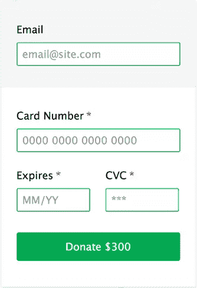

# 用聚合物构建信用卡表单定制元素

> 原文：<https://www.sitepoint.com/building-credit-card-form-custom-element-polymer/>

在本文中，我们将使用[聚合物库](https://www.polymer-project.org/)为信用卡支付表单创建一个定制元素。最终的形式看起来会像这样，



定义这个支付表单的标记就像下面这样简单:

```
<credit-card amount="$300"></credit-card>
```

可以预见的是，在这个定制元素的表面下隐藏着一个额外的抽象层，负责处理典型信用卡支付表单的所有复杂问题。使用自定义元素有助于隔离任何潜在的未来问题，并保持顶层标记的整洁和语义。

我们的信用卡支付表将包括:

*   电子邮件地址
*   信用卡号码
*   到期日
*   一个 [CVC](http://en.wikipedia.org/wiki/Card_security_code) 号

如果您以前从未使用过 Polymer library，或者需要复习 web 组件的基本概念，那么您可以首先阅读我以前在 SitPoint 上的文章:

*   [Web 组件和聚合物介绍(教程)](https://www.sitepoint.com/introduction-to-web-components-and-polymer-tutorial/)
*   [用聚合物构建引用定制元素](https://www.sitepoint.com/building-pull-quote-custom-element-polymer/)

这些文章应该能够让您快速掌握理解本文所需的最基本的知识。

## 基本项目设置

在我们开始创建自定义元素之前，我们将通过 Bower 安装 Polymer 和所有需要的依赖项来快速设置项目文件夹。

```
$ bower install --save Polymer/polymer
```

这将在`bower_components`文件夹中安装聚合物库和网络组件 polyfills。

```
bower_components/
├── core-component-page
├── webcomponentsjs
└── polymer
```

请注意，自从升级到 v0.5.0 版本后，`platform.js`多灌装器[已被重命名为](https://blog.polymer-project.org/announcements/2014/10/16/platform-becomes-webcomponents/)并被单独维护。

## 设计标记

创建定制元素的基本方法是首先决定如何在我们的标记中使用它，然后反向创建定制元素的模板。在这种情况下，我们打算使用我们的自定义元素，通过使用`<credit-card>`标记的`amount`属性来指定要支付的金额，

```
<credit-card amount="$300"></credit-card>
```

我们将从在项目文件夹的根目录下创建一个`credit-card.html`文件开始，并导入定义定制元素所需的`polymer.html`文件。

```
<link rel="import" href="bower_components/polymer/polymer.html">
```

我们将使用`<polymer-element>`的`name`属性声明新的`<credit-card>`元素:

```
<polymer-element name="credit-card">
  <template>
    <!-- More to come -->
  </template>
</polymer-element>
```

设计自定义元素所需的所有必要样式和标记都将放在`<template>`标签中。我使用了标准的表单控件和适当的标签来提高可访问性。

```
<template>
  <form>
    <fieldset name="personalInfo">
      <label for="email">Email</label>
      <input type="email" id="email" 
             placeholder="email@site.com">
    </fieldset>

    <fieldset name="cardInfo">
      <label for="cardNum" required>Card Number</label>
      <input type="tel" id="cardNum" 
             placeholder="0000 0000 0000 0000">

      <label for="cardExp" required>Expires</label>
      <input type="tel" id="cardExp" placeholder="MM/YY">  

      <label for="cardCVC" required>CVC</label>
      <input type="tel" id="cardCVC" placeholder="***">
    </fieldset>

    <input type="submit" value="Donate {{amount}}">
  </form>
</template>
```

上面的 HTML 没有什么不寻常的，除了下面一行:

```
<input type="submit" value="Donate {{amount}}">
```

`{{ }}`中的值称为聚合物表达式。这些提供了一个钩子，将 Light DOM 中指定的数据(使用自定义元素时)绑定到 Shadow DOM(自定义元素的模板)中。在这种情况下，我指的是在`<credit-card>`标签的`amount`属性中指定的值:

```
<credit-card amount="$300"></credit-card>
```

这将转化为:

```
<input type="submit" value="Donate $300">
```

关于在自定义元素上定义属性的最后一件事是，在使用它们之前，您还需要在主元素的顶部声明它们。这是按如下方式完成的:

```
<polymer-element name="credit-card" attributes="amount">
```

在同一自定义元素上指定多个属性时，可以用空格或逗号分隔它们。

## 设置自定义元素的样式

可以在模板标记中定义样式，如下所示:

```
<template>
  <style> /* ... */ </style>
</template>
```

或者我们可以将它们写在一个新的 CSS 文件中，然后使用`link`标签导入该文件。

为了使我们的设置更加模块化和可伸缩，以处理未来的增强，我们将使用第二种方法，创建一个新的 CSS 文件`credit-card.css`，它将包含自定义元素的所有必要样式。

```
<template>
  <link rel="stylesheet" href="credit-card.css">
  <form>
    [...]
  </form>
</template>
```

本文主要关注定制元素的功能方面，而不是设计。只要你意识到以下几点，造型是相当标准的:

*   默认情况下，所有自定义元素都被设置为`display: inline`。因此，在这种情况下，我们必须显式地将元素声明为`display: block`。
*   `:host`指自定义元素本身，特异性最低。这允许用户从外部覆盖您的样式。

## 注册元素

注册元素允许支持的浏览器将其识别为自定义元素。通常，元素可以通过调用`Polymer()`构造函数直接注册，

```
Polymer([ tag-name, ] [prototype]);
```

其中:

*   `tag-name`匹配`<polymer-element>`上的`name`属性。这是可选的，除非调用聚合物的`<script>`标签被放置在`<polymer-element>`标签之外。
*   `[prototype]`包含用于定义自定义元素行为的公共属性和方法。

调用 Polymer 最简单的方法是在您的`<polymer-element>`标签中放置一个内嵌脚本:

```
<polymer-element name="tag-name">
  <template>
    [...]
  </template>
  <script>Polymer();</script>
</polymer-element>
```

对于不需要定制属性或方法的元素，可以使用`noscript`属性:

```
<polymer-element name="tag-name" noscript>
  [...]
</polymer-element>
```

为了简洁起见，我们将通过以下方式显式使用标记名来注册我们的自定义元素:

```
<script> Polymer('credit-card', {
    /* More to come */
  }); </script>
```

## 使用带有自定义元素的 JavaScript 库

在实际设置中，定制元素的行为可能依赖于外部 JavaScript 库。本节将带您了解一个将外部 JavaScript 文件与您的定制元素结合使用的基本示例。

让我们通过以下方式改善用户的支付体验:

*   将信用卡号格式化成 4 位数的组，总长度不超过 16 位数。
*   将到期日期格式化为`MM/YY`。

我们将使用优秀的 [`jquery.payment`库来解决这些可用性问题，反过来也需要 jQuery 库来工作。简而言之，我们在结束的`<polymer-element>`标记之前包含了两个脚本，因为在加载定制元素时我们并不真正需要任何 JavaScript。](https://github.com/stripe/jquery.payment)

```
<polymer-element name="credit-card" attributes="amount">
  <template>
    [...]
  </template>
  <script src='//cdnjs.cloudflare.com/ajax/libs/jquery/2.1.3/jquery.min.js'></script>
  <script src='//cdnjs.cloudflare.com/ajax/libs/jquery.payment/1.2.1/jquery.payment.min.js'></script>
  <script> Polymer('credit-card', {}); </script>
</polymer-element>
```

聚合物库提供了一系列有用的回调方法，用于在自定义元素创建生命周期的不同阶段注入自定义行为:

*   `created`–创建元素的实例。
*   `ready`–元素的一个实例被插入到 DOM 中。
*   `detached`–从 DOM 中删除了该元素的一个实例。
*   `attributeChanged`–添加、删除或更新了元素的属性。

关于生命周期方法的更多信息可以在 [API 开发者指南](https://www.polymer-project.org/docs/polymer/polymer.html)中找到

```
<script>  
Polymer('credit-card', {
  ready: function() {       
    var cardNum = this.$.cardNum,
        cardExp = this.$.cardExp,
        cardCVC = this.$.cardCVC,
        creditCard = this.$.creditCard,
        $cardNum = jQuery(cardNum),
        $cardExp = jQuery(cardExp),
        $cardCVC = jQuery(cardCVC),
        $creditCard = jQuery(creditCard);

    /* Formatting input fields */
    $cardNum.payment('formatCardNumber');
    $cardExp.payment('formatCardExpiry');
    $cardCVC.payment('formatCardCVC');

    /* Card validation on Form submission */
    $creditCard.submit(function(e){
      var cardExpiryVal = $cardExp.payment('cardExpiryVal'),
        cardType = jQuery.payment.cardType($cardNum.val()),
        isValidNum = jQuery.payment.validateCardNumber($cardNum.val()),
        isValidExp = jQuery.payment.validateCardExpiry(cardExpiryVal),
        isValidCVC = jQuery.payment.validateCardCVC($cardCVC.val(), cardType);

        if (isValidNum && isValidExp && isValidCVC) {
          /* Success */
        }
        else {
          /* Validation failed */
        }
    });
  }
});
</script>
```

Polymer 提供了一种使用`this.$.id`在影子 DOM 中自动查找节点的便捷方式。`$`当然是`jQuery`的简称。因此，为了避免任何潜在的冲突，我们在整个代码中使用了标识符`jQuery`。或者，如果您想使用类名而不是 ID 来查找节点，那么您有两种选择:

使用以下命令直接访问影子 DOM:

```
this.shadowRoot.querySelector('.classname');
```

或者向自定义元素添加一个标识符(`#container`)，然后使用:

```
this.$.container.querySelector('.classname');
```

## 使用自定义元素

在文档中包含`credit-card.html`文件，然后使用定制元素就像编写代码一样简单:

```
<head>
  <link rel="import" href="credit-card.html">
</head>
<body>
  <credit-card amount="$300"></credit-card>
</body>
```

Chrome 和 Opera 现在完全支持最新版本的 web 组件。然而，IE，Firefox 和 Safari，[仍然落后于](http://caniuse.com/#feat=custom-elements)。要启用对这些浏览器的支持，您还需要包含`webcomponents.js` polyfill:

```
<head>
  <!-- Load platform support before any code that touches the DOM. -->
  <script src="bower_components/webcomponentsjs/webcomponents.min.js"></script>
  <link rel="import" href="credit-card.html">
</head>
```

在 Plunker 上查看[完整代码](http://plnkr.co/edit/hBCJ7xkIAGK5ErCMgBEf?p=preview)以及演示。我还在 Github 上为信用卡定制元素建立了一个[项目库。](https://github.com/pankajparashar/custom-elements/tree/master/credit-card)

## 结论

这不是一个功能性的信用卡支付表单，甚至远未完成。然而，这个演示应该足够好，让你能够使用聚合物库以定制元素的形式构建自己的设计组件。

## 分享这篇文章