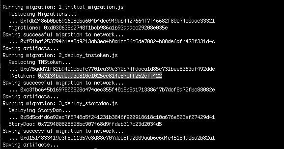
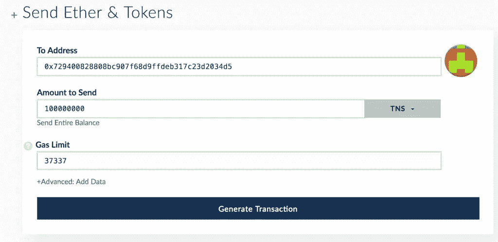
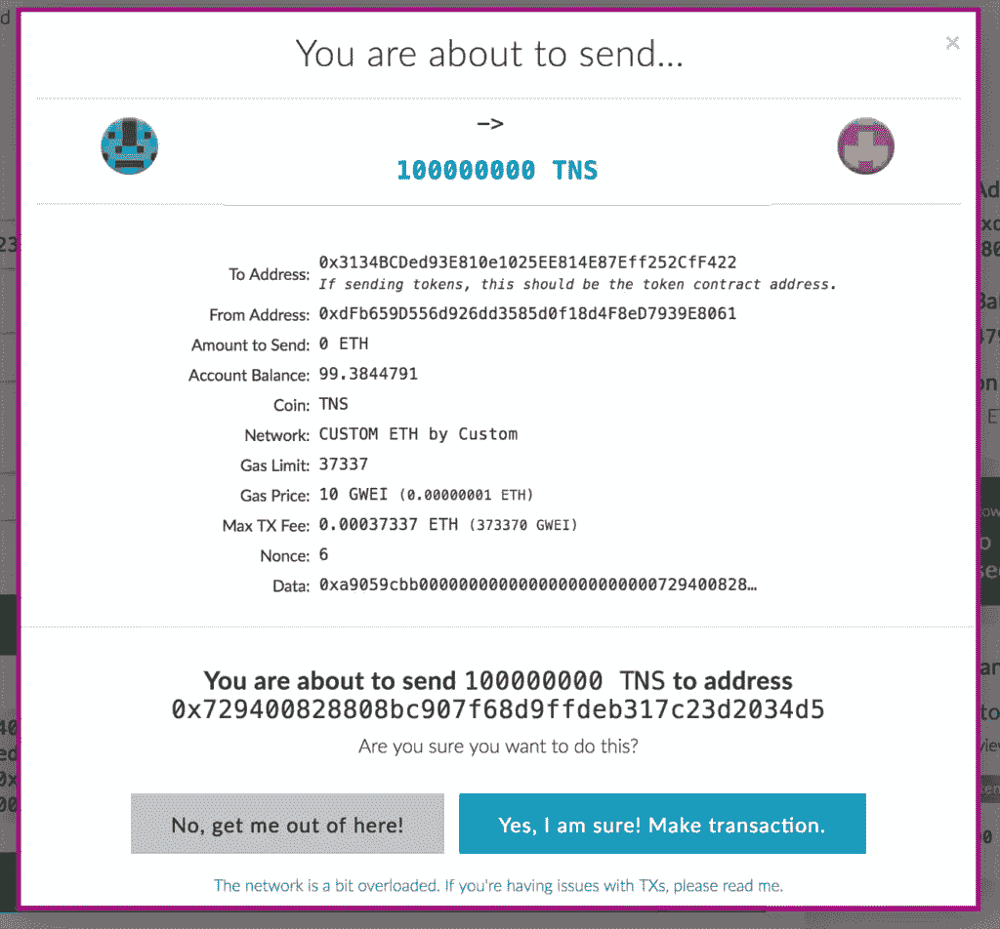
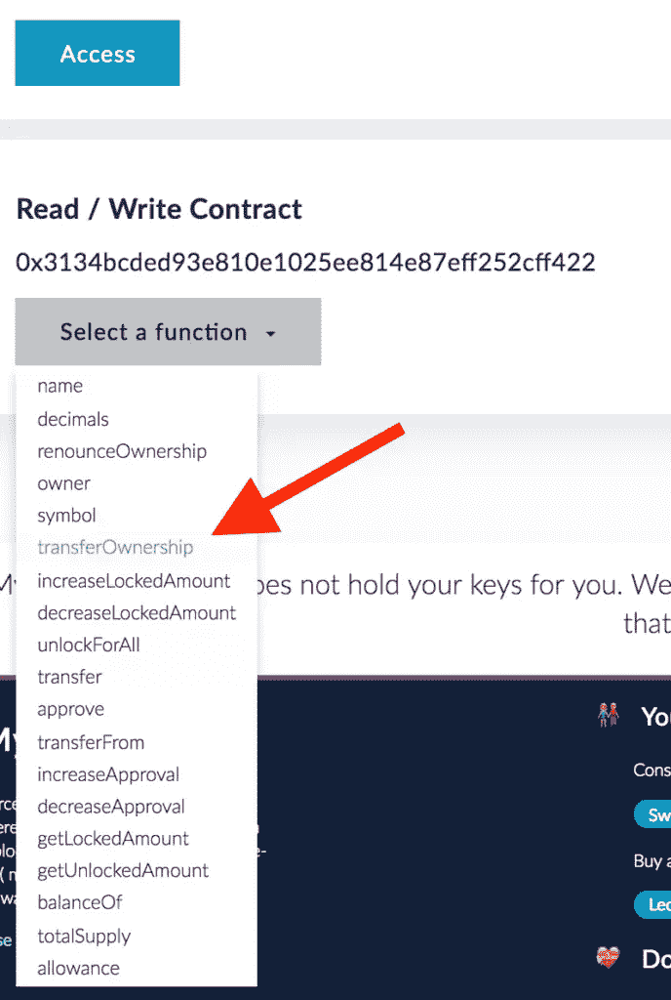
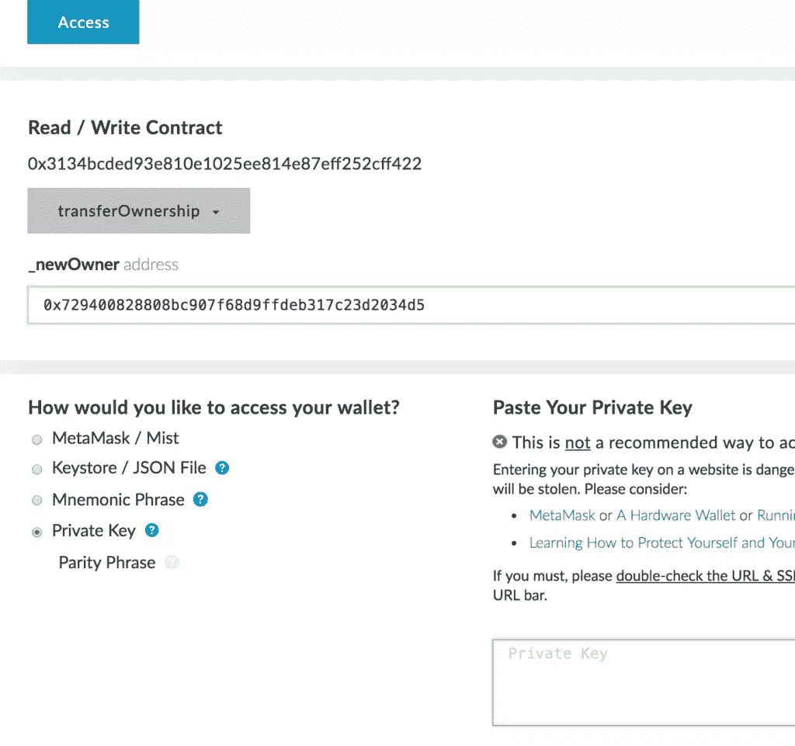
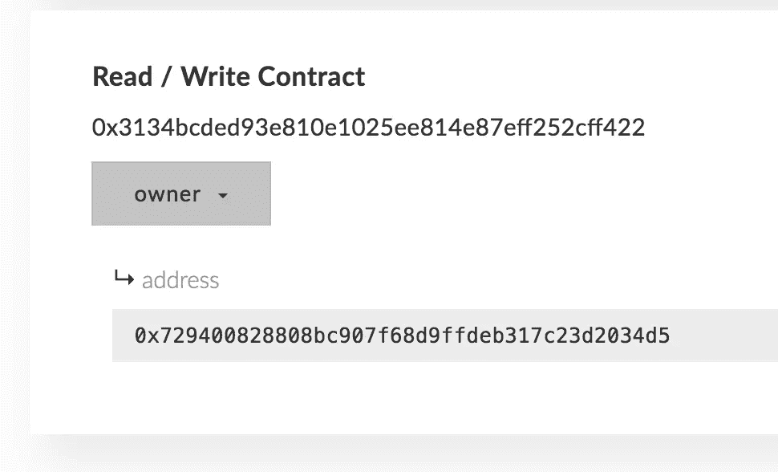
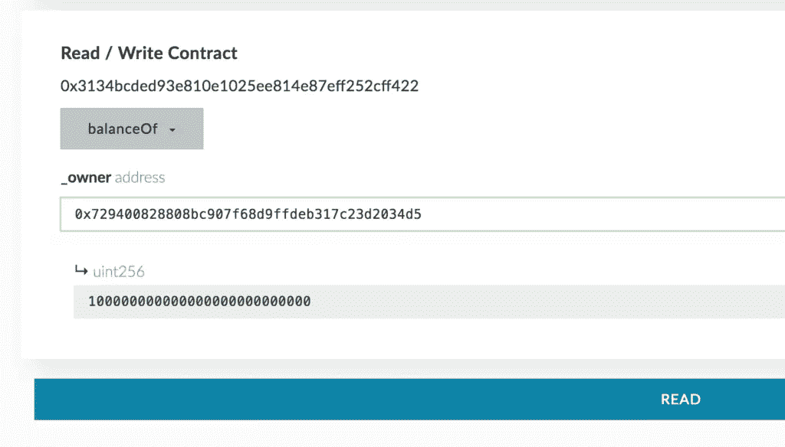

# 建造以太坊 DApp:启动故事道

> 原文：<https://www.sitepoint.com/building-ethereum-dapps-launching-storydao/>

在这个关于用以太坊构建 dapp 的系列教程的第 7 部分中，我们展示了如何构建应用的前端，为我们正在处理的这个故事设置和部署 UI。

是时候做一些部署并编写一些最终函数了。

* * *

这是使用[以太坊](https://www.sitepoint.com/ethereum-introduction)区块链构建分散式应用程序系列的第八部分。我们正在建设的项目叫做永无止境的故事。完整的项目可以在 storydao.bitfalls.com 的[找到。它的完整代码是 GitHub](https://storydao.bitfalls.com/) 上的[。](https://github.com/bitfalls/storydao)

以下是整个系列的概要:

*   在[第 1 部分](https://www.sitepoint.com/building-ethereum-dapps-app-rules-blockchain-setup)中，我们引导了两个版本的本地区块链用于开发:一个 Ganache 版本，和一个完全私有的 PoA 版本。
*   在[第 2 部分](https://www.sitepoint.com/building-ethereum-dapps-tns-tokens)中，我们构建并部署我们的 TNS 令牌。
*   在[第 3 部分](https://www.sitepoint.com/ethereum-dapps-compiling-deploying-testing-tns-tokens)中，我们将了解如何编译、部署、测试和验证我们的自定义 TNS 令牌，该令牌与所有交换兼容，可用作常规的 ERC20 令牌。
*   在第 4 部分中，我们迈出了开发 Story DAO 的第一步，包括白名单和测试。
*   在[第 5 部分](https://www.sitepoint.com/building-ethereum-dapps-cross-contract-communication-token-selling)中，我们处理向故事中添加内容，看看如何添加参与者从 DAO 购买代币的能力以及向故事中添加提交内容。
*   在[第 6 部分](https://www.sitepoint.com/building-ethereum-dapps-voting-custom-tokens)中，我们将 DAO 扩展到了最终形式，添加了投票、黑名单/取消黑名单、红利分配和撤销，同时添加了一些额外的辅助函数。
*   在[第 7 部分](https://www.sitepoint.com/building-ethereum-dapps-web3-ui-dao-contract)中，我们展示了如何构建应用的前端，为我们正在处理的这个故事设置和部署 UI。
*   在这最后一部分，我们看看部署应用程序和编写一些最终功能的最后步骤。

* * *

## 自杀

某些事情可能会非常、非常错误，整个 DAO 不知何故会被破坏——要么是由于糟糕的、仓促编写的代码，要么是由于太多参与者而无法进行长循环。(一个提案上的太多投票人可能会破坏这个系统；我们真的没有采取任何预防措施！)以防这种情况发生，拥有一个相当于“大红色按钮”的东西可能会很有用。首先，让我们升级我们的故事道:

```
function bigRedButton() onlyOwner external {
    active = false;
    withdrawToOwner();
    token.unlockForAll();
} 
```

然后，让我们使一次性解锁令牌契约中的所有令牌成为可能:

```
/**
@dev unlocks the tokens of every user who ever had any tokens locked for them
*/
function unlockForAll() public onlyOwner {
    uint256 len = touchedByLock.length;
    for (uint256 i = 0; i < len; i++) {
        locked[touchedByLock[i]] = 0;
    }
} 
```

自然，我们需要将这个新的地址列表添加到合同中:

```
address[] touchedByLock; 
```

我们需要升级我们的`increaseLockedAmount`函数来添加地址到这个列表中:

```
/**
@dev _owner will be prevented from sending _amount of tokens. Anything
beyond this amount will be spendable.
*/
function increaseLockedAmount(address _owner, uint256 _amount) public onlyOwner returns (uint256) {
    uint256 lockingAmount = locked[_owner].add(_amount);
    require(balanceOf(_owner) >= lockingAmount, "Locking amount must not exceed balance");
    locked[_owner] = lockingAmount;
    touchedByLock.push(_owner);
    emit Locked(_owner, lockingAmount);
    return lockingAmount;
} 
```

我们还应该更新 StoryDao 契约中令牌的必需接口，以包含这个新函数的签名:

```
// ...
    function getUnlockedAmount(address _owner) view public returns (uint256);
    function unlockForAll() public;
} 
```

对于我们之前添加的活动故事块(除非故事的`active`标志为真，否则无法运行某些功能)，这应该可以实现。没有其他人会浪费钱，把它送到合同，每个人的令牌都会解锁。

业主没有得到以太人提交。取而代之的是，戒断功能变得可用，所以人们可以收回他们的乙醚，每个人都得到照顾。

现在我们的合同终于可以部署了。

### 自毁呢？

有一个名为`selfdestruct`的函数可以让你毁掉一份合同。看起来是这样的:

```
selfdestruct(address); 
```

调用它将禁用有问题的合同，从区块链的状态中删除其代码并禁用所有功能，同时将该地址中的以太发送到提供的地址。在我们的情况下，这不是一个好主意:我们仍然希望人们能够收回他们的以太；我们不想从他们那里拿走。此外，任何直接发送到自杀合同地址的以太将永远丢失(烧毁)，因为没有办法找回它。

## 部署合同

要完全部署智能合约，我们需要执行以下操作:

1.  部署到 mainnet
2.  向 StoryDAO 地址发送令牌
3.  将令牌合同的所有权转移给 StoryDao。

我们走吧。

### Mainnet 部署

为了部署到 mainnet，我们需要在我们的`truffle.js`文件中添加一个新的网络:

```
mainnet: {
  provider: function() {
    return new WalletProvider(
      Wallet.fromPrivateKey(
        Buffer.from(PRIVKEY, "hex")), "https://mainnet.infura.io/"+INFURAKEY
    );
  },
  gasPrice: w3.utils.toWei("20", "gwei"),
  network_id: "1",
}, 
```

幸运的是，这非常简单。它实际上与 Rinkeby 部署相同；我们只需要去掉燃气量(让它自己算)，改变燃气价格。我们还应该将网络 ID 改为 1，因为这是 mainnet ID。

我们这样使用它:

```
truffle migrate --network mainnet 
```

这里有一点需要注意。如果您正在先前部署的网络上进行部署(即使您刚刚将令牌部署到 mainnet 上，并希望稍后部署 StoryDao ),您可能会收到以下错误:

```
Attempting to run transaction which calls a contract function, but recipient address XXX is not a contract address 
```

发生这种情况是因为 Truffle 记得它在哪里部署了已经部署的契约，以便它可以在后续迁移中重用它们，从而避免重新部署的需要。但是如果你的网络重新启动(即 Ganache)或者你做了一些不兼容的更改，可能会发生它保存的地址实际上不再包含这个代码，所以它会抱怨。您可以通过重置迁移来解决这个问题:

```
truffle migrate --network mainnet --reset 
```

### 向 StoryDao 地址发送令牌

从部署过程中获取令牌的地址和 StoryDao 的地址。



然后就像前面描述的那样使用 MEW 来发送令牌。





如果你摆脱了汽油的错误，只要增加汽油的限制。请记住:剩余的未使用的汽油总是会得到退款，所以不用担心会损失比您的交易成本更多的钱(发送代币应该在 40000 汽油以下)。

### 将令牌的所有权转移到 StoryDao

要转移所有权，我们需要调用令牌上的`transferOwnership`函数。让我们将令牌装入 MEW。在`Contracts`屏幕中，我们输入地址和合同的 ABI(从`/build`文件夹中获取)。点击*访问*将让我们在菜单中选择`transferOwnership`访问该合同中的功能。



*提示:只包含你打算调用的函数的 ABI 就够了:不必是令牌的整个 ABI！你可以只包含`transferOwnership`函数的 ABI，这样就很好了！*

然后，我们选择新的所有者(部署的 StoryDao 的地址)并解锁当前所有者的钱包(我们之前发送令牌的钱包)。



写完这个修改后，我们可以检查令牌契约中的只读函数`owner`(与`transferOwnership`相同的菜单)。它现在应该显示新的所有者。



为了确保 StoryDao 地址确实有令牌，我们可以选择`balanceOf`功能并将 StoryDao 的地址输入到`_owner`字段，然后点击*读取*:



事实上，StoryDao 地址中有 1 亿个令牌。

提示:我们也可以将令牌发送和所有权转移作为部署步骤的一部分。试着弄清楚在测试环境中是如何做到的。

## 确认

根据本系列的第 3 部分，在 Etherscan 上验证 DAO 和令牌的契约将会使我们受益匪浅。那个绿色的勾号可以走很长的路。

请按照该部分的说明核实您的合同。请注意，在验证步骤中，您现在必须将优化器标记为活动的，因为我们正在优化代码以实现更低的部署成本！

## 部署到 Web

要部署 StoryDao 的 web UI，请遵循“常规”web 开发环境中的说明。因为，在这种情况下，它都是静态代码，你甚至可以把它放在 GitHub 页面或类似的东西上。

点击阅读一些选项[。](https://developer.mozilla.org/en-US/docs/Learn/Getting_started_with_the_web/Publishing_your_website)

页面打开后，配置 UI 使用我们在迁移步骤中获得的合同地址。或者，为令牌和 StoryDao 注册 ENS 名称，您可以保持 web UI 静态和固定，硬编码地址，然后只更改 ENS 名称指向的以太坊地址。

## 结论

DAO 教程到此结束。我们希望它能帮助你认识到 Solidity 开发的复杂性，但我们也希望它能让一些事情变得更加清晰，让你更加好奇。

一如既往，最好的学习方法是实践。实验，犯错，重启，重建。这种类型的区块链开发需求很高，而且只会越来越受欢迎，所以你有机会进入第一层。

祝你好运！

*附:如果你喜欢这个教程，请随意在推特上联系作者。如果你有抱怨、建议、想法等。请将它们发送到 GitHub 上的资源库中！*

## 分享这篇文章