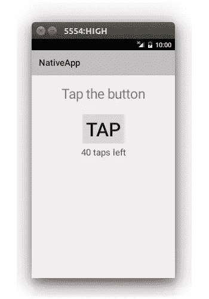
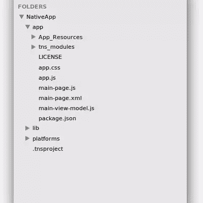
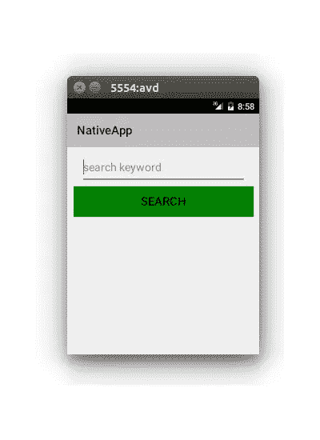
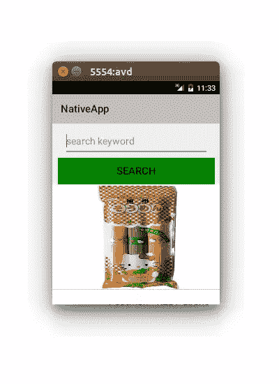

# 使用 NativeScript 用 JavaScript 构建本机应用程序

> 原文：<https://www.sitepoint.com/building-native-app-javascript-using-nativescript/>

利用 HTML、CSS 和 JavaScript 创建跨平台应用程序有很多选择，在之前我已经介绍过其中的很多。在这篇文章中，我将关注来自 [Telerik](http://www.telerik.com/) 的 [NativeScript](https://www.nativescript.org/) ，它声称比许多现有选项更容易为跨平台应用程序创建。

从他们的官方文件中。

> NativeScript 使开发人员能够为 iOS、Android 和 Windows Universal 构建原生应用，同时跨平台共享应用代码。在构建应用程序 UI 时，开发人员使用我们的库，这些库抽象了本地平台之间的差异。

## 创建图像搜索闪烁应用程序

在本教程中，我们将创建一个简单的应用程序，在 flickr 上搜索图片并显示结果。我们将利用 [flicker 开发者 API](https://www.flickr.com/services/developer/api/) 来搜索图像。

本教程的源代码可以在 GitHub 上找到。

### 入门指南

安装 [nodejs](https://nodejs.org/) ，然后使用节点包管理器(npm)安装本地脚本。

```
npm install -g nativescript
```

安装本机脚本后，创建一个名为 *NativeApp* 的新项目。

```
tns create NativeApp
```

导航到项目目录并添加移动开发平台。

```
tns platform add android
```

在 android 模拟器上运行应用程序。

```
tns run android --emulator
```



### 项目结构



项目文件夹内有 3 个子文件夹: *app* 、 *lib* 和*平台*。应用程序源代码驻留在 *app* 文件夹中。应用程序代码使用 JavaScript 编写，用户界面使用 XML 设计。

在 *app* 文件夹中有一个名为 *main-page.xml* 的文件，它拥有默认的用户界面代码。在*中，main-view-model.js* 是默认的模型代码，而 *main-page.js* 定义了应用程序逻辑。最后 *app.js* 包含了用定义好的模块启动应用程序的代码。

## 设计应用程序

让我们从使用 XML 设计应用程序开始。打开 *main-page.xml* ，查看默认代码。移除除了页面标签之外的所有内容。`Page`标签有一个名为`loaded`的属性，它在应用程序加载后执行`pageLoaded`功能。`pageLoaded`函数在 *main-page.js* 文件中。

这个项目将使用堆栈布局来设计我们的应用程序。本地脚本提供了许多[布局。](http://docs.nativescript.org/layouts)

在`Page`标签内添加堆栈布局。

```
<StackLayout orientation="vertical">

</StackLayout>
```

定义垂直方向的堆栈布局。在堆栈布局中添加搜索文本框和按钮。

```
<TextField width="300px" hint="search keyword" />

<Button text="Search" height="50px" style="background-color:green;width:300px;border:none;font-size:20px;" />
```

保存更改并运行应用程序。它应该看起来像下面这样。



## 从 flickr 获取数据

向搜索按钮添加一个名为`tap`的属性。

```
tap="signin"
```

现在，当用户点击搜索按钮时，就会调用`signin`功能。让我们在 *main-page.js* 中定义`signin`函数。

```
exports.signin = function() {
  // Code would be here !
};
```

要使用 flickr 的开发者 API，你需要一个 flickr 的免费帐户。[请求 API 键](https://www.flickr.com/services/developer/api/)进行 API 请求。

在 *main-page.js* 中定义 API 键。

```
var api_key = 'replacewithyourkey';
```

调用 API 将需要`http`模块，因此将模块导入到 *main-page.js* 中。

```
var http = require("http");
```

在`signin`函数中，使用`http`模块，现在进行 API 调用。

```
http.getJSON("https://api.flickr.com/services/rest/?method=flickr.photos.search&api_key=" + api_key + "&text=hello&format=json&nojsoncallback=1&per_page=5").then(function(r) {

    console.log(JSON.stringify(r));

}, function(e) {

    console.log(e);

});
```

上面的代码用现在硬编码的搜索文本进行 API 调用，这将在教程的后面变成动态的。

在模拟器中运行应用程序时，您需要运行“adb logcat”来检查日志消息。

保存更改并在模拟器上运行应用程序。点击搜索按钮，Flickr 返回的结果应该可以在终端中看到。

接下来，使用返回的响应创建图像 url，并将 URL 推送到`images`数组。

需要一个可观察数组来创建和检测一组事物的变化。将这个相同的可观察数组绑定到视图，这样每当发生变化时视图都会更新。

为了创建可观察数组，将这些变量声明添加到 *main-page.js* :

```
var observableArray = require("data/observable-array");
var images = new observableArray.ObservableArray([]);
```

根据 API 请求返回的响应，下一个任务是创建 flickr 图像 URL。关于创建 flickr 网址的详细信息可以在这里找到。

接下来，我们遍历返回的数据，创建图像 URL 并推送到图像数组。将这段代码添加到`signin`函数中。

```
var imgUrl = '';

var photoList = r.photos.photo;

for (var i = 0; i < photoList.length; i++) {
    imgUrl = "https://farm" + photoList[i].farm + ".staticflickr.com/" + photoList[i].server + "/" + photoList[i].id + "_" + photoList[i].secret + ".jpg";

    images.push({
        img: imgUrl
    });

}
```

## 将数据绑定到用户界面

一旦数据在图像数组中，就将其绑定到 UI。为了显示数据，在现有的`Button`元素下面的`main-page.xml`中创建一个[列表视图](https://docs.nativescript.org/ApiReference/ui/list-view/HOW-TO.html)。

```
<ListView>
    <ListView.itemTemplate>

        <Image stretch="fill" height="200px" />

    </ListView.itemTemplate>
</ListView>
```

将图像数组绑定到列表视图，并设置图像的来源。

```
<ListView items="{{ images }}">
    <ListView.itemTemplate>

        <Image stretch="fill" height="200px" src="{{img}}" />

    </ListView.itemTemplate>
</ListView>
```

要使图像数组在视图中可用，请在 observable 模块中设置图像数组。通过导入一个可观察的模块并使用它创建一个可观察的对象来实现这一点。

```
var observableModule = require("data/observable");
var pageData = new observableModule.Observable();
```

在`pageLoaded`函数中，将 images 数组设置为 observable 模块，并将 observable 模块添加到页面上下文中。

```
function pageLoaded(args) {
    var page = args.object;
    pageData.set("images", images);
    page.bindingContext = pageData;
}
```

使用相同的`pageData`可观察对象，搜索文本框中的值是可读的。修改文本字段以添加文本属性。

```
<TextField width="300px" text="{{txtKeyword}}"  hint="search keyword"/>
```

在`signin`函数中，删除硬编码的 *hello* 搜索文本，并替换为:

```
pageData.get('txtKeyword')
```

保存更改并在模拟器上运行应用程序。点击搜索按钮，应该可以看到从 Flickr API 收到的图片。该请求是 5 个图像，所以向下滚动应该会显示所有的图像。



## 结论

本教程演示了如何开始使用 NativeScript 创建一个简单的移动应用程序。关于使用 NativeScript 的详细信息，我推荐阅读[官方文档](http://docs.nativescript.org/)。

*您有过使用 NativeScript 进行移动开发的经历吗？你对使用 NativeScript 有什么看法？请在下面的评论中告诉我们你的想法、建议和修改。*

## 分享这篇文章