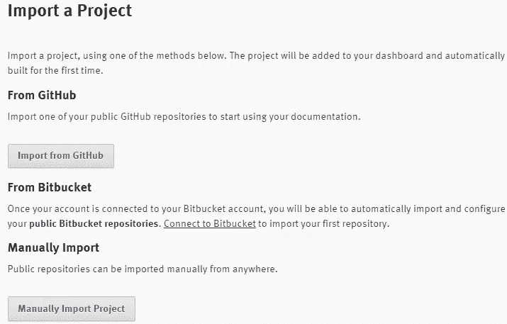
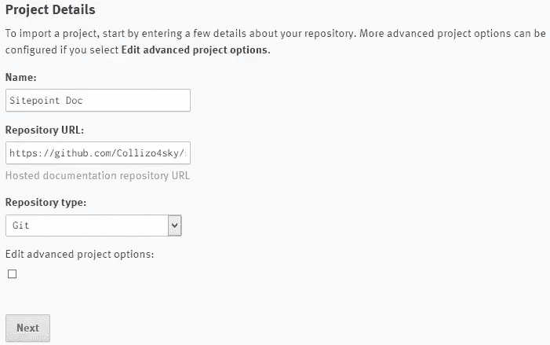
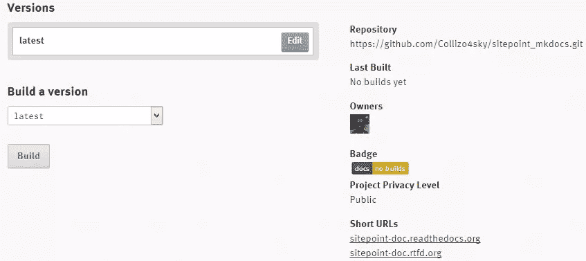

# 使用 MkDocs 构建产品文档

> 原文：<https://www.sitepoint.com/building-product-documentation-mkdocs/>

有一句流行的格言“产品和它的文档一样好”。这对软件和物理产品都适用。

作为一个不擅长前端设计的小型独立开发者，我经常雇佣一个自由职业者来建立我的产品网站——当然，通常包括一个文档部分。

即使对于一个简单的产品来说，建立一个文档部分也要花费相当多的时间和金钱，所以最好不要为每个站点重新发明轮子。还好有办法。

## MkDocs 简介

MkDocs 是一个免费的静态站点生成器，面向构建项目文档。它可以用来生成一个独立的站点，或者只是一个大型站点的文档部分。

因为 MkDocs 生成静态文件，所以您的文档是轻量级的，易于托管——使用 GitHub Pages 和 Read Docs 等免费服务——当然也可以在您自己的服务器上托管。

在本文中，我将介绍 MkDocs，向您展示如何安装它，用它构建文档，最后在 web 服务器上托管生成的文档。

为了了解 MkDocs 生成的文档类型，看看我的 ProfilePress [WordPress 插件文档](http://docs.profilepress.net)，它是用 MkDocs 使用[Read Docs 主题](http://www.mkdocs.org/user-guide/styling-your-docs/#built-in-themes)构建的。

MkDocs 是用 [Python](https://www.python.org/) 写的。文档源文件是用 Markdown 编写的，用一个 YAML 配置文件进行配置。

要使用 MkDocs 构建文档，您需要在本地计算机上安装它。那么接下来让我们来看看如何安装它。

## 安装 Python 和 MkDocs

像 Jekyll(主要用于博客，构建于 Ruby 之上)和 MkDocs 这样的静态站点生成器确实需要一些命令行工具，所以要小心。然而，对于那些不习惯使用命令行的人，我鼓励你继续阅读并尝试一下，因为它并不像看起来那么糟糕！

### 安装 Python 和 pip

要安装 MkDocs，你需要在电脑上安装 [Python](https://www.python.org/downloads/) 和 [pip](https://pip.pypa.io) (一个 Python 包管理器)。它们可能已经安装在您的计算机上。如果你安装了 Python 3.4 或更高版本，你可能已经安装了`pip`。(完整说明见 [Python 安装指南](https://wiki.python.org/moin/BeginnersGuide/Download)。)

要在 Ubuntu 等 Linux 发行版上安装 Python，请查看这个 [stackoverflow 线程](http://stackoverflow.com/questions/12662530/how-to-install-python-3)或者在 Google 上搜索您的发行版。

对于 Windows，下载您的首选版本[安装程序](https://www.python.org/downloads/windows/)并运行该文件来安装 Python。

或者，如果您的机器上安装了 [Chocolatey](https://chocolatey.org/) 包管理器，运行`choco install python`。

要验证您的 Python 发行版是否安装了`pip`，请运行`pip --version`命令。否则，通过`Chocolatey`运行`python get-pip.py`或`choco install pip`安装。

### 安装 MkDocs

现在已经安装了 Python 和 pip，运行`pip install mkdocs`来安装 MkDocs。

为了确认一切正常，运行`mkdocs help`来尝试`mkdocs`命令。

如果你在 Windows 上并且`mkdocs`命令不存在，一定要将`C:\path-to-python-folder\Scripts`添加到`Path`环境变量中。

## 构建文档

既然已经设置了 Python 和 MkDocs，就可以开始处理实际的文档了。

首先，为文档创建一个项目(姑且称之为`sp-doc`)并导航到创建的文件夹:

```
$ mkdocs new sp-doc
$ cd sp-doc
```

生成的项目文件夹将包含一个`docs`文件夹(文档的降价文件将存储在这里)和配置文件`mkdocs.yml`。

下面是目录结构:

```
|-- docs              # MD doc pages
    |-- index.md
|-- mkdocs.yml        # config file 
```

将以下最低配置添加到`mkdocs.yml`文件中:

```
site_name: SitePoint Documentation
site_description: Description of the documentation
theme: readthedocs
pages:
- ['index.md', 'Index']
```

MkDocs 附带了许多[主题](http://www.mkdocs.org/user-guide/styling-your-docs/#built-in-themes)——比如“MkDocs”、“阅读文档”和“引导程序”。假设您打算使用默认主题。在这种情况下，只需将上面代码中的`readthedocs`替换为`mkdocs`。

`pages`配置用于确定应该为文档和导航菜单构建的页面集。

添加到`pages`的降价文件必须相对于`docs`文件夹。例如，如果您在`docs`目录中创建了一个名为`config`的新文件夹，并在其中添加了一个`setup.md`文件，下面是您如何将它添加到`mkdocs.yml`文件配置中的`pages`:

```
site_name: SitePoint Documentation
site_description: Description of the description
theme: readthedocs
pages:
- ['index.md', 'Index']
- ['start.md', 'Get Started']
- ['config/setup.md', 'Configuration', 'Setup']
- ['config/debug.md', 'Configuration', 'Debug']
```

这将创建一些自动出现在我们的文档菜单中的新页面。首先，有一个`start.md`页面，标题是“开始”。

我们还在文档菜单中添加了一个名为“配置”的新部分，在它下面有一个到新的设置和调试页面的链接。

MkDocs 包括一个内置的 web 服务器，因此您可以在本地预览您的文档。

要启动 web 服务器，请确保您位于`mkdocs.yml`配置文件所在的目录中，然后运行`mkdocs serve`命令。

在浏览器中访问`http://127.0.0.1:8000`查看文档:


如果您对已经创建的内容感到满意，运行`mkdocs build`为文档生成静态文件，这些文件将保存到`site`目录。

您可以复制静态文件，并将其托管在您选择的 web 服务器上，以便实时获取文档。

在下一节中，我们将学习如何部署 MkDocs 来[读取 Docs](https://readthedocs.org/) 和 [GitHub 页面](https://pages.github.com)。

## 正在部署 MkDocs

首先，创建一个 GitHub(或 Bitbucket)存储库来存储文件。

运行以下命令部署到 GitHub，其中`https://github.com/Collizo4sky/sitepoint_mkdocs`是我自己的 MkDocs repo:

```
$ git init

$ git remote add origin https://github.com/Collizo4sky/sitepoint_mkdocs.git

$ git add -A

$ git commit -a -m 'the genesis'

git push --set-upstream origin master
```

现在让我们部署文档文件来阅读 Docs，这是一个免费的文档服务。

### 阅读文件

首先，创建一个帐户，如果你没有，然后登录。

点击`Import a Project`按钮或点击`Add project`菜单项。

您可以选择连接您的 GitHub 或 Bitbucket 帐户来阅读文档，以导入您的整个项目。相反，我们将通过点击`Manually Import Project`按钮进行手动导入。



如下图所示填写表单:



从 GitHub 成功导入文档后，您将被重定向到项目页面:



您可以在[http://sitepoint-doc.readthedocs.org/en/latest/](http://sitepoint-doc.readthedocs.org/en/latest/)查看我们生成的文档。

如果您希望文档位于子域上，请将 DNS 中的 CNAME 记录指向您项目的子域。

例如，为了使文档在`docs.sitepoint.com`可用，创建一个指向`sitepoint-doc.readthedocs.org`的 CNAME 记录。


### github pages-github 页面

现在让我们看看如何在 GitHub Pages 上托管我们的文档，这是另一个免费的托管服务。

确保您处于 git 存储库的工作分支——在我们的例子中是`master`分支。

运行命令`mkdocs gh-deploy --clean`

在后台，这个命令将构建您的文档，并将它们提交到`gh-pages`分支，然后将分支推送到 GitHub。


这是我们在 GitHub 页面上的 SitePoint 文档的演示。

### 其他提供商

任何可以提供静态文件的主机提供商都可以用来提供 MkDocs 生成的文档。以下指南应该提供一些一般性的帮助。

当您使用`mkdocs build`命令构建您的站点时，所有的文件都被写入您的`mkdocs.yaml`配置文件中分配给`site_dir`配置选项的目录(默认为“站点”)。

只需将该目录的内容复制到托管提供商服务器的根目录下，就大功告成了。或者，如果您的文档只是网站的一个子部分，请将文件移动到指定的子文件夹中。

## 摘要

在本教程中，我们学习了如何使用 Python 静态网站生成器 MkDocs 构建文档，以及如何在 GitHub 页面和[阅读文档](https://readthedocs.org)上免费部署和托管文档。

*你以前用过 MkDocs 吗？如果没有，你会考虑用吗？您目前如何处理向用户提供文档的问题？我很乐意听到您的反馈或回答您可能有的任何问题。*

## 分享这篇文章