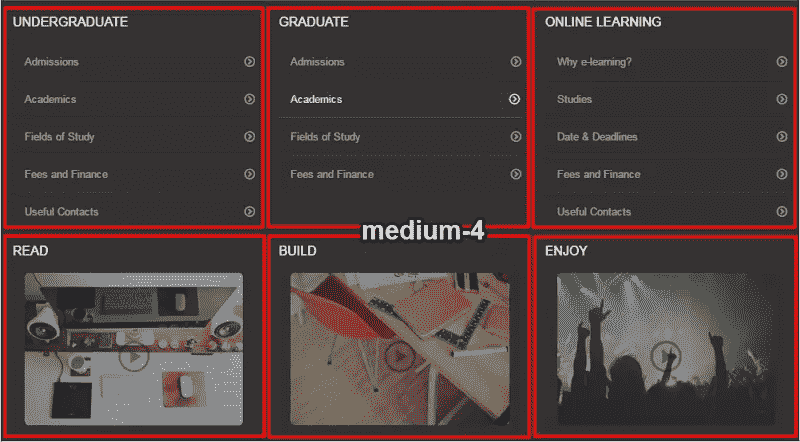

# 用基础建立一个反应灵敏的大菜单

> 原文：<https://www.sitepoint.com/building-responsive-mega-menu-foundation/>

巨型菜单是一种设计趋势，通常用于大型网站，如电子商务和教育网站。例如，[易贝的](http://www.ebay.com/)巨型菜单:


但是什么是超级菜单呢？好吧，让我们看看雅各布·尼尔森是如何描述的:

> 一个巨大的菜单(一个大的二维下拉面板)将导航选项分组，以消除滚动，并使用字体、图标和工具提示来解释用户的选择。

因此，考虑到这一点，本文旨在帮助你理解如何用[基金会](http://foundation.zurb.com/)构建一个简单的**响应式巨型菜单**。我们将一步一步来构建一个功能齐全的版本。请注意，Foundation 不支持巨型菜单，但我们会尽力实现一个基于其预定义样式的易用解决方案。对于更高级和有效的定制，请确保检查/修改相应的 Sass 文件。

如果你想向前看，[最后的演示在这里](http://codepen.io/SitePoint/pen/yNeZzK/)。

## 构建主菜单

在开始创建自定义大菜单之前，让我们首先构建主菜单本身(即“顶部栏”)。下面的截图让你知道它会是什么样子:


如你所见，这里没有发生什么奇特的事情。我们只是利用 Foundation 提供给我们的顶栏组件的[基本代码来构造菜单。在接下来的章节中，我们将为主菜单中的两个不同项目创建一个大菜单:“程序”菜单项和“病历报告”项。事实上，我们将构建这个菜单的两种变体。](http://foundation.zurb.com/docs/components/topbar.html)

下面的代码显示了顶栏的标记:

```
<div class="contain-to-grid">
  <nav class="top-bar" data-topbar role="navigation">
    <ul class="title-area">
      <li class="name">
        <h1><a href="#">Logo</a></h1>
      </li>
      <li class="toggle-topbar menu-icon">
        <a href="#"><span>Menu</span></a>
      </li>
    </ul>
    <section class="top-bar-section">
      <ul class="left">
        <li class="divider"></li>
        <li>
          <a href="#">University</a>
        </li>
        <li class="divider"></li>
        <li class="has-dropdown">
          <a href="#">Programs</a>
          <ul class="dropdown m-menu">
            <li>
              <!-- mega menu here ... -->
            </li>
          </ul>
        </li>
        <li class="divider"></li>
        <!-- more list items here ... -->
      </ul>
    </section>
  </nav>
</div><!-- .contain-to-grid -->
```

注意，我们用一个类`contain-to-grid`将菜单包装在一个`div`元素中。这样，我们的菜单的最大宽度将等于网格宽度，默认情况下是 62.5 雷姆(1000 像素)。如果我们不把菜单放在这个容器中，它的宽度将被设置为视窗宽度。

## 定制大型菜单

此时，我们准备开始关注巨型菜单(我们将给出一个类`m-menu`)。以下是默认样式的外观:


嗯，这不是一个大菜单，是吗？让我们创造一个！首先，我们必须相对于主菜单定位菜单，使它们垂直对齐(在中上屏幕上)并具有相等的宽度(即≤1000 像素)。但是，Foundation 会设置下拉列表相对于其(直接)父级位置的位置。因此，为了避免这种情况，我们修改以下声明:

```
.top-bar-section .has-dropdown {
  position: relative;
}
```

…读作如下:

```
.top-bar-section .has-dropdown {
  position: static;
}
```

然而，在这一点上，我们的巨型菜单有一个小问题:


请注意，小箭头图标(表示下拉菜单)同样相对于主菜单定位。我们可以通过添加一个新的 CSS 声明来解决这个问题:

```
.top-bar-section .has-dropdown > a {
  position: relative;
}
```

以下是巨型菜单的新状态:


我们几乎完成了初始定制。我们要做的最后一件事是修复在调整浏览器窗口大小时出现的不一致。为此，我们将更改以下 CSS:

```
.top-bar-section .has-dropdown.moved {
  position: relative;
}

.top-bar-section .has-dropdown.moved > a:after {
  display: none;
}
```

致以下内容:

```
.top-bar-section .has-dropdown.moved {
  position: static;
}

.top-bar-section .has-dropdown.moved > a:after {
  display: block;
}
```

这样，我们就成功定位了菜单，可以进入下一步了！

注意:我们可以使用 JavaScript 来定位和设置菜单的宽度。但是对于这个例子，我们只对纯 CSS 解决方案感兴趣。

## 向大型菜单添加内容

在这下一步，我们的目标是原型的菜单布局，然后我们将添加内容。下面的屏幕截图显示了在中等尺寸和更大尺寸(≥641 像素)的屏幕上打开“程序”菜单项时出现的大菜单:



注意，这个菜单由两行组成，每行包含三个大小相等的列(使用`.medium-4`类)。

下面是必需的标记:

```
<div class="row">
  <div class="medium-4 column">
    <h3>Undergraduate</h3>
    <ul>
      <li>
        <a href="#"><i class="icon-circle-right"></i>Admissions</a>
      </li>
      <li>
        <a href="#"><i class="icon-circle-right"></i>Academics</a>
      </li>
      <!-- more list items here ... -->
    </ul>
  </div><!-- .medium-4 .column-->
  <div class="medium-4 column">
    <h3>Graduate</h3>
    <ul>
      <!-- list items here ... -->
    </ul>
  </div><!-- .medium-4 .column-->
  <div class="medium-4 column">
    <!-- content here ... -->
  </div><!-- .medium-4 .column-->
</div><!-- .row -->
<div class="row">
  <!-- content here ... -->
</div><!-- .row -->
```

现在让我们来看看打开“病历报告”菜单项时出现的大菜单:


在这个实例中，我们有一行和该行中两个等宽的列(使用`.medium-6`类)。

下面是我们将使用的标记:

```
<div class="row">
  <div class="medium-6 column show-for-medium-up">
    
    <div class="info-wrap">
      <div class="info info-visible">
        <h3>Select your program...</h3>
        <p>More info...</p>
      </div>
      <div class="info">
        <h3>Undergraduate Studies</h3>
        <p>At vero eos et accusamus et iusto odio dignissimos ducimus qui 
        blanditiis praesentium voluptatum deleniti atque corrupti quos dolores 
        et quas molestias excepturi sint occaecati cupiditate non provident.</p>
      </div>
      <!-- more items here... -->
    </div><!-- .info-wrap -->

  </div><!--end of .column-->
  <div class="medium-6 column">
    <h3>Programs</h3>
    <ul class="is-hover">
      <li><a href="#"><i class="icon-circle-right"></i>Undergraduate</a></li>
      <li><a href="#"><i class="icon-circle-right"></i>Graduate</a></li>
      <li><a href="#"><i class="icon-circle-right"></i>Internships</a></li>
      <li><a href="#"><i class="icon-circle-right"></i>Other</a></li>
      <li><a href="#"><i class="icon-circle-right"></i>Contact</a></li>
    </ul>
  </div><!--end of .column-->
</div><!--end of .row-->
```

注意带有`.info-wrap`和`is-hover`类的元素的结构。我们将在下一节中引用这些元素。

## 让事情充满活力

在本例中，当用户将鼠标悬停在特定部分的链接上时，我们将换入和换出菜单中的一些内容。这可能不是对用户最友好的方式，但它展示了当它被显示时，在大菜单中可以做什么。

在我们的 HTML 中，如上所示，我们有一系列信息框，对应于不同的“程序”链接:

```
<div class="info-wrap">
  <div class="info info-visible">
    <h3>Select your program...</h3>
    <p>More info...</p>
  </div>
  <div class="info">
    <h3>Undergraduate Studies</h3>
    <p>At vero eos et accusamus et iusto odio dignissimos ducimus qui 
    blanditiis praesentium voluptatum deleniti atque corrupti quos dolores 
    et quas molestias excepturi sint occaecati cupiditate non provident.</p>
  </div>
  <!-- 4 more "info" items here... -->
</div>
```

所有的链接都包装在一个类为`.info-wrap`的元素中。在 CSS 中，我们默认隐藏除第一个项目之外的所有项目，然后我们可以通过在不同的`.info`元素上添加和移除`.info-visible`类来换入正确的对应项目。

下面是我们实现这一点的 jQuery:

```
$('.is-hover a').on('mouseover', function () {
  var idx = $(this).parent().index() + 2;
  $('.info:nth-child(' + idx + ')').addClass('info-visible');
  $('.info:nth-child(' + idx + ')').siblings().removeClass('info-visible');
});

$('.dropdown').on('mouseout', function () {
  $('.info:nth-child(1)').addClass('info-visible')
                         .siblings().removeClass('info-visible');
});
```

当用户打开“研究”大菜单，然后将鼠标悬停在其中一个“程序”链接上时，上面的代码被触发。将变量`idx`的值调整为“2 ”,以考虑额外的初始可见的`.info`元素，以及 jQuery 的 CSS 选择器中的索引不是从零开始的这一事实。我们还确保当用户将鼠标从大菜单上移开时，默认信息框是唯一显示的信息框。

一旦就位，我们的大菜单就完整且功能齐全了。这是 CodePen 上的嵌入式演示:

参见 [CodePen](http://codepen.io) 上 SitePoint ( [@SitePoint](http://codepen.io/SitePoint) )的 Pen [Mega Menu 下拉与基础 5](http://codepen.io/SitePoint/pen/yNeZzK/) 。