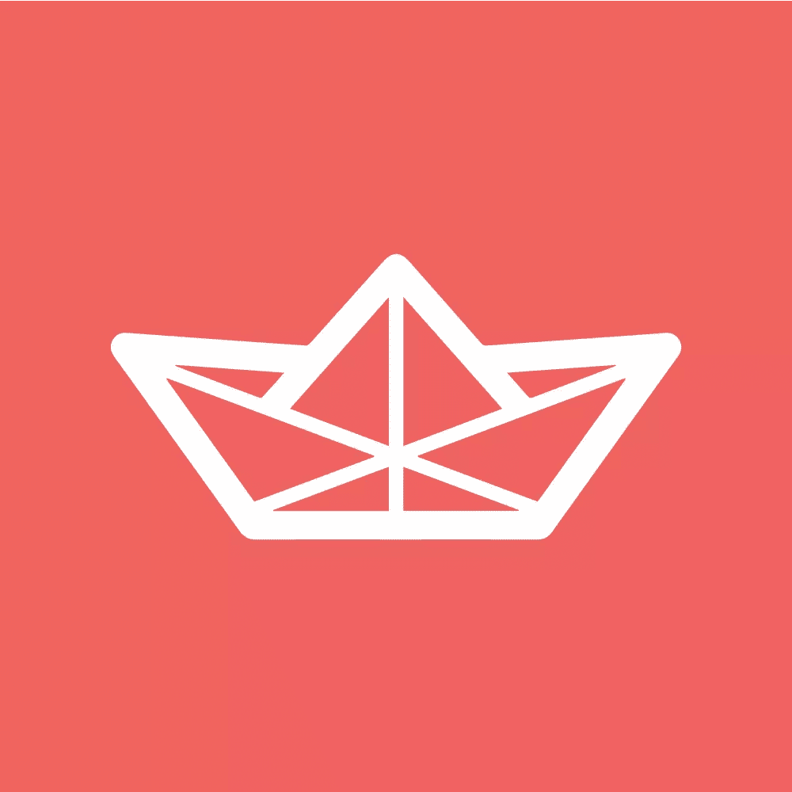
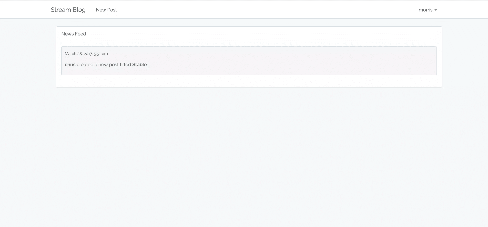
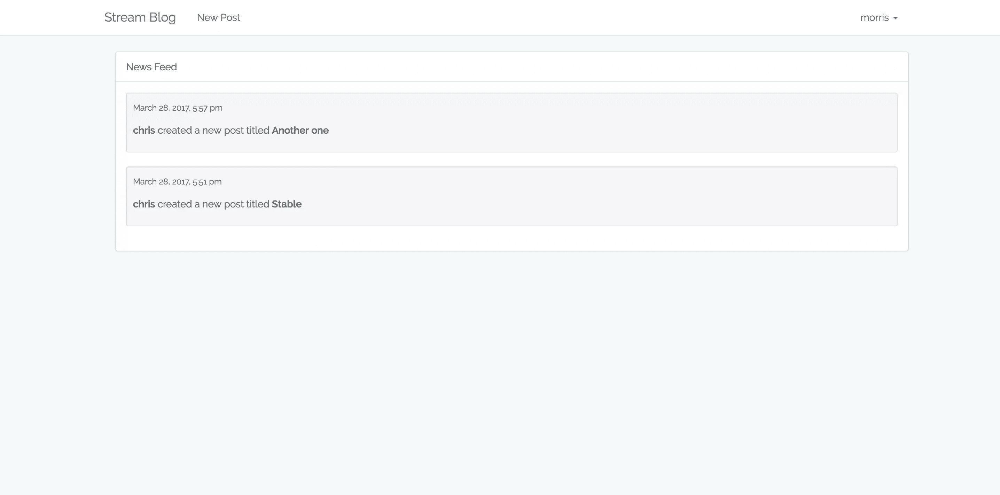
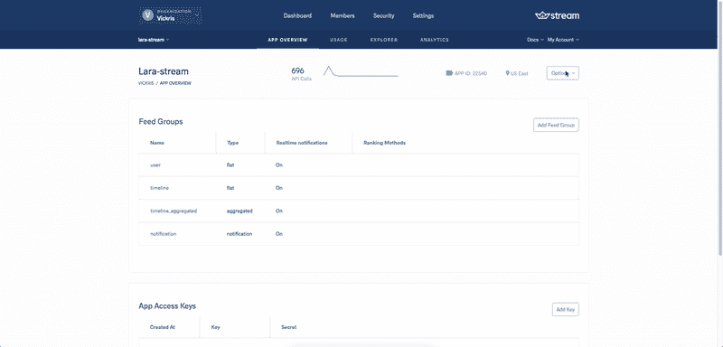
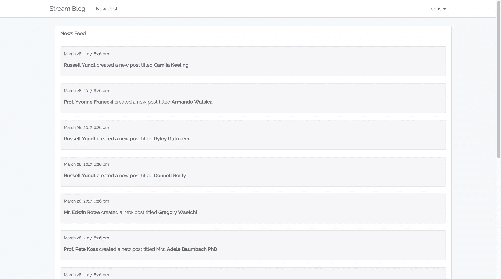
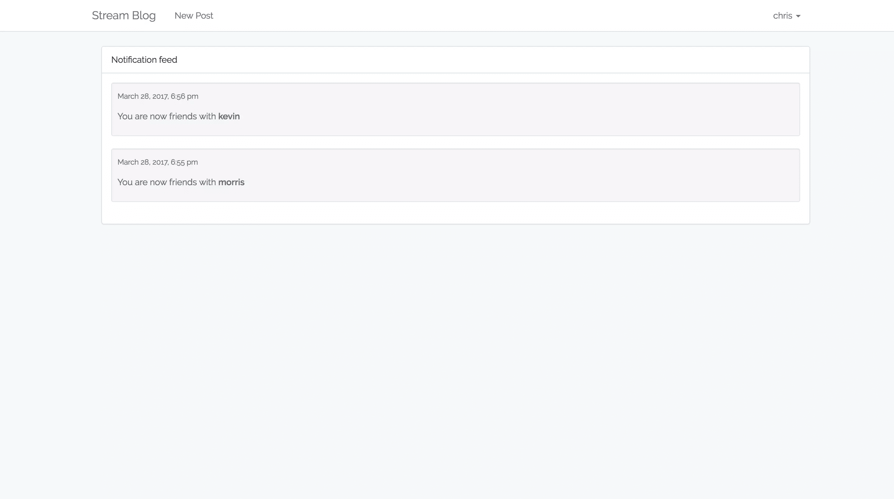
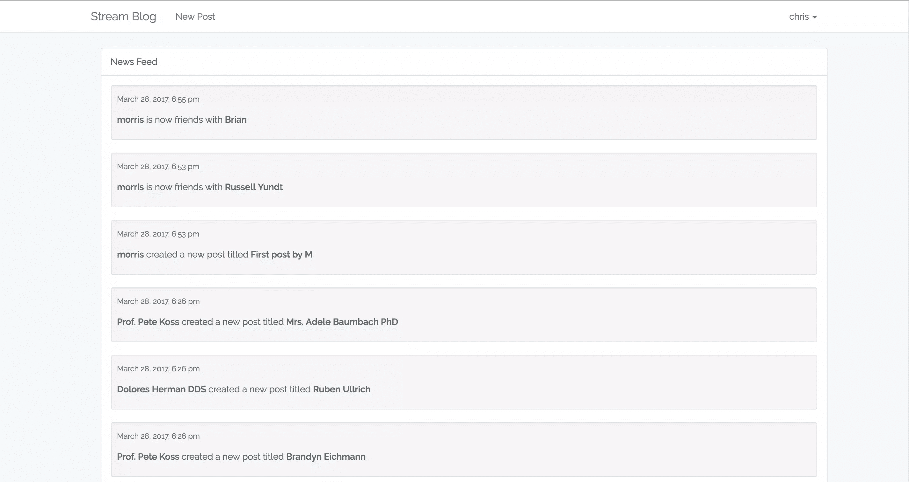

# 用 Laravel 和 Stream 建立社交网络？轻松点。

> 原文：<https://www.sitepoint.com/building-social-network-laravel-stream-easy/>

在[之前的帖子](https://www.sitepoint.com/real-time-laravel-notifications-follows-sure-stream/)中，我们看到了如何将*跟随*功能添加到[的 Laravel](https://www.sitepoint.com/blog/) 应用中。我们还看了如何配置我们的应用程序来使用[流](http://getstream.io)。这一部分将侧重于:

*   配置我们的模型，以便能够跟踪活动。
*   Stream 提供的不同类型的提要。
*   从流中获取源。
*   在视图中呈现不同类型的提要。



## 活动字段

当使用 Stream 时，模型作为活动存储在提要中。一个活动至少由以下数据字段组成:`actor`、`verb`、`object`、`time`。如果需要，您还可以添加更多自定义数据。

*   **对象**是对模型实例本身的引用
*   **actor** 是对实例的用户属性的引用
*   **动词**是类名的字符串表示

让我们在`Post`模型中定义活动动词:

```
[...]
class Post extends Model
{
    [...]
    /**
    * Stream: Change activity verb to 'created':
    */
    public function activityVerb()
    {
        return 'created';
    }
} 
```

## 提要管理器

我们将利用`FeedManager`使我们的应用程序变得生动。Stream Laravel 附带了一个`FeedManager`类，用于帮助所有常见的 feed 操作。我们可以获得一个带有`FeedManager`的管理器实例，我们在前面的`config/app.php`文件中将它设置为门面别名。

## 预捆绑的订阅源

为了让我们开始，经理已经预先配置了提要。如果我们的应用程序需要，我们还可以添加更多的提要。三种饲料分为三类:`User Feed`、`News Feed`、`Notification Feed`。例如，`User feed`存储用户的所有活动。让我们把它看作是我们个人的脸书页面。我们可以很容易地从经理那里获得这些信息。

然而，对于这个应用程序，我们更感兴趣的是获得由我们关注的人创建的帖子的通知以及新关注者的通知，因此我们将只坚持使用`News Feed`和`Notification Feed`。欲了解更多关于其他类型的提要以及如何使用它们的信息，请访问[此链接](https://github.com/GetStream/stream-laravel#pre-bundled-feeds)。

## 关注/取消关注功能–使用 FeedManager

我们需要更新`FollowController`中的`follow`和`unfollow`方法，以记录`FeedManager`:

*app/Http/Controllers/follow controller . PHP*

```
[...]
public function follow(User $user)
{
    if (!Auth::user()->isFollowing($user->id)) {
        // Create a new follow instance for the authenticated user
        Auth::user()->follows()->create([
            'target_id' => $user->id,
        ]);
        \FeedManager::followUser(Auth::id(), $user->id);

        return back()->with('success', 'You are now friends with '. $user->name);
    } else {
        return back()->with('error', 'You are already following this person');
    }

}

public function unfollow(User $user)
{
    if (Auth::user()->isFollowing($user->id)) {
        $follow = Auth::user()->follows()->where('target_id', $user->id)->first();
        \FeedManager::unfollowUser(Auth::id(), $follow->target_id);
        $follow->delete();

        return back()->with('success', 'You are no longer friends with '. $user->name);
    } else {
        return back()->with('error', 'You are not following this person');
    }
}
[...] 
```

`follow`方法中的这段代码让当前用户的`timeline`和`timeline_aggregated`订阅源跟随另一个用户的个人订阅源。在 unfollow 方法中，我们取消订阅另一个用户的个人提要。

## 显示不同类型的提要

为了显示不同类型的提要，让我们从创建一个`FeedsController`开始:

```
php artisan make:controller FeedsController 
```

当从提要中读取数据时，活动返回的格式不适合在我们的视图中使用。例如，创建后活动将如下所示:

`{'actor': 'User:1', 'verb': 'created', 'object': 'Post:1'}`

这远远不能用于我们的模板。我们将从数据库加载引用的过程称为 *enrichment* 。在视图中显示它们之前，我们将丰富我们的活动。

### 新闻提要

让我们在这个控制器中创建一个`newsFeed`方法来获取这种类型的提要。我们还应该在这个控制器中创建一个私有方法，负责实例化`Enricher class`:

```
[...]
use GetStream\StreamLaravel\Enrich;
[...]
class FeedsController extends Controller
{
    public function newsFeed(Request $request)
    {
        // Timeline feed:
        $feed = \FeedManager::getNewsFeeds($request->user()->id)['timeline'];

        //  get 25 most recent activities from the timeline feed:
        $activities = $feed->getActivities(0,25)['results'];
        $activities = $this->enrich()->enrichActivities($activities);

        return view('feed.newsfeed', [
            'activities' => $activities,
        ]);
    }

    private function enrich()
    {
        return new Enrich;
    }
} 
```

在上面的代码块中，我们从`FeedManager` ( *中调用了`getNewsFeeds`方法，指定我们想要获取的格式很重要。在我们的例子中，我们想要时间轴格式的提要*。之后，我们从提要中获取 25 个最近的活动，然后丰富它们。这些活动应该显示在我们即将创建的`newsfeed`视图中。

接下来，让我们创建一个映射到`newsFeed`方法的路由，当它被访问时，将把我们带到一个带有新闻提要的视图。这个路由也属于带有`auth`中间件的路由组，因为用户必须经过身份验证才能加载提要:

```
[...]
Route::group(['middleware' => ['auth']], function () {
    [...]
    Route::get('/feed', 'FeedsController@newsFeed');
});
[...] 
```

### 模板

我们现在可以在视图中呈现丰富的活动:

*resources/views/feed/news feed . blade . PHP*

```
@extends('layouts.app')

@section('content')
    <div class="container">
        @if ($activities)
            <div class="panel panel-default">
                <div class="panel-heading">
                    News Feed
                </div>

                <div class="panel-body">
                    @foreach ($activities as $activity)
                        @include('stream-laravel::render_activity', array('activity'=>$activity))
                    @endforeach
                </div>
            </div>
        @else
        <p>You are not following anyone.Follow other users <a href="/users">here</a> in order to see their activities</p>
        @endif
    </div>
@endsection 
```

`stream-laravel::render_activity`视图标签将使用活动作为上下文来呈现视图`activity.$activity["verb"]`视图。为了让事情顺利进行，我们需要在视图中创建一个活动文件夹。这样做之后，我们可以为后期创建活动创建一个分部。分部的名称应该对应于活动动词:

*resources/views/activity/created . blade . PHP*

```
<div class="well well-sm">
    <p>{{ date('F j, Y, g:i a', strtotime($activity['time'])) }}</p>

    <p><strong>{{ $activity['actor']['name'] }}</strong> created a new post titled <strong>{{ $activity['object']['title'] }}</strong></p>
</div> 
```

通过访问 URL `\feed`，我们应该能够看到我们的新闻提要。最初，我们会看到文本“你没有关注任何人”，因为我们在测试基于关注状态的不同按钮变体时，尚未将 Stream 集成到我们的应用程序中。还要注意，如果我们没有从 stream dashboard 中删除第一个活动，页面将会报错缺少`[.app.\user]`视图。

让我们继续从我们的帐户创建一个新帖子。如果我们从不同的帐户关注我们自己，这个帖子创建活动应该显示在另一个帐户的 feed 中，如下所示:



从上面的截图来看，如果名为`chris`的用户创建了另一个帖子，来自`chris`的新帖子创建活动将显示在`morris'` feed 上:



或者，我们可以从 Stream 的仪表板中截取应用程序中的数据，然后用种子数据再次预填充我们的数据库，而不是创建新的帐户和帖子来测试这种行为。下面的 gif 说明了如何截断数据:



当我们这一次播种我们的数据库时，创建后的活动将被记录在流中:

```
php artisan migrate:refresh --seed 
```

然后，我们可以跟踪在播种数据库时创建的一些用户。如果我们现在访问 URL `\feed`，我们将看到他们的活动:



目前，我们只能收到由我们关注的人创建的新帖子的通知。我们还希望这样做，以便我们获得新的关注通知。

### 通知源

为此，让我们首先更新我们的`Follow`模型，以记录以下活动

*app/Follow.php*

```
class Follow extends Model
{
    use \GetStream\StreamLaravel\Eloquent\ActivityTrait;

    [...]
    public function target()
    {
        return $this->belongsTo(User::class);
    }

    public function activityNotify()
    {
        $targetFeed = \FeedManager::getNotificationFeed($this->target_id);
        return array($targetFeed);
    }

    public function activityVerb()
    {
        return 'follow';
    }

    public function activityExtraData()
    {
        return array('followed' => $this->target, 'follower' => $this->user);
    } 
```

`activityNotify`方法用于构建通知提要。这种类型的提要对于通知某些用户某个操作非常有用。在我们的例子中，我们通知用户有人跟踪了他们。`activityExtraData()`方法让我们存储比基本字段更多的数据。在我们的例子中，我们希望存储新关注的目标以及关注该目标的人。

让我们继续创建控制器操作、路由和视图来显示通知提要:

*app/Http/控制器/feedController*

```
[...]
class FeedsController extends Controllers
{
    [...]
    public function notification(Request $request)
    {
        //Notification feed:
        $feed = \FeedManager::getNotificationFeed($request->user()->id);
        $activities = $feed->getActivities(0,25)['results'];
        $activities = $this->enrich()->enrichActivities($activities);

        return view('feed.notifications', [
            'activities' => $activities,
        ]);
    }
} 
```

我们获取这个提要的方式与获取新闻提要的方式相同，唯一的不同是我们在`FeedManager`上调用了`getNotificationFeed`方法，而不是`getNewsFeeds`方法。

现在让我们创建到这个控制器动作的路由映射:

```
Route::group(['middleware' => 'auth'], function () {
    [...]
    Route::get('/notifications', 'FeedsController@notification');
}); 
```

### 模板

在显示通知提要时，我们将遵循与显示新闻提要时相同的过程，即使用我们想要显示的信息创建一个部分，然后在视图中呈现该部分。我们将从创建视图开始:

*资源/视图/提要/通知. blade.php*

```
@extends('layouts.app')

@section('content')
    <div class="container">
        @if ($activities)
            <div class="panel panel-default">
                <div class="panel-heading">
                    Notification feed
                </div>

                <div class="panel-body">
                    @foreach ($activities as $activity)
                        @foreach ($activity['activities'] as $activity)
                            @include('stream-laravel::render_activity', array('aggregated_activity'=>$activity, 'prefix'=>'notification'))
                        @endforeach
                    @endforeach
                </div>
            </div>
        @else
        <p>You don't have any follow activities</p>
        @endif
    </div>
@endsection 
```

注意，我们必须在视图中深入两层才能访问通知提要。这是因为我们在调用`getNotificationFeed`方法后得到的数据格式。另外，请注意，呈现分部的代码行有一个前缀`key`，其值被设置为`notification`。让我解释一下这是怎么回事。对于这个应用程序，我们希望同一个活动，即后续活动，两个不同的模板。为了用 Stream 实现这一点，我们发送第三个参数来改变视图选择。在这种情况下，我们将在*活动*文件夹中创建一个名为`notification_follow.blade.php`的分部:

*resources/views/activity/notification _ follow . blade . PHP*

```
<div class="well well-sm">
    <p>{{ date('F j, Y, g:i a', strtotime($activity['time'])) }}</p>
    <p>You are now friends with <strong>{{ $activity['follower']['name'] }}</strong></p>
</div> 
```

如果我们访问`/notifications` URL，我们应该会看到我们收到的每个关注的提要以及关注我们的人的姓名:



从截图上看，莫里斯和凯文都跟着我。

我们还希望后续活动的提要显示在我们的`NewsFeed`页面中。但是，在展示这个的时候，我们想说谁和谁成了朋友。这就是我们必须为后续活动想出不同部分的原因。关于模板的更多信息可以在 [Streams GitHub 页面](https://github.com/GetStream/stream-laravel)获得:

*资源/视图/活动/跟随. blade.php*

```
<div class="well well-sm">
    <p>{{ date('F j, Y, g:i a', strtotime($activity['time'])) }}</p>
    <p><strong>{{ $activity['actor']['name'] }}</strong> is now friends with <strong>{{ $activity['followed']['name'] }}</strong></p>
</div> 
```

现在让我们访问`/feed`网址。下列活动也应该出现:



为了使导航更容易，我们可以在`New Post`链接旁边的导航栏中添加链接来访问新闻提要和通知提要:

*资源/视图/布局/app.blade.php*

```
<ul class="nav navbar-nav">

    <li><a href="{{ url('/posts/create') }}">New Post</a></li>
    <li><a href="{{ url('/users') }}">Users</a></li>
    <li><a href="{{ url('/feed') }}">News Feed</a></li>
    <li><a href="{{ url('/notifications') }}">Notification Feed</a></li>
</ul> 
```

## 结论

与从头开始编写逻辑相比，Stream 使向任何应用程序添加提要变得极其容易。

我们可以跟踪应用程序中的任何东西，甚至是对帖子的喜欢或评论。我将把它作为家庭作业，这样你就可以开始使用 API 了。Stream 还为不使用 Laravel 的 PHP 项目提供了底层 API 访问。更多关于如何直接使用低级 PHP 客户端 API 的信息可以在[这里](https://getstream.io/docs/php/)找到。

如果你觉得这个教程有帮助，请点击“喜欢”按钮，不要忘记与你的朋友和同事分享！

## 分享这篇文章