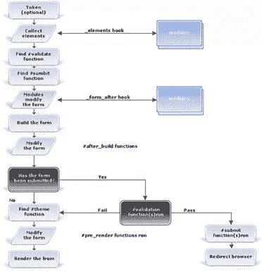

# 保护你的 Drupal 网站

> 原文：<https://www.sitepoint.com/bulletproof-your-drupal-website/>

> 当你偷钱或货物时，有人会注意到它不见了。当你窃取信息时，大多数时候没有人会注意到，因为信息仍然在他们手中。”–**凯文·米特尼克**《欺骗的艺术》，2003 年。

这是一个最坏的情况:一个晴朗的早晨，你发现你的网站已经或正在被攻击。当然，安全性被破坏，用户名、密码、电子邮件(有时三者都有)……简而言之，敏感信息被泄露，让外人登录你的银行账户，做各种各样的坏事，比如让你的网站转发垃圾邮件，或者把它变成一个恶意软件巢穴，感染数千台其他来访的计算机。

大量网站缺乏安全配置是事实。对于一个用 Drupal 构建的站点，贡献(或定制)模块中的逻辑/编程漏洞会使它变得更糟。问题是，追踪攻击者可能使用的所有漏洞是一项非常艰巨的任务。这个清单非常庞大，而且还在增长。

我将帮助您覆盖最基本、最常见和最重要的漏洞。这些步骤将通过检查和发现弱点并解决它们来帮助您保护您的 Drupal 站点。稍后，我们还将了解一些增加额外保护的步骤。

我应该指出，我假设您熟悉 Drupal 基础知识。可以在 Drupal 文档中找到对所用术语的解释。这将使我能够集中精力解释所涉及的概念。

## Drupal 漏洞

### 不安全的配置

默认情况下，Drupal core 非常安全，但是如果配置错误，漏洞可能会在不知不觉中打开。有多少用户就有多少最佳实践，但是某些设置在安全的 Drupal 环境中是常见的。

从限制匿名用户的访问和权限开始，包括帐户创建。这将阻止垃圾邮件发送者和谷歌链接劫持者。一些垃圾邮件发送者的目标是创建帐户，而其他人则从您的网站发布链接到他们自己的网站，以获得更好的搜索引擎排名。

匿名用户用自动程序(bots)创建虚假账户，在 Drupal 设置中，攻击者可以自由创建账户，因为 Drupal 只区分经过认证的用户和未经认证的用户。创建帐户的未经身份验证(或匿名)的用户实际上获得了特权。

接下来，禁止匿名发布任何内容。权宜之计将阻止机器人找到你的网站，这意味着没有垃圾邮件内容泛滥。因此，创建内容或上传必须得到一些检查或验证。

对上传和文件类型进行限制。Drupal 可以设置允许的文件类型，所以不需要上传 PHP 代码。它们可能在服务器上执行，也可能是可执行的恶意软件、有害的动态内容等。禁止上传脚本和可执行文件极大地保护了网站。

必须遏制错误报告。Drupal 代码有时会导致错误，默认情况下，Drupal 会将其记录在内部错误日志中。同样的内容也会显示在屏幕上，但这仅在开发环境中需要。对程序员有用的东西对最终用户完全没用。此外，调试消息包含重要的配置信息，攻击者可以很好地利用这些信息。这就是*信息泄露漏洞*。

### 跨站点脚本

XSS 代码在浏览器内部执行。代码可以是 JavaScript，Flash 或类似的东西。XSS 使用您的会话 cookies 来获取您的所有信息。访问运行恶意 XSS 代码的页面可能会导致新的内容发布，不知不觉地与其他网站的用户成为朋友，投票，最令人恼火的是，改变自己的管理权限！

识别 XSS 主要涉及识别 JavaScript 漏洞。然而，其他人也不容忽视。做到这一点的诀窍是使用一个 *JavaScript 警告框*。当它弹出时，很难错过，尤其是当警报是特定的，并且特定于代码注入的位置时。这有助于追溯。

你可以用这两个字符串，发布到信息中，然后浏览你的网站。`">`有助于发现代码是否有 HTML 属性。这将弹出一个 JavaScript 框，显示一条来自博客节点标题字段的消息。转到页面的 HTML，找到 JavaScript 泄漏的地方，并回溯到代码，添加一个合适的过滤函数。

`"><script>alert('blog-node-title');</script>`

`">`

Drupal 也允许改变配置来对抗 XSS。为此，您不能使用 PHP 输入类型。Drupal 有三种默认格式(全 HTML、过滤 HTML 和 PHP ),用户在填写 web 表单时可以使用。到目前为止，过滤 HTML 是最安全的，应该尽可能地使用它来去除恶意的 HTML 代码(例如，JavaScript)。

这将确保安全抵御 XSS ( *跨站脚本*)和 CSRF ( *跨站请求伪造*)攻击。虽然 PHP input-type 允许用户将 PHP 直接编写到现有内容中，并允许服务器进行评估，但这也吸引了攻击者。如果有需要，启用权限，直到它制作完成。简而言之，不使用时必须保持禁用状态。

### 跨站点请求伪造



Drupal *Form API* 对 CSRF 进行保护。它使用不断更新的特殊令牌(在表单中)。有了一个使用*表单 API* 处理所有数据修改请求的模块，并正确遵循*表单 API 文档*，CSRF 制造麻烦的可能性就很小了。对于好的代码，参见*表单 API 文档*。易受 CSRF 攻击的菜单回调很容易通过给每个菜单回调添加`confirm_form()`(确认表单)来处理。Drupal 完成剩下的工作。

除了禁用 PHP input-type 之外，您还可以使用这个技巧，直接利用 Drupal 中的令牌生成。它包括添加一个令牌；添加的令牌将与后续操作的请求一起返回，并在采取操作之前进行验证。令牌被添加到`security_review_reviewed`函数链接中，然后在`security_review_toggle_check` 中进行检查。

令牌是添加到请求中的特殊参数。它告诉 Drupal，它为查看站点的特定用户生成了一个链接。Drupal 将标记添加到它生成的每个表单中，为开发人员提供了无形的保护。

```
$token = drupal_get_token($check['reviewcheck']);
$link_options = array(
'query' => array('token' => $token),
'attributes' => array('class' => 'sec-rev-dyn'),
);
```

```
if (!drupal_valid_token($_GET['token'], $check_name)) {
return drupal_access_denied();
}
```

然而，为了在 Drupal 贡献的模块中处理 CSRF(例如像``这样的链接)，*表单确认*以及*表单令牌*是至关重要的。这些问*你确定要删除这个项目吗？*针对 Drupal 核心和模块。

因此，底线是在手动生成链接和表单时使用令牌保护是明智的。

### SQL 注入和数据库 API

数据库查询中不太可信的数据(例如，提要、用户输入、一些其他数据库等。)一定不能直接使用。如果你用这样的东西，你就有可能被烤熟:

`index.php?id=12mysql_query("UPDATE mytable SET value = '". $value ."' WHERE id = ".  $_GET['id']);`

或者，比方说，当您将两个数据字符串组合成一个单独的字符串(连接)直接进入 SQL 查询时。举个例子，

```
<?php
db_query('SELECT FROM {table} t WHERE t.name = '. $_GET['user']);
?>
```

为了对抗 SQL 注入，使用 Drupal 函数并将用户输入作为参数传递。事情是这样的:

`db_query("UPDATE {mytable} SET value = :valueWHERE id = :id", array(  ':value' => $value,  ':id' => $id);`

此外，使用数据库抽象层有助于抵御攻击；此外，在`db_query`中，它使用了适当的参数替换。

```
<?php
db_query("SELECT foo FROM {table} t WHERE t.name = '%s' ", $_GET['user']);
?>
```

为了在 SQL 中容纳可变数量的参数，创建一个占位符数组会有所帮助。因此，与其说:

```
<?php
db_query("SELECT t.s FROM {table} t WHERE t.field IN (%s)", $from_user);
?>
```

最好这样写:

```
<?php
$placeholders = implode(',', array_fill(0, count($from_user), "%d"));
db_query("SELECT t.s FROM {table} t WHERE t.field IN ($placeholders)", $from_user);
?>
```

使用带有引用节点(或`{node}table`)的 SQL 语句的`db_rewrite_sql()`函数调用将停止违反*节点访问限制*。它是使 Drupal 访问其节点的机制的绝对要求；任何违反，它是外来者获得进入被禁止的节点。事情是这样的:

```
<?php
$result = db_query(db_rewrite_sql("SELECT n.nid, n.title FROM {node} n"));
?>
```

## 摘要

这是一个关于让 Drupal 用户抓狂的各种漏洞的速成班，但是任何经历过这种困境的人都会知道，我们已经讨论了三个最重要的问题，即 XSS、CSRF 和 SQL 注入，如果正确遵循 Drupal 配置方面的建议，前两个问题很容易解决。

请在评论中告诉我你对 Drupal 安全性的体验，以及你是否想从我这里看到更多关于这个话题的内容。

## 分享这篇文章