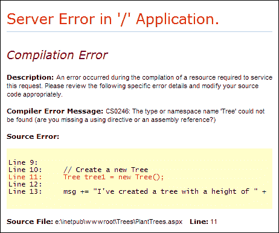
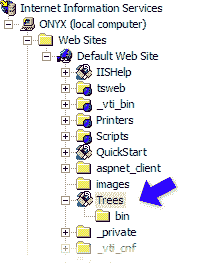
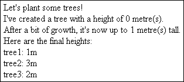
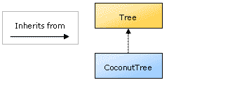
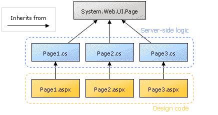

# 面向 ASP.NET 开发者的面向对象 C#

> 原文：<https://www.sitepoint.com/c-asp-net-developers/>

曾经有一段时间，任何具备 JavaScript 基础知识的 Web 开发人员都可以在几个小时内掌握 ASP Web 开发的基本知识。随着 ASP.NET，微软最新的网络应用程序开发平台，门槛已经提高。虽然更整洁，通常对开发人员更友好，但真实世界的 ASP.NET 开发需要一项 ASP 没有的重要技能:面向对象编程(OOP)。

用于编写 ASP 脚本的两种最流行的语言，VBScript 和 JScript，已经用 OOP 特性进行了改进，成为 VB.NET 和 JScript.NET。此外，微软还推出了一种全新的编程语言 C# (C-sharp)。不受从非面向对象遗留下来的笨拙语法的阻碍，C#可以说是最干净、最有效的。NET 在今天被广泛使用。

在本文中，我将向您介绍 C#的面向对象特性，因为它们适用于 ASP.NET Web 开发。到最后，你应该已经很好地理解了 OOP 是什么，以及为什么它是 ASP.NET 如此强大和重要的一个方面。如果你是一个经验丰富的面向对象编程专家(例如，如果你有一些 Java 经验)，你可能想绕过所有的理论，直接跳到关于[代码隐藏页面](http://www.webmasterbase.com/article.php?pid=217&aid=853)的部分。

本文是 ASP.NET 系列文章的第三篇。如果你是 ASP.NET Web 开发的新手，并且没有读过我以前的文章，在继续之前，请查看一下[ASP.NET 入门](http://webmasterbase.com/article/781)和[ASP.NET 表单处理基础](http://webmasterbase.com/article/815)。

由于 C#是一种与 Java 非常相似的语言，所以本文的大部分内容都基于我的两部分系列文章“Java 中的面向对象概念”。因此，请接受我的道歉，如果一些例子对长期读者来说似乎非常熟悉。

##### 基本术语

写作。NET 应用程序(无论是 Windows 桌面应用程序还是 ASP.NET 网络应用程序)都是关于构建一个由相互关联的软件组件组成的网络，这些组件协同工作来完成工作。这些组件被称为*对象*。

有许多不同种类的对象，事实上在。NET 正在创建你自己的对象类型。创建可在中使用的新类型的对象。NET 程序，你必须提供一个蓝图。NET 将用于创建这种类型的新对象。这个蓝图被称为*级*。

让我们来看一个概念性的例子来帮助这些想法站稳脚跟。假设您在国家林业委员会工作，您的网站需要跟踪森林中的一组树木；具体来说，假设它需要记录这些树的高度。图 1 显示了作为一名在这个站点工作的 ASP.NET 程序员，您可能创建的类和对象的一个例子。

左边是一个名为 Tree 的类。这个类定义了一种类型的对象——树，它将作为创建所有树对象的蓝图。类本身不是树；它仅仅是对一棵树是什么的描述，或者所有树的共同点。在这个例子中，我们的树类表明所有的树都有一个名为“height”的属性。

在右边，我们有两个实际的树对象。这些*是*树，它们是基于 Tree 类提供的蓝图创建的。这些对象被称为树类的*实例*，创建它们的过程被称为*实例化*。因此，我们可以说，通过两次实例化 Tree 类，我们已经创建了 Tree 类的两个实例，两个基于 Tree 类的对象，或者只是两棵树。请注意，在创建这些对象时，我们已经为它们的 height 属性赋值。第一棵树高 2 米，第二棵树高 5 米。尽管这些属性的值不同，但这不会改变两个对象都是树的事实。它们只是不同高度的树。

类不仅仅定义对象的属性；它们还定义了那些对象可以执行的*操作*。在 C#等面向对象语言中，这样的操作被称为*方法*。继续我们的树示例，我们可以在树类中定义一个名为“Grow”的方法。这样做的结果是，每个树对象都能够执行类中定义的增长操作。例如，对树执行增长操作可能会使树的高度属性增加一米。

##### C#树

对于我们对面向对象编程的第一次尝试，我建议用 C#实现上面讨论的 Tree 类，然后编写一个 ASP.NET 页面，用它来实例化几棵树，并使它们稍微生长。

打开您选择的文本编辑器，创建一个名为`Tree.cs`的新文本文件。这个文件将包含树类的定义。键入以下内容(行号仅为您提供方便，不应作为代码的一部分键入):

```
1  /**   

2   * Tree.cs   

3   * A simple C# class.   

4   */   

5   

6  public class Tree {
```

第 1-4 行只是一个介绍性的注释(`/*`标记 C#中多行注释的开始，而`*/`标记结束)，编译器会忽略。我们在第 6 行开始实际的代码，宣布我们打算创建一个名为`Tree`的`class`。单词`public`表示我们的程序(或网站)中的任何代码都可以使用我们的类。注意，我遵守了用大写字母拼写类名的惯例。

```
7    public int height = 0;   

8
```

除了这一行开头的单词`public`，这看起来就像一个标准的变量声明。看起来，我们声明了一个名为`height`的整数变量，并给它赋值为零。同样，变量名不大写是惯例。以这种方式在类定义中声明的变量成为该类对象的*字段*。字段是表现为类属性的变量。因此，这一行表示`Tree`类的每个对象都有一个名为`height`的字段(属性),其中包含一个整数值，高度字段的初始值为零。单词`public`表示您的程序(或网站)中的任何代码都可以查看和修改该字段中的值。在本文的后面，我们将看到保护存储在对象字段中的数据的技术，但是现在这已经足够了。

这实际上就是创建一个树类来跟踪它的高度的全部内容；然而，为了让这个例子至少有点意思，我们还将实现我在上一节提到的`Grow`方法。它从以下内容开始:

```
9     /**   

10     * Grows this tree by 1 meter   

11     */   

12    public void Grow() {
```

让我一个字一个字地解释这一行。单词`public`再次表明`Grow`方法(操作)是公开可用的，这意味着它可能被程序中任何地方的代码触发。方法也可能是`private`、`protected`、`internal`或`protected internal`，稍后我将解释这些选项的含义。单词`void`表示这个方法不会返回值。稍后，我们将看到如何创建产生一些值作为结果的方法，对于这样的方法，我们将用要产生的值的类型替换`void`(例如`int`)。

最后，单词`Grow`是将要创建的方法的实际名称。请注意，我遵守了以大写字母开始拼写方法名称的惯例(这。NET 约定不同于其他一些语言，比如 Java，在 Java 中方法通常不大写)。这个单词后面的空括号表明它是我们正在声明的方法(与另一个字段相对，如上面的`height`)。稍后我们会看到括号不为空的情况。最后，左括号表示每次触发树对象的`Grow`方法时将执行的代码块的开始。

```
13      height = height + 1;
```

这个操作恰好是一个简单的操作。它获取`height`字段的值并加 1，将结果存储回`height`字段。注意，我们不需要在这个方法中将`height`声明为变量，因为它已经在上面的第 7 行被声明为对象的一个字段。如果我们在这个方法中将`height`声明为一个变量，C#会将它视为一个单独的变量，每次运行该方法时都会重新创建一个变量，我们的类将不再像预期的那样运行(如果您好奇，请稍后尝试)。

```
14   }   

15 }
```

第 14 行的右括号标志着`Grow`方法的结束，而第 15 行的右括号标志着`Tree`类的结束。输入所有这些内容后，保存文件。你下一步的工作是编译它。

如果你安装了微软。NET Framework SDK(而不是通过 Visual Studio 之类的产品获得它。NET)，您应该能够从任何目录打开一个命令行窗口并运行 C#编译器(通过键入`csc`)。如果您使用的是 Visual Studio 附带的 Framework SDK。NET，需要启动专门的 Visual Studio。请改用. NET 命令提示符(开始|程序| Microsoft Visual Studio。NET | Visual Studio。NET 工具| Visual Studio。NET 命令提示符)。

如果你以前从未使用过命令行，在继续之前，请阅读我的[备忘单](http://webmasterbase.com/article/846)。准备好之后，导航到创建`Tree.cs`的目录，键入以下内容来编译文件:

```
C:CSTree>**csc /target:library Tree.cs**
```

假设您正确输入了`Tree`类的代码，那么在同一个目录中会创建一个名为`Tree.dll`的文件。这是 Tree 类的编译定义。任何。您试图在其中创建树的. NET 程序(或网页)将寻找这个文件来包含要创建的对象的蓝图。事实上，那是我们的下一步。

##### 使用树类

好了，现在你有了一棵树的蓝图。有什么大不了的，对吧？有趣的是，当您使用该蓝图在. NET 程序(如 ASP.NET 网页)中创建和操作树对象时。在文本编辑器中创建一个名为`PlantTrees.aspx`的新文件，并按照我的指导编写这样一个页面。

首先，让我们看看这个页面的完整代码:

```
1  <%@ Page Language="C#" %>    

2  <html>    

3  <head>    

4  <title>Planting Trees</title>    

5  <script runat="server">    

6    protected void Page_Load(Object Source, EventArgs E)    

7    {    

8      string msg = "Let's plant some trees!<br/>";    

9    

10     // Create a new Tree    

11     Tree tree1 = new Tree();    

12    

13     msg += "I've created a tree with a height of " +    

14       tree1.height + " metre(s).<br/>";    

15    

16     tree1.Grow();    

17    

18     msg += "After a bit of growth, it's now up to " +    

19       tree1.height + " metre(s) tall.<br/>";    

20    

21     Tree tree2 = new Tree();    

22     Tree tree3 = new Tree();    

23     tree2.Grow();    

24     tree3.Grow();    

25     tree2.Grow();    

26     tree3.Grow();    

27     tree2.Grow();    

28     msg += "Here are the final heights:<br/>";    

29     msg += " tree1: " + tree1.height + "m<br/>";    

30     msg += " tree2: " + tree2.height + "m<br/>";    

31     msg += " tree3: " + tree3.height + "m<br/>";    

32    

33     Output.Text = msg;    

34   }    

35 </script>    

36 </head>    

37 <body>    

38 <p><asp:label runat="server" id="Output" /></p>    

39 </body>    

40 </html>
```

如果你看看代码的底部，你会看到 HTML 部分基本上只包含一个`<asp:label>`标签。我们的`Page_Load`函数是所有动作发生的地方，它将使用那个`<asp:label>`来显示我们乱搞的结果。

所以让我们关注一下`Page_Load`中的代码:

```
8      string msg = "Let's plant some trees!<br/>";
```

这里我们创建一个名为`msg`的文本字符串(`string`)。我们将使用它来存储我们最终将告诉`<asp:label>`标签显示的消息。首先，它包含一个简短的介绍性消息，结尾有一个`<br/>`标签，用于在页面上创建一个新行。

```
10     // Create a new Tree    

11     Tree tree1 = new Tree();
```

正如第 10 行的评论所暗示的，第 11 行实现了凭空创建一个新树的壮举。这是一条非常重要的线。所以我来深入解释一下。该行以声明要创建的对象的类(类型)开始(在本例中为`Tree`)。然后我们给我们的新树起一个名字(在这个例子中，`tree1`)。这实际上等同于通过指定变量名称(如`string msg`)后的数据类型来声明一个新变量。

这条线的其余部分才是真正神奇的地方。单词`new`是一个特殊的 C#关键字，它触发一个新对象的*实例化*。在`new`之后是要实例化的类名，后面是一对括号(同样，在我们后面将看到的更复杂的情况下，这些括号可能不是空的)。

简而言之，这一行写道，“创建一个名为`tree1`的`Tree`类型的变量，并赋予它一个`new Tree`的值。”所以实际上这一行不仅仅是创建了一棵树，它还创建了一个新的变量来存储它。如果在这一点上这种区别对你来说有点模糊，不要担心；后面的例子将有助于明确这些概念。

现在我们已经创建了一棵树，让我们对它做些什么:

```
13     msg += "I've created a tree with a height of " +    

14       tree1.height + " metre(s).<br/>";
```

这对你来说应该不会太陌生。行首附近的`+=`告诉 C#将下面的字符串添加到已经存储在`msg`变量中的字符串中。换句话说，`msg +=`是`msg = msg +`的简写。所以这个两行命令只是向消息中添加了另一行文本，只是这一行文本的一部分从`tree1`变量(`tree1.height`)的高度取值。如果你只是简单地键入了`height`而不是`tree1.height`，C#会认为你引用了在这个方法中声明的一个名为`height`的变量，或者一个 ID 为`height`的标签(在`PlantTrees.aspx`页面本身)。找不到任何一个，当您试图查看该页面时，您的 Web 服务器会打印出一条错误消息。为了告诉 C#你正在引用`tree1`中树的`height`字段，你需要在`tree1`后面加上*点运算符* ( `.`)。

当你反向阅读这个表达式时，点运算符可能被认为有点像 C#中表达“属于”的方式。因此，`tree1.height`应读作属于`tree1`的`height`因为树是以零高度创建的，所以第 13 行和第 14 行应该打印出“我已经创建了一棵高度为 0 米的树。”

调用(或触发)属于一个对象的方法是以类似的方式完成的:

```
16     tree1.Grow();
```

这一行调用属于`tree1`中的树的`Grow`方法，使它长了一米。同样，这组括号表示我们引用的是一个方法，而不是一个字段。所以在这一行之后，如果我们再次打印出`tree1`的高度…

```
18     msg += "After a bit of growth, it's now up to " +    

19       tree1.height + " metre(s) tall.<br/>";
```

这一行将打印出“经过一点增长，现在高达 1 米。”

为了显示每棵树都有独立于其他树的高度值，我们将通过创建更多的树并让它们以不同的量增长来完善这个示例:

```
21     Tree tree2 = new Tree();    

22     Tree tree3 = new Tree();    

23     tree2.Grow();    

24     tree3.Grow();    

25     tree2.Grow();    

26     tree3.Grow();    

27     tree2.Grow();    

28     msg += "Here are the final heights:<br/>";    

29     msg += " tree1: " + tree1.height + "m<br/>";    

30     msg += " tree2: " + tree2.height + "m<br/>";    

31     msg += " tree3: " + tree3.height + "m<br/>";
```

最后，我们将完成的`msg`变量指定为`<asp:label id="Output"/>`标签的`Text`属性:

```
33     Output.Text = msg;    

34   }
```

好了，现在我们有了一个类(`Tree`)和一个使用它的 ASP.NET 页面。让我们将它们部署在 IIS Web 服务器上进行测试！

在您的 Web 根目录(如`c:inetpubwwwroot`)中创建一个名为 Trees(如`c:inetpubwwwrootTrees`)的新目录。这将是我们的小 ASP.NET Web 应用程序的根目录。将`PlantTrees.aspx`复制到该目录中，然后在浏览器中加载页面(`http://localhost/Trees/PlantTrees.aspx`)。图 2 展示了您应该看到的内容。

Fig. 2 Compilation error due to a missing class

如果你仔细阅读技术术语，你会发现这个错误屏幕在抱怨 ASP.NET 不知道什么是`Tree`。我们需要把我们的`Tree.dll`文件(包含`Tree`类)放在 ASP.NET 可以找到的地方。

ASP.NET 在当前 Web 应用程序的`bin`目录中查找类文件。所以部署我们的`Tree`类是一个两步的过程:

1.  确保对 IIS 进行了配置，以便`Trees`目录是一个 Web 应用程序。

3.  将`Tree.dll`文件放入`Treesbin`目录。

要使`Trees`目录成为 Web 应用程序，打开服务器上的 Windows *控制面板*，打开*管理工具*，然后打开*互联网信息服务*。在*本地计算机*、*网站*、*默认网站*下，你会看到列出了`Trees`目录。旁边的普通文件夹图标表明它只是一个普通的目录，而不是一个 Web 应用程序。

右击`Trees`目录，选择*属性…* 。在*目录*页面，点击*应用设置*下的*创建*按钮。单击 OK 关闭窗口，您将看到 Trees 旁边有一个漂亮的蓝色 Web 应用程序图标。它看起来像一个小盒子，里面有一个网页(见图 3)。

现在，当 IIS 在`Trees`或其子目录中加载 ASP.NET 页面时，它会在`Treesbin`中查找任何可能需要的类文件。在这种情况下，将`Tree.dll`放到`bin`目录中(如果您还没有创建`bin`目录，那么您需要创建这个目录)。

当您的 Web 应用程序被创建并且`Tree.dll`在`bin`目录中时，尝试再次加载`http://localhost/Trees/PlantTrees.aspx`。这一次，您应该看到预期的输出，如图 4 所示。

Fig. 4 Output of `PlantTrees.aspx`

##### 遗产

面向对象编程的优势之一是*继承*。这个特性允许你创建一个基于旧类的新类。假设您的程序还需要跟踪椰子树，那么您将需要一个名为`CoconutTree`的新类来跟踪每棵树上椰子的数量。您可以从头开始编写`CoconutTree`类，从负责跟踪树的高度并允许树增长的`Tree`类复制所有代码，但是对于更复杂的类，可能会涉及大量重复的代码。如果你后来决定让你的树有非整数的高度(比如 1.5 米)，会发生什么？您必须调整这两个类中的代码！

继承允许你定义你的`CoconutTree`类为`Tree`类的*子类*，这样它*继承*该类的字段和方法以及它自己的。为了理解我的意思，下面是`CoconutTree`的代码:

```
1  /**     

2   * CoconutTree.cs     

3   * A more complex kind of tree.     

4   */     

5     

6  public class CoconutTree **: Tree** {     

7    public int numNuts = 0; // Number of coconuts     

8     

9    public void GrowNut() {     

10     numNuts = numNuts + 1;     

11   }     

12     

13   public void PickNut() {     

14     numNuts = numNuts - 1;     

15   }     

16 }
```

第 6 行的代码`: Tree`赋予了`CoconutTree`类一个`height`字段和一个`Grow`方法，此外还有`numNuts`字段(是的，这个例子是为了产生一个非常有趣的变量名——那又怎么样？)以及为该类显式声明的`GrowNut`和`PickNut`方法。图 5 中的图表显示了我们两个类的关系。

Fig. 5 `CoconutTree` is a subclass of `Tree`

通过构建具有多层次继承的类的层次结构，您可以创建功能强大的复杂对象模型，而只需很少或不需要重复代码(这有助于减少输入和易于维护)。在本文结束之前，我们将看到一个非常重要的例子，展示 ASP.NET 开发人员继承的力量。

##### 编译多个类

现在，您的工作目录中应该有两个 C#源文件— `Tree.cs`和`CoconutTree.cs`。`Tree.cs`仍然可以像以前一样自己编译，但是由于`CoconutTree.cs`指的是树类，编译器需要知道在哪里可以找到那个类来成功编译`CoconutTree.cs`。

在大多数情况下，最简单的方法是将所有相关的类编译成一个 DLL(在。NET 术语)。要将`Tree.cs`和`CoconutTree.cs`编译成一个名为`trees.dll`的 DLL 文件，其中包含这两个类的定义，请在包含 C#源文件的目录中键入以下命令:

```
csc /target:library /out:trees.dll Tree.cs CoconutTree.cs
```

如果要编译的文件是目录中仅有的 C#源文件，可以使用通配符作为快捷方式:

```
csc /target:library /out:trees.dll *.cs
```

然后，您可以将`trees.dll`文件放到 Web 应用程序的`bin`目录中，它将可以访问这两个类。

##### 传递参数和返回值

到目前为止，我们所看到的大多数方法都是一种特殊的类型。下面是这样一个方法的声明，我们上面开发的`CoconutTree`类的`PickNut`方法:

```
 public void PickNut() {      

    numNuts = numNuts - 1;      

  }
```

这个方法和我们到目前为止看到的其他方法的特别之处在于，它不需要任何*参数*，也不返回一个*值*。当我们在本系列后面的文章中查看更多 C#类的实际例子时，您会发现大多数方法都做到了其中一项或两项。

参数是在调用函数以完全指定要采取的动作时必须提供的信息。例如，如果我们想让上面的`PickNut`方法更强大，我们可以给它一个参数来指示要采摘的坚果数量:

```
 public void PickNut(int numberToPick) {      

    numNuts = numNuts - numberToPick;      

  }
```

在这个新版本的`PickNut`方法中，我们已经指定该函数接受一个整数(`int`)参数，其值存储在一个名为`numberToPick`的变量中。然后，该方法的代码使用它作为要从`numNuts`字段中减去的数字。因此，我们现在只需调用一次`PickNut`方法，就可以从`CoconutTree`中挑选尽可能多的坚果。下面是几个调用`PickNut`的例子:

```
CoconutTree ct = new CoconutTree(); // New tree      

// Presumably we grow a few nuts first...      

ct.PickNut(1); // Picks one nut      

ct.PickNut(5); // picks five nuts      

ct.PickNut(0); // Doesn't do anything      

int nuts = 10;      

ct.PickNut(nuts); // Picks ten nuts      

ct.PickNut(-1); // Picks -1 nut (??)
```

正如最后一行所示，这个方法有一个问题。因为它接受任何整数作为要拾取的坚果数量，所以没有什么可以阻止程序使用它来拾取负数的坚果。看看我们方法的代码，这实际上只是给树增加了更多的坚果，但是我们不应该允许对我们的对象进行在现实世界中没有意义的操作。另一个没有意义的操作是采摘比树上可采摘的更多的坚果！对于现有的代码，这将导致我们的树报告负的坚果数量——这几乎不是一个现实的情况。

这两个问题揭示了在设计需要参数的方法时的一个重要问题。在使用方法之前，应该始终确保传递给方法的值是有意义的。即使你只是计划在你自己的程序中使用一个类，当你不自动检查这些值时，忘记什么值会引起问题和什么值不会引起问题是令人惊讶的容易。

下面的修改版本的`PickNut`检查参数以确保它不是负的，并且不大于树上的坚果数:

```
 public void PickNut(int numberToPick) {      

    if (numberToPick < 0) return; // Cannot pick negative number      

    if (numberToPick > numNuts) return; // Not enough nuts      

    numNuts = numNuts - numberToPick;      

  }
```

`return`命令立即终止该方法。因此，只有当`if`语句中的两个条件都为假时，才会发生挑选坚果的操作(从`numNuts`字段中减去)。这确保了在我们允许提货操作继续进行之前，我们的两个约束得到满足。

这里还有一个问题。调用`PickNut`方法的代码如何知道挑选操作是否成功？毕竟，如果采摘操作因为其中一个约束条件不满足而失败，我们不希望我们的程序像能够采摘坚果一样继续运行。要解决这个问题，我们必须再次改变`PickNut`；这一次，我们将让它返回一个值:

```
 public **bool** PickNut(int numberToPick) {      

    if (numberToPick < 0) **return false**;      

    if (numberToPick > numNuts) **return false**;       

    numNuts = numNuts - numberToPick;      

    **return true**;      

  }
```

方法不仅可以在被调用时接收参数值，还可以通过将值指定为`return`命令的一部分来发回一个值。在这个新版本的代码中，我们用单词`bool`替换了方法声明中的单词`void`。这表明函数在终止时将返回一个布尔值(真/假)。在这个特殊的例子中，如果提货操作成功，我们选择返回`true`，如果由于任何原因提货操作失败，我们选择返回`false`。这使我们能够将调用该方法的程序的代码组织成如下形式:

```
if (!ct.PickNut(10)) {      

  ErrorLabel.Text = "Error: Could not pick 10 nuts!";      

  return;      

}      

nutsInHand = nutsInHand + 10;
```

`if`语句的条件调用参数值为 10 的`PickNut`，然后检查它的返回值看是否为假(注意`!`操作符)。如果是，将打印出一条错误消息。然后，`return`命令立即终止`Page_Load`功能，这是对意外错误的合理反应。否则，程序照常进行。

返回值的另一个常见用途是创建执行一些常见计算并返回结果供程序使用的方法。在本系列的剩余部分中会有更多的例子供您学习。

##### 访问修饰符

正如我们已经看到的，类通常应该被设置为`public`以允许应用程序中其他地方的代码使用它。但是有时候你会想要限制对一个类的访问；例如，您可能只想允许同一程序集(DLL 文件)中的其他类使用它。这时你就需要指定一个不同的*访问修饰符*。*类成员*，包括字段和方法，可以类似地修改以控制对它们的访问。

以下是 C#支持的访问修饰符:

*   **`public`** :任何代码都可以访问类或类成员。
*   **`private`** :类或类成员在包含它的类之外是不可访问的(是的，在高级情况下，您可以将一个类放在另一个类中)。
*   **`protected`** :类或类成员只能由包含它的类或该类的任何子类访问。
*   **`internal`** :类或类成员只能由同一程序集(DLL)中的代码访问。
*   **`protected internal`** :类或类成员可由同一程序集(DLL)中的代码访问，或由包含它的类的任何子类访问。

如果不指定任何访问修饰符，C#将默认为`private`。

考虑以下示例声明:

```
 int numNuts = 0;       

  bool PickNut(int numberToPick) {       

    ...       

  }
```

由于没有指定访问修饰符，这两个成员的行为就好像它们被声明为`private`。即使类被声明为`public`，上面的`numNuts`字段(假设它被声明为类的字段)的值也只能被同一个类内部的代码访问或修改。类似地，上面显示的`PickNut`方法只能被类中其他地方的代码调用。

区分每种访问控制设置适用的情况需要一些经验。一开始很容易把所有事情都声明出来，这样你就不用担心什么时候可以访问什么时候不可以。虽然这肯定可行，但这绝对不符合面向对象编程的精神。尤其是您计划重用或分发的代码，将受益于被分配最严格的适当的访问控制设置。这其中的一个原因将在下一节中说明。

现在，请注意我对访问修饰符的选择。我会在每种情况下解释我的理由，不久你就可以选择你自己的理由了！

##### C#属性

之前，我们修改了`PickNut`方法，这样它就不会接受太高的数字，这会导致我们的`CoconutTree`认为它包含负数的椰子。但是有一个更简单的方法来产生这种不现实的情况:

```
CoconutTree ct = new CoconutTree();        

ct.numNuts = -10;
```

我们如何保护像`numNuts`这样的对象字段不被赋予像这样没有意义的值？解决方案是让字段本身成为`private`，并允许使用 *C#属性*访问它们。

C#属性是一对用于读取和写入对象属性的方法。从这里开始，C#属性将被简单地称为`properties`。

下面是我们的`CoconutTree`类的更新版本，它利用了这种技术:

```
1  public class CoconutTree : Tree {        

2    **private** int numNuts = 0;         

3          

4    public void GrowNut() {        

5      numNuts = numNuts + 1;        

6    }        

7          

8    public bool PickNut(int numToPick) {        

9      if (numToPick < 0) return false;        

10     if (numToPick > numNuts) return false;        

11     numNuts = numNuts - numToPick;        

12     return true;        

13   }        

14         

15   **public int NumNuts {**        

16   **  get {**        

17   **    return numNuts;**        

18   **  }**        

19   **  set {**        

20   **    if (value < 0) return;**        

21   **    numNuts = value;**        

22   **  }**        

23   **}**        

26 }
```

正如您在第 2 行看到的，`numNuts`字段现在是私有的，这意味着只有这个类中的代码才允许访问它。`GrowNut`和`PickNut`方法保持不变；他们可以继续直接更新`numNuts`字段(`PickNut`中的约束确保`numNuts`的值保持合法)。因为我们仍然希望代码能够确定树中坚果的数量，所以我们添加了一个公共的`NumNuts`属性(注意大写，它将`NumNuts`属性与`numNuts`字段区分开来——可以说是一对`numNuts`):

```
15   public int NumNuts {        

16     get {        

17       return numNuts;        

18     }        

19     set {        

20       if (value < 0) return;        

21       numNuts = value;        

22     }        

23   }
```

属性的声明就像一个字段一样，有一个访问修饰符(`public`)、类型(`int`)和名称(`NumNuts`)，按照惯例是大写的。在这些预备工作之后，我们定义了*访问器*。 *get 访问器*用于检索属性的值，而 *set 访问器*用于更改它。

访问器的行为就像方法一样。get 访问器必须总是返回分配给属性的类型的值，在本例中，它只是返回 private `numNuts`字段的值。这里没什么特别的。然而，set 访问器总是提供有一个名为`value`的变量，它包含要分配给属性的值，在将这个变量存储到`numNuts`字段之前，它检查这个变量是否大于或等于零(因为我们不能有负数的 nuts)。

即使在任何值都可以接受的情况下，您也应该使对象的字段成为`private`并提供一个属性来访问它们。这样做可以让你的程序展示面向对象编程的一个重要特性，叫做封装。

*封装*意味着一个对象的内部表示与它呈现给程序中其他对象的接口是分离的。换句话说，使用你的类的程序员只需要知道*公共方法和属性做什么，而不是它们如何工作。这样做的好处是，您可以更改类的工作方式来提高性能或添加新功能，而无需破坏依赖于原始类提供的方法的任何代码。*

例如，如果您决定将每个椰子表示为类`Coconut`的一个单独的对象，而不是使用一个整数变量来计数，那么您可以进行必要的更改，并且仍然拥有与上面的实现相同的属性和两个方法。用原始接口编写的旧代码将像以前一样继续工作，而新代码可以利用新特性(当然是由新方法提供的)。

作为一个练习，重写`Tree`类，以便它正确地用属性封装它的`height`字段。

##### 构造器

构造函数是一种特殊类型的方法，在创建对象时会自动调用。构造函数允许您指定属性的初始值，以及其他类似的初始化细节。

再次考虑我们的`Tree`类；具体来说，它的`height`字段的声明(现在应该是`private`，并带有一个`public`属性):

```
 private int height = 0;
```

这是我们关心的部分。为什么所有新树的高度都应该为零？使用构造函数，我们可以让这个类的用户指定树的初始高度。它看起来是这样的:

```
 private int height;         

  public Tree(int height) {         

    if (height < 0) this.height = 0;         

    else this.height = height;         

  }
```

乍一看，这看起来只是一个普通的方法。然而，有两个不同之处:

*   构造函数从不返回值；因此，它们没有返回类型(`void`、`int`、`bool`等)。)在他们的宣言中。
*   构造函数与它们用来初始化的类同名。既然我们写的是`Tree`类，那么它的构造函数也必须命名为`Tree`。

所以逐行分析，第一行声明我们正在声明一个公共构造函数，它接受一个参数并将其值赋给一个整数(`int`)变量`height`。注意，这不是目标场`height`，我们马上会看到。第二行检查`height`变量是否小于零。如果是，我们将树的`height`字段设置为零(因为我们不想允许负的树高)。如果没有，我们将参数的值赋给该字段。

注意，由于我们有一个名为`height`的局部变量，我们必须将当前对象的`height`字段称为`this.height`。`this`是 C#中的一个特殊变量，它总是引用当前代码正在其中执行的对象。如果这让你感到困惑(没有双关的意思)，你可以将构造函数的参数命名为类似于`newHeight`的东西。然后，您就可以简单地将对象字段称为`height`。

因为`Tree`类现在有一个带参数的构造函数，所以在创建新的`Tree`时，您必须为该参数指定一个值:

```
Tree myTree = new Tree(10); // Initial height 10
```

##### 重载方法

有时候同一方法有两个不同的版本是有意义的。例如，当我们修改了`CoconutTree`类中的`PickNut`方法，要求一个指定要挑选的坚果数量的参数时，我们失去了通过调用`PickNut()`就能挑选单个坚果的便利。C#实际上允许您并排声明该方法的两个版本，并通过调用该方法时传递的参数的数量和类型来确定使用哪个版本。像这样用多个版本声明的方法被称为*重载方法*。

下面是如何声明两个版本的`PickNut`方法:

```
 public bool PickNut() {          

    if (numNuts == 0) return false;          

    numNuts = numNuts - 1;          

    return true;          

  }          

  public bool PickNut(int numToPick) {          

    if (numToPick < 0) return false;          

    if (numToPick > numNuts) return false;          

    numNuts = numNuts - numToPick;          

    return true;          

  }
```

一种节省输入的方法是注意到`PickNut()`实际上只是`PickNut(int numToPick)`的一个特例；也就是说，调用`PickNut()`和调用`PickNut(1)`是一样的，所以只需进行等价的调用就可以实现 P `ickNut()`:

```
 public bool PickNut() {          

    return PickNut(1);          

  }          

  public bool PickNut(int numToPick) {          

    if (numToPick < 0) return false;          

    if (numToPick > numNuts) return false;          

    numNuts = numNuts - numToPick;          

    return true;          

  }
```

这不仅节省了两行代码，而且如果你改变了`PickNut`方法的工作方式，你只需要调整一个方法而不是两个！

构造函数可以像普通方法一样重载。如果您错过了创建高度为零的新`Tree`的便利，您可以声明第二个不带参数的构造函数:

```
 private int height;          

  public Tree() {          

    this(0);          

  }          

  public Tree(int height) {          

    if (height < 0) this.height = 0;          

    else this.height = height;          

  }
```

注意，我们通过调用更复杂方法的一个特例(`Tree(0)`)来实现更简单的方法(`Tree()`)，再次节省了一些输入。然而，在构造函数的情况下，你用一个特殊的名字`this`来称呼它。

##### 高级继承:重写方法

我在本文前面讨论了继承，但是为了简洁起见，我忽略了一个高级问题，现在我想讨论一下:*重写方法*。如你所知，`CoconutTree`类的对象继承了它所基于的`Tree`类的所有特性(例如，`CoconutTree`是`Tree`的子类)。因此，`CoconutTree` s 有`Grow`方法，就像`Tree` s 一样。

但是如果你想让椰子在生长时长出新的椰子呢？当然，您可以在每次导致`CoconutTree`增长时调用`GrowNut`方法，但是如果您能以完全相同的方式对待`Tree`和`CoconutTree`并让它们在它们类型的对象增长时都做它们应该做的事情，那就更好了。

要让相同的方法在子类中做不同的事情，你必须用子类中的新定义*覆盖*那个方法。简单地说，您可以在`CoconutTree`类中重新声明`Grow`方法，让它做一些不同的事情！这里有一个关于成长的新定义，你可以添加到你的`CoconutTree`类中:

```
 public void Grow() {           

    height = height + 1;           

    GrowNut();           

  }
```

简单吧？但是，如果您在`Tree`类的`Grow`方法中添加了新的功能(例如长出叶子)，会怎么样呢？你如何确保这仍然被`CoconutTree`类继承，而不必在两个地方都做改变？就像在我们对重载方法的讨论中，我们通过调用更复杂方法的特例来实现简单方法，我们可以通过引用子类*基类*(也称为父类或超类)中方法的定义来实现子类中方法的新定义:

```
 public void Grow() {           

    base.Grow();           

    GrowNut();           

  }
```

`base.Grow()`行调用基类(`Tree`)中定义的`Grow`的版本，这样我们就不用重新发明轮子了。当您正在创建一个扩展您没有源代码的类的类时(例如，另一个开发人员提供的或内置的类),这尤其方便。网)。通过简单地调用您正在重写的方法的基类版本，您可以确保您的对象没有丢失任何功能。

构造函数可以像普通方法一样被重写，但是在基类中调用构造函数的版本略有不同。下面是一组用于`CoconutTree`类的构造函数，以及不带初始值的`numNuts`字段的新声明:

```
 private int numNuts;           

  public CoconutTree() : base() {           

    numNuts = 0;           

  }           

  public CoconutTree(int height) : base(height) {           

    numNuts = 0;           

  }           

  public CoconutTree(int height, int numNuts) : base(height) {           

    if (numNuts < 0) this.numNuts = 0;           

    else this.numNuts = numNuts;           

  }
```

前两个构造函数覆盖了它们在`Tree`类中的对等物，而第三个是全新的。注意，我们将基类的构造函数称为`base()`，但是我们没有将这个调用放在构造函数体中，而是使用`:`操作符将其添加到构造函数声明的末尾。我们的三个构造函数都调用基类中的一个构造函数，以确保我们不会丢失任何功能。

##### 名称空间

在本文的大部分时间里，我们使用了一个名为`Tree`的类。现在，虽然`Tree`不是一个特别原创的类名，但是它非常适合这个类。问题是相同的名字可能也适合另一个类，这样你就有了命名冲突。当您开始编写自己的类时，这种冲突并不太严重；然而，当你需要引入一组别人为你的程序编写的类时，事情会变得混乱。

例如，考虑一下，如果您设计了所有的类来处理一个网站的逻辑，该网站将跟踪服装纽扣的销售，会发生什么情况。在这种情况下，拥有一个名为`Button`的类是很自然的，但是你的老板告诉你他或她想要一个漂亮的图形用户界面。令您沮丧的是，您发现内置于。在用户界面上创建按钮的. NET 框架叫做(你猜对了)`Button`。如何解决这种冲突，而不必回顾你的代码，改变对你的`Button`类的每一个引用？

名称空间来拯救！C#提供名称空间作为一种根据类的用途、编写它们的公司或您喜欢的任何其他标准将类分组的方式。只要您确保您的`Button`类与 C#的内置`Button`类不在同一个名称空间中，您就可以在程序中使用这两个类，而不会产生任何冲突。

默认情况下，您创建的类驻留在*默认名称空间*中，这是一个未命名的名称空间，所有未被分配名称空间的类都位于其中。对于大多数程序来说，将类保留在默认名称空间中是安全的。所有的。NET Framework 的内置类以及您在互联网上和其他软件供应商处找到的大多数类都被分组到命名空间中，因此您通常不必担心自己的类的名称与默认命名空间中其他类的名称冲突。

如果您打算在将来的项目中重用您的类(其中新的类名可能与您想要重用的类名冲突)，或者如果您想要将它们分发给其他开发人员使用(其中他们的类名可能与您自己的类名冲突)，您将需要将您的类分组到命名空间中。要将类放在命名空间中，只需用命名空间声明将类声明括起来。例如，我们在 SitePoint.com 开发的类通过在我们的 C#文件中添加以下内容而被分组到`Sitepoint`命名空间中:

```
namespace SitePoint {            

  // Class declaration(s) go here            

}
```

如果我们以这种方式将我们的`Tree`类放在`SitePoint`名称空间中，这个类的全名将变成`SitePoint.Tree`。您还可以在名称空间中声明名称空间，以进一步组织您的类(例如`SitePoint.Web.Tree`)。

事实证明，`Button`类内置于。NET Framework 实际上位于`System.Windows.Forms`命名空间中，该命名空间还包含用于在. NET 中创建基本图形用户界面的所有其他类。NET 的`Button`类是`System.Windows.Forms.Button`。为了利用这个类而不让你的程序认为你在引用你自己的`Button`类，你可以用这个全名来代替。例如:

```
// Create a Windows Button            

System.Windows.Forms.Button b = new System.Windows.Forms.Button();
```

事实上，C# *要求*使用与当前类不在同一个名称空间中的任何类的全名！

但是如果你的程序没有*的*类来和内置的`Button`类冲突呢？网？每次拼出完整的类名意味着大量的额外输入。为了避免这种麻烦，您可以通过在 C#文件的顶部放置一行`using`(就在`namespace`声明中，如果有的话)来*将`System.Windows.Forms`名称空间导入到当前名称空间中:*

```
namespace SitePoint {            

  using System.Windows.Forms;            

  // Class declaration(s) go here            

}
```

一旦导入了它的名称空间，您就可以通过它的简称(`Button`)来使用该类，就好像它是您的类的同一名称空间的一部分一样。

因此，如果你把你的`Tree`类放到一个名为`SitePoint`的名称空间中，任何没有被声明为在`SitePoint`名称空间中需要使用它的类将不得不调用它`SitePoint.Tree`或者导入`SitePoint`名称空间。

对于 ASP.NET 页面(`.aspx`文件)中的代码，将自动导入以下命名空间:

*   `System`
*   `System.Collections`
*   `System.Collections.Specialized`
*   `System.Configuration`
*   `System.IO`
*   `System.Text`
*   `System.Text.RegularExpressions`
*   `System.Web`
*   `System.Web.Caching`
*   `System.Web.Security`
*   `System.Web.SessionState`
*   `System.Web.UI`
*   `System.Web.UI.HtmlControls`
*   `System.Web.UI.WebControls`

但是如果你想访问你的`PlantTrees.aspx`文件中新命名的`SitePoint.Tree`类，你要么用它的全名调用它，要么使用一个*导入指令*。

像页面指令一样，导入指令是一个特殊的标签，它位于文件的顶部，提供关于 ASP.NET 页面的特殊信息。下面是使用 SitePoint 命名空间的导入指令的外观:

```
<%@ Import namespace="SitePoint" %>
```

##### 静态成员

所有的类成员(包括方法、字段和属性)都可以声明`static`。静态成员属于类，而不属于该类的对象。由于静态成员在基本的 ASP.NET 开发中并不常见，所以我不会过多地讨论静态成员；但是为了完整起见，让我们看一个简单的例子。

知道在我们的程序中已经创建的树的总数可能是有用的。为此，我们可以在`Tree`类中创建一个名为`totalTrees`的`static`字段，并修改构造函数，使其值在每创建一个`Tree`时增加 1。然后，使用一个名为`TotalTrees`的`static`属性，我们将只为其定义一个 get 访问器(使其成为一个只读属性)，我们可以通过检查`Tree.TotalTrees`的值随时检查该值。

下面是修改后的`Tree`类的代码:

```
public class Tree {             

  private static int totalTrees = 0;               

  private int height;             

  public Tree() {             

    this(0);             

  }             

  public Tree(int height) {             

    if (height < 0) this.height = 0;             

    else this.height = height;             

    totalTrees = totalTrees + 1;             

  }             

          f   

  public static int TotalTrees {             

    get {             

      return totalTrees;             

    }             

  }             

  // ... rest of the code here ...             

}
```

静态成员主要在两种情况下有用:

*   当您想要跟踪某个类的所有成员共享的一些信息时(如上所述)。
*   当一个属性或方法有多个实例没有意义时。

正如我所说的，静态成员不太可能出现在基本的 ASP.NET 应用程序中，但是了解它们是很有用的，这样当你看到有人访问类中的方法而不是对象时，你就不会完全被迷惑了！

##### ASP.NET 的代码隐藏页

好吧，我已经絮絮叨叨了似乎永远，而你所学的就是如何种树(和坚果！).“他打算什么时候说重点？!"你一定在问。或者，你已经知道了 OOP 的基本概念，你已经跳过了这里的内容。

回报是这样的:

**Everything in ASP.NET is an object.**

一切…包括书页本身。您编写的每一个`.aspx`页面都会自动编译成一个继承自`System.Web.UI.Page`类的类，该类内置于。NET 框架。

ASP.NET 页面自动做的所有事情都由那个类处理(例如，在页面显示之前调用`Page_Load`函数——它实际上是一个方法)。所以创建一个 ASP.NET 页面的站点实际上就是创建`System.Web.UI.Page`的子类的过程。这在图 6 中示出。

Fig. 6 ASP.NET pages inherit from `System.Web.UI.Page` by default

好吧，我看得出你又开始不耐烦了。不如我告诉你这给你带来了什么(除了头疼)？

ASP.NET 面向对象的特性让你可以实现设计代码(HTML)和服务器端代码的完全分离。这种技术被称为*代码隐藏*。这个想法是你创建一个包含所有服务器端代码的`System.Web.UI.Page`的子类，然后让你的`.aspx`页面(包含所有你的设计代码)从*继承那个*类，而不是从`System.Web.UI.Page`(见图 7)。

Fig. 7 Code-Behind files: server-side logic, and design code are kept separate

不服气？让我们看一个例子。

下面是我们在[ASP.NET 表单处理基础](http://webmasterbase.com/article/815)中看到的最后一个例子的代码:

```
<%@ Page Language="C#" %>              

<html>              

<head>              

<title>My First ASP.NET Form</title>              

<script runat="server">              

  protected void Page_Load(Object Source, EventArgs E) {              

    if (IsPostBack) {              

      NameForm.Visible = false;              

      NameLabel.Text = NameBox.Text;              

      NameLabel.Style.Add( "font-weight", "bold" );              

    }              

    TimeLabel.Text = DateTime.Now.ToString();              

  }              

</script>              

</head>              

<body>              

<p>Hello <asp:label runat="server" id="NameLabel">there              

</asp:label>!</p>              

<form runat="server" id="NameForm">              

  <p>Do you have a name?</p>              

  <p><asp:textbox runat="server" id="NameBox" />              

    <input type="submit" value="Submit" /></p>              

</form>              

<p>The time is now: <asp:label runat="server" id="TimeLabel" /></p>              

</body>              

</html>
```

现在，这是一个相对简单的 ASP.NET 页面，然而服务器端代码(`Page_Load`方法)占据了页面的一半。一个 HTML 和 JavaScript 设计者不得不调整一个更典型的 ASP.NET 页面的设计，看到文件中的代码，他会感到非常沮丧(许多 ASP 开发人员因为这个原因很难留住设计人员)。

此外，如果一个由服务器端开发人员和 Web 设计人员组成的 Web 开发团队必须在一个站点上协作工作，那么让两种类型的团队成员同时在一个页面上工作的拔河比赛将会变得难以控制！

让我们创建一个名为`HelloTherePage`的类，它包含所有的服务器端代码:

```
using System;              

using System.Web;              

using System.Web.UI;              

using System.Web.UI.HtmlControls;              

using System.Web.UI.WebControls;              

public class HelloTherePage : Page {              

  protected HtmlForm NameForm;              

  protected Label NameLabel;              

  protected Label TimeLabel;              

  protected TextBox NameBox;              

  protected void Page_Load(Object Source, EventArgs E) {              

    if (IsPostBack) {              

      NameForm.Visible = false;              

      NameLabel.Text = NameBox.Text;              

      NameLabel.Style.Add( "font-weight", "bold" );              

    }              

    TimeLabel.Text = DateTime.Now.ToString();              

  }              

}
```

首先注意文件顶部的`using`命令块。因为我们不再在一个`.aspx`文件中，我们没有以前所有的自动名称空间导入的好处；因此，我们必须显式导入我们想要使用的名称空间。我在这里使用的五个名称空间是 ASP.NET 程序中最常见的。

`Page_Load`方法的定义与上面的`.aspx`页面完全一样。注意，它被声明为`protected`，因为唯一需要调用这个类的类是我们将要用`.aspx`文件创建的子类(回想一下，`protected`意味着一个成员只能被类本身或它的任何子类访问)。

这个类中还声明了四个`protected`字段:`NameForm`、`NameLabel`、`TimeLabel`和`NameBox`。这些是`Page_Load`在页面中访问的页面元素的`ID`。在`.aspx`子类中，这些字段将被实际的元素覆盖(例如`<asp:label id="NameLabel">`覆盖`NameLabel`)，但是它们必须在这个类中声明，这样当我们在`Page_Load`中引用它们时 C#就不会混淆。

由于`NameLabel`和`TimeLabel`表示`.aspx`页面中的`<asp:label>`标签，它们应该是类`System.Web.UI.WebControls.Label`的对象(我们可以将其缩写为`Label`，因为我们的文件是`using`的`System.Web.UI.WebControls`名称空间)。`NameBox`是一个`<asp:textbox>`，因此是一个`System.Web.UI.WebControls.TextBox`。`NameForm`是一个 HTML `<form>`标签，由类`System.Web.UI.HtmlControls.HtmlForm`的对象表示。一般来说，所有的 ASP.NET 标签(`<asp:tagName>`)在`System.Web.UI.WebControls`名称空间中都有相应的类，而 HTML 标签类在`System.Web.UI.HtmlControls`中，它们的名称形式为`Html*TagName*`。

将该文件作为`HelloThere.cs`保存在与`.aspx`页面相同的目录中(不要担心——IIS 足够聪明，不会允许 Web 浏览器查看 C#和其他。Web 可访问目录中的. NET 源代码文件)。现在让我们重写`HelloThere.aspx`,以使用我们刚刚编写的代码隐藏文件:

```
<%@ Page **Inherits="HelloTherePage" src="HelloThere.cs"** %>              

<html>              

<head>              

<title>My First ASP.NET Form</title>              

</head>              

<body>              

<p>Hello <asp:label runat="server" id="NameLabel">there              

</asp:label>!</p>              

<form runat="server" id="NameForm">              

  <p>Do you have a name?</p>              

  <p><asp:textbox runat="server" id="NameBox" />              

    <input type="submit" value="Submit" /></p>              

</form>              

<p>The time is now: <asp:label runat="server" id="TimeLabel" /></p>              

</body>              

</html>
```

变化是戏剧性的，但非常简单！我只是删除了包含`Page_Load`方法的`<script>`标记，该方法现在在`HelloTherePage`中定义，该页面的基类在代码隐藏文件中定义，并在第一行的`Page`指令中添加了两个新属性。我还从这个指令中删除了`Language`属性，因为这个文件中不再有任何需要指定语言的服务器端代码。

属性被设置为这个页面应该继承的类的名称。默认情况下，这是`System.Web.UI.Page`。属性告诉 ASP.NET 页面编译器在哪里可以找到指定类的源代码。ASP.NET 使用该属性动态地为您智能编译代码隐藏文件，并将生成的`.dll`文件放在 Web 应用程序的`bin`目录中，以便该页面可以找到它。您当然可以手动完成这项工作，但是让 ASP.NET 来做重新编译代码隐藏文件的工作要容易得多，只要您自动进行更改。

当`HelloThere.cs`和`HelloThere.aspx`在你的 Web 服务器上的同一个目录中时，你应该能够像往常一样加载`HelloThere.aspx`,并且发现它的行为与你将服务器端代码分割成一个单独的文件之前完全一样。

##### 摘要

嗯！这是一次漫长的旅程，但在本文中，我已经带您浏览了 C#语言所有重要的面向对象特性。此外，我还向您展示了它们如何应用于 ASP.NET Web 开发。

特别是，我演示了如何使用一个类来处理一个简单页面中的一些逻辑，该页面跟踪树的生长。在一个实际的系统中，每个树类可能例如从国家森林生长的数据库中获取它的信息。关键是 ASP.NET 页面不需要知道如何跟踪树的生长，因为所有的功能都封装在一个方便的类中，如果需要，我们可以在其他项目中重用它。

然而，到目前为止，面向对象编程概念在日常 ASP.NET 开发中最令人兴奋的应用是，ASP.NET 的一切都是对象。通过在代码隐藏文件中为我们的每个页面定义一个类，我们可以完全将页面的服务器端逻辑从它们的设计中分离出来，从而让我们的 Web 设计人员晚上可以安心睡觉。事实上，你甚至可以做两个或更多不同的。aspx 页面继承自相同的代码隐藏文件，以便试验不同的页面设计(可能是您的移动设备站点的 WAP 版本？)共享相同的服务器端逻辑。

在本系列的下一篇文章中，我将向您介绍事件驱动编程。事实证明。NET 类(包括大多数组成 ASP.NET 的类)可以发出事件，您的代码可以侦听这些事件并对其做出反应。我们将看到如何使用这些事件来实现 ASP.NET 开发中的一些常见任务。

下次见！

## 分享这篇文章