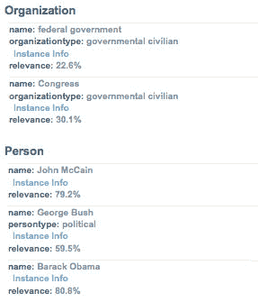

# 加莱语义网服务增加专业版

> 原文：<https://www.sitepoint.com/calais-semantic-web-service-adds-professional-version/>

汤森路透的语义网络服务加莱(Calais)今天在麻省剑桥麻省理工学院的 EmTech 会议上宣布了一个新的商业版本。Calais 是一个 web 服务和开放 API，允许 web 发布者自动扫描内容并提取语义元数据。换句话说，构建在 Calais API 上的服务可以自动在语义上标记内容。

据汤森路透负责 Calais 计划的 Tom Tague 称，他们最终接触到了大量使用 Calais 的人，包括大公司和小型网络初创公司，他们告诉他们，为了真正利用 Calais，他们需要一个带有 SLA 的专业版本。因此，Tague 和公司推出了专业版，每月 2000 美元，一年承诺，提供 24×7 监控，每天 10 万笔交易(每秒 20 笔)，而免费版每天 4 万笔，每秒 4 笔。

塔格告诉我，大多数要求专业版的用户并不需要更多的量，他们只需要一个服务可用的保证，以及汤森路透对继续下去的认真态度。

除了专业版，Calais 还宣布了一个企业版，可以为无法让其内容通过防火墙的客户现场安装。Tague 告诉我，企业版将吸引处理健康记录、财务数据或其他敏感信息的客户，或者需要大量交易的客户，在这些客户中，在本地进行处理比将其发送到云中的服务更有意义。

早期对 Calais 最大的打击之一是，由于它早期是一个名为 Clear Forest 的商业应用程序(已被汤森路透收购)，它偏向于商业语言。这意味着它对于不涉及商业话题的网站来说用处有限。我向 Tague 询问他们在扩展 Calais 的词汇以理解商业领域之外的语义方面的最新进展，他告诉我 Calais 自首次推出以来已经有了长足的进步。

根据 Tague 的说法，自“清除森林日”以来，该词汇增长了约 40%，现在包括流行文化实体，如音乐团体、活动、艺人和运动队，以及医疗保健行业实体类型。Calais 甚至与一些客户合作创建专门的词汇表，并有大约 12 名全职自然语言程序员以每月 10-12 个条目的速度添加新的实体。塔格说，他不记得在过去的三四个月里听到过“过于专注于商业”的抱怨。

## 语义代理

尽管专业版的 Calais 是个大新闻，但 Tague 更兴奋地和我谈论了来自 Open Calais 的新服务 [SemanticProxy](http://www.semanticproxy.com/) 。

SemanticProxy 构建于 Calais 3.0 之上，其工作原理类似于代理服务器，用于从 web 内容中提取语义信息。它获取一个 URL，获取页面，用 Calais 清理和处理页面，然后返回 HTML、RDF 或微格式的语义元数据。

“在未来，网络将是一个巨大而紧密相连的信息资产，以人们渴望的方式和格式提供他们需要的内容和服务。除了为人们发布信息，每个网站都会以机器可读的方式公开其内容。机器将混合、匹配、过滤和聚合信息，以极大地改善每个人的体验，”塔格说。不幸的是，对于许多出版商来说，投资在语义上标记他们的内容是不可行的——要么是因为他们有大量需要关注的内容，要么是因为他们发布的内容(如新闻)只是短暂阅读。

Calais 和基于它的服务(如 SemanticProxy)的目标是消除标记内容和向内容添加语义的障碍。“语义网将会成为一部重要的大众剧，”塔格告诉我。你需要足够多的出版商来生产语义标记的内容，这样愿景才能发挥作用，你越容易让他们在内容中添加语义，这种事情就会发生得越多。

比如雅虎！的 Search Monkey 鼓励使用 RDF 和其他语义标记，Calais 和 SemanticProxy 将通过刺激活动和使标记内容更容易来帮助出版商走向语义网。

## 分享这篇文章