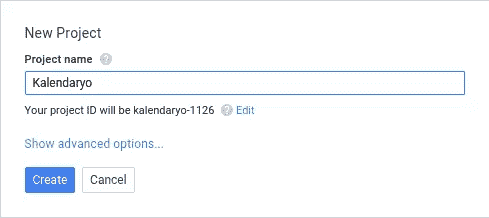
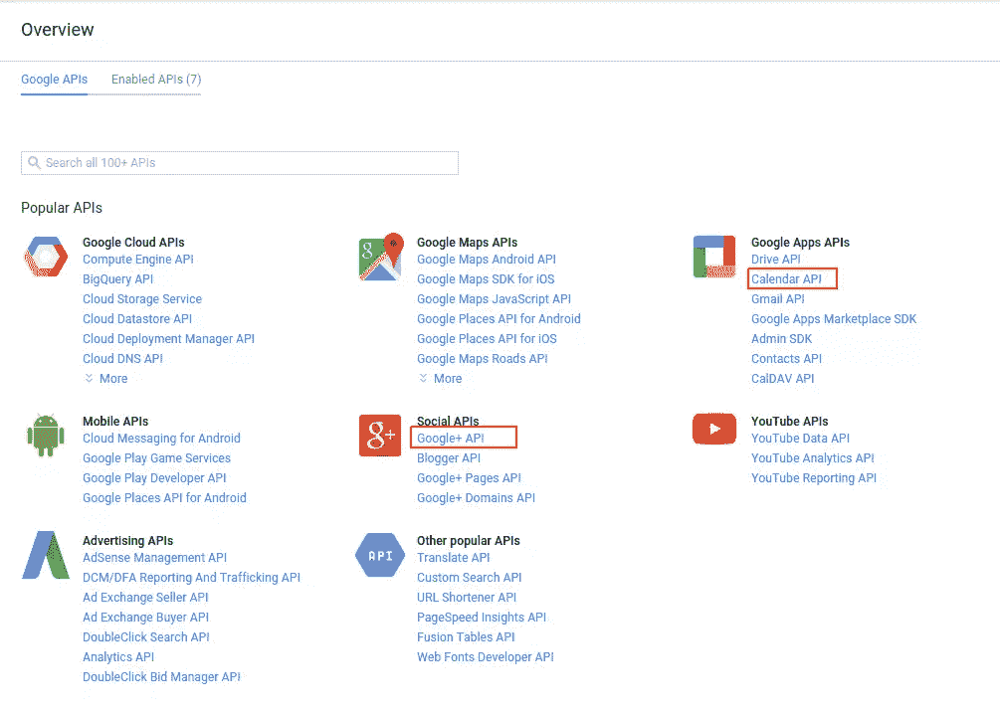
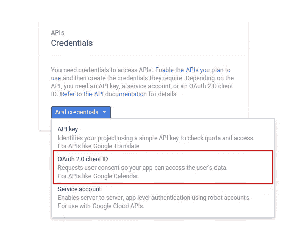
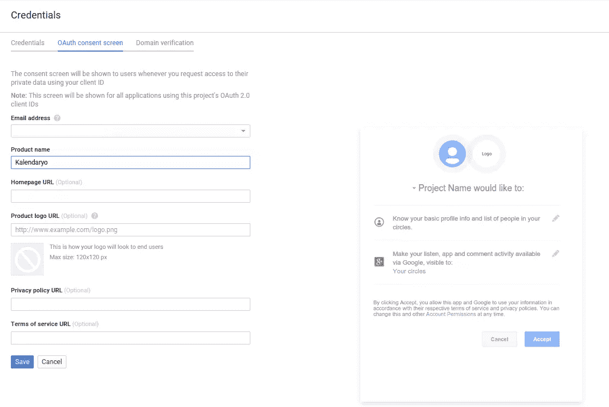

# PHP 中的日历即服务？简单，用谷歌日历 API！

> 原文：<https://www.sitepoint.com/calendar-as-a-service-in-php-easy-with-google-calendar-api/>

在本文中，您将学习如何在 PHP 中使用 Google Calendar API。您将通过构建一个日历应用程序来实现这一点，该应用程序允许用户添加新日历、添加事件以及将日历同步到 Google 日历。如果你想跟进，我推荐你[建立家园](https://www.sitepoint.com/quick-tip-get-homestead-vagrant-vm-running/)，这样你就可以很容易地获得一个运行应用程序的环境。


## 设置 Google 控制台项目

您需要做的第一件事是在 [Google 开发者控制台](https://console.developers.google.com/home/dashboard)中创建一个新项目。



一旦项目被创建，点击仪表板上的*启用和管理 API*链接。


在 google APIs 页面上，选择并启用日历 API 和 Google+ API。



一旦启用，返回到 Google APIs 页面并点击*凭证*链接，然后点击*添加凭证*按钮并选择 *OAuth 2.0 客户端 ID* 。



这将要求您配置同意屏幕。点击*配置同意屏幕*进行配置。

选择您的首选电子邮件地址，添加产品名称，然后点击*保存*。



创建一个 *Web 应用程序*。


这将为您提供客户端 ID 和客户端密码

## 构建应用程序

我们将通过[作曲家](https://www.sitepoint.com/php-dependency-management-with-composer/)使用 Laravel。

### 安装依赖项

```
composer create-project --prefer-dist laravel/laravel kalendaryo 
```

这将创建一个名为`kalendaryo`的新文件夹，它将作为您项目的目录。

让我们安装一些其他依赖项:

```
composer require nesbot/carbon google/apiclient 
```

您将使用 Google Client 与 Google+ API 进行登录，并使用 Google Calendar API 使用 Google Calendar。

### 配置应用程序

打开项目目录根目录下的`.env`文件，并提供缺少的细节，如下所示:

```
APP_ENV=local
APP_DEBUG=true
APP_KEY=base64:iZ9uWJVHemk5wa8disC8JZ8YRVWeGNyDiUygtmHGXp0=
APP_URL=http://localhost

DB_CONNECTION=mysql
DB_HOST=127.0.0.1
DB_PORT=3306
DB_DATABASE=kalendaryo
DB_USERNAME=root
DB_PASSWORD=secret

SESSION_DRIVER=file

APP_TITLE=Kalendaryo
APP_TIMEZONE="Asia/Manila"

GOOGLE_CLIENT_ID="YOUR GOOGLE CLIENT ID"
GOOGLE_CLIENT_SECRET="YOUR GOOGLE CLIENT SECRET"
GOOGLE_REDIRECT_URL="http://kalendaryo.dev/login"
GOOGLE_SCOPES="email,profile,https://www.googleapis.com/auth/calendar"
GOOGLE_APPROVAL_PROMPT="force"
GOOGLE_ACCESS_TYPE="offline" 
```

您需要添加的配置值有`DB_DATABASE`、`DB_USERNAME`、`DB_PASSWORD`、`APP_TIMEZONE`、`GOOGLE_CLIENT_ID`、`GOOGLE_CLIENT_SECRET`和`GOOGLE_REDIRECT_URL`。

对于`APP_TIMEZONE`，您可以使用来自 [PHP 时区页面](http://php.net/manual/en/timezones.php)的任何值。

对于数据库细节，创建一个新的 MySQL 数据库，并使用数据库名称作为`DB_DATABASE`的值。`DB_USERNAME`和`DB_PASSWORD`是该数据库的登录凭证。如果在[家园改良](https://www.sitepoint.com/quick-tip-get-homestead-vagrant-vm-running/)上，只需用`homestead` / `secret`凭证就可以使用预先创建的 DB `homestead`。

对于 Google 配置，用您之前从 Google 控制台获得的凭证替换`GOOGLE_CLIENT_ID`、`GOOGLE_CLIENT_SECRET`和`GOOGLE_REDIRECT_URL`的值。`GOOGLE_SCOPES`是您的应用程序将需要的权限。你输入的内容会显示在同意屏幕上。用户必须同意，应用程序才能访问您所要求的特定数据。

如果你想知道我从哪里得到这些，你可以查看[oauthroplayout](https://developers.google.com/oauthplayground/)并选择 Google+ API 和 Google 日历 API。下拉列表中显示的 URL 基本上就是权限。`email`和`profile`只是`https://www.googleapis.com/auth/userinfo.email`和`https://www.googleapis.com/auth/userinfo.profile`的简称。每个权限由逗号分隔，因为稍后您将把它转换成数组。

### 为 Google 客户端创建服务容器

接下来，看看用于 Google 客户端的[服务容器](https://laravel.com/docs/master/container)。创建一个`app/Googl.php`文件并添加以下内容:

```
<?php
namespace App;

class Googl 
{    
    public function client()
    {
        $client = new \Google_Client();
        $client->setClientId(env('GOOGLE_CLIENT_ID'));
        $client->setClientSecret(env('GOOGLE_CLIENT_SECRET'));
        $client->setRedirectUri(env('GOOGLE_REDIRECT_URL'));
        $client->setScopes(explode(',', env('GOOGLE_SCOPES')));
        $client->setApprovalPrompt(env('GOOGLE_APPROVAL_PROMPT'));
        $client->setAccessType(env('GOOGLE_ACCESS_TYPE'));
        return $client;
    }
} 
```

在上面的代码中，您设置了客户端 ID、客户端密码、重定向 URL、范围(权限)、批准提示和访问类型。您正在从先前创建的`.env`文件中加载所有这些值。一旦一切都设置好了，返回新的实例。稍后，您只需调用`client`方法来初始化 Google 客户端。

### 路线

打开`app/Http/routes.php`文件，然后在应用程序中添加不同页面的路线:

```
Route::group(
    ['middleware' => ['admin']],
    function(){

        Route::get('/dashboard', 'AdminController@index');

        Route::get('/calendar/create', 'AdminController@createCalendar');
        Route::post('/calendar/create', 'AdminController@doCreateCalendar');

        Route::get('/event/create', 'AdminController@createEvent');
        Route::post('/event/create', 'AdminController@doCreateEvent');

        Route::get('/calendar/sync', 'AdminController@syncCalendar');
        Route::post('/calendar/sync', 'AdminController@doSyncCalendar');

        Route::get('/events', 'AdminController@listEvents');

        Route::get('/logout', 'AdminController@logout');
});

Route::get('/', 'HomeController@index');
Route::get('/login', 'HomeController@login'); 
```

在上面的代码中，您使用了一个名为`admin`的定制[路由中间件](https://www.sitepoint.com/middleware-in-laravel-5/)。您将很快创建它。在路由组中使用中间件意味着它将被组中的每条路由激活。

```
Route::group(
    ['middleware' => ['admin']],
    function(){
        ...
    }
); 
```

在回调函数中，有属于该组的不同路由。它们都不言自明。响应`POST`请求路由用于执行写操作，而 GET 路由是只读的。

```
Route::get('/dashboard', 'AdminController@index');

Route::get('/calendar/create', 'AdminController@createCalendar');
Route::post('/calendar/create', 'AdminController@doCreateCalendar');

Route::get('/event/create', 'AdminController@createEvent');
Route::post('/event/create', 'AdminController@doCreateEvent');

Route::get('/calendar/sync', 'AdminController@syncCalendar');
Route::post('/calendar/sync', 'AdminController@doSyncCalendar');

Route::get('/events', 'AdminController@listEvents');

Route::get('/logout', 'AdminController@logout'); 
```

### 管理路由中间件

如前所述，[路由中间件](https://www.sitepoint.com/middleware-in-laravel-5/)用于在访问特定路由时执行代码。对于`admin`中间件，它用于检查用户当前是否登录。

在`app/Http/Middleware/AdminMiddleware.php`创建管理中间件，并添加以下内容:

```
<?php
namespace App\Http\Middleware;

use Closure;

class AdminMiddleware
{
    public function handle($request, Closure $next)
    {
        if ($request->session()->has('user')) {
            return $next($request);
        }

        return redirect('/')
            ->with(
                'message',
                ['type' => 'danger', 'text' => 'You need to login']
            );
    }
} 
```

大多数路由中间件有一个共同点:它们有一个用于处理请求的`handle`方法。这在任何响应路由的方法之前执行。在该方法中，您检查是否在当前会话中设置了一个`user`。如果有，继续处理请求。

```
if ($request->session()->has('user')) {
    return $next($request);
} 
```

否则，将用户重定向到主页，并向会话传递一条消息，告诉他们需要登录。

```
return redirect('/')
            ->with(
                'message',
                ['type' => 'danger', 'text' => 'You need to login']
            ); 
```

通过将中间件添加到`$routeMiddleware`数组下的`app/Http/Kernel.php`文件中，使中间件可供使用:

```
'admin' => \App\Http\Middleware\AdminMiddleware::class 
```

### 数据库ˌ资料库

app 使用三个表:*用户*、*日历*和*事件*。为了节省时间，您可以从库中获取迁移，并将它们粘贴到您自己项目的相同路径中。在项目的根目录中执行`php artisan migrate`,在数据库中实际创建表。

之后，将 [`User.php`](https://github.com/anchetaWern/kalendaryo/blob/master/app/User.php) 、 [`Calendar.php`](https://github.com/anchetaWern/kalendaryo/blob/master/app/Calendar.php) 、 [`Event.php`](https://github.com/anchetaWern/kalendaryo/blob/master/app/Event.php) 的内容复制到`app`目录中。这些文件是您稍后将用来与数据库对话的模型。

### 主页

创建一个`app/Http/Controllers/HomeController.php`文件并添加以下内容:

```
<?php
namespace App\Http\Controllers;

use App\Googl;
use App\User;
use App\Calendar;
use Illuminate\Http\Request;

class HomeController extends Controller
{
   public function index()
   {
        return view('login');
   }

   public function login(Googl $googl, User $user, Request $request)
   {
        $client = $googl->client();
        if ($request->has('code')) {

            $client->authenticate($request->get('code'));
            $token = $client->getAccessToken();

            $plus = new \Google_Service_Plus($client);

            $google_user = $plus->people->get('me');

            $id = $google_user['id'];

            $email = $google_user['emails'][0]['value'];
            $first_name = $google_user['name']['givenName'];
            $last_name = $google_user['name']['familyName'];

            $has_user = $user->where('email', '=', $email)->first();

            if (!$has_user) {
                //not yet registered
                $user->email = $email;
                $user->first_name = $first_name;
                $user->last_name = $last_name;
                $user->token = json_encode($token);
                $user->save();
                $user_id = $user->id;

                //create primary calendar
                $calendar = new Calendar;
                $calendar->user_id = $user_id;
                $calendar->title = 'Primary Calendar';
                $calendar->calendar_id = 'primary';
                $calendar->sync_token = '';
                $calendar->save();
            } else {
                $user_id = $has_user->id;
            }

            session([
                'user' => [
                    'id' => $user_id,
                    'email' => $email,
                    'first_name' => $first_name,
                    'last_name' => $last_name,
                    'token' => $token
                ]
            ]);

            return redirect('/dashboard')
                ->with('message', ['type' => 'success', 'text' => 'You are now logged in.']);

        } else {
            $auth_url = $client->createAuthUrl();
            return redirect($auth_url);
        }
   }
} 
```

分解上面的代码，您有返回登录视图的`index`方法。

```
public function index()
{
    return view('login');
} 
```

您可以在`resources/views/login.blade.php`文件中创建登录视图:

```
@extends('layouts.default')

@section('content')
<form method="GET" action="/login">
    <button>Login with Google</button>
</form>
@stop 
```

登录视图是一个带有登录按钮的表单，用于登录 Google。该视图扩展了默认模板(`resources/views/layouts/default.blade.php`)，包含以下内容:

```
<!DOCTYPE html>
<html lang="en">
<head>
    <meta charset="UTF-8">
    <title>{{ env('APP_TITLE') }}</title>
    <link rel="stylesheet" href="{{ url('assets/lib/picnic/picnic.min.css') }}">
    <link rel="stylesheet" href="{{ url('assets/lib/picnic/plugins.min.css') }}">

    <link rel="stylesheet" href="{{ url('assets/css/style.css') }}">
</head>
<body>
    <div class="container">
        <header>
            <h1>{{ env('APP_TITLE') }}</h1>
        </header>
        @include('partials.alert')
        @yield('content')
    </div>
</body>
</html> 
```

在上面的模板中，[野餐 CSS](http://www.picnicss.com/) 用于美化事物。样式表存储在`public/assets`目录下。手动安装或者用类似[鲍尔弗普](https://www.sitepoint.com/bower-vs-bowerphp/)的好东西安装。

带有`@yield('content')`的部分是显示登录表单的地方。

您还包括了`partials.alert`，您可以在`resources/views/partials/alert.blade.php`文件中定义它。这用于向用户显示消息和表单验证错误:

```
@if(session('message'))
    <div class="alert alert-{{ session('message.type') }}">
        {{ session('message.text') }}
    </div>
@endif

@if($errors->any())
    <div class="alert alert-danger">
        <ul>
            @foreach($errors->all() as $error)
                <li>{{ $error }}</li>
            @endforeach
        </ul>
    </div>
@endif 
```

回到`HomeController`，接下来是`login`方法。使用类型提示是为了让您可以使用 Google client 的服务容器。`User`车型也是如此。

```
public function login (Googl $googl, User $user)
{
    ...
} 
```

在`login`方法中，创建一个新的 Google client 实例，然后检查代码是否作为查询参数传递给 URL。

如果你以前没有在你的任何项目中实现过 OAuth，它的工作方式是用户必须点击一个链接，这个链接会引导到服务的登录页面。在本例中，它是 Google，因此用户被重定向到 Google 的登录页面。登录后，用户会被要求特定的权限。一旦用户同意，他们将被重定向回网址中带有唯一代码的网站。然后，这将用于获取访问令牌，应用程序可以使用该令牌来执行对 API 的请求。

您在这里检查的代码是用于交换访问令牌的代码。如果不存在，则将用户重定向到 Google 登录页面:

```
$client = $googl->client();
if ($request->has('code')) {
    ...
} else {
    $auth_url = $client->createAuthUrl();
    return redirect($auth_url);
} 
```

如果存在，请使用该代码验证用户:

```
$client->authenticate($request->get('code')); 
```

这允许您获取访问令牌并初始化对 Google+服务的请求:

```
$token = $client->getAccessToken();
$plus = new \Google_Service_Plus($client); 
```

接下来，获取当前登录的用户并提取他们的信息:

```
$google_user = $plus->people->get('me');
$id = $google_user['id'];

$email = $google_user['emails'][0]['value']; //email
$first_name = $google_user['name']['givenName']; //first name
$last_name = $google_user['name']['familyName']; //last name 
```

检查用户是否已经存在于数据库中:

```
$has_user = $user->where('email', '=', $email)->first(); 
```

如果用户不存在，创建一个新用户并将条目保存到数据库中。还要为用户创建默认日历。这是 Google 日历中的主日历。您基本上是在制作一个副本，这样一旦您开始同步来自 Google 日历服务的数据，事件(约会)就会有一个容器。

```
if (!$has_user) {
    //not yet registered
    $user->email = $email;
    $user->first_name = $first_name;
    $user->last_name = $last_name;
    $user->token = $token;
    $user->save(); 
    $user_id = $user->id;

    //create primary calendar
    $calendar = new Calendar;
    $calendar->user_id = $user_id;
    $calendar->title = 'Primary Calendar';
    $calendar->calendar_id = 'primary';
    $calendar->sync_token = '';
    $calendar->save();
} 
```

如果用户已经存在，给`$user_id`赋值，以便您可以在会话中设置它:

```
$user_id = $has_user->id; 
```

将用户详细信息保存到会话中:

```
session([
    'user' => [
        'id' => $user_id,
        'email' => $email,
        'first_name' => $first_name,
        'last_name' => $last_name,
        'token' => $token
    ]
]); 
```

最后，将用户重定向到管理仪表板页面:

```
return redirect('/dashboard')
                ->with('message', ['type' => 'success', 'text' => 'You are now logged in.']); 
```

### 管理页面

接下来，在`app/Http/Controllers/AdminController.php`文件中为管理页面创建控制器:

```
<?php
namespace App\Http\Controllers;

use App\Googl;
use App\User;
use App\Calendar;
use App\Event;
use Carbon\Carbon;
use Illuminate\Http\Request;

class AdminController extends Controller
{

   private $client;

   public function __construct(Googl $googl)
   {
        $this->client = $googl->client();
        $this->client->setAccessToken(session('user.token'));
   }

   public function index(Request $request)
   {
        return view('admin.dashboard');
   }

   public function createCalendar(Request $request)
   {
        return view('admin.create_calendar');
   }

   public function doCreateCalendar(Request $request, Calendar $calendar)
   {
        $this->validate($request, [
            'title' => 'required|min:4'
        ]);

        $title = $request->input('title');
        $timezone = env('APP_TIMEZONE');

        $cal = new \Google_Service_Calendar($this->client);

        $google_calendar = new \Google_Service_Calendar_Calendar($this->client);
        $google_calendar->setSummary($title);
        $google_calendar->setTimeZone($timezone);

        $created_calendar = $cal->calendars->insert($google_calendar);

        $calendar_id = $created_calendar->getId();

        $calendar->user_id = session('user.id');
        $calendar->title = $title;
        $calendar->calendar_id = $calendar_id;
        $calendar->save();

        return redirect('/calendar/create')
            ->with('message', [
                'type' => 'success', 'text' => 'Calendar was created!'
            ]);
   }

   public function createEvent(Calendar $calendar, Request $request)
   {
        $user_id = session('user.id');
        $calendars = $calendar
            ->where('user_id', '=', $user_id)->get();
        $page_data = [
            'calendars' => $calendars
        ];
        return view('admin.create_event', $page_data);
   }

   public function doCreateEvent(Event $evt, Request $request)
   {
        $this->validate($request, [
            'title' => 'required',
            'calendar_id' => 'required',
            'datetime_start' => 'required|date',
            'datetime_end' => 'required|date'
        ]);

        $title = $request->input('title');
        $calendar_id = $request->input('calendar_id');
        $start = $request->input('datetime_start');
        $end = $request->input('datetime_end');

        $start_datetime = Carbon::createFromFormat('Y/m/d H:i', $start);
        $end_datetime = Carbon::createFromFormat('Y/m/d H:i', $end);

        $cal = new \Google_Service_Calendar($this->client);
        $event = new \Google_Service_Calendar_Event();
        $event->setSummary($title);

        $start = new \Google_Service_Calendar_EventDateTime();
        $start->setDateTime($start_datetime->toAtomString());
        $event->setStart($start);
        $end = new \Google_Service_Calendar_EventDateTime();
        $end->setDateTime($end_datetime->toAtomString());
        $event->setEnd($end);

        //attendee
        if ($request->has('attendee_name')) {
            $attendees = [];
            $attendee_names = $request->input('attendee_name');
            $attendee_emails = $request->input('attendee_email');

            foreach ($attendee_names as $index => $attendee_name) {
                $attendee_email = $attendee_emails[$index];
                if (!empty($attendee_name) && !empty($attendee_email)) {
                    $attendee = new \Google_Service_Calendar_EventAttendee();
                    $attendee->setEmail($attendee_email);
                    $attendee->setDisplayName($attendee_name);
                    $attendees[] = $attendee;
                }
            }

            $event->attendees = $attendees;
        }

        $created_event = $cal->events->insert($calendar_id, $event);

        $evt->title = $title;
        $evt->calendar_id = $calendar_id;
        $evt->event_id = $created_event->id;
        $evt->datetime_start = $start_datetime->toDateTimeString();
        $evt->datetime_end = $end_datetime->toDateTimeString();
        $evt->save();

        return redirect('/event/create')
                    ->with('message', [
                        'type' => 'success',
                        'text' => 'Event was created!'
                    ]);
   }

   public function syncCalendar(Calendar $calendar)
   {
        $user_id = session('user.id');
        $calendars = $calendar->where('user_id', '=', $user_id)
            ->get();

        $page_data = [
            'calendars' => $calendars
        ];
        return view('admin.sync_calendar', $page_data);
   }

   public function doSyncCalendar(Request $request)
   {
        $this->validate($request, [
            'calendar_id' => 'required'
        ]);

        $user_id = session('user.id');
        $calendar_id = $request->input('calendar_id');

        $base_timezone = env('APP_TIMEZONE');

        $calendar = Calendar::find($calendar_id);
        $sync_token = $calendar->sync_token;
        $g_calendar_id = $calendar->calendar_id;

        $g_cal = new \Google_Service_Calendar($this->client);

        $g_calendar = $g_cal->calendars->get($g_calendar_id);
        $calendar_timezone = $g_calendar->getTimeZone();

        $events = Event::where('id', '=', $calendar_id)
            ->lists('event_id')
            ->toArray();

        $params = [
            'showDeleted' => true,
            'timeMin' => Carbon::now()
                ->setTimezone($calendar_timezone)
                ->toAtomString()
        ];

        if (!empty($sync_token)) {
            $params = [
                'syncToken' => $sync_token
            ];
        }

        $googlecalendar_events = $g_cal->events->listEvents($g_calendar_id, $params);

        while (true) {

            foreach ($googlecalendar_events->getItems() as $g_event) {

                $g_event_id = $g_event->id;
                $g_event_title = $g_event->getSummary();
                $g_status = $g_event->status;

                if ($g_status != 'cancelled') {

                    $g_datetime_start = Carbon::parse($g_event->getStart()->getDateTime())
                        ->tz($calendar_timezone)
                        ->setTimezone($base_timezone)
                        ->format('Y-m-d H:i:s');

                    $g_datetime_end = Carbon::parse($g_event->getEnd()->getDateTime())
                        ->tz($calendar_timezone)
                        ->setTimezone($base_timezone)
                        ->format('Y-m-d H:i:s');

                    //check if event id is already in the events table
                    if (in_array($g_event_id, $events)) {
                        //update event
                        $event = Event::where('event_id', '=', $g_event_id)->first();
                        $event->title = $g_event_title;
                        $event->calendar_id = $g_calendar_id;
                        $event->event_id = $g_event_id;
                        $event->datetime_start = $g_datetime_start;
                        $event->datetime_end = $g_datetime_end;
                        $event->save();
                    } else {
                        //add event
                        $event = new Event;
                        $event->title = $g_event_title;
                        $event->calendar_id = $g_calendar_id;
                        $event->event_id = $g_event_id;
                        $event->datetime_start = $g_datetime_start;
                        $event->datetime_end = $g_datetime_end;
                        $event->save();
                    }

                } else {
                    //delete event
                    if (in_array($g_event_id, $events)) {
                        Event::where('event_id', '=', $g_event_id)->delete();
                    }
                }

            }

            $page_token = $googlecalendar_events->getNextPageToken();
            if ($page_token) {
                $params['pageToken'] = $page_token;
                $googlecalendar_events = $g_cal->events->listEvents('primary', $params);
            } else {
                $next_synctoken = str_replace('=ok', '', $googlecalendar_events->getNextSyncToken());

                //update next sync token
                $calendar = Calendar::find($calendar_id);
                $calendar->sync_token = $next_synctoken;
                $calendar->save();

                break;
            }

        }

        return redirect('/calendar/sync')
            ->with('message',
                [
                    'type' => 'success',
                    'text' => 'Calendar was synced.'
                ]);

   }

   public function listEvents()
   {
        $user_id = session('user.id');
        $calendar_ids = Calendar::where('user_id', '=', $user_id)
            ->lists('calendar_id')
            ->toArray();

        $events = Event::whereIn('calendar_id', $calendar_ids)->get();

        $page_data = [
            'events' => $events
        ];

        return view('admin.events', $page_data);
   }

   public function logout(Request $request)
   {
        $request->session()->flush();
        return redirect('/')
            ->with('message', ['type' => 'success', 'text' => 'You are now logged out']);
   }

} 
```

我们来分解一下上面的代码。

在控制器内部，`$client`变量存储了对您在构造函数中初始化的新 Google 客户端的引用。这样，你就不需要每次需要的时候都初始化它。

```
private $client;

public function __construct(Googl $googl)
{
    $this->client = $googl->client();
    $this->client->setAccessToken(session('user.token'));
} 
```

`index`方法返回管理仪表板(`resources/views/admin/dashboard.blade.php`)视图。

```
public function index(){
    return view('admin.dashboard');
} 
```

管理控制面板包含不同页面的链接，允许用户执行各种操作:

```
@extends('layouts.admin')

@section('content')
<h3>What do you like to do?</h3>
<ul>
    <li><a href="/calendar/create">Create Calendar</a></li>
    <li><a href="/event/create">Create Event</a></li>
    <li><a href="/calendar/sync">Sync Calendar</a></li>
    <li><a href="/events">Events</a></li>
    <li><a href="/logout">Logout</a></li>
</ul>
@stop 
```

该视图扩展了以下管理布局(`resources/views/layouts/admin.blade.php`):

```
<!DOCTYPE html>
<html lang="en">
<head>
    <meta charset="UTF-8">
    <title>{{ env('APP_TITLE') }}</title>
    <link rel="stylesheet" href="{{ url('assets/lib/picnic/picnic.min.css') }}">
    <link rel="stylesheet" href="{{ url('assets/lib/picnic/plugins.min.css') }}">

    @yield('jquery_datetimepicker_style')

    <link rel="stylesheet" href="{{ url('assets/css/style.css') }}">
</head>
<body>
    <div class="container">
        <header>
            <h1>{{ env('APP_TITLE') }}</h1>
        </header>
        @include('partials.alert')
        @yield('content')
    </div>

    @yield('attendee_template')

    @yield('jquery_script')

    @yield('handlebars_script')

    @yield('jquery_datetimepicker_script')

    @yield('create_event_script')

</body>
</html> 
```

在上面的代码中，除了主要内容之外，还会产生一些模板。这些模板是从不同的视图传入的。如果一个视图没有定义它所产生的部分，它就不会返回任何东西。

### 创建日历

回到`AdminController`，这里是返回创建新日历的视图的方法:

```
public function createCalendar(Request $request)
{
    return view('admin.create_calendar');
} 
```

create calendar 视图包含一个询问日历标题的表单。还有一个隐藏字段用于防止 CSRF(跨站点请求伪造)。

```
@extends('layouts.admin')

@section('content')
<form method="POST">
    <input type="hidden" name="_token" value="{{{ csrf_token() }}}" />
    <p>
        <label for="title">Title</label>
        <input type="text" name="title" id="title" value="{{ old('title') }}">
    </p>
    <button>Create Calendar</button>
</form>
@stop 
```

一旦提交了表单，就会调用`doCreateCalendar`方法。在该方法中，验证是否有一个值提供给 title 字段，以及它是否至少有 4 个字符。

```
$this->validate($request, [
    'title' => 'required|min:4'
]); 
```

初始化 Google 日历客户端:

```
$cal = new \Google_Service_Calendar($this->client); 
```

创建新日历。将标题设置为用户提供的标题，将时区设置为默认的应用程序时区:

```
$google_calendar = new \Google_Service_Calendar_Calendar($this->client);
$google_calendar->setSummary($title);
$google_calendar->setTimeZone($timezone);

$created_calendar = $cal->calendars->insert($google_calendar); 
```

获取日历的 ID:

```
$calendar_id = $created_calendar->getId(); 
```

将新创建的日历保存到数据库:

```
$calendar->user_id = session('user.id');
$calendar->title = $title;
$calendar->calendar_id = $calendar_id;
$calendar->save(); 
```

将用户重定向回创建新日历的页面:

```
return redirect('/calendar/create')
            ->with('message', [
                'type' => 'success', 'text' => 'Calendar was created!'
            ]); 
```

### 创建事件

接下来是返回创建新事件的视图的方法。这里您传入了用户已经创建的日历，因为用户必须选择将事件添加到哪个日历中。

```
public function createEvent(Calendar $calendar, Request $request)
{
    $user_id = session('user.id');
    $calendars = $calendar
        ->where('user_id', '=', $user_id)->get();
    $page_data = [
        'calendars' => $calendars
    ];
    return view('admin.create_event', $page_data);
} 
```

`admin.create_event` ( `resources/views/admin/create_event.blade.php`)视图包括 jQuery、手柄和 [jQuery datetimepicker](https://github.com/xdan/datetimepicker) 样式和脚本。

您正在使用 jQuery 监听 DOM 中的事件，使用 handlebars 创建新的 HTML，使用 jQuery datetimepicker 将日期字段转换成日期和时间选择器。在表单中，有一个字段用于输入事件标题、选择添加事件的日历、开始和结束日期和时间，还有一些字段用于输入与会者的姓名和电子邮件。在表单下面，有 attendee 行的 handlebars 模板。这一行将被追加到参与者容器(`<div id="attendees">...</div>`)中。

```
@extends('layouts.admin')

@section('jquery_datetimepicker_style')
<link rel="stylesheet" href="{{ url('assets/lib/jquery-datetimepicker/jquery.datetimepicker.min.css') }}">
@stop

@section('content')
<form method="POST">
    <input type="hidden" name="_token" value="{{{ csrf_token() }}}" />
    <p>
        <label for="title">Title</label>
        <input type="text" name="title" id="title" value="{{ old('title') }}">
    </p>
    <p>
        <label for="calendar_id">Calendar</label>
        <select name="calendar_id" id="calendar_id">
            @foreach($calendars as $cal)
            <option value="{{ $cal->calendar_id }}">{{ $cal->title }}</option>
            @endforeach
        </select>
    </p>
    <p>
        <label for="datetime_start">Datetime Start</label>
        <input type="text" name="datetime_start" id="datetime_start" class="datetimepicker" value="{{ old('datetime_start') }}">
    </p>
    <p>
        <label for="datetime_end">Datetime End</label>
        <input type="text" name="datetime_end" id="datetime_end" class="datetimepicker" value="{{ old('datetime_end') }}">
    </p>
    <div id="attendees">
        Attendees
        <div class="attendee-row">
            <input type="text" name="attendee_name[]" class="half-input name" placeholder="Name">
            <input type="text" name="attendee_email[]" class="half-input email" placeholder="Email">
        </div>
    </div>
    <button>Create Event</button>
</form>
@stop

@section('attendee_template')
<script id="attendee-template" type="text/x-handlebars-template"> <div class="attendee-row">
        <input type="text" name="attendee_name[]" class="half-input name" placeholder="Name">
        <input type="text" name="attendee_email[]" class="half-input email" placeholder="Email">
    </div> </script>
@stop

@section('jquery_script')
<script src="{{ url('assets/lib/jquery.min.js') }}"></script>
@stop

@section('handlebars_script')
<script src="{{ url('assets/lib/handlebars.min.js') }}"></script>
@stop

@section('jquery_datetimepicker_script')
<script src="{{ url('assets/lib/jquery-datetimepicker/jquery.datetimepicker.min.js') }}"></script>
@stop

@section('create_event_script')
<script src="{{ url('assets/js/create_event.js') }}"></script>
@stop 
```

在上面的模板中，您还包括了`create_event.js`文件。该文件负责将日期字段转换为日期选择器，并监听与会者电子邮件文本字段上的模糊事件。一旦触发模糊事件，并且用户填写了该行的与会者姓名和电子邮件，它将生成一个新行，用户可以在其中输入另一个与会者。

```
var attendee_template = Handlebars.compile($('#attendee-template').html());

$('.datetimepicker').datetimepicker();

$('#attendees').on('blur', '.email', function(){

    var attendee_row = $('.attendee-row:last');
    var name = attendee_row.find('.name').val();
    var email = attendee_row.find('.email').val();

    if(name && email){
        $('#attendees').append(attendee_template());
    }
}); 
```

下面是提交创建事件表单后将执行的方法:

```
public function doCreateEvent(Event $evt, Request $request)
{
    ...
} 
```

在该方法中，验证表单并从字段中获取数据:

```
$this->validate($request, [
    'title' => 'required',
    'calendar_id' => 'required',
    'datetime_start' => 'required|date',
    'datetime_end' => 'required|date'
]);

$title = $request->input('title');
$calendar_id = $request->input('calendar_id');
$start = $request->input('datetime_start');
$end = $request->input('datetime_end'); 
```

将开始和结束日期时间转换为日期对象，以便于格式化:

```
$start_datetime = Carbon::createFromFormat('Y/m/d H:i', $start);
$end_datetime = Carbon::createFromFormat('Y/m/d H:i', $end); 
```

创建一个新的 Google 日历事件，并将其摘要设置为用户输入的标题:

```
$event = new \Google_Service_Calendar_Event();
$event->setSummary($title); 
```

设置开始和结束日期时间。注意，Google Calendar API 期望日期和时间被格式化为 atom 字符串，所以您使用 Carbon 提供的`toAtomString()`方法来格式化`$start_datetime`和`$end_datetime`。

```
$start = new \Google_Service_Calendar_EventDateTime();
$start->setDateTime($start_datetime->toAtomString());
$event->setStart($start);

$end = new \Google_Service_Calendar_EventDateTime();
$end->setDateTime($end_datetime->toAtomString());
$event->setEnd($end); 
```

检查用户是否添加了任何与会者:

```
if ($request->has('attendee_name')) {
    ...
} 
```

如果是，将它们分配给变量:

```
$attendees = [];
$attendee_names = $request->input('attendee_name');
$attendee_emails = $request->input('attendee_email'); 
```

循环访问每个人，如果用户输入了姓名和电子邮件，在 Google 日历中创建一个新的活动参与者，并设置他们的电子邮件和姓名。然后，将创建的 attendee 推送到`$attendees`数组。

```
foreach ($attendee_names as $index => $attendee_name) {
    $attendee_email = $attendee_emails[$index];
    if (!empty($attendee_name) && !empty($attendee_email)) {
        $attendee = new \Google_Service_Calendar_EventAttendee();
        $attendee->setEmail($attendee_email);
        $attendee->setDisplayName($attendee_name);
        $attendees[] = $attendee;
    }
} 
```

遍历每个参与者后，将`$attendees`数组附加到事件的参与者:

```
$event->attendees = $attendees; 
```

将活动保存到 Google 日历:

```
$created_event = $cal->events->insert($calendar_id, $event); 
```

还将事件保存到数据库:

```
$evt->title = $title;
$evt->calendar_id = $calendar_id;
$evt->event_id = $created_event->id;
$evt->datetime_start = $start_datetime->toDateTimeString();
$evt->datetime_end = $end_datetime->toDateTimeString();
$evt->save(); 
```

重定向回事件创建页面:

```
return redirect('/event/create')
            ->with('message', [
                'type' => 'success',
                'text' => 'Event was created!'
            ]); 
```

### 同步日历

接下来是返回同步日历视图的函数(`resources/views/admin/sync_calendar.blade.php`)。在这里，您将用户创建的日历作为该视图的数据传入。

```
public function syncCalendar(Calendar $calendar)
{
    $user_id = session('user.id');
    $calendars = $calendar->where('user_id', '=', $user_id)
        ->get();

    $page_data = [
        'calendars' => $calendars
    ];
    return view('admin.sync_calendar', $page_data);
} 
```

下面是`admin.sync_calendar`视图的代码。这允许用户选择要同步的日历。提交后，它会添加任何尚未添加到数据库中的事件，删除已取消的事件，并更新自上次同步以来更新的事件。

```
@extends('layouts.admin')

@section('content')
<form method="POST">
    <input type="hidden" name="_token" value="{{{ csrf_token() }}}" />
    <p>
        <label for="calendar_id">Calendar</label>
        <select name="calendar_id" id="calendar_id">
            @foreach($calendars as $cal)
            <option value="{{ $cal->id }}">{{ $cal->title }}</option>
            @endforeach
        </select>
    </p>
    <button>Sync Calendar</button>
</form>
@stop 
```

一旦用户提交了日历同步表单，就会执行`doSyncCalendar`方法:

```
public function doSyncCalendar(Request $request)
{
    ...
} 
```

在函数中，在数据库中查找日历:

```
$calendar = Calendar::find($calendar_id);
$sync_token = $calendar->sync_token;
$g_calendar_id = $calendar->calendar_id; 
```

创建 Google 日历服务的新实例，并根据其 ID 获取日历。也获取日历的时区。这允许您设置事件的日期和时间以哪个时区表示。这样，你可以很容易地转换到应用程序使用的时区。

```
$g_cal = new \Google_Service_Calendar($this->client);

$g_calendar = $g_cal->calendars->get($g_calendar_id);
$calendar_timezone = $g_calendar->getTimeZone(); 
```

获取属于用户选择的日历的事件的 id。这将用于检查之前是否已经添加了特定事件。从那里，您可以决定如何处理该事件。如果它已经在数据库中，并且状态不是取消，那么它需要更新，否则从数据库中删除它。如果它还没有在数据库中，那么它需要添加。

```
$events = Event::where('id', '=', $calendar_id)
            ->lists('event_id')
            ->toArray(); 
```

为首次同步指定默认过滤器。`showDeleted`选项允许您返回删除的事件，而`timeMin`选项允许您指定请求中使用的最小日期时间。这样，过去的事件就不会被返回。

```
$params = [
    'showDeleted' => true,
    'timeMin' => Carbon::now()
        ->setTimezone($calendar_timezone)
        ->toAtomString()
]; 
```

Google 日历同步的工作原理是利用一个同步令牌，该令牌在每次日历发生变化时都会发生变化(例如，添加了一个事件)。然后需要将这个令牌保存在数据库中，这样，当 Google 服务器中的令牌与您拥有的令牌相同时，就意味着什么都没有改变。如果不同，这是您唯一一次执行更新。更新后，数据库中的令牌也需要更新。

如果同步令牌不为空，则使用该令牌而不是默认筛选器。这允许您只返回那些已经更新或添加的事件。

```
if (!empty($sync_token)) {
    $params = [
        'syncToken' => $sync_token
    ];
} 
```

获取事件:

```
$googlecalendar_events = $g_cal->events->listEvents($g_calendar_id, $params); 
```

接下来是一个无限循环，只有当您获取了用户选择的日历的所有更新后，它才会停止执行。

```
while (true) {
    ...
} 
```

在无限循环中，遍历 API 返回的事件并提取所有相关数据:

```
foreach ($googlecalendar_events->getItems() as $g_event) {

    $g_event_id = $g_event->id;
    $g_event_title = $g_event->getSummary();
    $g_status = $g_event->status;
    ...
} 
```

检查事件状态。如果取消，则从数据库中删除该事件:

```
if ($g_status != 'cancelled') {
    ...
} else {
    //delete event
    if (in_array($g_event_id, $events)) {
        Event::where('event_id', '=', $g_event_id)->delete();
    }
} 
```

如果事件没有取消，提取事件的开始和结束日期时间，并将其转换为应用程序的时区。

```
$g_datetime_start = Carbon::parse($g_event->getStart()
    ->getDateTime())
    ->tz($calendar_timezone)
    ->setTimezone($base_timezone)
    ->format('Y-m-d H:i:s');

$g_datetime_end = Carbon::parse($g_event->getEnd()->getDateTime())
    ->tz($calendar_timezone)
    ->setTimezone($base_timezone)
    ->format('Y-m-d H:i:s'); 
```

如果在事件 ID 数组中找到该事件 ID，则意味着该事件已被更新，因此您也对数据库执行更新:

```
if (in_array($g_event_id, $events)) {
    //update event
    $event = Event::where('event_id', '=', $g_event_id)->first();
    $event->title = $g_event_title;
    $event->calendar_id = $g_calendar_id;
    $event->event_id = $g_event_id;
    $event->datetime_start = $g_datetime_start;
    $event->datetime_end = $g_datetime_end;
    $event->save();

} 
```

如果它还不在数组中，这意味着它是一个新事件，所以您向数据库添加一个新条目:

```
else {
    //add event 
    $event = new Event;
    $event->title = $g_event_title;
    $event->calendar_id = $g_calendar_id;
    $event->event_id = $g_event_id;
    $event->datetime_start = $g_datetime_start;
    $event->datetime_end = $g_datetime_end;
    $event->save();
} 
```

遍历完事件后，获取下一页的令牌。请注意，这与之前的同步令牌不同。页面标记仅用于分页。在这里，您只是检查当前结果集中是否还有页面。

```
$page_token = $googlecalendar_events->getNextPageToken(); 
```

如果它有下一页，将其设置为下一个请求的`pageToken`,然后继续请求获取事件:

```
if ($page_token) {
   $params['pageToken'] = $page_token;
   $googlecalendar_events = $g_cal->events->listEvents('primary', $params);
} 
```

如果没有，这意味着您已经获得了所有结果，所以执行一个请求来获得下一个同步令牌，然后用该值更新数据库。此时，您可以退出无限循环。

```
else {
    $next_synctoken = str_replace('=ok', '', $googlecalendar_events->getNextSyncToken());

    //update next sync token
    $calendar = Calendar::find($calendar_id);
    $calendar->sync_token = $next_synctoken;
    $calendar->save();

    break; //exit out of the inifinite loop
} 
```

重定向至日历同步页面，并通知用户日历已同步:

```
return redirect('/calendar/sync')
        ->with('message',
            [
                'type' => 'success',
                'text' => 'Calendar was synced.'
            ]); 
```

### 列出事件

接下来是显示用户已同步的所有事件的方法:

```
public function listEvents()
{
    $user_id = session('user.id');
    $calendar_ids = Calendar::where('user_id', '=', $user_id)
        ->lists('calendar_id')
        ->toArray();

    $events = Event::whereIn('calendar_id', $calendar_ids)->get();

    $page_data = [
        'events' => $events
    ];

    return view('admin.events', $page_data);
} 
```

事件视图(`resources/views/admin/events.blade.php`)包含以下内容:

```
@extends('layouts.admin')

@section('content')
@if(count($events) > 0)
<table>
    <thead>
        <tr>
            <th>Title</th>
            <th>Datetime Start</th>
            <th>Datetime End</th>
        </tr>
    </thead>
    <tbody>
        @foreach($events as $event)
        <tr>
            <td>{{ $event->title }}</td>
            <td>{{ $event->datetime_start }}</td>
            <td>{{ $event->datetime_end }}</td>
        </tr>
        @endforeach
    </tbody>
</table>
@endif
@stop

@stop 
```

### 注销

最后，还有一个`logout`方法，一旦用户单击管理仪表板中的注销链接，该方法就会被执行。这将删除所有会话数据，并将用户重定向回主页。

```
public function logout(Request $request)
{
    $request->session()->flush();
    return redirect('/')
        ->with('message', ['type' => 'success', 'text' => 'You are now logged out']);
} 
```

## 结论

就是这样！在本教程中，您已经了解了如何构建一个集成了 Google Calendar API 的 PHP 应用程序。通过这样做，您已经学会了如何使用 PHP 操作 Google 日历。

你有没有利用谷歌的 API 来构建自己的日历应用？这些说明容易/难理解吗？欢迎所有反馈！

## 分享这篇文章