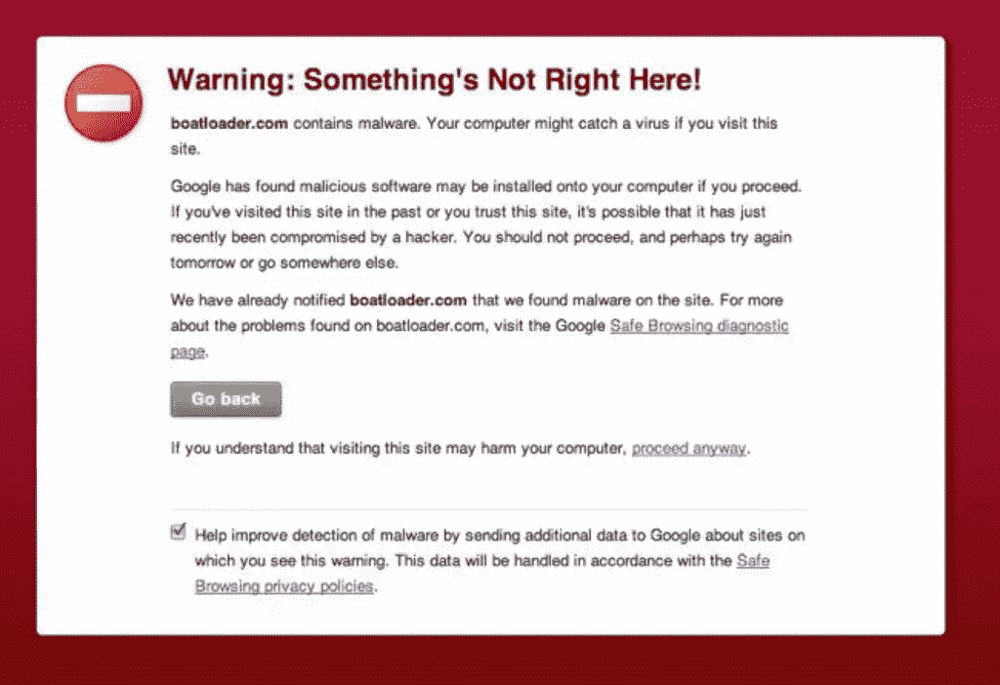

# 消极的 SEO 真的会让你的网站受到惩罚吗？

> 原文：<https://www.sitepoint.com/can-negative-seo-really-get-your-site-penalized/>

4 月 24 日，谷歌推出了企鹅更新——对其算法的改变，试图纠正与富含低质量链接的网站相关的问题。例如，这些低质量的链接包括赞助链接、指向无关网站的链接，以及指向锚文本重复相同关键字的网站的链接。本质上，企鹅更新审查网站的链接简介。这的确是一个非常值得称赞的目标，但同样的更新也使得负面 SEO 的表现——这就像听起来一样糟糕！—对于不择手段的人来说，这是一个挑战性小得多的练习。

## **什么是负 SEO？**

通过不正当的手段，在某人(通常是竞争对手)让你完全合法的网站看起来违反了谷歌的质量准则后，网站的排名会下降。他们通过创建指向您网站的低质量链接、创建您网站的重复内容或侵入您的网站并插入恶意代码来做到这一点。负面 SEO 是一种“黑帽”技术，每个网站所有者都应该知道。

消极 SEO 的主要技术是垃圾链接、内容操纵和网站入侵。如果有人执意在你的网站上发送垃圾链接，他们会设置大量低质量的链接，并把它们指向你。这种设置使得谷歌很可能会注意到不自然的链接，并发出垃圾邮件警报，这肯定会降低你的排名。另一方面，如果选择的方法是内容操纵，那么你网站的内容会被一次又一次地复制，直到谷歌惩罚你拥有重复的内容。你说什么是的，即使*你*没有复制你自己的内容，如果其他人复制了它，即使没有你的允许，你的网站也可能被视为违反了谷歌禁止复制内容的规定。最后，入侵是指黑客或恶意软件的入侵。所有这些方法都有一个目标:降级你的网站。让我们更详细地看看这些技术。

### **垃圾链接**

企鹅算法检查网站的低质量链接与高质量链接的比率；如果比例不利，你的网站会被扣分。重要的是要记住，企鹅不是实时运行的。这意味着，如果你被垃圾邮件困扰，即使立即清除垃圾邮件也不能保证你马上就能重回巅峰；事实上，可能需要几个星期。为了有效地推翻一个网站的好链接与坏链接的比率，攻击者必须产生数百个负面链接——无论如何都不是一件轻而易举的事情，但也不是不可能的。

以下是谷歌可能认为的低质量链接的一些例子:

*   来自有太多外向链接的站点的链接
*   来自低质量博客网络的链接
*   来自有太多连续链接的网站的链接(如赞助商链接)
*   站点范围内的链接数量过多
*   太多来自低 Google PageRank 网站的链接
*   来自具有相关 IP 地址的站点的链接太多
*   某个关键字在链接锚文本中使用了太多次
*   来自主题与你的网站无关的网站的链接
*   来自链接交换类型页面的链接
*   来自低质量目录的链接
*   页脚中的链接
*   来自博客和论坛评论的链接

最好的建议是保持一个健康和强大的反向链接配置文件，并远离操纵链接建设。理想情况下，你的网站将链接到高质量的网站，有不重复的锚文本，链接是多样化的。定期检查你的链接简介也是一个很好的做法；这将为您提供识别和删除垃圾链接的机会。既然雅虎的站点浏览器已经进入了互联网历史的垃圾箱，而谷歌连一条好的反向链接数据都没有，那么第三方工具就是你的最佳选择。对于反向链接评论，试试 SEOMoz 的[OpenSiteExplorer.com](http://www.opensiteexplorer.com/)和[Majestic SEO](http://www.majesticseo.com/)——两者都有免费版本，强烈推荐。这些工具只会向您显示您的反向链接，但要分析您拥有的链接类型，要么手动进行，要么您可以从 CSV 文件中获取反向链接数据，并将它们输入到[链接侦探](http://www.linkdetective.com/)，它将分解链接类型，如博客评论链接、页脚链接等。

觉得自己受到企鹅更新不公平影响的网站可以联系谷歌要求重新收录。

### **内容操作**

当网页上出现重复内容时，谷歌的算法会记录下来，通常会为单个版本保留较好的排名，而为其他版本分配较差的排名。最初发布内容的网站有望获得更好的排名，但情况并不总是如此。

这样一个网站——其原始内容被其他网站复制——如果谷歌将复制内容排在原始网站之前，它的排名可能会低于其模仿者。同样，网页排名较高的网站也可能受到谷歌算法的青睐。当心厚颜无耻地转发你的内容；它被复制的越多，你的网站就越有可能被惩罚。

内容复制往往通过抓取软件来完成；自动软件将复制你的内容，并张贴在其他网站上。垃圾邮件制造者使用抓取软件快速创建数千个页面，以获得快速排名。他们经常从排名靠前的网站复制内容，希望自己的网站也能排名靠前。

2011 年初，谷歌发布了熊猫更新。Panda 类似于 Penguin，它过滤掉所有垃圾页面，但它不是针对低质量的链接，而是针对低质量的内容(即抓取和复制的内容)。关键词填充是它的另一个目标，基本上是针对那些在页面上重复使用过多关键词的网站。

你如何保护你的网站免受这种负面搜索引擎优化的影响？通过频繁检查重复内容。检查它的一种方法是使用[Copyscape.com](http://www.copyscape.com/)，或者其他类似的服务。但是从你的网站上提取一个独特的句子并用谷歌搜索(不要忘记使用引号)也是可行的。对于后者，选择一个五到十五个单词长的句子。内容中的一两个句子被复制通常不会带来风险，但是如果整个内容部分被复制，你就有理由担心了。

如果您的重复内容检查只发现几个网站，请联系这些网站的所有者，要求删除复制的材料；或者发封停止通知函。当这些策略被证明是无效的，DMCA(数字千年版权法案)投诉文件是有序的。

谷歌有一个[报告工具](http://support.google.com/bin/static.py?hl=en&ts=1114905&page=ts.cs)，可以帮助你处理网络搜索问题。如果有问题的材料出现在 Google Plus 页面或 YouTube 等地方，你可以求助于它。然而，当重复的数量太多时，克服其不良影响的最直接的方法是进行彻底的内容重写。

给聪明人的最后一句话:留意附属机构的内容“借用”。如果代销商计划是你的商业战略的一部分，确保预先指定的、与你的业务相关的内容可供他们使用可能是一个成功的解决方案。这些内容应该与你的业务相关，但要与你自己网站上出现的内容分开。这里最重要的想法是定期更新你的内容，以避免成为负面搜索引擎优化的受害者。每月更新你的内容，贴近谷歌的高质量内容指南，会让你保持在正确的轨道上。

### **网站入侵**

网络服务器黑客攻击或植入恶意软件构成网站入侵。如果黑客将恶意代码输入到您的 HTML 源代码中，您的网站可以被谷歌除名，谷歌在检测恶意代码方面没有任何问题。您可能不知道这些代码被插入到您的站点中，直到 Google 通过您的网站管理员工具帐户中的电子邮件提醒您，或者有人提醒您他们看到了来自 Google 的关于您的站点包含恶意代码的通知。

为了避免这种情况，您的 web 服务器应该保持最新。通过在补丁发布时安装补丁，并留意外来代码来做到这一点。网上有免费的工具可以帮你解决所有这些问题。清除恶意代码后，谷歌可能需要几天或几周的时间来重新索引你的网站——需要多长时间将取决于你网站的受欢迎程度，但要加快速度，你可以使用 [Lindexed](http://www.lindexed.com/) ，它使用几种索引技术来加快这个过程。

如果你没有[网站管理员工具](http://www.google.com/webmasters/tools/)账户，一定要注册并登记你的网站，因为谷歌可能会用它来传达网站删除。

## 分享这篇文章