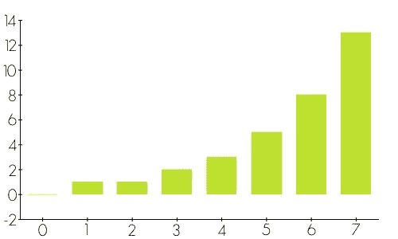
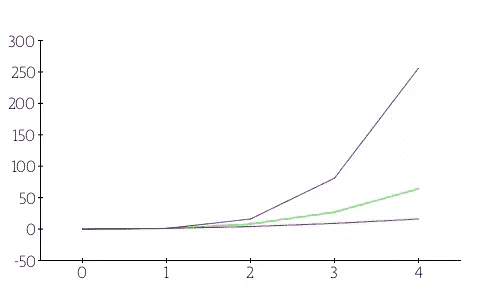
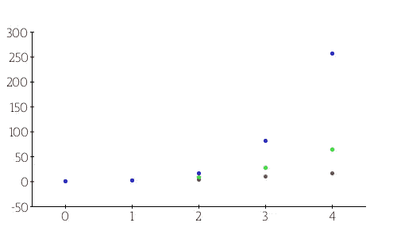
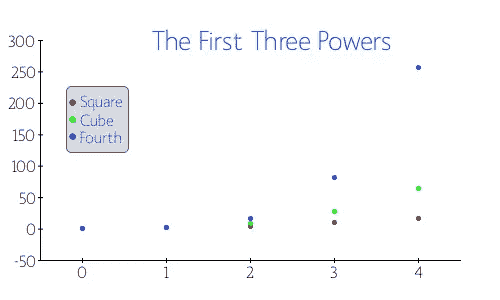

# 用 pChart 制图

> 原文：<https://www.sitepoint.com/charting-with-pchart/>

由法国图卢兹的系统工程师 Jean-Damien Pogolotti 创建和维护，pChart 是一个使用 PHP 创建抗锯齿图表的库。它的面向对象的代码最近已经过重新设计，可以很容易地添加漂亮、引人注目的数据。该库可免费用于非盈利用途，并包含在 GPL 分布式软件中；其他用途的许可计划起价仅为 50 欧元。在这篇文章中，我将带你安装 pChart，并使用它来生成一个基本的图表，折线图和曲线图。

## 装置

pChart 喜欢 PHP 5+并需要 GD 和 FreeType 扩展。这些应该在版本 5 中默认安装并启用，但是使用`phpinfo()`函数进行复查是个好主意。该函数生成 PHP 安装的完整描述。如果您看到“gd”部分报告在其输出中启用了 GD 和自由类型支持，您应该能够使用 pChart。

如果您正在本地开发系统上工作，不要忘记在部署应用程序之前检查您的托管服务器。共享主机方案应该不会造成任何问题，但是如果你使用的是 VPS，那么如果缺乏 GD 和 FreeType 支持，你可能需要请求管理员重新编译 PHP。

pChart 可以从[www.pchart.net/download](http://www.pchart.net/download)下载。在撰写本文时，该库的最新版本是 2.1.3。下载该库，并记下网页上与其并列的 MD5 校验和；这是一个好主意，以验证您下载的文件的校验和，以确保它们匹配。在 unix 系统上，您可以像这样验证校验和:

```
jajeronymo@web1:~$ md5sum  pChart2.1.3.zip
7895f71126638cbfb73b69c987418107  pChart2.1.3.zip
```

然后解压这个包。在我的例子中，内容被自动放入一个文件夹`pChart2.1.3`。阅读`readme.txt`文件，它解释了什么是 pChart，它的要求是什么，也许最重要的是代码库中的各种文件是什么。然后，根据应用程序的需要，移动文件夹或创建指向它的符号链接(或两者都做)。

```
jajeronymo@web1:~$ unzip pChart2.1.3.zip
jajeronymo@web1:~$ sudo -i
[sudo] password for jajeronymo: ********
root@web1:~# mv /home/jajeronymo/pChart2.1.3 /srv/www/lib/
root@web1:~# cd /srv/www/lib
root@web1:/srv/www/lib# ln -s pChart2.1.3 pChart
```

你看过`readme.txt`文件了吗？不要！？请现在就做。这是一个健康的习惯。

现在您可以使用`require_once`语句让 PHP 脚本可以使用各种 pChart 类。文档提醒我们，在会话开始后(如果您正在使用它们的话)，在任何内容被发送到浏览器之前，应该包含它们，否则 PHP 可能会抛出臭名昭著的“headers has sent”错误。

```
<?php
session_start();
require_once "../lib/pChart/class/pDraw.class.php";
require_once "../lib/pChart/class/pImage.class.php";
require_once "../lib/pChart/class/pData.class.php";
```

上面我使用了完整的相对路径，因为 PHP 将只在几个选择的默认目录中查找包含的文件，比如当前工作目录、`/usr/share/php`和`/usr/share/pear`。如果你想让 PHP 搜索其他目录，你可以使用`set_include_path()`:

```
<?php
define("PCHART_PATH", /srv/www/lib/pChart");
set_include_path(get_include_path() . PATH_SEPARATOR . PCHART_PATH);
require_once "class/pDraw.class.php";
...
```

## 创建单个系列图表

无论图表有多复杂，创建 pChart 图表都需要三个步骤:定义数据、创建图像文件和输出文件。我们从数据定义开始。

数据通常来自真实世界应用程序中的数据库，但在本教程中，它将在脚本中定义为数组。让我们使用[斐波纳契数列](http://en.wikipedia.org/wiki/Fibonacci_number)的前八个值作为数据集:

```
<?php
$myDataset = array(0, 1, 1, 2, 3, 5, 8, 13);
```

pChart 是面向对象的。您只需创建一个数据对象，它是`pData`类的一个实例，并用`addPoints()`将您的数据集分配给它:

```
<?php
$myData = new pData(); 
$myData->addPoints($myDataset);
```

你已经完成了第一步。现在需要定义一个 image 对象将`$myData`表示为图表。这个对象是一个 500×300 像素的类实例`pImage`:

```
<?php
$myImage = new pImage(500, 300, $myData);
```

图表通常使用文本标签来标识值。您可以指定图像对象的`setFontProperties()`方法使用哪种字体系列和字体大小:

```
<?php
$myImage->setFontProperties(array(
    "FontName" => PCHART_PATH . "/fonts/GeosansLight.ttf",
    "FontSize" => 15));
```

定义字体的正确路径至关重要！这里我使用了 pChart 附带的一种字体，它位于`pChart/fonts`目录中。因为我的根脚本在`pChart/`之外，所以后者必须包含在路径中。如果路径不正确，您将收到“无法找到/打开字体”警告，并且图表将无法显示文本。

尽管图像大小为 500×300 像素，但实际的图表区域必须小于容纳 X 轴和 Y 轴标签的区域。`setGraphArea()`方法将图表区域的左上角和右下角定义为点 X1，Y1 和 X2，Y2:

```
<?php
$myImage->setGraphArea(25,25, 475,275);
```

此外，一些图表需要不同的水平和垂直刻度，以获得最大的易读性。pChart 有几十个用于秤定制的参数，但为了简单起见，我们只使用默认值:

```
<?php
$myImage->drawScale();
```

有些图表要求您调用`drawScale()`方法，即使没有参数。

现在是正确创建图表的时候了。pChart 目前提供 14 种不同类型的基本图表，每种图表都有许多可定制的选项。我只想要一个带有默认参数的简单条形图:

```
<?php
$myImage->drawBarChart();
```

此时`$myImage`是一个图像对象，您可以用它来创建和输出图像文件。使用`null`作为参数调用`Render()`方法会将图像发送到浏览器，但是在此之前，请确保您已经发送了适当的内容类型头。或者，您可以提供一个文件位置作为参数，然后`Render()`会将图像文件保存到服务器上的那个位置:

```
<?php
header("Content-Type: image/png");
$myImage->Render(null);
```

当您运行 PHP 脚本时，您的浏览器应该会向您显示一个类似如下的图表:



## 三系列图表

现在，我将向您展示一个更高级的示例，用线图和曲线图来显示三个系列:从 0 到 4 的整数的平方、立方和四次方。首先将系列创建为以编程方式填充的数组:

```
<?php
$squareSeries = array();
$cubeSeries = array();
$fourthSeries = array();
for ($i = 0; $i <= 4; $i++) {
    $squareSeries[$i] = pow($i, 2);
    $cubeSeries[$i] =  pow($i, 3);
    $fourthSeries[$i] = pow($i, 4);
}
```

创建一个新的数据对象，并用`addPoints()`将序列添加到其中:

```
<?php
$myPowersData = new pData();
$myPowersData->addPoints($squareSeries,"Square");
$myPowersData->addPoints($cubeSeries,"Cube");
$myPowersData->addPoints($fourthSeries,"Fourth");
```

为每个系列使用不同的颜色将有助于使图表更容易阅读。您可以使用`setPalette()`方法设置每个系列的颜色。它使用一个数组以 [RGBa](http://en.wikipedia.org/wiki/RGBA_color_space) 符号指定所需的颜色。在这里，我将为正方形系列暗红色、立方体系列绿色和第四系列蓝色设置颜色:

```
<?php
$myPowersData->setPalette("Square",
    array("R" => 240,"G" => 16, "B" =>16, "Alpha" => 100));
$myPowersData->setPalette("Cube",
    array("R" => 16, "G" => 240, "B" => 16, "Alpha" => 100));
$myPowersData->setPalette("Fourth",
    array("R" => 16, "G" => 16, "B" => 240, "Alpha" => 100));
```

对于图像对象，我将使用与之前相同的大小，但我将指定不同的字体系列和字体大小:

```
<?php
$myPowersImage = new pImage(500,300, $myPowersData);
$myPowersImage->setFontProperties(array(
    "FontName" => PCHART_PATH . "/fonts/MankSans.ttf",
    "FontSize" => 12));
```

然后，增加边框以容纳更大的图形，并使用默认的缩放比例:

```
<?php
$myPowersImage->setGraphArea(40,40, 460,260);
$myPowersImage->drawScale();
```

最后，告诉 pChart 使用`drawLineChart()`方法绘制一个折线图，并输出图像:

```
<?php
$myPowersImage->drawLineChart();
header("Content-Type: image/png");
$myPowersImage->Render(null);
```



曲线图类似于折线图，用点来标记精确的坐标。要为相同的数据集绘制曲线图，您只需调用`drawPlotChart()`即可。您不必重新定义数据集或图像对象:

```
<?php
$myPowersImage->drawPlotChart();
header("Content-Type: image/png");
$myPowersImage->Render(null);
```

再次运行脚本并在浏览器中检查图表。



向图表添加描述性标签和图例来标识系列是一个好主意。`drawText()`和`drawLegend()`方法让您可以做到这一点。

方法`drawText()`至少需要文本框的左上角位置和要显示的文本。虽然有很多定制参数可用，但我将只指定字体颜色和大小。在调用`drawPlotChart()`之前添加这一行。

```
<?php
$myPowersImage->drawText(150,50, "The First Three Powers",
    array("R" => 0, "G" => 64, "B" => 255, "FontSize" => 20));
```

同样，`drawLegend()`也有许多可定制的参数。我将创建一个彩色圆圈(LEGEND_FAMILY_CIRCLE)，浅色背景，深色边框。字体与用于文本的字体相同，我将图例放置在 70，100，以避开情节主线。在对`drawText()`的调用下面添加这一行并重新加载:

```
<?php
$myPowersImage->drawLegend(70,100, 
    array("R" => 220, "G" => 220, "B" => 220,
          "FontR" => 0, "FontG" => 64, "FontB" => 255,
          "BorderR" => 80, "BorderG" => 80, "BorderB" => 80,
          "FontSize" => 12, "Family" => LEGEND_FAMILY_CIRCLE));
```



## 结论

呃，本·迪斯·唐！pChart 是一个非常简单的用于专业图形和图表的库。在这篇文章中，我只触及了它的皮毛；它有数百个定制选项和调整。即使对于非免费应用程序，pChart 的价格也很合理。*非常感谢，让·达米安！*

如果您有兴趣查看本文中用于生成图形的完整源代码，可以在 GitHub 上找到。

图像通过[爪兽](http://www.shutterstock.com/gallery-716569p1.html) / [快门](http://www.shuttestock.com)

## 分享这篇文章