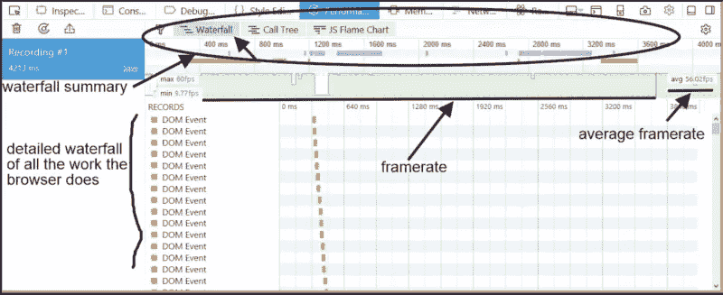
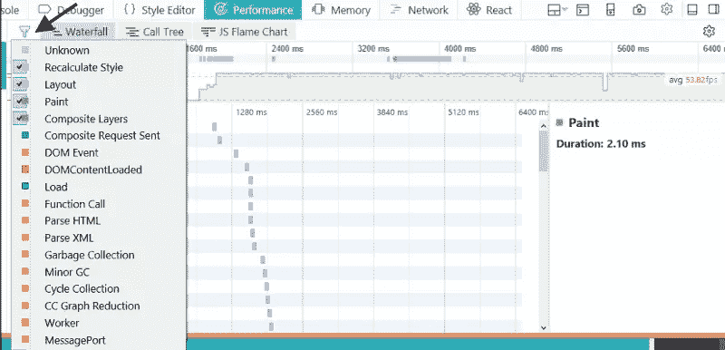
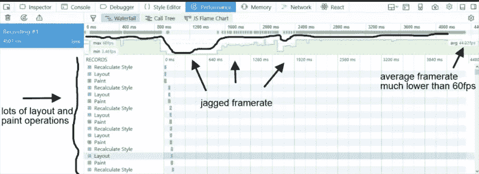
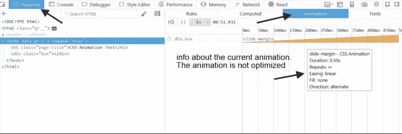
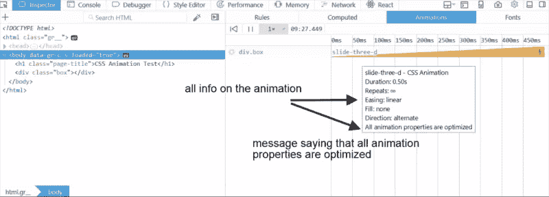

# 优化 CSS:用 DevTools 调整动画性能

> 原文：<https://www.sitepoint.com/check-css-animation-performance-with-the-browsers-dev-tools/>

本文是与 SiteGround 合作创作的系列文章的一部分。感谢您对使 SitePoint 成为可能的合作伙伴的支持。

众所周知，CSS 动画具有超强的表现力。虽然这是一些元素的简单动画的情况，但是如果你在编写动画时没有考虑到性能并增加了更多的复杂性，网站用户很快就会注意到这一点，并可能会感到恼火。

在这篇文章中，我介绍了一些有用的浏览器 DevTools 特性，这些特性将使您能够检查使用 CSS 制作动画时发生了什么。这样，当一个动画看起来有点起伏，你会有一个更好的想法为什么和你可以做些什么来修复它。

## CSS 性能开发工具

您的动画需要达到 60 fps(每秒帧数)才能在浏览器中流畅运行。比率越低，动画看起来就越差。这意味着浏览器只有不超过 16 毫秒的时间来完成一帧的工作。但是在这段时间里它做了什么呢？您如何知道您的浏览器是否跟上了所需的帧速率？

我认为在评估一部动画的质量时，没有什么能打败用户体验。然而，现代浏览器中的开发工具虽然并不总是 100%可靠，但已经变得越来越智能，使用它们您可以做很多事情来审查、编辑和调试您的代码。

当您需要检查帧速率和 CSS 动画性能时也是如此。它是这样工作的。

## 探索 Firefox 中的性能工具

在本文中，我使用 Firefox 性能工具。另一个大竞争者是 Chrome 性能工具。你可以选择你最喜欢的，因为两种浏览器都提供了强大的性能特性。

要在 Firefox 中打开开发者工具，请选择以下选项之一:

*   右键单击您的网页并在上下文菜单中选择 *Inspect Element*
*   如果使用键盘，在 Windows 和 Linux 上按`Ctrl + Shift + I`或者在 macOS 上按`Cmd + Opt + I`。

接下来，点击*性能*选项卡。在这里，您可以找到让您开始录制网站表现的按钮:


按下该按钮，等待几秒钟或在页面上执行一些操作。完成后，点击*停止录制演奏*按钮:


在一瞬间，Firefox 向您展示了大量组织良好的数据，这些数据将帮助您了解您的代码遇到了哪些问题。

在*性能*面板中记录的结果如下所示:



*瀑布*部分非常适合检查与 CSS 过渡和关键帧动画相关的问题。其他部分是*调用树*和 *JS 火焰图*，你可以用它们来找出你的 JavaScript 代码中的瓶颈。

瀑布顶部有一个摘要部分和一个详细的细目分类。在这两种情况下，数据都用颜色编码:

*   黄色条指的是 JavaScript 操作。
*   紫色条表示计算 HTML 元素的 CSS 样式(重新计算样式)和布局页面(布局)。布局操作对于浏览器来说是相当昂贵的，所以如果你动画化了包含重复布局的属性(也称为*重排*——比如`margin`、`padding`、`top`、`left`等)。—结果可能很简单。
*   绿色条表示将元素绘制到一个或多个位图中(Paint)。动画属性如`color`、`background-color`、`box-shadow`等。，涉及昂贵的绘制操作，这可能是动画缓慢和用户体验差的原因。

您还可以过滤想要检查的数据类型。例如，我只对与 CSS 相关的数据感兴趣，所以我可以通过单击屏幕左上角的过滤器图标来取消选择其他所有内容:



瀑布摘要下方的绿色大条代表帧速率信息。

一个健康的代表看起来很高，但最重要的是，一致——也就是说，没有太多深的差距。

让我们用一个例子来说明这一点。

### 运行中的性能工具

这是一个使用`@keyframes`关键字的简单的 [CSS 动画](https://developer.mozilla.org/en-US/docs/Web/CSS/CSS_Animations/Using_CSS_animations)。测试页面如下所示:


紫色的矩形盒子无限循环地滑入和滑出视野。

我已经通过动画制作了代表屏幕上矩形框的`<div>`元素的`margin-left`属性。下面是`@keyframes`动画块的样子:

```
@keyframes slide-margin {
  100% {
    margin-left: 0;
  }
}
```

我从这个动画中获得的性能数据如下所示:



帧率视觉看起来有点参差不齐，帧率平均为 44.82 fps，有点低。

此外，请注意动画期间发生的所有布局和绘制操作。这些是浏览器在其主线程上执行的开销很大的操作，对性能有负面影响。

最后，如果您访问*检查器*工具，单击*动画*部分并将鼠标悬停在动画名称上，会弹出一个信息框，显示当前动画的所有相关数据。如果你的动画被优化了，会有一个消息来说明这个事实。在这种情况下，没有消息:



现在，我将更改我的代码，并在浏览器使用这个`@keyframes`块激活 CSS `translate3d()`属性时制作一个新的记录:

```
@keyframes slide-three-d {
  100% {
    transform: translate3d(0, 0, 0);
  }
}
```

这是表演的录音:


现在帧速率更高了(56.83 fps)，瀑布显示没有昂贵的布局和绘画操作。

此外，如果您打开开发者工具的*检查器*标签，访问*动画*面板并将鼠标悬停在动画的名称上，您可以看到如下内容:



动画名称相关的信息框表明所有动画都经过了优化，这对网站访问者来说是个好消息。

## 仅动画 CSS *不透明度*、*变换*和*滤镜*

你可能以前听过这条建议，但为了以防万一，它值得再看一遍:如果你想让你的动画流畅，只动画 CSS 不透明度，变换和过滤器。动画会让你的浏览器在很短的时间内执行昂贵的任务，这通常不会产生最好的结果。

正如浏览器中的性能工具所证实的，重复的布局和绘制操作不是你的朋友。

然而，每个浏览器处理 CSS 属性的方式都有所不同。如果你想确切地知道哪个浏览器触发了哪个属性的布局和绘制操作(特别是在更新这些属性的值时，这是 web 动画所涉及的)，请前往 [CSS Triggers](https://csstriggers.com/) 。

为了确保高性能的动画，一种流行的方法是强制浏览器将更改一些属性的工作交给 GPU(图形处理单元)，这减轻了浏览器主线程的一些压力，并利用了硬件加速。你可以通过使用 [`will-change` CSS 属性](https://developer.mozilla.org/en/docs/Web/CSS/will-change)，或者`translateZ(0)` 和`translate3d(0,0,0)`来实现。所有这些技巧都会起作用，但是如果你做得太多，你实际上可能会得到你试图避免的东西，即恶作剧动画。

我不打算详细介绍 web 动画性能的硬件加速，但是如果您想深入了解，可以看看下面列出的资源。

## 资源

*   Paul Lewis 和 Paul Irish 制作的高性能动画
*   马克斯·伍约维奇的《CSS 动画和过渡性能:在浏览器中寻找》
*   保罗·刘易斯和萨姆·索罗古德的动画和表演
*   [坚持仅合成器属性和管理层数](https://developers.google.com/web/fundamentals/performance/rendering/stick-to-compositor-only-properties-and-manage-layer-count)Paul Lewis
*   Sara Soueidan 的 GPU 合成 CSS 技巧
*   Nick Salloum 对 CSS 将改变属性的介绍
*   由 MDN 制作 CSS 属性动画

## 分享这篇文章