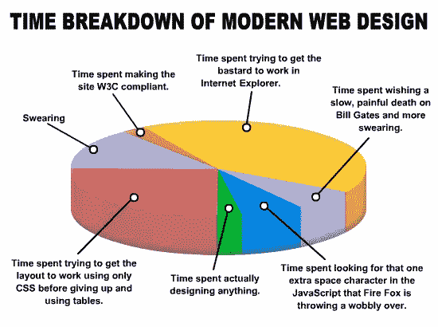

# Internet Explorer 之后的清理工作

> 原文：<https://www.sitepoint.com/cleaning-house-after-internet-explorer/>

对于前端开发来说，新的一年开局不错。1 月 12 日，[微软终止了对旧版 ie 浏览器](https://www.microsoft.com/en-us/WindowsForBusiness/End-of-IE-support)的支持。全世界数以百万计的开发者为这个消息欢欣鼓舞。定义新千年开始的浏览器大战的最后痕迹终于被平息了。

至少在过去十年中，各种版本的 Internet Explorer 一直是各地 web 设计人员和前端开发人员的克星。Firefox、Opera 以及后来的 Chrome 的崛起向世界展示了网络可以变得更强大、更快速、更安全。然而，由于担心那些没有(或不能)离开 Internet Explorer 的人会破坏网络，我们被迫跳过重重障碍，竭尽全力去迎合这些传统浏览器的怪癖。有一个众所周知的饼状图图像(我能找到的最早的图像是 2007 年在[www.dezinerfolio.com](http://www.dezinerfolio.com/wp-content/uploads/2007/04/1985.jpg)上出现的)展示了社区的感受:



幸运的是，现在情况好多了。我们只需要处理三叉戟引擎的最后一个化身，即 Internet Explorer 11，它已经是一个与其竞争对手不相上下的坚实的现代浏览器。因此，是时候清理门户，扔掉过时的工具、流程和技术了。淘汰旧的…

## 不再有浏览器黑客

我们武器库中的第一件武器是浏览器黑客。黑客是一种看似不正确的声明，它利用了渲染引擎中的一些解析错误。它用于用一个值覆盖标准声明，该值将使布局在特定的浏览器上看起来和运行起来都正常。有针对单一版本的 Internet Explorer 的攻击，也有针对多个版本的攻击。可以根据黑客攻击的形式进行进一步的分类:

*   选择器黑客:这些黑客通常用于排除不理解新语法的旧版本 IE。
*   **属性/值或属性攻击**:这些是原始攻击——利用解析引擎中的漏洞来攻击特定的旧版本。
*   **媒体查询技巧**:基于对`@media`声明语法的支持，它们被用于定位/过滤各种版本的浏览器(不仅仅是 Internet Explorer)。
*   **JavaScript hacks** :它们用于“浏览器嗅探”，根据 JavaScript 引擎支持的各种功能检测特定版本的 Internet Explorer。

黑客的使用既复杂又令人沮丧。有时，您必须一个接一个地级联几个黑客，因为一些解析错误(允许黑客的存在)在后续版本中得到修复，而没有消除首先需要黑客的渲染问题。让我们来看看这类攻击的几个例子，仅限于最近退役的三个版本:

```
/*========== Selector Hacks ==========*/

/* Internet Explorer 10+ */
_:-ms-input-placeholder, :root .selector {}

/* Everything except Internet Explorer 9 and lower */
html[lang='\
en'] .selector 
{}

/*========== Property/Value Hacks ==========*/

/* Internet Explorer 6-8 */
.selector { property: value\9; }
.selector { property/*\**/: value\9; }

/*========== Media Query Hacks ==========*/

/* Internet Explorer 8 */
@media \0screen {}

/* Internet Explorer 10+ */
@media screen and (-ms-high-contrast: active), (-ms-high-contrast: none) {}

/*========== JavaScript Hacks ==========*/

/* Internet Explorer 6-10 */
var isIE = !!window.ActiveXObject;

/* Internet Explorer 8-10 */
var isIE = document.all && document.querySelector;
```

要从代码中删除更全面的黑客列表，请访问 [Browserhacks](http://browserhacks.com/) 。

## 拜拜条件注释

正如我们在上面看到的，CSS hacks 的使用很混乱，容易出错，而且(对于那些痴迷于代码的人来说)会使样式表无法通过验证。事情已经升级到这样的地步，2005 年 11 月，微软的家伙们介入并呼吁采取行动让 CSS hacks 消亡，敦促开发者使用[条件注释](https://msdn.microsoft.com/en-us/library/ms537512.aspx)来代替。

最初，条件注释用于为某些版本的 Internet Explorer 加载额外的样式表。当时，符合标准的浏览器和 Internet Explorer 之间的代码差异很大，足以使这种做法有效。当 HTML5 成为现实时，它也用于加载 polyfills，为新特性提供缺失的支持(我们将在本文后面触及这个主题)。虽然这种实践主要用于 IE6–7 的目标代码，但您仍可能在一些遗留代码中遇到它。让我们来看看一些代码示例:

### 用于加载额外样式表的条件注释

```
<!--[if lte IE 8]><link rel="stylesheet" href="lte-ie-8.css"><![endif]-->
<!--[if lte IE 7]><link rel="stylesheet" href="lte-ie-7.css"><![endif]-->
<!--[if lte IE 6]><link rel="stylesheet" href="lte-ie-6.css"><![endif]-->
```

### 用于加载 JavaScript 聚合填充的条件注释

*(代码摘自默认[引导启动模板](http://getbootstrap.com/getting-started/) )*

```
<!--[if lt IE 9]>
  <script src="https://oss.maxcdn.com/html5shiv/3.7.2/html5shiv.min.js"></script>
  <script src="https://oss.maxcdn.com/respond/1.4.2/respond.min.js"></script>
<![endif]-->
```

这种方法的主要问题是，以这种方式为目标的每个版本的 Internet Explorer 都会产生额外的 HTTP 请求。开发人员被迫寻找提供更高性能的方法。结果是部署了条件注释来给`<html>`标签添加额外的类。这种做法更受欢迎，尤其是被 [HTML5 样板](https://html5boilerplate.com/)框架所使用。到那时，Internet Explorer 6 要么被忽略，要么被适度降级处理，而更现代的版本(IE7–9)与其竞争对手(Firefox、Chrome、Safari 和 Opera)之间的差异小到不足以保证整个额外的样式表。由于添加到`<html>`标签中的类提供了额外的特性，所以可以进行一些小的调整。这是当今最有可能遇到的例子，如下例所示:

### 用于向`<html>`标签添加额外类的条件注释

```
<!--[if IE 7]>   <html class="ie7"><![endif]-->
<!--[if IE 8]>   <html class="ie8"><![endif]-->
<!--[if IE 9]>   <html class="ie9"><![endif]-->
<!--[if gt IE 9]><!--><html><!--<![endif]-->
```

### 使用额外类的 CSS 代码

```
.foo { color: black; }
.ie7 .foo { color: blue; } /* IE7 */
.ie8 .foo { color: green; } /* IE8 */
.ie9 .foo { color: red; } /* IE9 */
```

Internet Explorer 10 的推出带来了条件注释的终结，因为在这个版本中它们不再受支持。特征检测(使用 [Modernizr](https://modernizr.com/) )是渐进增强或适度退化的新标准。只有需要向后兼容的网站或框架还在使用它们，主要是加载 polyfills，正如我们在上面的例子中看到的。

## 精简您的 JavaScript 库

我们在上面已经看到，缺乏对现代特性的支持常常被使用条件注释的聚合填充所堵塞。如果您的应用程序或网站正在使用这样的脚本，您现在可以安全地删除它们。但并不是每一种情况都像这种情况一样清晰。让我们用几个相关的例子进一步扩展这个话题。

众所周知，jQuery 是网络上使用最多的 JavaScript 库，记录上有超过 5300 万个网站(根据 BuiltWith.com 的数据)。jQuery 的诞生是因为需要通过覆盖特性支持的差异来平衡浏览器之间的竞争。随着时间的推移，遗留支持已经达到了这样的水平，以至于在 2013 年 jQuery 分成了两个分支:`1.x.x`维持对旧版本 Internet Explorer 的支持，而`2.x.x` [放弃了与 Internet Explorer 6–8](http://blog.jquery.com/2013/04/18/jquery-2-0-released/)相关的所有功能。最近一次更新于 2016 年 1 月 8 日，已经公布为[移到`3.x.x`T11 之前的最后一次。因此，你要么留在`1.x.x`分支，直接跳到`3.x.x`，要么现在切换到`2.x.x`，获得尽可能高的效率。](http://blog.jquery.com/2016/01/08/jquery-2-2-and-1-12-released/#8211;2%E2%80%932-and%E2%80%931%E2%80%9312-released/)

还有一件事要考虑。Internet Explorer 11 和 Edge 更好地集成了原生方法(特别是对于 DOM 导航和操作),这些方法在过去需要 jQuery 才能跨浏览器正常工作。在某些情况下，当脚本可以被适当重构时，甚至有可能完全移除 jQuery，只使用普通的 JavaScript。

另一个例子是[Modernizr](https://modernizr.com/)——我们之前已经提到过。这个库的工作方式是对支持的特性执行一组测试，并将结果标记为一个附加到`<html>`元素的类。通过一点点研究(主要是关于[CanIUse.com](http://caniuse.com/))，我们可以禁用旨在隔离旧版本 Internet Explorer 不支持的功能的测试。如果你的页面只使用主流特性，有广泛的浏览器支持，你可能根本不需要加载 Modernizr。

同样的方法也适用于您可能使用的任何其他聚合填充脚本。检查它所修补的特性在现代浏览器中是否受支持，如果不再需要就把它去掉。

## 移除专有 CSS 值

曾几何时，Internet Explorer 是唯一一个能够在页面中实现惊人效果的浏览器，这要归功于一项名为 [ActiveX Filters](https://msdn.microsoft.com/en-us/library/ms532853.aspx) 的专有技术。开发人员能够在加载新页面时制作静态效果(例如不透明)、创建渐变背景、旋转和变换元素或制作过渡效果。虽然 CSS3 为大多数这些效果提供了标准的替代方案，但 ActiveX 过滤器在很长一段时间内仍然是 Internet Explorer 唯一可用的选项。仍然会遇到这些声明，尤其是在手工编码的样式表中。因此，请留意类似下面的语句，您不再需要这些语句了:

```
.foo {
  /* Internet Explorer 4.0 syntax */
  filter:filtername(sProperties);

  /* Internet Explorer 5.5 syntax */
  filter: progid:DXImageTransform.Microsoft.filtername(sProperties)";

  /* Internet Explorer 8 syntax */
  -ms-filter: 'progid:DXImageTransform.Microsoft.filtername(sProperties)'";
}
```

如果你写 CSS 的过程包括使用自动前缀，那么你就不必担心这个话题。一个好的插件将会保持最新的支持水平。

## 去掉过时的 Meta 标签

Internet Explorer 8 引入了一种新的软件机制，称为“兼容性视图”，旨在改变呈现模式，使旧网站仍能正常呈现。这是在一个`X-UA-Compatible`声明的帮助下实现的，要么作为一个`<meta />`元素，要么通过 HTTP 头。这种方法甚至一度在[谷歌网络工具包](http://www.gwtproject.org/doc/latest/DevGuideIE9.html)中被推荐。如今，由于只支持 Internet Explorer 11 和 Microsoft Edge，这些标签已经过时。我们可以在这里看到一个例子，说明您需要寻找什么:

```
<meta http-equiv="X-UA-Compatible" content="IE=9">
<meta http-equiv="X-UA-Compatible" content="IE=Edge" />
```

## 清理您的自定义 Web 字体

很长一段时间，网页设计师在字体选择上受到限制。人们从各种操作系统上可用的系统字体中收集了许多“网络安全”字体列表(例如 [CSS 字体堆栈](http://www.cssfontstack.com/))。随着`@font-face`规则的引入，每个人现在都可以直接或者从像[谷歌网络字体](https://www.google.com/fonts)和 [TypeKit](https://typekit.com/) 这样的服务中加载自定义字体。让我们不要忘记聚集了巨大人气的图标字体过多。Chris Coyier 使用@font-face 在[上有一个全面的条目，以防你需要刷新你的记忆。](https://css-tricks.com/snippets/css/using-font-face/)

随着对 Internet Explorer 9 支持的结束，我们现在可以安全地抛弃*。eot* (甚至还有*。ttf* )字体文件，以及它们相关的 CSS 条目。如果您需要管理图标字体，这尤其有用，因为更新过程大大简化了(尽管越来越多的人推荐使用 SVG 图标而不是图标字体)。

## 简化您的跨浏览器测试过程

跨浏览器测试和调试一直是一个乏味的过程，尤其是当需要 Internet Explorer 兼容性时。随着时间的推移，人们找到了各种各样的解决方案:从像 [IETester](http://tredosoft.com/Multiple_IE) 或 [Multiple IE](http://www.my-debugbar.com/wiki/IETester/HomePage) 这样的应用程序。有些人使用虚拟机，但主要问题是每个实例仍然需要有效的操作系统许可证。然后微软的人介入进来，提供了“定时炸弹”[虚拟机，这些虚拟机结合了 Windows 和 Internet Explorer](https://dev.windows.com/en-us/microsoft-edge/tools/vms/windows/) 。一个人所要做的就是从可用列表(目前包含[虚拟盒](https://www.virtualbox.org/)、 [VMWare](http://www.vmware.com/) 、[流浪者](https://www.vagrantup.com/)和 [HyperV](http://www.microsoft.com/en-us/server-cloud/solutions/virtualization.aspx) )中选择自己喜欢的虚拟化系统，下载想要的虚拟机镜像，启动它并开始工作。

所有这些选项今天仍然可用，如果你感到怀旧，并想向新来的孩子解释你是如何在没有 Web 开发工具的情况下在 Internet Explorer 6 上调试代码的。但是没有理由让它们成为正常开发过程的一部分。

## 结论

调试遗留 Internet Explorer 版本的代码曾经是一个复杂(有时甚至令人沮丧)的过程。我们记住了最常见的浏览器错误及其对策。[位置就是一切](http://www.positioniseverything.net/)和[怪癖模式](http://www.quirksmode.org/)曾经是我们书签列表的顶端。幸运的是，随着网络的不断发展，我们能够将那些日子抛在身后，抛弃那些过时的工具和实践。现在是彻底打扫房间的时候了。

## 分享这篇文章