# 使用 React Native Elements 和 Expo 克隆 Tinder

> 原文：<https://www.sitepoint.com/cloning-tinder-using-react-native-elements-expo/>

在手机上制作完美的像素布局很难。尽管 React Native 比其原生版本更容易，但要让移动应用程序达到完美仍需要大量工作。

在本教程中，我们将克隆最著名的约会应用程序，Tinder。然后我们将了解一个叫做 [React Native Elements](https://react-native-training.github.io/react-native-elements/) 的 UI 框架，它使得 React Native 应用程序的样式化变得容易。

由于这只是一个布局教程，我们将使用 Expo，因为它比普通的老式`react-native-cli`更容易设置。我们还将利用大量虚拟数据来制作我们的应用程序。

我们将总共制作四个屏幕— *首页*、*最佳选择*、*个人资料*和*消息*。

*想从头开始学习 React Native？这篇文章是从我们的优质图书馆摘录的。使用 SitePoint Premium 获得 React 本地书籍的完整收藏，涵盖基础知识、项目、技巧和工具&。[现在就加入，每月仅需 9 美元](https://www.sitepoint.com/premium/products/Z2lkOi8vbGVhcm5hYmxlL1Byb2R1Y3QvMzA3?utm_source=blog&utm_medium=articles)。*

## 先决条件

对于本教程，你需要有一个基本的知识[反应本地](https://facebook.github.io/react-native/)和一些熟悉[博览会](https://expo.io/)。您还需要在移动设备上安装 Expo 客户端，或者在计算机上安装兼容的模拟器。如何做到这一点的说明可以在[这里](https://docs.expo.io/versions/latest/introduction/installation/)找到。

你还需要对 React Native 中的[样式](https://facebook.github.io/react-native/docs/style)有一个基本的了解。React Native 中的样式基本上是一种类似于 CSS 的抽象，只有一些不同。你可以在[的样式备忘单](https://github.com/vhpoet/react-native-styling-cheat-sheet)中获得所有属性的列表。

在整个教程中，我们将使用`yarn`。如果你还没有安装`yarn`，从[这里](https://yarnpkg.com/en/docs/install)安装。

还要确保你已经在电脑上安装了`expo-cli`。

如果尚未安装，请继续安装:

```
$ yarn global add expo-cli 
```

为了确保我们在同一页上，这些是本教程中使用的版本:

*   节点 11.14.0
*   国家预防机制 6.4.1
*   纱线 1.15.2
*   世博会 2.16.1

如果你有一段时间没有更新`expo-cli`，请确保更新，因为`expo`版本很快就会过时。

我们要建造一个看起来像这样的东西:

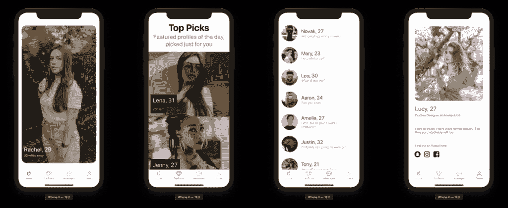

如果只是想克隆回购，完整代码可以在 [GitHub](https://github.com/deadcoder0904/expo-tinder) 上找到。

## 入门指南

让我们使用`expo-cli`建立一个新的 Expo 项目:

```
$ expo init expo-tinder 
```

然后它会让你选择一个模板。你应该选择`tabs`并点击`Enter`。

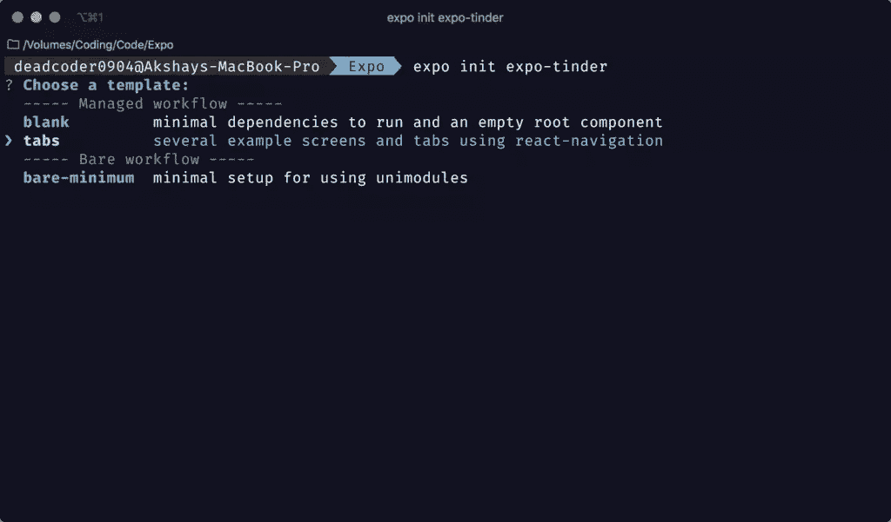

然后它会让你给项目命名。键入`expo-tinder`并再次点击`Enter`。

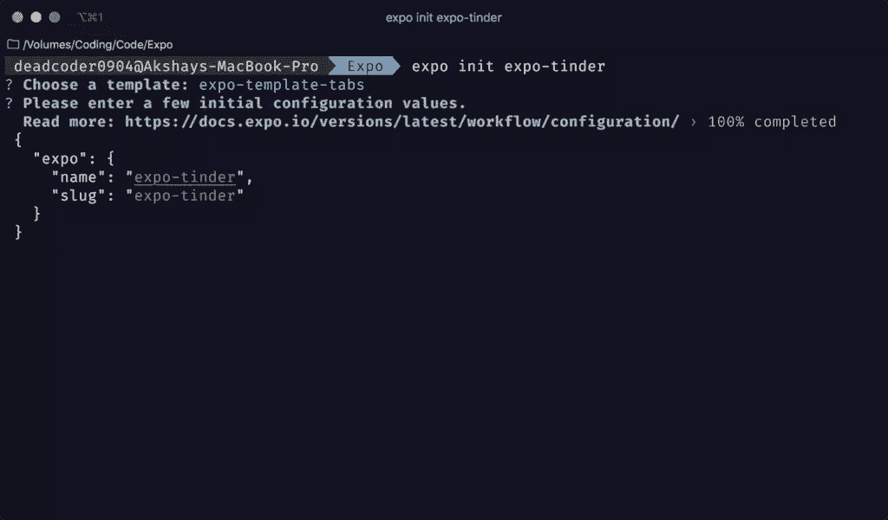

最后，它会要求你按下`y`来安装与`yarn`的依赖关系，或者按下`n`来安装与`npm`的依赖关系。按下`y`。

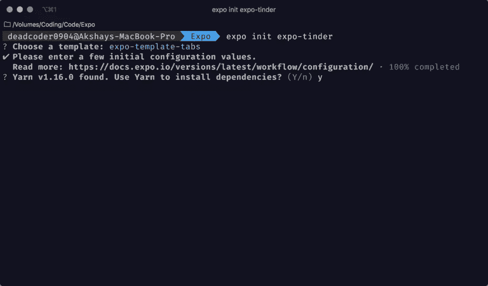

这将使用`expo-cli`启动一个全新的 React 原生应用。

## 反应本地元素

React Native Elements 是一个跨平台的 UI 工具包，为 React Native 提供跨 Android、iOS 和 Web 的一致设计。

它易于使用，完全由 JavaScript 构建。这也是 React Native 的第一个 UI 套件。

它允许我们以我们想要的方式完全定制任何组件的样式，因此每个应用程序都有自己独特的外观和感觉。

它也是开源的，由一群优秀的开发者组成的社区 T2 提供支持。

您可以轻松构建漂亮的应用程序。

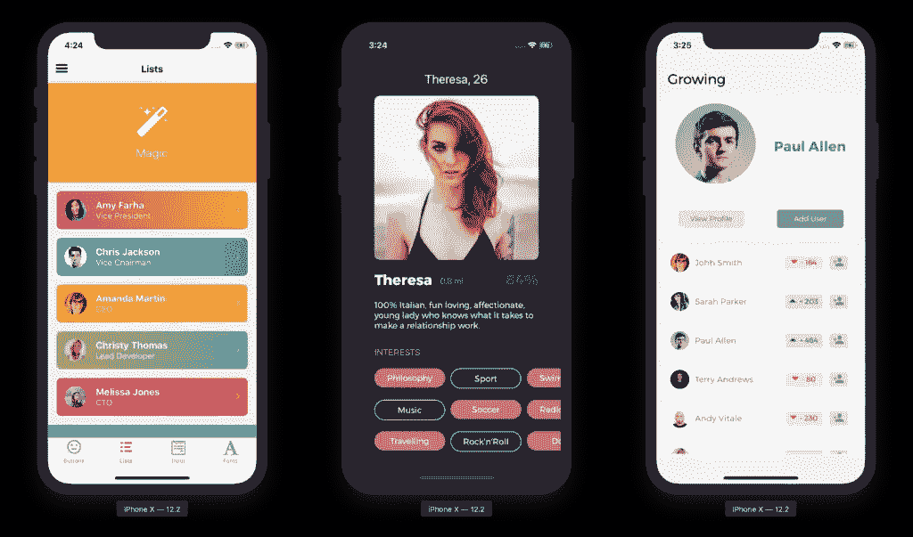

## 克隆 Tinder UI

我们已经创建了一个名为`expo-tinder`的项目。

要运行项目，请键入以下内容:

```
$ yarn start 
```

按`i`运行 iOS 模拟器。这将自动运行 iOS 模拟器，即使它没有打开。

按`a`运行 Android 模拟器。注意，在输入`a`之前，模拟器必须已经安装并启动。否则它将在终端中抛出一个错误。

它应该是这样的:

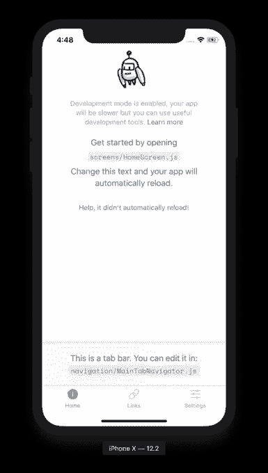

### 航行

初始设置已经为我们安装了`react-navigation`。默认情况下，底部的选项卡导航也可以工作，因为我们在`expo init`的第二步中选择了`tabs`。您可以通过点击**链接**和**设置**进行检查。

`screens/`文件夹负责标签改变时显示的内容。

现在，完全删除`HomeScreen.js`的内容，并替换为以下内容:

```
import React from 'react'
import { Text, View } from 'react-native'

class HomeScreen extends React.Component {
  render() {
    return (
      <View>
        <Text>Home Screen</Text>
      </View>
    )
  }
}

export default HomeScreen 
```

您现在应该会看到更新后的 UI:

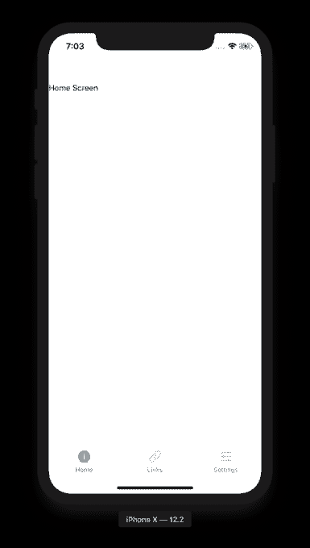

现在，我们将根据将要构建的应用程序来调整选项卡。对于我们的 Tinder 克隆版，我们将有四个屏幕:*主页*、*最佳选择*、*个人资料*和*消息*。

我们可以从`screens/`文件夹中完全删除`LinksScreen.js`和`SettingsScreen.js`。请注意，我们的应用程序中断了，红色屏幕上满是错误。

这是因为我们在`navigation/`文件夹中链接了它。打开`navigation/`文件夹中的`MainTabNavigator.js`。目前看起来是这样的:

```
import React from 'react';
import { Platform } from 'react-native';
import { createStackNavigator, createBottomTabNavigator } from 'react-navigation';

import TabBarIcon from '../components/TabBarIcon';
import HomeScreen from '../screens/HomeScreen';
import LinksScreen from '../screens/LinksScreen';
import SettingsScreen from '../screens/SettingsScreen';

const HomeStack = createStackNavigator({
  Home: HomeScreen,
});

HomeStack.navigationOptions = {
  tabBarLabel: 'Home',
  tabBarIcon: ({ focused }) => (
    <TabBarIcon
      focused={focused}
      name={
        Platform.OS === 'ios'
          ? `ios-information-circle${focused ? '' : '-outline'}`
          : 'md-information-circle'
      }
    />
  ),
};

const LinksStack = createStackNavigator({
  Links: LinksScreen,
});

LinksStack.navigationOptions = {
  tabBarLabel: 'Links',
  tabBarIcon: ({ focused }) => (
    <TabBarIcon
      focused={focused}
      name={Platform.OS === 'ios' ? 'ios-link' : 'md-link'}
    />
  ),
};

const SettingsStack = createStackNavigator({
  Settings: SettingsScreen,
});

SettingsStack.navigationOptions = {
  tabBarLabel: 'Settings',
  tabBarIcon: ({ focused }) => (
    <TabBarIcon
      focused={focused}
      name={Platform.OS === 'ios' ? 'ios-options' : 'md-options'}
    />
  ),
};

export default createBottomTabNavigator({
  HomeStack,
  LinksStack,
  SettingsStack,
}); 
```

完全删除对`LinksStack`和`SettingsStack`的引用，因为我们的应用程序中不需要这些屏幕。它应该是这样的:

```
import React from 'react'
import { Platform } from 'react-native'
import {
  createBottomTabNavigator,
  createStackNavigator,
} from 'react-navigation'
import TabBarIcon from '../components/TabBarIcon'
import HomeScreen from '../screens/HomeScreen'

const HomeStack = createStackNavigator({
  Home: HomeScreen,
})

HomeStack.navigationOptions = {
  tabBarLabel: 'Home',
  tabBarIcon: ({ focused }) => (
    <TabBarIcon
      focused={focused}
      name={
        Platform.OS === 'ios'
          ? `ios-information-circle${focused ? '' : '-outline'}`
          : 'md-information-circle'
      }
    />
  ),
}

export default createBottomTabNavigator({
  HomeStack,
}) 
```

继续在`screens/`文件夹中创建`TopPicksScreen.js`、`ProfileScreen.js`和`MessagesScreen.js`。

在`TopPicksScreen.js`中增加以下内容:

```
import React from 'react'
import { Text, View } from 'react-native'

class TopPicksScreen extends React.Component {
  render() {
    return (
      <View>
        <Text>Top Picks Screen</Text>
      </View>
    )
  }
}

export default TopPicksScreen 
```

在`ProfileScreen.js`中增加以下内容:

```
import React from 'react'
import { Text, View } from 'react-native'

class ProfileScreen extends React.Component {
  render() {
    return (
      <View>
        <Text>Profile Screen</Text>
      </View>
    )
  }
}

export default ProfileScreen 
```

在`MessagesScreen.js`中增加以下内容:

```
import React from 'react'
import { Text, View } from 'react-native'

class MessagesScreen extends React.Component {
  render() {
    return (
      <View>
        <Text>Messages Screen</Text>
      </View>
    )
  }
}

export default MessagesScreen 
```

让我们继续更改`components/TabBarIcon.js`，因为我们将需要在底部的选项卡导航中使用自定义图标。目前看起来是这样的:

```
import React from 'react';
import { Icon } from 'expo';

import Colors from '../constants/Colors';

export default class TabBarIcon extends React.Component {
  render() {
    return (
      <Icon.Ionicons
        name={this.props.name}
        size={26}
        style={{ marginBottom: -3 }}
        color={this.props.focused ? Colors.tabIconSelected : Colors.tabIconDefault}
      />
    );
  }
} 
```

我们在这里做的唯一一件事是添加一个`Icon`道具，这样我们就可以有不同类型的`Icon`而不仅仅是`Ionicons`。目前支持的不同类型有`AntDesign`、`Entypo`、`EvilIcons`、`Feather`、`FontAwesome`、`FontAwesome5`、`FontAwesome5Brands`、`Foundation`、`Ionicons`、`MaterialCommunityIcons`、`MaterialIcons`、`SimpleLineIcons`、`Octicons`和`Zocial`。

你可以从 [@expo/vector-icons](https://expo.github.io/vector-icons/) 目录中选择各种不同的图标。它在[@ ob ador/react-native-vector-icons](https://oblador.github.io/react-native-vector-icons/)周围添加了一个兼容层，以与世博会资产系统协同工作。

`TabBarIcon.js`现在应该是这样的:

```
import React from 'react'
import Colors from '../constants/Colors'

export default class TabBarIcon extends React.Component {
  render() {
    const { Icon, name, focused } = this.props
    return (
      <Icon
        name={name}
        size={26}
        style={{ marginBottom: -3 }}
        color={focused ? Colors.tabIconSelected : Colors.tabIconDefault}
      />
    )
  }
} 
```

现在我们可以将`Icon` prop 传递给上面的`TabBarIcon`组件来加载不同的图标。

我们需要改变`MainTabNavigator.js`文件夹中`HomeStack`的实现，以与新的`TabBarIcon`组件的`Icon`属性结合。

将`HomeStack`变量实现改为:

```
import { Icon } from 'expo'

const HomeStack = createStackNavigator({
  Home: HomeScreen,
})

HomeStack.navigationOptions = {
  tabBarLabel: 'Home',
  tabBarIcon: ({ focused }) => (
    <TabBarIcon
      Icon={Icon.MaterialCommunityIcons}
      focused={focused}
      name="fire"
    />
  ),
} 
```

这里唯一的变化是添加了`Icon={Icon.MaterialCommunityIcons}`，因为我们改变了`TabBarIcon`的实现来接受图标源，所以我们可以使用来自不同提供者的不同类型的图标。

现在需要先加载这些图标。否则，在图标出现之前，我们会看到一闪而过的空白屏幕。为此，我们需要通过添加以下内容来更改`App.js`:

```
Font.loadAsync({
  // This is the font that we're using for our tab bar
  ...Icon.MaterialIcons.font,
  ...Icon.MaterialCommunityIcons.font,
  ...Icon.FontAwesome.font,
  ...Icon.Feather.font,
}), 
```

在我们的应用程序中的某些地方会用到这些字体类型。这就是为什么我们只包括了四种字体。例如，`MainTabNavigator.js`文件中的`HomeStack`变量使用了`MaterialCommunityIcons`，如上图。

我们还将把我们的`StatusBar`隐藏在`App.js`中:

```
<StatusBar hidden /> 
```

我们还将替换在`App.js`中使用的资产:

```
Asset.loadAsync([
  require('./asseimg/splash.png'),
  require('./asseimg/icon.png'),
]), 
```

`App.js`文件现在应该看起来像这样:

```
import { AppLoading, Asset, Font, Icon } from 'expo'
import React from 'react'
import { StatusBar, StyleSheet, View } from 'react-native'
import AppNavigator from './navigation/AppNavigator'

export default class App extends React.Component {
  state = {
    isLoadingComplete: false,
  }

  render() {
    if (!this.state.isLoadingComplete && !this.props.skipLoadingScreen) {
      return (
        <AppLoading
          startAsync={this._loadResourcesAsync}
          onError={this._handleLoadingError}
          onFinish={this._handleFinishLoading}
        />
      )
    } else {
      return (
        <View style={styles.container}>
          <StatusBar hidden />
          <AppNavigator />
        </View>
      )
    }
  }

  _loadResourcesAsync = async () => {
    return Promise.all([
      Asset.loadAsync([
        require('./asseimg/splash.png'),
        require('./asseimg/icon.png'),
      ]),
      Font.loadAsync({
        // This is the font we're using for our tab bar
        ...Icon.MaterialIcons.font,
        ...Icon.MaterialCommunityIcons.font,
        ...Icon.FontAwesome.font,
        ...Icon.Feather.font,
      }),
    ])
  }

  _handleLoadingError = error => {
    // In this case, you might want to report the error to your error
    // reporting service, such as Sentry
    console.warn(error)
  }

  _handleFinishLoading = () => {
    this.setState({ isLoadingComplete: true })
  }
}

const styles = StyleSheet.create({
  container: {
    flex: 1,
    backgroundColor: '#fff',
  },
}) 
```

我们还需要将上述所有屏幕— `TopPicksScreen.js`、`ProfileScreen.js`和`MessagesScreen.js`—在`navigation/`文件夹内的`MainTabNavigator.js`中的`screens/`内链接起来，如下图所示:

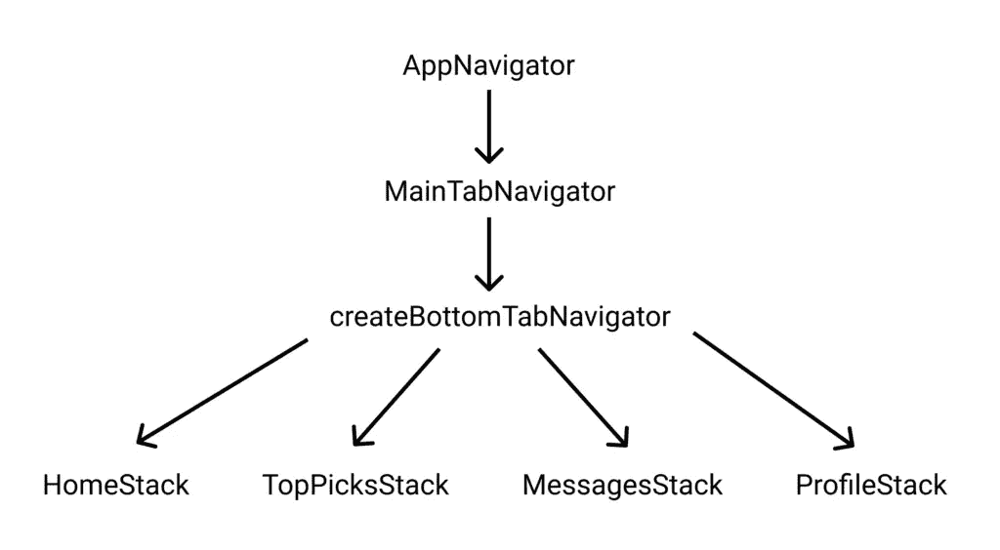

另外在`MainTabNavigator.js`中增加以下内容:

```
import MessagesScreen from '../screens/MessagesScreen'
import ProfileScreen from '../screens/ProfileScreen'
import TopPicksScreen from '../screens/TopPicksScreen'

const TopPicksStack = createStackNavigator({
  TopPicks: TopPicksScreen,
})

TopPicksStack.navigationOptions = {
  tabBarLabel: 'TopPicks',
  tabBarIcon: ({ focused }) => (
    <TabBarIcon Icon={Icon.FontAwesome} focused={focused} name="diamond" />
  ),
}

const MessagesStack = createStackNavigator({
  Messages: MessagesScreen,
})

MessagesStack.navigationOptions = {
  tabBarLabel: 'Messages',
  tabBarIcon: ({ focused }) => (
    <TabBarIcon Icon={Icon.FontAwesome} focused={focused} name="commenting-o" />
  ),
}

const ProfileStack = createStackNavigator({
  Profile: ProfileScreen,
})

ProfileStack.navigationOptions = {
  tabBarLabel: 'Profile',
  tabBarIcon: ({ focused }) => (
    <TabBarIcon Icon={Icon.Feather} focused={focused} name="user" />
  ),
} 
```

上面的代码创建了三个堆栈导航器— `TopPicksStack`、`MessagesStack`和`ProfileStack`。静态属性`navigationOptions`让我们将自己的标签和图标添加到底部选项卡。

此外，更改`createBottomTabNavigator`以确保`TopPicksStack`、`MessagesStack`和`ProfileStack`显示在底部选项卡导航中:

```
export default createBottomTabNavigator({
  HomeStack,
  TopPicksStack,
  MessagesStack,
  ProfileStack,
}) 
```

现在，您应该能够在底部选项卡导航中看到不同屏幕的不同图标，如下所示:

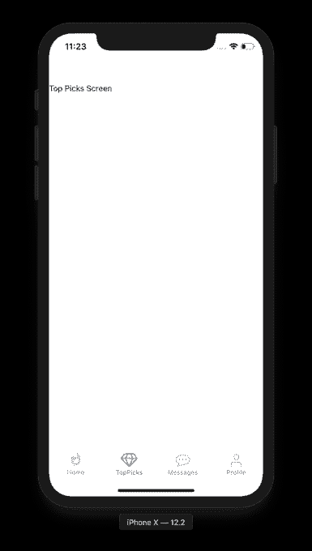

我们现在需要去掉每个屏幕上显示的标题，占据一些顶部空间。为了摆脱它，我们需要在`createStackNavigator`配置中添加`headerMode: 'none'`。

我们需要在`HomeStack`、`TopPicksStack`、`MessagesStack`和`ProfileStack`上添加。

`HomeStack`应该是这样的:

```
const HomeStack = createStackNavigator(
  {
    Home: HomeScreen,
  },
  {
    headerMode: 'none',
  },
) 
```

对其余的人也这样做。如果你检查一下，文本会出现在左上角，钟的正上方。

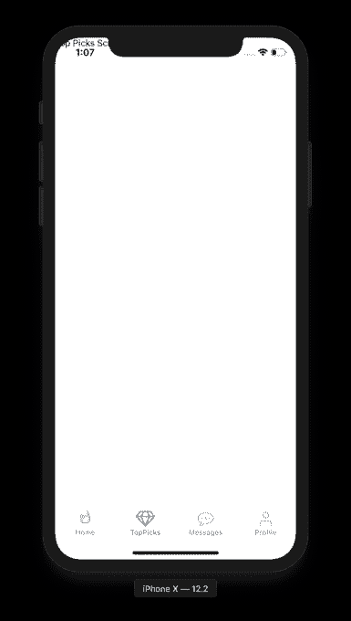

对此有一个简单的解决方法。我们需要使用`SafeAreaView`。`SafeAreaView`呈现设备安全区域边界内的内容。让我们进入`screens/`目录，将`HomeScreen.js`改为使用`SafeAreaView`，这样看起来就像这样:

```
import React from 'react'
import { SafeAreaView, Text } from 'react-native'

class HomeScreen extends React.Component {
  render() {
    return (
      <SafeAreaView>
        <Text>Home Screen</Text>
      </SafeAreaView>
    )
  }
}

export default HomeScreen 
```

它现在呈现设备边界内的内容。

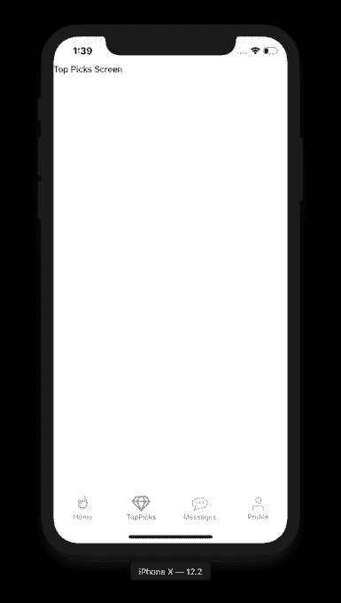

继续下去，并改变他们做同样的事情。

将`SafeAreaView`包装在每个组件中，而不是像`App.js`一样设置在根组件上，这是重复的。但是请注意，如果你尝试在`App.js`上这么做，这是行不通的。

请记住，`SafeAreaView`应该始终设置在屏幕组件或其中的任何内容上，而不是包裹整个导航器。你可以在这篇博客上了解更多。

### 屏幕

现在我们的导航已经解决了，我们可以开始布局了。

我们将使用一个名为 React Native Elements 的 UI 工具包，请安装它:

```
$ yarn add react-native-elements 
```

在开始任何操作之前，请确保从 [GitHub repo](https://github.com/deadcoder0904/expo-tinder) 中复制`assets/`目录，用于虚拟映像。

现在我们将开始在主屏幕上工作。

#### 主屏幕

在开始处理`HomeScreen.js`之前，让我们删除不必要的文件。转到`components/`文件夹，删除`StyledText.js`和`__tests__`文件夹。

现在让我们开始在主屏幕上工作。

首先，在`components/`文件夹中创建`Card.js`。我们将展示一张个人资料卡片，上面有这个人的姓名、年龄以及他们住的地方有多远。

我们将使用来自`react-native-elements`的[磁贴](https://react-native-training.github.io/react-native-elements/docs/tile.html)组件来显示我们的用户卡。

来自`react-native-elements`的`Tile`组件如下所示:

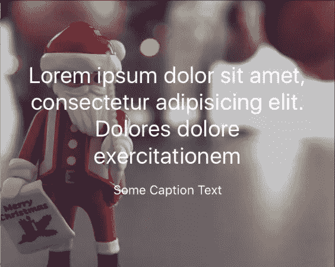

```
import React from 'react'
import { Platform, StyleSheet } from 'react-native'
import { Tile } from 'react-native-elements'
import Layout from '../constants/Layout'

const BOTTOM_BAR_HEIGHT = !Platform.isPad ? 29 : 49 // found from https://stackoverflow.com/a/50318831/6141587

export const Card = ({ pic, title, caption }) => (
  <Tile
    imageSrc={pic}
    imageContainerStyle={styles.imageContainer}
    activeOpacity={0.9}
    title={title}
    titleStyle={styles.title}
    caption={caption}
    captionStyle={styles.caption}
    containerStyle={styles.container}
    featured
  />
)

const styles = StyleSheet.create({
  container: {
    flex: 1,
    alignItems: 'center',
  },
  imageContainer: {
    width: Layout.window.width - 30,
    height: Layout.window.height - BOTTOM_BAR_HEIGHT * 6,
    borderRadius: 20,
    overflow: 'hidden', // this does magic
  },
  title: {
    position: 'absolute',
    left: 10,
    bottom: 30,
  },
  caption: {
    position: 'absolute',
    left: 10,
    bottom: 10,
  },
}) 
```

`Card`组件接受`pic`、`title`和`caption`，依次传递给`Tile`组件。

组件有一些额外的属性。`activeOpacity`是一个在按下磁贴时传递来控制不透明度的数字，这是可选的，但是默认值是 0.2，这使得它在按下时看起来是透明的，所以我们传递一个接近 1 的值来保持它不透明。`featured`道具改变了`Tile`的外观。当`featured`未指定或设置为`false`时，它会将文本保留在`title`中，并将`caption`支柱保留在图像上，而不是下方。

其余的是应用的样式，以获得正确的用户卡。`container`样式使用户卡居中。`imageContainer`有宽有高。`width`设置为设备的总宽度—30dp(设备像素)—而`height`设置为设备的总高度— `BOTTOM_BAR_HEIGHT * 6`。

我们从[stackoverflow.com](https://stackoverflow.com/a/50318831/6141587)那里得到`BOTTOM_BAR_HEIGHT`。

我们从`constants/Layout.js`文件中获得器件宽度，该文件主要包含以下内容:

```
import { Dimensions } from 'react-native'

const width = Dimensions.get('window').width
const height = Dimensions.get('window').height

export default {
  window: {
    width,
    height,
  },
  isSmallDevice: width < 375,
} 
```

然后我们给图像添加一个边界半径。但是不会应用边框半径。我们也需要`overflow: hidden`来让它工作。

然后我们定位我们的`title`和`caption`以使用`absolute`定位，并使它们出现在左下角，就在图像上方。

接下来，创建一个`utils/shuffleArray.js`文件，并将以下内容粘贴到其中:

```
// found at https://stackoverflow.com/a/46545530/6141587
const shuffleArray = array =>
  array
    .map(a => ({ sort: Math.random(), value: a }))
    .sort((a, b) => a.sort - b.sort)
    .map(a => a.value)

export default shuffleArray 
```

这确保了我们的数组每次都是随机的。

现在创建一个`constants/Pics.js`文件并粘贴到下面:

```
import shuffleArray from '../utils/shuffleArray'

export const HomeScreenPics = shuffleArray([
  {
    pic: require('../asseimg/women/women1.jpg'),
    title: 'Amelia, 27',
    caption: '16 miles away',
  },
  {
    pic: require('../asseimg/women/women2.jpg'),
    title: 'Joanna, 19',
    caption: '2 miles away',
  },
  {
    pic: require('../asseimg/women/women3.jpg'),
    title: 'Charlie, 32',
    caption: '24 miles away',
  },
  {
    pic: require('../asseimg/women/women4.jpg'),
    title: 'Mary, 23',
    caption: '45 miles away',
  },
  {
    pic: require('../asseimg/women/women5.jpg'),
    title: 'Lucy, 27',
    caption: '32 miles away',
  },
  {
    pic: require('../asseimg/women/women6.jpg'),
    title: 'Rachel, 29',
    caption: '30 miles away',
  },
  {
    pic: require('../asseimg/women/women7.jpg'),
    title: 'Ava, 31',
    caption: '14 miles away',
  },
  {
    pic: require('../asseimg/women/women8.jpg'),
    title: 'Monica, 35',
    caption: '19 miles away',
  },
  {
    pic: require('../asseimg/women/women9.jpg'),
    title: 'Lisa, 25',
    caption: '7 miles away',
  },
  {
    pic: require('../asseimg/women/women10.jpg'),
    title: 'Julia, 22',
    caption: '9 miles away',
  },
  {
    pic: require('../asseimg/men/men1.jpg'),
    title: 'Aaron, 24',
    caption: '3 miles away',
  },
  {
    pic: require('../asseimg/men/men2.jpg'),
    title: 'Novak, 27',
    caption: '12 miles away',
  },
  {
    pic: require('../asseimg/men/men3.jpg'),
    title: 'Justin, 32',
    caption: '20 miles away',
  },
  {
    pic: require('../asseimg/men/men4.jpg'),
    title: 'Tony, 21',
    caption: '4 miles away',
  },
  {
    pic: require('../asseimg/men/men5.jpg'),
    title: 'Leo, 30',
    caption: '22 miles away',
  },
  {
    pic: require('../asseimg/men/men6.jpg'),
    title: 'Ronald, 39',
    caption: '35 miles away',
  },
  {
    pic: require('../asseimg/men/men7.jpg'),
    title: 'Johnny, 41',
    caption: '44 miles away',
  },
  {
    pic: require('../asseimg/men/men8.jpg'),
    title: 'Chandler, 35',
    caption: '29 miles away',
  },
  {
    pic: require('../asseimg/men/men9.jpg'),
    title: 'Joey, 29',
    caption: '17 miles away',
  },
  {
    pic: require('../asseimg/men/men10.jpg'),
    title: 'Alfie, 37',
    caption: '27 miles away',
  },
]) 
```

这包含了我们的应用程序所需的所有图像。注意每次我们调用`shuffleArray`来随机化我们的数组。

让我们安装 [react-native-deck-swiper](https://github.com/alexbrillant/react-native-deck-swiper/) 来确保我们的卡像火绒一样被刷。最新版本(撰写时为 v1.6.7)使用[react-native-view-overflow](https://github.com/entria/react-native-view-overflow/)，不支持 Expo。因此，我们将安装 1.5.25 版:

```
$ yarn add react-native-deck-swiper@1.5.25 
```

现在进入`HomeScreen.js`文件并粘贴以下内容:

```
import React from 'react'
import { SafeAreaView, StyleSheet } from 'react-native'
import Swiper from 'react-native-deck-swiper'
import { Card } from '../components/Card'
import { HomeScreenPics } from '../constants/Pics'

class HomeScreen extends React.Component {
  render() {
    return (
      <SafeAreaView style={styles.container}>
        <Swiper
          cards={HomeScreenPics}
          renderCard={Card}
          infinite // keep looping cards infinitely
          backgroundColor="white"
          cardHorizontalMargin={0}
          stackSize={2} // number of cards shown in background
        />
      </SafeAreaView>
    )
  }
}

const styles = StyleSheet.create({
  container: {
    flex: 1,
    backgroundColor: 'transparent',
  },
})

export default HomeScreen 
```

现在我们的卡可以刷了，我们的主屏幕看起来像这样:

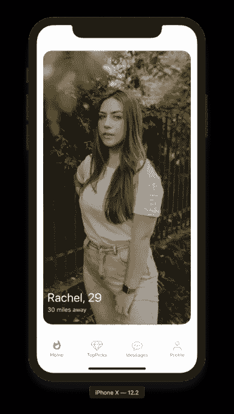

现在尝试滑动，它应该工作如下:

<video class="wp-video-shortcode" id="video-173737-1" width="598" height="1224" preload="metadata" controls=""><source type="video/mp4" src="https://uploads.sitepoint.com/wp-content/uploads/2019/09/1569895158swipe.mp4?_=1">[https://uploads.sitepoint.com/wp-content/uploads/2019/09/1569895158swipe.mp4](https://uploads.sitepoint.com/wp-content/uploads/2019/09/1569895158swipe.mp4)</video>

如果你想学习如何制作这种火绒滑动动画，你应该在 YouTube 上看看 [Varun Nath](https://twitter.com/nathvarun) 的[火绒滑动系列](https://www.youtube.com/playlist?list=PLy9JCsy2u97ksUNgcXFYXZiuxSkkxQC5F)。

既然我们的主屏幕已经完成，让我们建立顶部选择屏幕。

#### 顶部精选屏幕

现在让我们设计顶部精选屏幕。

首先，进入`constants/Pics.js`并在末尾添加以下位:

```
export const TopPicksScreenPics = shuffleArray([
  {
    pic: require('../asseimg/women/women11.jpg'),
    title: 'Annie, 40',
    caption: '26h left',
  },
  {
    pic: require('../asseimg/women/women12.jpg'),
    title: 'Lena, 31',
    caption: '20h left',
  },
  {
    pic: require('../asseimg/women/women13.jpg'),
    title: 'Kendra, 19',
    caption: '15h left',
  },
  {
    pic: require('../asseimg/women/women14.jpg'),
    title: 'Mia, 23',
    caption: '45h left',
  },
  {
    pic: require('../asseimg/women/women15.jpg'),
    title: 'Jenny, 27',
    caption: '12h left',
  },
  {
    pic: require('../asseimg/men/men11.jpg'),
    title: 'Dwayne, 34',
    caption: '13h left',
  },
  {
    pic: require('../asseimg/men/men12.jpg'),
    title: 'Novak, 27',
    caption: '22h left',
  },
  {
    pic: require('../asseimg/men/men13.jpg'),
    title: 'Zikomo, 32',
    caption: '20h left',
  },
  {
    pic: require('../asseimg/men/men14.jpg'),
    title: 'Sam, 19',
    caption: '42h left',
  },
  {
    pic: require('../asseimg/men/men15.jpg'),
    title: 'Richard, 31',
    caption: '21h left',
  },
]) 
```

这些是我们在顶部选择屏幕中需要的图像。

现在在`TopPicksScreen.js`中添加以下代码:

```
import React from 'react'
import { ScrollView, StyleSheet, View } from 'react-native'
import { Text, Tile } from 'react-native-elements'
import { SafeAreaView } from 'react-navigation'
import { TopPicksScreenPics } from '../constants/Pics'

class TopPicksScreen extends React.Component {
  render() {
    return (
      <SafeAreaView>
        <ScrollView>
          <Text h2 h2Style={styles.h2Style}>
            Top Picks
          </Text>
          <Text h4 h4Style={styles.h4Style}>
            Featured profiles of the day, picked just for you
          </Text>
          <View style={styles.grid}>
            {TopPicksScreenPics.map(({ pic, title, caption }, i) => (
              <Tile
                imageSrc={pic}
                activeOpacity={0.9}
                title={title}
                titleStyle={styles.title}
                caption={caption}
                captionStyle={styles.caption}
                featured
                key={title}
              />
            ))}
          </View>
        </ScrollView>
      </SafeAreaView>
    )
  }
}

const styles = StyleSheet.create({
  h2Style: {
    fontWeight: 'bold',
    textAlign: 'center',
    color: '#000000',
  },
  h4Style: {
    textAlign: 'center',
    color: '#757575',
  },
  grid: {
    marginTop: 20,
    marginBottom: 20,
  },
  title: {
    position: 'absolute',
    left: 10,
    bottom: 50,
    backgroundColor: 'black',
    marginBottom: -2,
    padding: 10,
  },
  caption: {
    position: 'absolute',
    left: 10,
    bottom: 0,
    backgroundColor: 'black',
    marginTop: 10,
    padding: 10,
  },
})

export default TopPicksScreen 
```

首先，我们使用在`react-native-elements`中找到的带有标题和副标题的基本`Text`组件。

然后我们遍历刚刚添加到`constants/Pics.js`中的所有图像，并使用`Tile`组件显示它们。

默认情况下，`title`和`caption`被放置在`center`中，但是我们将它们和`position:'absolute'`一起移动到了左下方。

这就是我们的首选屏幕，非常简单。

看起来是这样的:

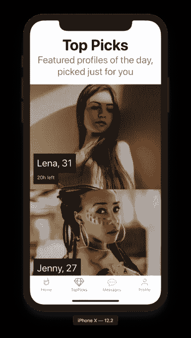

#### 消息屏幕

现在让我们从消息屏幕开始。首先，我们需要一些虚拟数据来显示在列表条上。

在`constants/`文件夹中创建`Messages.js`并粘贴如下内容:

```
import shuffleArray from '../utils/shuffleArray'

export const Messages = shuffleArray([
  {
    pic: require('../asseimg/women/women1.jpg'),
    title: 'Amelia, 27',
    message: "Let's get to your favorite restaurant.",
  },
  {
    pic: require('../asseimg/women/women2.jpg'),
    title: 'Joanna, 19',
    message: "What's the best way to win you over?",
  },
  {
    pic: require('../asseimg/men/men2.jpg'),
    title: 'Novak, 27',
    message: 'Will catch up with you later.',
  },
  {
    pic: require('../asseimg/men/men3.jpg'),
    title: 'Justin, 32',
    message: 'Probably not going to work out :(',
  },
  {
    pic: require('../asseimg/women/women3.jpg'),
    title: 'Charlie, 32',
    message: 'How about we go for a coffee on Sunday?',
  },

  {
    pic: require('../asseimg/women/women5.jpg'),
    title: 'Lucy, 27',
    message: 'Sleeping for now.',
  },
  {
    pic: require('../asseimg/men/men1.jpg'),
    title: 'Aaron, 24',
    message: 'See you soon.',
  },
  {
    pic: require('../asseimg/men/men4.jpg'),
    title: 'Tony, 21',
    message: 'Seriously, come on time.',
  },
  {
    pic: require('../asseimg/men/men5.jpg'),
    title: 'Leo, 30',
    message: "What'd you like?",
  },
  {
    pic: require('../asseimg/women/women4.jpg'),
    title: 'Mary, 23',
    message: "Hey, what's up?",
  },
  {
    pic: require('../asseimg/women/women14.jpg'),
    title: 'Michelle, 45',
    message: 'Howdy!!!',
  },
  {
    pic: require('../asseimg/women/women12.jpg'),
    title: 'Arya, 18',
    message: 'Not today!',
  },
]) 
```

接下来，在`components/`文件夹中创建`MessagesScreen.js`，并粘贴以下内容:

```
import React from 'react'
import { SafeAreaView, ScrollView, StyleSheet } from 'react-native'
import { ListItem } from 'react-native-elements'
import { Messages } from '../constants/Messages'

class MessagesScreen extends React.Component {
  render() {
    return (
      <SafeAreaView>
        <ScrollView>
          {Messages.map((user, i) => (
            <ListItem
              key={i}
              leftAvatar={{ source: user.pic, size: 'large' }}
              title={user.title}
              titleStyle={styles.title}
              subtitle={user.message}
              subtitleStyle={styles.subtitle}
              chevron
            />
          ))}
        </ScrollView>
      </SafeAreaView>
    )
  }
}

const styles = StyleSheet.create({
  title: {
    fontSize: 24,
    color: '#3F3F3F',
  },
  subtitle: {
    color: '#A5A5A5',
  },
})

export default MessagesScreen 
```

我们获取虚拟数据`Messages`并对其进行映射，然后将其放入从`react-native-elements`导出的`ListItem`中。`ListItem`组件显示一个接一个的项目列表，就像我们在任何 messages 应用程序上看到的一样——有一个大头像、用户名和消息。`react-native-elements`消除了为消息编写自己的列表的所有麻烦，这样我们就可以只用五行代码来制作一个漂亮的列表。

目前看起来是这样的:

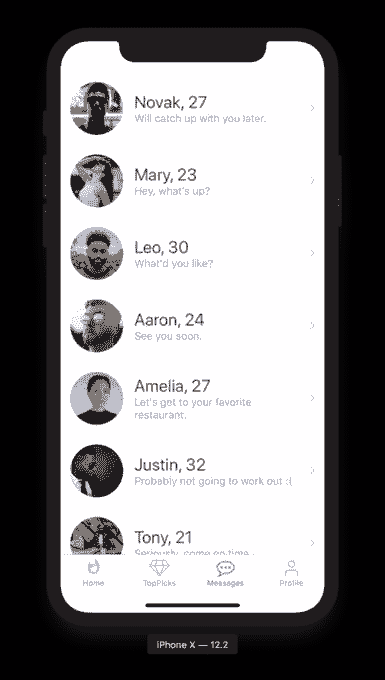

#### 轮廓屏幕

让我们制作最终的个人资料屏幕。

首先，创建一个`utils/randomNo.js`文件并粘贴如下内容:

```
export const randomNo = (min, max) =>
  Math.floor(Math.random() * (max - min) + min) 
```

函数`randomNo`返回一个在`min`和`max`之间的随机数。

现在打开`components/ProfileScreen.js`并粘贴以下内容:

```
import React from 'react'
import { Image, SafeAreaView, StyleSheet, View } from 'react-native'
import { Divider, Icon, Text } from 'react-native-elements'
import Layout from '../constants/Layout'
import { HomeScreenPics } from '../constants/Pics'
import { randomNo } from '../utils/randomNo'

const { pic, title } = HomeScreenPics[randomNo(1, HomeScreenPics.length)]

const Social = ({ name }) => (
  <Icon
    name={name}
    type="font-awesome"
    containerStyle={styles.iconContainer}
    size={32}
  />
)

class ProfileScreen extends React.Component {
  render() {
    return (
      <SafeAreaView style={styles.container}>
        <View style={styles.imageContainer}>
          <Image source={pic} style={styles.image} />
        </View>
        <Text h4 style={styles.name}>
          {title}
        </Text>
        <Text style={styles.desc}>Fashion Designer at Amelia & Co.</Text>
        <Divider style={styles.divider} />
        <Text style={styles.desc}>
          I love to travel. I have a cat named pickles. If he likes you, I
          probably will too.
        </Text>
        <Divider style={styles.divider} />
        <Text style={styles.desc}>Find me on Social here</Text>
        <View style={styles.socialLinks}>
          <Social name="snapchat" />
          <Social name="instagram" />
          <Social name="facebook-square" />
        </View>
      </SafeAreaView>
    )
  }
}

const styles = StyleSheet.create({
  container: {
    flex: 1,
    alignItems: 'center',
  },
  imageContainer: {
    margin: 20,
  },
  image: {
    width: Layout.window.width - 60, // device width - some margin
    height: Layout.window.height / 2 - 60, // device height / 2 - some margin
    borderRadius: 20,
  },
  name: {
    color: '#5E5E5E',
    alignSelf: 'flex-start',
    marginLeft: 30,
  },
  desc: {
    color: '#5E5E5E',
    alignSelf: 'flex-start',
    marginTop: 5,
    marginHorizontal: 30,
    fontSize: 14,
  },
  divider: {
    backgroundColor: '#C0C0C0',
    width: Layout.window.width - 60,
    margin: 20,
  },
  socialLinks: {
    flex: 1,
    alignItems: 'flex-start',
    flexDirection: 'row',
    width: Layout.window.width,
    marginLeft: 40,
  },
  iconContainer: {
    paddingHorizontal: 8,
    paddingVertical: 15,
  },
})

export default ProfileScreen 
```

让我们稍微破译一下密码。

首先，我们从`HomeScreenPics`数组中得到一个随机的`pic`和`title`，它不是第一幅图像，但可以是该数组中其余图像中的任何一幅。

然后我们创建了一个`Social`组件，如下所示:

```
const Social = ({ name }) => (
  <Icon
    name={name}
    type="font-awesome"
    containerStyle={styles.iconContainer}
    size={32}
  />
) 
```

这需要一个`name`作为道具。我们在我们的`render`方法中使用这个。`render`方法包含通常的`SafeAreaView`、`Text`、`View`和我们定制的`Social`组件——带有一点我们已经在上面介绍过的样式。

这里唯一独特的组件是一个[分频器](https://react-native-training.github.io/react-native-elements/docs/divider.html)组件。**分隔符**是内容的可视分隔符。我们用它们来区分内容的不同部分。

最后，我们添加一些样式。就是这样。

目前看起来是这样的:

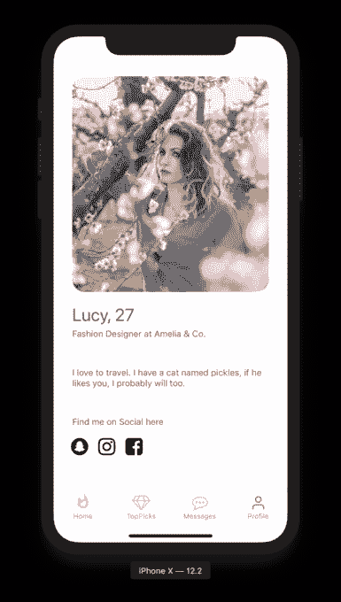

我还做了一个回购，以防你想克隆它。你可以在 GitHub 的这里找到它。

## 结论

我们已经成功地克隆了一个 Tinder UI，带有一点自定义样式，并得到了 React 原生元素的大量帮助。

React Native Elements 通过使用其预制的组件库，在构建漂亮的 UI 时消除了所有的麻烦。

我们也可以不使用任何 UI 库，完全从头开始创建一切，但这需要我们编写大量代码——主要是样式。通过使用 UI 库，我们可以编写更少的代码，更快地交付我们的应用程序。

您现在可以通过提取 UI 的最小部分并构建它来模仿任何 UI。使用 UI 框架来编写更少的代码并提高速度。

## 分享这篇文章