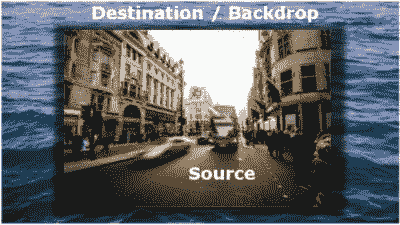
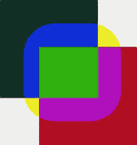

# CSS 混合混合模式属性的特写

> 原文：<https://www.sitepoint.com/close-up-css-mix-blend-mode-property/>

直到不久前，在你的网页图片上创造艺术效果只能通过使用复杂的图像编辑器来完成，比如 Photoshop 或 GIMP。将两种或两种以上的背景色，或者两个图像，直接从你的 CSS 中混合到一个新的数字艺术作品中，这有多酷？

这正是你可以用 CSS3 的[背景混合模式](http://dev.w3.org/fxtf/compositing-1/#background-blend-mode)和[混合混合模式](http://dev.w3.org/fxtf/compositing-1/#mix-blend-mode)属性做的事情。在这篇文章中，我将重点介绍`mix-blend-mode`属性的功能，以及如何在项目中利用这些功能。

但是首先，让我们更仔细地检查一下*混合模式*。

## 什么是混合模式？

**混合模式**在图形元素的*合成*操作中发挥作用。合成只是一个技术术语，指的是将两个或多个图像分层，以将它们组合成一个图像。图层的混合模式决定了该图层上的像素如何与其下方图层上的可见像素相互作用。

当合成两个元素时，底部的元素称为**目的地**，顶部的元素称为**源**。顶部元素后面的重叠内容*是混合发生的地方，它被称为**背景**。*



混合模式如*叠加*、*叠加*、*屏幕*等。，按照一些我们不需要掌握的数学公式来达到不同的效果，以便创造出视觉上有趣的复合元素。如果你想深入了解每种混合模式是如何工作的，Pye 的这本[Photoshop 混合模式终极指南](http://www.slrlounge.com/school/photoshop-blend-modes/)是必读的。

纯 CSS 可用的简单混合模式是**不透明度**属性:顶部元素的完全不透明度隐藏底部元素的重叠区域；不完全不透明会显示下面的元素。

这可以实现一些令人愉快的结果，但没有像 Photoshop 一样复杂的混合模式——直到 [W3C 合成和混合](http://dev.w3.org/fxtf/compositing-1/#propdef-mix-blend-mode)规范到来。

该规范引入了三个属性，`background-blend-mode`、`mix-blend-mode`和[隔离](http://dev.w3.org/fxtf/compositing-1/#isolation)，并使使用[十六种 CSS 混合模式](http://dev.w3.org/fxtf/compositing-1/#ltblendmodegt)成为可能。

默认混合模式值为`normal`，不应用任何混合。如果您想要混合的只是背景颜色或背景图像，请尝试使用`background-blend-mode`属性。要找到一些关于这个属性的巧妙技巧，请前往罗宾·伦德尔的[链接多个混合模式](https://css-tricks.com/chaining-multiple-blend-modes/)。

现在让我们看看`mix-blend-mode`属性，以及`isolation`属性在混合 HTML 元素时如何帮助我们。

## `mix-blend-mode`属性

CSS3 `mix-blend-mode`属性令人兴奋的地方在于，您可以快速混合图像，包括 SVG 图像，以及其他 HTML 元素。

### 如何将混合应用到 SVG

下面是如何将[差异](http://dev.w3.org/fxtf/compositing-1/#valdef-blend-mode-difference)混合模式应用到一个基本的 SVG 图形。

HTML:

```
<svg width="467" height="462">
  <rect x="80" y="60" width="250" height="250" rx="1" fill="pink" />
  <rect x="140" y="120" width="250" height="250" rx="80" fill="blue" />
  <rect x="180" y="180" width="250" height="250" rx="1" fill="turquoise" />
</svg>
```

CSS:

```
rect {
  mix-blend-mode: difference;
}
```

不应用任何混合模式时 SVG 图形的外观:


…以及应用了`difference`混合模式后的效果:



这是 CodePen 演示:

通过 [CodePen](http://codepen.io) 上的 SitePoint ( [@SitePoint](http://codepen.io/SitePoint) )查看钢笔 [SVG 与差分混合模式](http://codepen.io/SitePoint/pen/NqRxJZ/)。