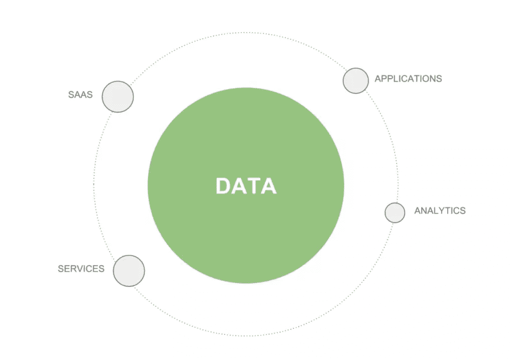

# 云数据策略:防止云中的数据黑洞

> 原文：<https://www.sitepoint.com/cloud-data-strategies-preventing-data-black-holes-in-the-cloud/>

*本文最初发表于 [mongoDB](https://www.mongodb.com/blog/post/cloud-data-strategies-preventing-data-black-holes-in-the-cloud?utm_medium=sp-synd&utm_source=sitepoint) 。感谢您对使 SitePoint 成为可能的合作伙伴的支持。*

黑洞是时空中具有如此强大引力的区域，任何东西都无法逃脱。不像你可能被引导去相信的那样完全是破坏性的，它们的引力效应有助于推动星系的形成和演化。事实上，我们自己的银河系围绕着一个质量是太阳 410 万倍的超大质量黑洞运行。一些理论认为，如果没有黑洞，我们都不会在这里。

另一方面，黑洞也可以被发现在宇宙中快速穿行——通常以每小时数百万英里的速度——撕裂其路径上的一切。据说，任何进入他们视野的东西，即“不归点”，将永远不会再被看到或听到，这使得黑洞成为太空中最有趣和最可怕的物体。

为什么我们一直在谈论黑洞、引力效应和不归路？因为类似的事情正在计算机领域发生。

Dave McCrory 于 2010 年[首次提出了“数据引力”的概念，将数据视为具有质量的行星或天体。随着环境中数据的积累，依赖于这些数据的应用程序和服务自然会被拉入到同一个环境中。数据的“质量”越大，“引力”就越强，发生的速度也越快。应用程序和服务各有各的重心，但数据重心是目前最强的，尤其是:](https://blog.mccrory.me/2010/12/07/data-gravity-in-the-clouds/?utm_medium=sp-synd&utm_source=sitepoint)

*   数据离得越远，对应用程序性能和用户体验的影响就越大。将应用程序和服务保持在物理位置附近可以减少延迟，最大化吞吐量，并使团队更容易构建高性能的应用程序。
*   移动数据是有成本的。在大多数情况下，集中数据以降低成本是有意义的，这就是为什么数据往往聚集在一个位置或环境中。是的，分布式系统确实允许组织出于特定目的以不同方式对数据进行分区，例如，按照地理边界隔离数据集以遵守法规，但是在这些分区内，最少的数据移动仍然是可取的。
*   最后，数字化业务和组织活动、流程和模型(被许多人称为“数字化转型”计划)的成败取决于数据利用的有效性。如果说软件是数字化转型的引擎，那么数据就是它的燃料。

正如在现实世界中，物体的质量越大，就越难移动，所以数据引力也意味着一旦你的数据量足够大，它也就越难(在某些情况下，几乎不可能)移动。让这一点变得比以往任何时候都重要的是向云计算的转变。随着企业向云迁移，他们需要做出一个具有深远影响的决定——他们将在哪里以及如何存储他们的数据？而他们如何不让云中的数据引力变成*数据黑洞*？

对于从构建自己的 it 到在云中消费 IT 即服务的组织来说，有几种选择。

## 专有表格(关系)数据库

专有表格数据库背后的公司经常惩罚他们的客户，因为他们在自己的云平台之外的任何平台上运行这些技术。这不应该让我们任何人感到惊讶。同样是这些供应商，几十年来一直依赖销售具有多年合同和年度维护费用的重型专有软件。供应商锁定对他们来说并不新鲜。

选择在云中使用专有表格数据库的组织还会背上这些技术的所有包袱，并且很少实现云的好处。这些数据库垂直扩展，通常无法利用云原生架构实现横向扩展和弹性，而不会造成巨大的损失。如果可以跨多个实例横向扩展数据，它也不是数据库固有的，需要复杂的配置、应用程序端的更改和额外的软件。

将这些数据库提升并转移到云并不能改变它们不是为利用云架构而设计的这一事实。

## 开源表格数据库

开源表格数据库的情况稍微好一点，因为没有供应商强制执行惩罚性价格来让您继续使用他们的云。然而，类似于专有的表格数据库，这些技术中的大部分被设计为纵向扩展；通过横向扩展来完全实现云弹性通常需要脆弱的配置或额外的软件来管理。

许多在云中运行这些数据库的公司依靠托管服务来降低运营开销。然而，跨云平台的功能对等性并不存在，这使得迁移变得复杂而昂贵。例如，运行在 Amazon Aurora 上的数据库利用了其他云上没有的 Aurora 特有的特性。

## 专有云数据库

有了专有的云数据库，很容易陷入数据进不去的境地。这些数据库服务仅在其母云中运行，并且通常提供非常有限的数据库功能，要求客户集成额外的云服务，以满足非常简单的用例之外的任何需求。

例如，许多专有的云 NoSQL 服务只提供键值功能；用户通常需要将数据传输到云数据仓库，以进行更复杂的查询和分析。它们在操作上也往往不成熟，需要额外的集成和服务来解决数据保护问题并提供足够的性能可见性。而且不止于此。新功能通常以新服务的形式引入，在用户意识到这一点之前，他们不再依赖单一的云数据库，而是依赖于不断增长的云服务网络。这使得获取数据变得更加困难。

主要的云提供商知道，如果他们能够在他们专有的数据库服务中获得你的数据，他们就能在他们想要的地方找到你。虽然有些人可能会说，组织实际上应该采用这种新的终极形式的供应商锁定，以充分利用云，但如果客户的要求或数据法规发生变化，客户就没有多少选择了。如果你没有使用的云提供商发布了一项改变游戏规则的服务，而你需要这项服务来挤掉竞争对手，那该怎么办？如果他们在您优先考虑的新地理区域建立了一个数据中心，而您的路线图上没有，该怎么办？如果您的主要客户要求您与您的云提供商断绝关系，该怎么办？[这件事发生在](https://www.cnbc.com/2017/06/21/wal-mart-is-reportedly-telling-its-tech-vendors-to-leave-amazons-cloud.html?utm_medium=sp-synd&utm_source=sitepoint)之前。

在所有这些场景中，您都可以从使用在任何地方都运行相同的数据库中受益。

## 在任何地方都运行相同的数据库

当您迁移到云时，如何防止数据重力对您不利并限制您的灵活性很简单—使用在任何环境中运行相同的数据库。

可以考虑的一个选项是 MongoDB。作为一个数据库，它将文档数据模型的灵活性与各种用例所需的复杂查询和索引相结合，从简单的键值到支持分析的实时聚合。

MongoDB 是一个分布式数据库，其核心是为云设计的。针对弹性、水平扩展和地理分布的冗余是数据库固有的，并且易于使用。

最后，无论部署在哪里，MongoDB 都能提供一致的体验:

*   对于还没有准备好迁移到云的组织，他们可以在自己的防火墙后面部署 MongoDB，并使用[高级操作工具](https://www.mongodb.com/products/ops-manager?utm_medium=sp-synd&utm_source=sitepoint)管理他们的数据库。
*   对于那些准备迁移到云的人来说，MongoDB Atlas 在 AWS、Azure 和 Google 云平台上跨 50 多个地区提供数据库作为完全托管的服务。成熟实践的内置自动化有助于减少团队负责的耗时数据库管理任务的数量，并防止组织将其运营开销迁移到云中。当然，如果你想在云中自我管理 MongoDB，你可以这样做。
*   最后，对于精通云服务的团队来说，MongoDB Atlas 提供了跨 AWS、Azure 和 Google 的一致体验，允许在单一、统一的数据平台上开发多云策略。

数据引力无疑会对您的 IT 资源在云中的整合和发展产生巨大影响。但这并不意味着你必须被困住了。选择能够在不同环境中提供一致体验的数据库，避免走上不归路。

## 分享这篇文章