# 云管理:RightScale & enStratus

> 原文：<https://www.sitepoint.com/cloud-management-rightscale-enstratus/>

## 介绍

[在本系列的第一部分](https://www.sitepoint.com/what-you-should-know-about-cloud-management/)中，我们了解了什么是云管理，以及为什么您应该使用它。在这一部分，我们将深入了解云管理软件的具体特性。

我们将具体看一下 [RightScale](http://www.rightscale.com/) 和 [enStratus](http://www.enstratus.com/) 。在比较两者的价格之前，我们将通过它们的控制台启动服务器并测试负载平衡。

## 右缩放

RightScale 的客户名单上有一些知名机构，因此 right scale 是这一市场的重要参与者。他们与主要的云提供商合作，支持公共云和私有云。RightScale 有自己的市场，你可以在那里找到预定义的模板和脚本来快速设置云服务器。

他们提供自己的配置框架，对于如何管理云没有任何限制。有一个广泛的自动化引擎，有许多监控选项来触发扩展。

### 仪表盘

Rightscale 的简单导航菜单提供了您需要的所有控件:

您可以选择构建或管理自己的模板或脚本，或者浏览他们的市场。

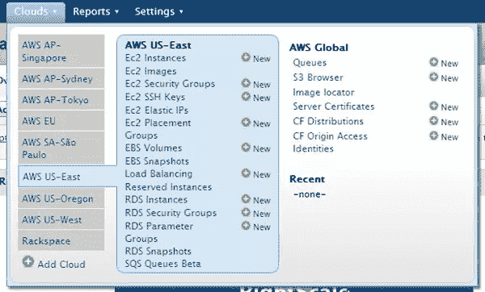
你可以决定部署一个没有模板的云服务器，自己设置。

得益于与 at Amazon Web Service (AWS)的 API 集成，您可以从 RightScale 仪表盘中启动完整的 AWS 产品。一旦您添加了 Rackspace 等云提供商，您也可以管理它们。

他们的完整控制面板还提供了对您的部署和警报的快速监控、成本概览，以及通过市场链接快速启动流行堆栈。

### 启动服务器

为了看看从 RightScale dashboard 设置云服务器有多简单，我决定尝试从 ServerTemplates 启动一个预配置的基于 LAMP stack 的 WordPress 站点。

在市场上，我发现了一个 WordPress AMI(亚马逊机器映像)。

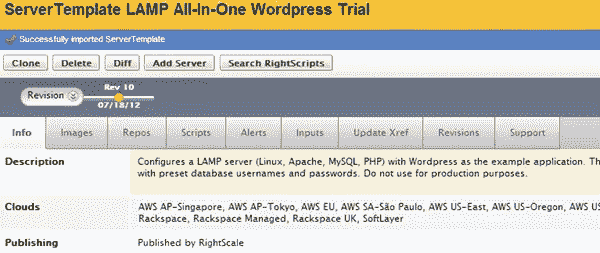

选择“导入”后，可以添加基于该模板的云服务器。您将看到您之前添加的云提供商。

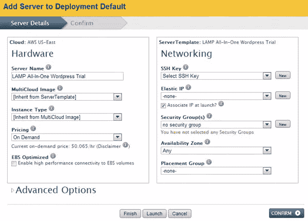

所有需要的设置都是从模板继承的，但是您总是可以更改这些设置。如果你都完成了，只需点击 launch，云服务器就部署好了。

几分钟后，你的网站就上线了。

监控为您提供了丰富的信息，让您了解您的部署概况，以及让您了解最新情况的事件列表。您还可以设置提醒，以便在出现异常时通知您。

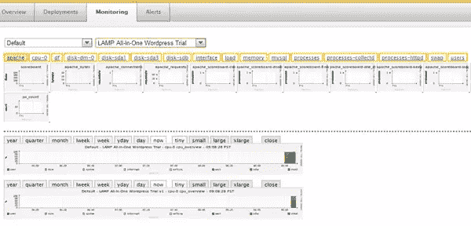

### 自动缩放

云管理的主要优势之一是能够自动扩展您的云服务器。这意味着根据您设置的特定参数添加或删除服务器。例如，这可以基于一段时间内的服务器负载、内存使用或 I/O 等待。或者您可以用它来替换一个停止运行的服务器。

您可以通过添加服务器阵列来开始设置。在这里，您可以指定最初需要多少台服务器，最大服务器数量是多少，以及应该扩展到多少台。就像手动添加服务器一样，首先要选择一个服务器模板并对其进行配置。

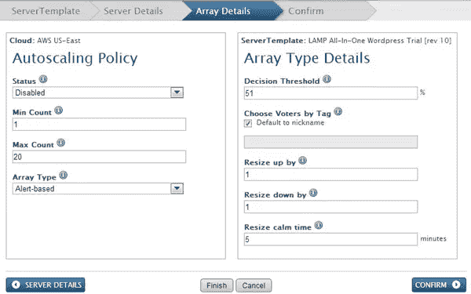

自动扩展决策是由各个服务器投票决定的。这是一种控制机制，防止在参数出现峰值时仓促做出决定。

在我的示例中，触发警报的内容是在模板中指定的，但是您也可以自己设置。

然后你决定怎么做:给自己发一封电子邮件，或者让它投票决定是扩大还是缩小。或者，您可以设置一个计划，在特定的时间或日期启动或停止服务器，以应对预期的流量。

举个简单的例子，我决定用最少三台服务器来设置我的阵列。这意味着，如果一台服务器出现故障，至少会替换三台服务器。启动阵列后，我手动终止了两台服务器。自动缩放确保它被替换。

之后，启动新的服务器，如扩展设置中所指定的。请注意，即使最少是三个，更多的服务器被启动，因为需要一段时间让它们启动和运行，这确保您的最少总是得到满足。它总是保持在你的最大限度内。

### 定价

RightScale 提供了一个免费计划，你可以在公共云上管理多达 55 台服务器(私有云是一个付费的附加服务)。如果您想要管理更多的服务器，您需要按 RCU (RightScale 计算单位)付费。一个 RCU 是一个小时的中型服务器。较小的服务器使用较少的 RCU。通过他们的免费计划，这可以降低到每个 RCU 0.12 美元，大约每月 86 美元。这还不包括您向云提供商支付的费用。

您可以升级到标准(500 美元/月)或高级(1000 美元/月)计划，每 RCU 支付 0.06 美元。我要感谢 RightScale 公司的人让我接触到他们的企业测试计划。

上面提到的所有功能都可以在他们的免费计划中获得。

## 恩斯特拉斯

enStratus 将自己定位为企业云管理。您可以通过软件即服务或内部安装的方式获得 enStratus 的工具。我将重点介绍他们的 SaaS 解决方案。

enStratus 专注于纯云管理，它确实提供一些基本的服务器映像，但让你填写应用程序。它允许您创建自己的模板和脚本，并提供了一个方便的设计器来可视化地构建您的部署。

### 仪表盘

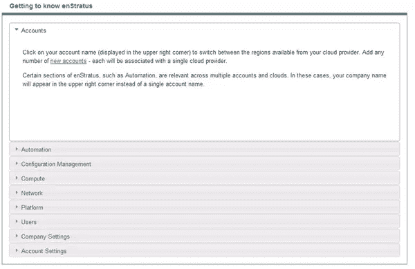

登录后，enStratus 提供了双重导航，顶部菜单栏涵盖了所有功能，主仪表板上的“了解 enStratus”部分提供了这些功能的链接。他们还为你提供了一个快速启动部分，让电机运行。还有一个服务状态窗口，以及如何联系支持的信息。

您可以使用云选择器轻松切换云或区域。

### 启动服务器

如上所述，enStratus 不提供带有预定义服务器模板的市场，你必须自己制作这些模板。你可以启动一台预装了操作系统的服务器，所以我会发现让它运行起来有多容易。

您可以从快速入门部分中的链接开始，它会将您带到一个操作系统列表。所有主要的操作系统都存在。

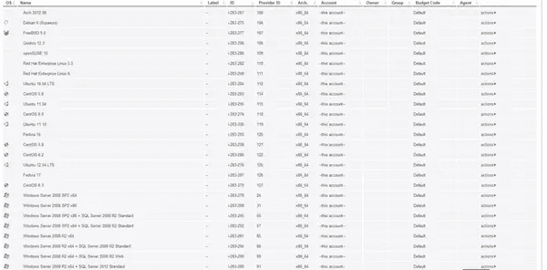

你可以选择你需要的操作系统，然后点击启动按钮。

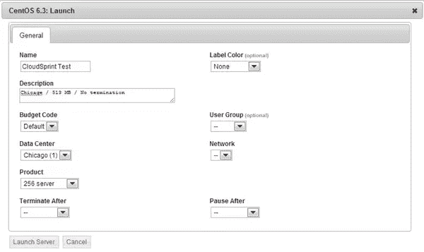

一个全面的弹出窗口让您可以指定一些设置，如您想要使用哪个数据中心，服务器需要多少内存，以及您是否想要在特定时间后终止或暂停它。

在构建过程中，您会在“作业待定”下找到您的服务器，一旦完成，您的服务器会在您的服务器概述中列出。然后，您可以通过使用 SSH 登录来设置您的服务器，并配置您的服务器。

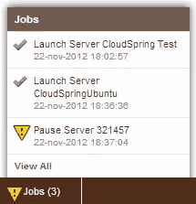

enStratus 通过一个小弹出窗口让您了解正在运行的作业。还有一个由 enStratus 提供的代理，它给你更多的远程操作服务器的选择。它主要用于获取 shell 访问，需要安装在您的服务器上。您还可以制作当前图像的图像，如果您应用了补丁或更新，这将非常方便。

### 自动缩放

enStratus 与一位设计师合作，建立您的自动扩展云，集成一个或多个负载平衡器。当您使用 Rackspace 时，您可以将普通云服务器指定为负载平衡器。有了亚马逊 AWS，你可以使用弹性负载平衡(ELB)。

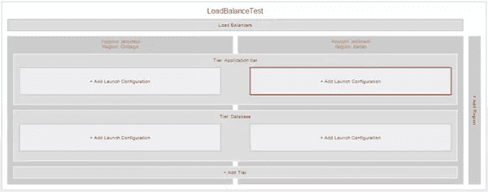

首先添加一个负载平衡器，然后选择要在您的设置中使用的组件。您可以为您的应用程序或前端选择组件(层),然后将其与数据库相结合。

您可以通过添加更多地区或云提供商来进行水平扩展。它还跟踪预期成本和实际成本。

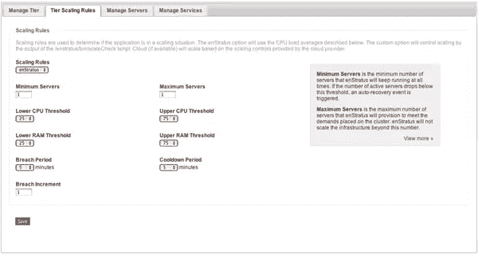

对于每一层，您可以指定最少和最多服务器的数量，以及何时扩大或缩小。您可以选择希望位于该层的服务器。

例如，这允许您在前端层引入低 RAM 服务器，在数据库层引入高 RAM 服务器。使用 designer 为您构建云带来了巨大的灵活性，包括功能性和可伸缩性。

### 定价

enStratus 提供了一个免费计划，您可以管理多达 5 台服务器，包括它们的大部分功能。之后，您可以升级到他们的基本计划(50 美元/m)，每台托管服务器每小时支付 0.05 美元。这相当于每台服务器每月 36 美元，还包括 30 次备份。它们将较高的月价格与较低的每台服务器价格相结合，从 500 美元/台，每台服务器小时 0.04 美元到 5000 美元/台，每台服务器小时 0.02 美元。按照这些费率，您还将收到 LADP、SAML 和 API。

## 结论

起初，两家供应商似乎提供相同的功能。对于实际的服务器管理来说，这几乎是真的，每个人都有自己的方法。但是当谈到自动扩展时，您会发现在如何构建部署方面有很大的不同。他们的免费计划给了你足够的机会去看你喜欢的。它们的定价也不一样，例如，enStratus 对每台服务器收费，而 RightScale 根据服务器大小和数量收费。

在你做出选择之前，做一下数学计算是值得的，计算一下当你成功时每家公司会让你付出什么代价。

*   [RightScale](http://www.rightscale.com/)
*   [恩斯特拉斯](http://www.enstratus.com/)

## 分享这篇文章