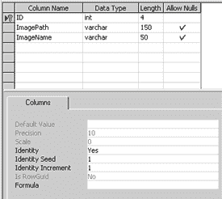
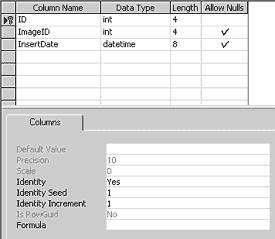

# HTTP 在 ColdFusion 中的实际应用

> 原文：<https://www.sitepoint.com/coldfusion-practical-uses-http/>

**超文本传输协议 [HTTP](https://www.w3.org/Protocols/rfc2616/rfc2616.html) 于 1990 年首次用于“万维网全球信息倡议”。从那时起，无论我们是否想到它，它已经成为我们日常生活的一部分。**

通常，我们会不假思索地使用这个协议，就像我们在网上冲浪一样。但是，有时我们必须主动使用 HTTP 来解决问题。ColdFusion 具有用于 HTTP 支持的内置标记，作为 Web 开发人员，知道如何有效地使用这些标记对我们是有利的。所以，让我们来一次 HTTP 之旅，看看这项技术能做些什么。

##### HTTP 如何工作

如果我们把它简化到最底层，HTTP 是一种客户端向 Web 服务器请求信息的方式，也是 Web 服务器对这些请求做出响应的方式。当你在浏览器的地址栏中键入[https://www.sitepoint.com/](https://www.sitepoint.com/)时，你的浏览器(客户端)会向 SitePoint 的服务器发送一个 HTTP 请求。然后，SitePoint 的服务器处理您的请求，从数据库中提取数据，创建 HTML，并将其返回给您的浏览器。

对服务器的请求通常有两种:“GET”和“POST”请求(是的，这就是为什么 HTML 表单让您设置“GET”或“POST”提交方法)。使用的方法指定了如何发送数据。您会注意到，如果您用“GET”方法创建一个表单，表单中输入的值会在 URL 上传递。如果你用“POST”的方法，它们是在幕后发送的。这就是为什么，例如，当您重新加载“POST”请求的结果时，Internet Explorer 总是询问您是否要重新发送数据—它让您知道有些东西在幕后被发送，必须重新发送才能正确处理请求。

我们还应该简单地谈一下 [MIME](http://hunnysoft.com/mime/) 类型。MIME 代表多用途互联网邮件扩展。该标准最初是为了定义通过电子邮件交换的文件类型，但后来扩展到了万维网。了解 MIME 类型将允许我们以各种格式返回信息，这将是我们下面演示代码的关键部分。

HTTP 有比我在这些简短的段落中描述的更多的东西。事实上，整本书都是关于这个话题的。但是，出于我们的目的，我们将把讨论留在这里。如果想了解更多信息，可以在 [W3C 网站](https://www.w3.org/Protocols/HTTP/HTTP2.html)找到一个优秀的 HTTP 参考。

##### HTTP 和 ColdFusion 标签

首先，让我们介绍一下我们将在示例应用程序中使用的基本标签。我们将使用`cfhttp`、`cfhttpparam`、`cfheader`和`cfcontent`。

首先，我们来看看 CFHTTP。CFHTTP 最常见的用途是从另一个页面或站点检索数据。例如，如果您想将我的 SitePoint 博客 Fuse 的 RSS 提要放在您的站点上，您应该制定一个如下所示的 HTTP 调用:

```
<cfhttp url="https://www.sitepoint.com/blog.rdf?blogid=7" method="get" timeout="5">
```

首先，您当然希望用`url`属性指定博客的 URL。我们使用的`method`是“GET”，我们指定我们想要一个五秒的`timeout`。这样，如果服务器很慢，它就会超时，而不会不必要地阻塞我们的应用程序。`cfhttp`标签返回给我们一个名为`cfhttp`的结构，它包含几个可能对我们有用的变量。首先，我们有了`FileContent`变量。它保存了我们调用的 URL 返回给我们的所有数据。因此，当我们显示一个原始文本转储文件`CFHTTP.FileContent`时，我们会看到从博客的 RSS 提要返回的原始 XML:

```
<cfoutput>#HTMLCodeFormat(cfhttp.FileContent)#</cfoutput>
```

`cfhttp`返回的其他变量有`MimeType`、`Header`和`ResponseHeader`。`ResponseHeader`是一个包含几个变量的结构，用于处理从 URL 收到的响应。如果我们试图访问某个服务器上的一个二进制文件，比如一个`.jpg`或`.gif`文件，那么`MimeType`可能是“image/jpeg”或“image/gif”。您可以对`cfhttp`结构执行简单的文本转储，如下所示:

```
<cfdump var="#cfhttp#">
```

这适用于 ColdFusion 5 及更高版本，当您使用此特定标签时，它会准确显示返回的内容。

您也可以让 ColdFusion 在从 URL 获取信息时自动将文件保存到服务器，方法是像这样传递给它`path`和`file`属性:

```
<cfhttp url="https://www.sitepoint.com/blog.rdf?blogid=7" 

  method="get" 

  timeout="5" 

  path="C:temp" 

filename="thefuse.rdf">
```

这将把文件直接保存到服务器上，以便以后使用。例如，如果您不想在每次 RSS 提要显示在您的站点上时都访问 SitePoint 的服务器，您可以使用上面的代码在您的服务器上缓存该文件，然后实现一些逻辑来每天刷新缓存的副本。它可能看起来像这样:

```
<cfdirectory action="list"  

directory="C:temp"  

name="TheFuseCache"  

filter="thefuse.rdf"> 

<cfif TheFuseCache.RecordCount eq 0  

or DateDiff("d", TheFuseCache.DateLastModified, Now()) gt 1> 

  <!--- use the CFHTTP call as you see above and then do this:---> 

  <cfset TheFuse = cfhttp.FileContent> 

<cfelse> 

  <cffile action="read"  

file="C:tempthefuse.rdf"  

variable="TheFuse"> 

</cfif>
```

现在，您可以每天更新一次 RSS 源，并且每天只需给 SitePoint 的服务器打一次电话(这将降低他们和您的带宽成本，减轻他们服务器的负载，并释放他们的资源，以便为您提供更优秀的 ColdFusion 内容！).大家都赢了！

关于`cfhttp`另一个值得一提的属性是`ResolveUrl`属性。如果您使用`cfhttp`来调用一个在其图像源、链接或样式表中有相对路径的站点，您可能想要将`ResolveUrl`属性设置为“是”。这确保了当您取回文件内容时，所有链接仍然指向正确的路径或 URL。否则，如果您试图在自己的站点上重用原始的 HTML，您将会得到断开的链接、样式表、图像等等。

现在，我们来谈谈`cfhttpparam`。这允许您在`cfhttp`标签的`url`属性中指定一个发送到 URL 的参数。这个标记允许您通过向 HTTP 请求添加参数(GET 和 POST 变量、cookies 等等)来模拟 HTML 表单提交。让我们来看看实际情况。

在这个例子中，我们将使用 HTTP 参数标签设置一个表单变量、一个 cookie、一个 URL(查询字符串)变量和一个文件上传。我们还将发送一个文件供目标上传。如果您在自己的服务器上试用此代码，您需要将“www.example.com”替换为您的服务器的路径。

```
<cfif not isDefined("Form.aFormField")>  

  <!--- this file (receive.cfm) requests itself --->  

  <cfhttp url="http://127.0.0.1/receive.cfm" method="post" timeout="10">  

     <cfhttpparam name="aFormField" type="FormField" value="I'm in a form.">  

     <cfhttpparam name="aCookie" type="Cookie" value="I'm a Cookie">  

     <cfhttpparam name="aUrlField" type="URL" value="I'm a URL variable">  

     <cfhttpparam name="aFile" type="File" file="C:temptest.txt">  

  </cfhttp>  

  <cfoutput>  

     Here is what the server said:<br />  

     #cfhttp.filecontent#<br />  

     #cfhttp.mimetype#<br />  

  </cfoutput>  

  <!--- end of the request --->  

<cfelse>  

  <!--- receives the variables --->  

  <cfoutput>  

     <cfif isDefined("Form.aFormField")>  

        Form Field: #form.aFormField#<br />  

     </cfif>  

     <cfif isDefined("Cookie.aCookie")>  

        Cookie Variable: #Cookie.aCookie#<br />  

     </cfif>  

     <cfif isDefined("URL.aUrlField")>  

        URL Variable: #URL.aUrlField#<br />  

     </cfif>  

     <cfif isDefined("Form.aFile")>  

        <cffile action="upload" filefield="aFile" destination="C:tempnew_test.txt" nameconflict="makeunique">  

     </cfif>  

  </cfoutput>  

  <!--- end of the receipt --->  

</cfif>
```

运行此命令时会产生什么输出？首先，脚本使用`cfhttpparam`请求自己发送一些请求参数。当使用这些参数请求它时，脚本会列出它所发送的参数。这个输出被放入执行请求的脚本中的`cfhttp.FileContent`变量中。然后与`cfhttp.MimeType`一起显示。

如您所见，`cfhttp`和`cfhttpparam`为您的应用程序提供了极大的灵活性，它们可以帮助您操纵 ColdFusion 脚本，使其表现得像真正的人在网站上冲浪一样。我相信你可能会想到这些标签的一千种不同的用法。

但是，我应该警告您，在使用这些标记时，您将需要进行大量的错误处理。如果您调用的服务器出现故障，您需要允许脚本无缝地继续运行(或者至少优雅地失败)。您依赖于该服务器的任何信息都将不可用。此外，使用这些标签时要有良好的判断力。进行大量的 HTTP 调用肯定会给你的站点带来问题，如果你不明智的话，还会大大降低服务器的速度。

请注意，您必须指定绝对 URL。如果您试图只指定相对文件名，它将不会被解析，您将得到一个连接失败。

##### cfheader 和 cfcontent 标记

接下来我们要讨论的是`cfheader`标签的使用。这可用于手动设置 HTTP 响应头和页面内容。HTTP 头随每个请求一起发送。它们描述了被发回的数据类型，以及请求的各种其他属性。假设您最近发现了关于[无刷新链接](https://www.sitepoint.com/no-refresh-links/)的 SitePoint 文章，并且您想尝试在 ColdFusion 应用程序中实现该文章(当然，首先要注意可能出现的可用性问题，如该文章所述)。

一旦您决定了要如何实现这一点，您可以在 ColdFusion 中轻松实现:

```
<cfheader statuscode="204" statustext="No Content">
```

这将设置“无内容”状态代码，让浏览器知道不需要刷新，因为没有内容。如果愿意，您可以选择将状态代码设置为 404(未找到页面)，甚至 500(内部服务器错误)。任何有效的 HTTP 响应代码都可以在这里指定(不过，我不知道您为什么要故意返回 404)。

如果你正在设置搜索引擎/用户友好的 URL，你也可以使用这个标签。您可以设置一个 404 错误处理程序来决定是否有一个有效的页面来显示用户的请求。如果有，您应该将状态代码设置为 200(成功)并显示内容。如果它真的是一个没有找到的页面，您只需让它保持原样，让它返回 404，并告诉用户您找不到该页面。一会儿我们将看到`cfheader`标签的另一种用法。

注意，您必须将 404 处理程序设置为 URL 处理程序，*而不是文件处理程序*。文件处理程序会将您的 ColdFusion 代码转储到浏览器中，就像它是一个文本文件一样。

为了更好地说明这个标记，我编写了一小段代码。下面是`call.cfm`文件:

```
<a href="receive.cfm">Call</a>
```

这只是一个调用接收页面的简单链接。在`receive.cfm`页面中，我有如下所示的代码:

```
<cfheader statuscode="204" statustext="No Content">  

<cffile action="write" file="C:Temptest.txt" output="file written successfully">
```

现在，运行`call.cfm`页面并点击链接。您会注意到状态栏加载了，但是页面仍然在`call.cfm`页面上。打开 Windows 资源管理器，转到`C:Temp`，你会看到`text.txt`文件是用“输出”属性中的字符串编写的。所以，成功了！只要确保在输出任何内容之前设置了头*(如果你没有返回任何内容，那么在`receive.cfm`文件中应该没有内容输出到浏览器)。*

请记住，您需要提醒用户某些操作已经发生并成功完成——这可以使用 JavaScript 或 DHTML 来完成。无论你怎么做，都不要让你的访问者感到困惑。

现在，在我们继续我们的项目之前，让我们深入研究一下`cfcontent`标签。此标记允许您指定文件返回的 MIME 类型。如果你在`cfcontent`标签之前输出任何东西，它将被忽略，就像`cfheader`一样。你实际上必须结合使用`cfcontent`和`cfheader`来确保它正常工作。我们要用这个标签做的是返回一个图像来响应对一个`.cfm`文件的请求。这很容易做到:

```
<cfheader name="Content-Disposition" value="inline; filename=help.gif">  

<cfcontent type="image/gif" deletefile="no" file="C:Inetpubwwwroothelp.gif">
```

当您运行这个文件时，您会看到它只是返回一个图像。现在创建一个新的 HTML 文档，并将这个图像标签插入其中:

```

```

这里假设你已经用标签`cfcontent`命名了你的文件`returnimage.cfm`。转到该文件，您会看到它就显示在页面上。你可以返回任何你想要的文件类型。只需如上所示在`cfheader`标签中指定内容处置，并在`cfcontent`标签中指定内容类型(以及，可选地，要从服务器发送的文件的名称，以及是否删除该文件)，就大功告成了。关于如何使用`cfcontent`和`cfheader`的另一个例子，请查看关于该主题的 [Macromedia 的 Live 文档](http://livedocs.macromedia.com/coldfusion/6.1/htmldocs/manage18.htm)。

##### 娱乐时间到了

好了，我们已经完成了繁重的工作——是时候享受一点乐趣了。假设我们正在构建一个图像服务器，我们想要跟踪显示的每一张图像。我不会从头到尾介绍整个应用程序，但我会向您展示如何使用 ColdFusion 返回图像，以及如何在每次显示图像时跟踪它们。

首先，我们需要一个数据库表来存储每张图片。这将是一个非常简单的表，包含图像标识符、图像的绝对路径和描述性的图像名称。在构建真实图像服务器时，您可能希望包括上传它的用户的 ID、上传它的日期和时间、图像显示的页面以及您可能想要的关于图像的任何其他信息。您还可以跟踪图像大小，以便可以测量每个用户使用了多少磁盘空间和带宽。但是为了简单起见，我那可怜的小桌子看起来像这样:



该表将存储图像的完整路径、图像的简要描述(这样我们就可以在通过管理界面或数据库表本身查看图像时知道它是什么)和唯一的 ID。为此我使用了 SQL Server，但是您可以很容易地在 Access 或 MySQL 中复制代码。

我还想计算每次图像被访问的次数。同样，为了简单起见，我将只跟踪图像 ID 以及它被访问的日期和时间。我的桌子看起来是这样的:



一旦创建了表，就需要考虑目录结构。对于我们的简单图像服务器，我们将把图像存储在服务器img/目录中。我们将有一个返回图像的页面，它将被存储在根目录下，只是为了这个应用程序。我们还将有一个匿名上传页面，允许用户上传图片。

我们将从上传脚本开始。下面是我们的表单的外观:

```
<form name="upload" action="upload.cfm" enctype="multipart/form-data" method="post">   

   <input type="file" name="uploadFile" size="20" />   

   <input type="submit" value="Upload File" />   

</form>
```

允许匿名上传确实会带来安全隐患，所以在允许人们上传文件之前，最好有某种授权。不过，这是一个简单的例子，所以我们将利用现有的信息。请特别注意`enctype="multipart/form-data""`属性。这对于上传文件至关重要。我将这个页面命名为`index.cfm`。

在`upload.cfm`文件中，我们首先要确保指定了文件名。该代码将如下所示:

```
<cfif not isDefined("Form.uploadFile") or (isDefined("Form.uploadFile") and Form.uploadFile eq "")>   

  <p>   

    You must select a file to upload.   

  </p>   

  <cfabort>   

</cfif>
```

我总是检查以确保字段在那里，并且不为空，以防止人们直接访问 URL，并防止他们在没有上传文件的情况下提交表单。接下来，我们将设置文件名和文件的目标:

```
<cfset fileName = DateFormat(Now(), "yyyymmdd") & TimeFormat(Now(), "HHmmss")>   

<cfset destination = GetDirectoryFromPath(CGI.Path_Translated) & "images" & fileName>
```

文件名将是一个长字符串中的日期和时间。目标将是当前文件所在目录下的`images`目录(变量`CGI.Path_Translated`给我们当前文件的绝对路径)。现在，我们可以将文件上传到以下位置:

```
<cffile action="upload"    

  filefield="uploadFile"    

  destination="#destination#"   

  accept="image/gif,image/jpeg"   

  nameconflict="makeunique">   

<cfset FullFilePath = "#CFFILE.ServerDirectory##CFFILE.ServerFileName#.#CFFILE.ServerFileExt#">	

请注意，ColdFusion 会生成自己的临时文件名来存储文件，直到您决定如何处理它。因此，如果您将`Form.uploadFile`的值输出到屏幕上，文件扩展名为”。tmp”。但是，在`cffile`结构中，我们获得了实际的文件名和文件扩展名。使用上面的“accept”属性，并指定 GIF 和 JPEG 图像，确保限制可以上传的文件类型。您也可以指定位图和 png。现在，我们把这个放入数据库。

```

```
<cfquery name="InsertFile" datasource="kodefusion_mssql">   

  INSERT INTO Images (   

    ImagePath,   

    ImageName   

  )   

  VALUES (   

    '#FullFilePath#',   

    'ANONYMOUS USER UPLOAD'   

  )   

</cfquery>
```

这里，我们只需插入图片的完整路径，并注明这是由匿名用户上传的。当我们上传上面的文件时，它没有扩展名，所以现在我们需要重命名它以匹配数据库中的内容。我们将这样做:

```
<cfif FileExists(destination) and not FileExists(FullFilePath)>   

  <cffile action="rename" source="#destination#" destination="#FullFilePath#">   

</cfif>
```

既然文件已经在正确的位置，我们将检索 URL 并放入我们的标签中，然后显示给用户。您需要根据您设置目录结构的方式来更改 URL。

```
<cfquery name="GetFileID" datasource="kodefusion_mssql">   

  SELECT ID   

  FROM Images   

  WHERE ImagePath = '#FullFilePath#'   

</cfquery>   

<cfoutput>   

  Here's your URL: http://127.0.0.1/imagetracking/returnimage.cfm?ImageID=#GetFileID.ID#   

</cfoutput>
```

下一步是创建`returnimage.cfm`文件。这是相当大的一段代码，所以先看一看，然后我们再来讨论它:

```
<cfif not isDefined("URL.ImageID") or (isDefined("URL.ImageID") and not isNumeric(URL.ImageID))>   

  <!--- no image specified. you could return a default graphic here if you want. --->   

<cfelse>   

  <cfquery name="GetImagePath" datasource="kodefusion_mssql">   

    SELECT ImagePath   

    FROM Images   

    WHERE ID = #URL.ImageID#   

  </cfquery>   

  <cfif GetImagePath.RecordCount neq 0>   

    <cfquery name="InsertTracking" datasource="kodefusion_mssql">   

      INSERT INTO ImageTracking (   

        ImageID,   

        InsertDate   

      )   

      VALUES (   

        #URL.ImageID#,   

        GetDate()   

      )   

    </cfquery>   

    <cfset fileExt = ListLast(GetFileFromPath(GetImagePath.ImagePath), ".")>   

    <cfif fileExt eq "jpg" or fileExt eq "jpeg">   

      <cfset contentType = "image/jpeg">   

    <cfelse>   

      <cfset contentType = "image/gif">   

    </cfif>   

    <cfheader name="Content-Disposition" value="inline; filename=#GetFileFromPath(GetImagePath.ImagePath)#">   

    <cfcontent type="#contentType#" deletefile="no" file="#GetImagePath.ImagePath#">   

  <cfelse>   

    <!--- no image. return default graphic. --->   

  </cfif>   

</cfif>
```

我们做的第一件事是检查以确保有一个可用的图像 ID。如果没有，我们可以返回一个默认的“图形不可用”类型的图形。如果我们不这样做，一个臭名昭著的红色 X 将出现在那里。

假设提供了一个 ID，我们用它从我们的图像表中选择`ImagePath`字段。我们检查以确保查询返回了一个结果，并在`ImageTracking`表中放入一行以表明图像被访问过。然后我们判断这是 JPEG 还是 GIF 图像，并相应地设置内容类型变量。您可以在 Images 表中创建一个单独的“FileExtension”字段，通过在其中存储文件扩展名甚至内容类型来消除这部分工作。

一旦我们弄清楚了内容类型，我们就发送我们的`cfheader`，然后使用`cfcontent`推送我们的图像。确保`deletefile`属性设置为“否”，这样文件在使用后不会被删除。如果数据库中没有匹配该 ID 的图像，我们可以返回“图像不可用”图形，或者只让它显示一个红色的 x。

确保在`cfheader`值属性中指定这是内联数据。这意味着它将显示在网页中，而不是作为附件下载。(提示:如果您想要跟踪文件的下载，您可以使用此方法并将 value 属性设置为“附件”。)另外，请注意，该值应该只是文件名，而不是完整路径。

##### 结论

这就是:图像服务器的一个非常基本的开始。使用本文中讨论的标记和技术，您可以做很多很多事情。你现在的任务是把上面的应用程序构建成更全面的东西。添加一种为用户命名图像的方式，一个显示图像被访问的频率的报告，以及存储关于每次图像上传和每次文件被访问的更多数据的能力。你可以做的事情多着呢！

在这篇文章中，我们已经讨论了很多内容(相信我，我已经精疲力尽了！).我们已经讨论了使用`cfhttp`标签检索 RSS 提要，使用`cfhttpparam`标签将表单、URL 和 cookie 变量以及文件发送到远程网站，以及如何使用 ColdFusion 返回文本和 HTML 之外的文件类型。您开发的应用程序越多，您就会发现在代码中应用这些标记的方式越多。下次再见，在 ColdFusion 的广阔世界里玩得开心。

## 分享这篇文章