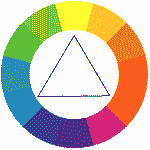
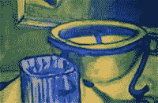
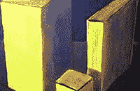

# 编码员的色彩——非设计师的色彩和设计

> 原文：<https://www.sitepoint.com/color-for-coders/>

如果你是一个把大部分阅读时间花在浏览客户端和服务器端编码文章上的人，那么你可能应该读读这篇文章。是的，你:你的代码在另一个监视器中全屏打开。我是一名设计师，在一家主机/ISP 公司工作，和四个非常有才华的网络程序员在一个房间里。他们可以一起开发任何类型的应用程序，但是如果他们的生活依赖于一个和谐的配色方案，他们中没有一个人可以开发出这样的方案。

网站设计的颜色选择是一个从不同角度探讨的话题。一些人从可用性的角度出发，解释如何确保可读性和跨平台兼容性。一些善意的人试图解释设计都是关于*感觉*的，用快乐、能量和稳定这样的幻觉描绘来描述颜色。其他人带着广告顾虑来到餐桌，比如，“黄色意味着廉价，绿色意味着金钱，黑色可能意味着优雅，或者可能……死亡！”

你有没有想过设计师是从哪里获得这种神秘的能力来判断一种颜色是否“有效”？虽然海泡石绿确实不适合原色调色板，但没有人真正解释为什么。就像拥有编程概念的诀窍一样，当你处理颜色时，一些天生的能力可能是有利的，但大多数技能可以从对颜色理论的基本理解中获得。用一点知识和一些安全的经验法则武装起来，你拿着调色盘会比牌桌上的算牌员更危险。

##### 画家最好的朋友

要开始理解颜色，你必须像画家一样思考。现在，不要出去像杰克逊·波拉克那样到处乱扔油漆；我的意思很简单，你需要考虑红色、黄色和蓝色。当您使用心爱的电脑时，颜色会使用加色法以 RGB(红、绿、蓝)光的百分比显示。这意味着，随着每种颜色越来越多，你越来越接近白光。相比之下，画家们使用减色法，这并不是一种双关语。所以，我要求你们像画家一样思考，我真正的意思是，我希望你们把颜色想象成红色、黄色和蓝色的组合，并且认识到，当你添加颜色时，你越来越接近黑色。

作为一名绘画大师，你最重要的调色工具是你对这里显示的简单色轮的理解。我放在中间的黑色三角形指出了原色。如果你混合两种原色，你会得到由浅灰色三角形指出的第二种颜色。当你把一种原色和它最接近的任何一种二次色混合时，你就得到一种三次色；这些位于黑色和灰色三角形的点之间。有了对色轮的这种绘画般的理解，掌握色彩理论的概念将变得轻而易举。

##### 配色方案

当我提到我的程序员朋友，以及他们如何不能创建一组和谐的颜色时，我说的是配色方案。有三种主要的配色方案:模拟、互补色和单色。

***比喻***

相似色是色轮上彼此相邻的颜色。如果你在我们的色轮上的任何一个三角形的两点之间选择任何范围的颜色(即黄色到红色，橙色到紫色，红色到蓝色，等等)，你将有一个类似的配色方案。当我在 UCF 大学上设计入门课时，我们得到了一幅静物画，并有一节课的时间用我们正在学习的任何配色方案来画它。冒着被公众嘲笑的风险，为了避免侵犯版权，我将使用这些作为我的配色方案的例子。这幅静物画有一个类似的配色方案，只混合了黄色和蓝色的丙烯酸颜料。

试着看看下面的链接，看看一些类似的配色方案的例子。

*   http://www.zeldman.com–杰弗瑞·泽尔德曼展示了……一个非常有限的类似配色方案。这当然不是赞美，因为在我们的色轮上没有一种颜色是相对的。请注意，他在设计中只使用了两种颜色，每种颜色只使用了两到三种色调。只要颜色符合严格的颜色主题，使用有限的调色板是个好主意。取决于你如何脱下它，这通常会产生一种清爽的感觉。
*   [http://www.jasonsantamaria.com？](http://www.jasonsantamaria.com?)—杰森·圣玛丽亚的经典书籍封面设计是类似配色方案的另一个范例。请注意，他网站上的每一点颜色都在我们色轮的三分之一以内。
*   http://www.gorillaglue.com——我想知道一家卖胶水的公司怎么会有这么一个华而不实、有趣的网站……但是当你玩大猩猩菜单时，你会注意到网站上所有的颜色从黄色、橙色到深红色。

***互补***

互补色方案由色轮上彼此相对的颜色组成，如绿色和红色、黄色和紫色或橙色和蓝色。据说这些颜色是相辅相成的。当一种颜色紧挨着另一种颜色放置时，会出现一种被称为同时对比的现象，即每种颜色都会使另一种颜色看起来更有活力。

使用互补方案时，有两个陷阱需要避免:

1.  如果你将互补色叠加在一起，就会产生一种运动的错觉。这对文字真的不好。你试过在黄色背景下阅读紫色文本吗？相信我:这并不美好。

3.  此外，像青色和红色这样的颜色，虽然不是直接相对，但也没有接近到可以类比的程度，因此会产生冲突而不是互补。这些颜色被称为不调和色。除非你想在你的访问者中制造不和，否则我建议你不要在你的项目中使用这些组合。

互补色方案通常比简单地使用色轮相对两侧的两种颜色更复杂。例如，双互补色方案就是在一个主题中使用两种互补色。类似地，一个分割的互补主题是一种颜色与相邻的两种颜色配对。例如，如果您想使用我们色轮上的颜色创建一个拆分-互补主题，您将首先选择一种您想要使用的颜色，比如黄色。然后，你可以选择深蓝色和粉红色，它们与黄色的补色紫色相邻。

以下是一些互补色方案的实例:

*   http://www.ufl.edu–佛罗里达大学最近重新设计的 XHTML 广受好评。这也是互补色方案的一个很好的例子。请注意，虽然橙色和蓝色是主要的设计颜色，但您不会真正看到它们重叠太多，这将导致我们之前讨论的整个运动错觉。
*   [http://www.modestmousemusic.com](http://www.modestmousemusic.com)–谦逊耗子乐团是另一个纯粹互补色的例子。这也是我见过的为数不多的能够实现绿色和粉色配色方案的网站之一。
*   [http://www.panera.com](http://www.panera.com)–Panera Bread 提供了一个有趣的免费配色方案的例子。您可以清楚地看到页面上绿色到红色和橙色到蓝色关系的双互补动作。

***单色***

如果你把白色和一种纯色混合，就会产生那种颜色的淡色。如果你把黑色和纯色混合，你会得到那种颜色的阴影。那么，如果你只用一种颜色的色调和阴影来创建一幅图像，你会得到什么呢？单色配色方案。这个例子是另一个基于颜色主题的静物，仅由橙色的色调和阴影组成。

以下是一些单色配色网站的例子:

*   http://www.target.com–目标是单色配色方案的教科书定义。一切都是红色、白色、黑色以及它们的组合。在主页上，看起来他们甚至避免使用不属于这个方案的照片。这才叫设计奉献！
*   [http://www.macromedia.com](http://www.macromedia.com)–Macromedia 的蓝绿色渐变配色方案也有类似的想法。它也很有策略地使用图片来搭配主页的外观。
*   http://www.yakima.com–亚基马在使用多种单色方案方面做得非常好。每个主导航页面都有一个橙色、蓝色或绿色的单色方案。

这三种配色方案有许多变体，并且已经进行了许多研究来定义颜色协调的科学方法，但是这些都是基本原则。我对培养颜色眼光的最好建议是:睁大你的眼睛。如果你看到一个非常突出的网站、广告或插图，问问自己它使用了什么类型的配色方案。就像分析代码块一样，了解颜色语言的语法是理解其用途的良好开端。

希望你会发现这些信息在为你的下一个 Web 应用程序选择颜色时有用，或者甚至可以作为你新发现的绘画爱好的介绍！记住，色轮是你的朋友。你甚至可以考虑去当地的艺术用品店买一个旋转塑料画放在你的桌子上。最起码，当你为你部门的设计师定义他们在最新设计作品中使用的配色方案时，你应该能够给他们留下深刻印象。请记住:编码员也可以使用颜色。

## 分享这篇文章