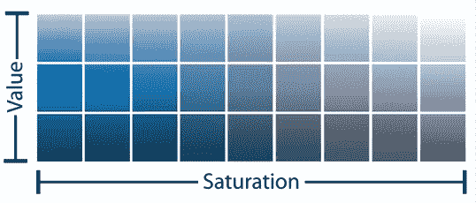
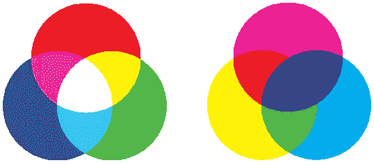
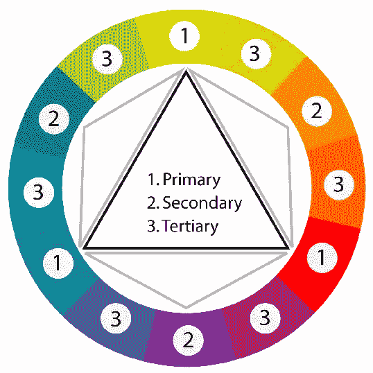

# 色彩理论 101

> 原文：<https://www.sitepoint.com/color-theory-101/>

继续本系列上一篇关于颜色的文章，颜色心理学，让我们仔细看看色温、色度值、饱和度，以及印刷和网络中颜色产生的基本理论。

## 色温

存在于整个光谱中的一个属性是色温的概念。哪个颜色的水龙头给你热水？你认为冰是什么颜色？为什么？答案是显而易见的，并且受到文化和自然的双重影响。

*暖色*是从红色到黄色的颜色，包括橙色、粉色、棕色、酒红色。由于暖色与太阳和火联系在一起，它代表了热和运动。当放在冷色系附近时，暖色会倾向于突出并占据主导地位。

冷色是从绿色到蓝色的颜色，可以包括一些紫色。紫罗兰色是红色和蓝色的中间色，所以冷色调的紫罗兰色，正如你可能猜到的，更接近蓝色，而红紫色会让人感觉温暖。冷色让人平静，可以减少紧张感。在一个设计中，冷色倾向于后退，这使得它们非常适合页面上的背景和较大的元素，因为它们不会压倒你的内容。

## 色度值

一种颜色的明度或暗度被称为它的色度值。将白色添加到颜色中会创建该颜色的*色调*。同样，一个*阴影*是通过给一个给定的颜色添加黑色产生的。图 1，左边的“色度值”说明了这种区别。

和颜色本身一样，你使用的颜色的色度值会影响用户对内容的心理联系。色度值的一个用途可能是强调客户与公司或组织联系在一起的时间。例如，如果你正在设计一个关于夜生活或音乐会的网站，你可能会选择深色，限制浅色的使用。色彩往往与日光、春天和童年联系在一起。想想:日出、婴儿服和爱心熊。正如任何在医院呆过的人都可以证明的那样，这些淡粉色也可以用于专业、复杂、成熟的场合。这是因为色彩是舒缓的颜色，给无菌环境带来个性，而不会惊吓病人或使婴儿哭泣。色彩设计师通常对诸如“医院绿”这样的颜色缺乏灵感，但是如果你在一个日间水疗网站上工作，色彩将是你调色板的一个很好的基础。

### 浸透

颜色的*饱和度*或*强度*被描述为该颜色的强度或纯度。显而易见，强烈、鲜明的颜色非常突出。尽管冷色往往会消退，但鲜艳的蓝色会比暗淡的橙色更引人注目。当我们给一种颜色添加灰色(黑色和白色)时，它会变得暗淡和柔和。就像一间米色墙壁的办公室，或者一个阴暗的冬天早晨，这些颜色不如明亮、生动的颜色令人兴奋或吸引人。从好的一面来看——没有双关的意思——暗淡的颜色有助于减少紧张，给作品一种沉思、梦幻的气氛

价值与饱和度的关系如图 2“价值与饱和度图”所示。

*图 2，“值与饱和度图”*

## 色轮

为了让我们的颜色基础知识更进一步，我们需要获得一些与主题相关的更技术性的概念的基础，例如颜色是如何形成的，以及它们是如何分类的。

显示在你电脑屏幕上的颜色(也就是我们将在网站设计中使用的颜色)是基于*加色*颜色模型的。在加色模型中，颜色以红色、绿色和蓝色( <acronym title="Red, Green, Blue">RGB</acronym> )光的百分比显示。如果我们把这三种颜色都调到最大，我们就会得到白光。如果我们把红色和绿色一路向上，但关掉蓝色，我们有黄色。

如果你曾经拥有一台彩色打印机，你可能会熟悉首字母缩写 <acronym title="Cyan, Magenta, Yellow, and black">CMYK</acronym> (青色、洋红色、黄色和黑色)。您的喷墨打印机、激光打印机和工业四色印刷机都使用青色、洋红色、黄色和黑色墨水或墨粉来创建图像。这个过程使用了一个*减色*颜色模型；通过在这个颜色模型中组合颜色，我们接近实现灰黑色。没有办法将青色、品红色和黄色合成黑色。这就是为什么它们总是用黑色来补充 CMYK 中的 K。请看图 3，“RGB 加色模型(左)和 CMYK 减色模型(右)”，以便更好地了解加色和减色模型的工作原理。

*图 3，RGB 加色模型(左)和 CMYK 减色模型(右)*

无论你是为印刷品还是网页设计，传统色彩理论的课程都是帮助我们对颜色进行分类和分组的关键。有记录的颜色分类研究可以追溯到公元前三世纪和亚里士多德的作品。从那以后，许多其他伟大的艺术家和哲学家对我们了解颜色的工作原理做出了贡献，包括艾萨克·牛顿、约翰·沃尔夫冈·冯·歌德和约翰·伊顿。这些人分别在 17、18 和 19 世纪的作品，为我们对色彩的理解奠定了基础。这三位理论家都用红、黄、蓝作为原色来解释颜色与色轮的关系。色轮是一个简单而有效的图表，用于呈现色彩理论的概念和术语。传统的艺术家色轮是一个分为 12 个部分的圆形，如图 4 所示，“传统的红、黄、蓝艺术家色轮”。每个切片或者是原色，或者是二次色，或者是三次色。

*图 4，传统的红、黄、蓝艺术家色轮*

### 红

传统色轮的原色是红色、黄色和蓝色。这些色调在色轮上形成一个等边三角形，从一种原色开始，每四种颜色代表另一种原色。

### 次要颜色

通过混合两种原色，我们创造了二次色，这里用灰色小三角形表示。第二种颜色是橙色、绿色和紫色。

### 三原色

总共有六种三原色:朱红色(橘红色)、金盏花色(橘黄色)、黄绿色(黄绿色)、蓝绿色(蓝绿色)、紫色(蓝紫色)和品红色(红紫色)。正如你可能已经猜到的，将一种原色和相邻的二次色混合起来就形成了三次色。

## 美丽网页设计的原则

这篇文章来自杰森·比厄德的 [*《美丽网页设计的原则》*一书](https://www.sitepoint.com/premium/library "SitePoint.com: The Principles of Beautiful Web Design, 2nd Edition")(第二版现已出版！).请务必在设计节上关注这本书的更多文章。

## 分享这篇文章