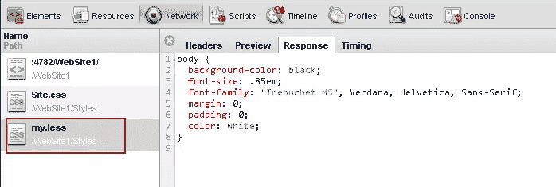
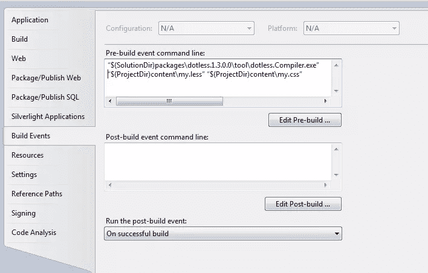

# 与 ASP.NET 结合较少

> 原文：<https://www.sitepoint.com/combining-less-with-asp-net/>

大家都知道少有多酷。如果你不是，下面是电梯演讲。LESS 扩展了 CSS 的动态行为，如变量、混合、名称空间和函数，这使得 CSS 易于使用。现在，重要的是要记住它不会为你编码你的 CSS——它不是一个神奇的 CSS 编辑器。你仍然需要知道如何使用 CSS。它允许你写一次 CSS，并在多个地方使用它。这是我很久以来一直想要的东西，现在它在这里。

还有其他执行类似功能的库，比如 SASS，但是我将重点介绍它，因为这是我所熟悉的。我会集中精力在 ASP.NET 身上使用它。

在这次演示中，我将使用 Visual Studio 2010，因为我在 Visual Studio 11 中使用 LESS 时遇到了一些问题。

### 在客户端上运行得更少

只有很少一部分可以完全在客户端或服务器上运行。在客户机上运行它是一个简单的三步过程。

1.  添加对 [LESS JavaScript 文件](http://lesscss.googlecode.com/files/less-1.3.0.min.js)的引用
2.  将链接标记中的 *rel* 值更新为 rel="stylesheet/less "
3.  添加新的。更少的文件，并在链接标签中引用它

将 [rel](http://www.w3schools.com/tags/att_link_rel.asp "LINK rel Attribute") 值更新为*样式表/less* 是必要的，因为 less 库会寻找这个值。一旦找到，它就处理那个文件。您的页面现在应该是这样的。

```
 <link href="styles/my.less" rel="stylesheet/less" />
<script src="http://lesscss.googlecode.com/files/less-1.3.0.min.js"></script> 

```

我引用了一个名为 my.less 的文件，所以让我们定义一些更少的代码来确保它能够工作。

```
 @back-color: #000;
@font-color: #fff;

body {
  background-color: @back-color;
  font-size: .85em;
  font-family: "Trebuchet MS", Verdana, Helvetica, Sans-Serif;
  margin: 0;
  padding: 0;
  color: @font-color;
} 

```

现在我将跳过语法，但是如果你运行网站并查看开发者工具，你将会看到更少的代码被用作有效的 CSS。



### 在服务器上运行得更少

有几种方法可以在服务器上安装 LESS。最简单的方法是通过 [NuGet](http://nuget.org/ "NuGet") 。有个包叫[无点](http://nuget.org/packages/dotless "dotless")。在 Visual Studio 中用下面的命令安装它。


安装后，您可以从页面中删除 JavaScript 引用。还要确保更新了链接标签，并从 rel 属性中删除了 */less* 。

```
 <link href="styles/my.less" rel="stylesheet" /> 

```

该包还向您的 web.config 文件添加了一些条目。定义了新的 configSection。

```
 <configSections>
  <section name="dotless" type="dotless.Core.configuration.DotlessConfigurationSectionHandler, dotless.Core" />
</configSections/>

<dotless minifyCss="false" cache="true" web="false" /> 
```

并且添加了一个新的 HTTP 处理程序来满足。更少的请求。

```
 <system.webServer>
  <handlers>
   <add name="dotless" path="*.less" verb="GET" type="dotless.Core.LessCssHttpHandler,dotless.Core" resourceType="File" preCondition="" />
  </handlers>
</system.webServer> 
```

关于 dotless 的一个很好的特性是，它可以通过 minifyCss 属性自动缩小 CSS。如果你把它更新为真，现在运行网站，你会看到缩小的 CSS。


就是这样。现在服务器上运行的更少。

### 什么时候用？

我认为少一点对开发来说很好，但是当你需要你的站点尽可能快地运行时，你不想改变每一个。减少即时请求。这就是为什么我建议只在开发过程中使用它。好消息是当你安装无点时，它会安装无点编译器。这可以在网站文件夹的 packagesdotless1.3.0.0Tool 文件夹中。

您可以从“生成属性”选项卡将其添加到预生成事件中。

" $(SolutionDir)packagesdotless . 1 . 3 . 0 . 0 tooldotless . compiler . exe " " $(project dir)content my . less " " $(project dir)content my . CSS "



这样你可以两全其美。

在离开 Visual Studio 之前，您可以安装一些扩展，为您提供熟悉的语法突出显示。放松似乎是更好的选择之一。

### 较少语法

本文中我没有涉及任何语法。我想少关注 ASP.NET。Ivaylo Gerchev 有一篇关于语法的好文章，可以在[这里](https://www.sitepoint.com/a-comprehensive-introduction-to-less/ "LESS Syntax")找到。

我认为 LESS 是开发过程中必须拥有的工具。在编写 CSS 代码时，它会让您的生活变得更加轻松。

## 分享这篇文章