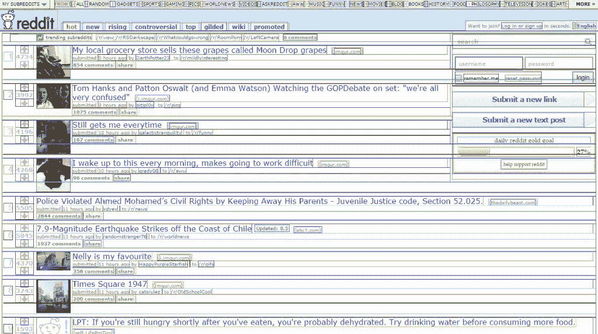
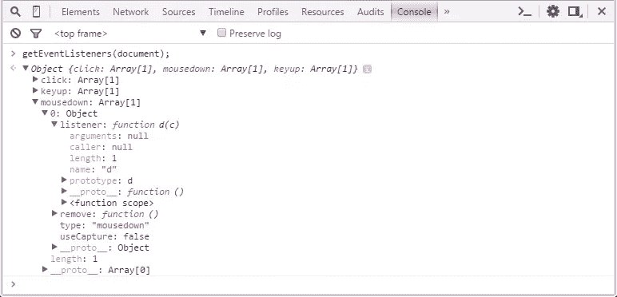

# 为了乐趣和利益的命令行 API

> 原文：<https://www.sitepoint.com/command-line-api-fun-profit/>

[命令行 API](https://developers.google.com/web/tools/javascript/command-line/command-line-reference) 是一个别名、便利函数和快捷方式的集合，用于在 JavaScript 控制台中与您的网页进行交互。在本文中，我们将看看其中的一些助手，以及如何利用它们来获得更好的开发和调试体验。

您可以通过多种方式访问浏览器的 JavaScript 控制台。通常按下 *F12* 并点击*控制台*标签效果最好。

在我们开始之前，让我问你一个小问题:你知道在浏览器中可视化 CSS 布局的轮廓需要什么吗？

*正好 108 字节*。

```
[].forEach.call($$("*"),function(a){a.style.outline="1px solid #"+(~~(Math.random()*(1<<24))).toString(16)}) 
```

一个*推特大小的调试器*，正如[这个聪明的一行程序](https://gist.github.com/addyosmani/fd3999ea7fce242756b1)的创造者 Addy Osmani 所说。现在就开始尝试吧。只需将该行复制并粘贴到您喜欢的开发人员工具的 JavaScript 控制台中，如 [Chrome 的 DevTools](https://developer.chrome.com/devtools/docs/commandline-api) 、 [Firefox 的 Firebug](https://getfirebug.com/wiki/index.php/Command_Line_API) 、 [Opera 的蜻蜓](http://www.opera.com/dragonfly/documentation/console/)、 [Safari 的 Web Inspector](https://developer.apple.com/library/mac/documentation/AppleApplications/Conceptual/Safari_Developer_Guide/Console/Console.html) ，甚至 [IE 的 F12 工具](https://msdn.microsoft.com/en-us/library/gg589530)(尽管 IE 只支持`$`家族和`console`对象)。



虽然颜色十六进制值的创建令人印象深刻，但我想把您的注意力吸引到特殊的`$$`上。这是`document.querySelectorAll`的别名，也是命令行 API 中许多巧妙之处之一。让我们看看这个 API 还能提供什么。

命令行 API 只能在 JavaScript 控制台中访问。您不能使 API 对页面上的脚本可用。从好的方面来看，这给了您一个独特的机会，让您可以在浏览器窗口中尝试本文剩余部分中的所有代码片段。只需打开您的 JavaScript 控制台并进行实验。

## 探索大教堂

如果你熟悉 jQuery 库，你可能会猜到`$`是做什么的。作为`document.querySelector`的别名，它返回与给定 CSS 选择器匹配的第一个 DOM 元素的引用。

让我们看看如何在著名的[饼干点击器游戏](http://orteil.dashnet.org/cookieclicker/)中使用这个。如果你从未偶然发现这个单调但奇怪的令人上瘾的游戏:你基本上点击一个大饼干来生产更多的烘焙食品，并购买各种各样的饼干烘焙设备。这些然后产生更多的饼干…你明白了。

现在，如果我们可以让我们的手和鼠标休息一下，让控制台来处理 cookie 点击，这不是很好吗？借助一点 JavaScript 和我们的新朋友`$`,这可以在一个简洁的一行程序中实现:

```
setInterval(function() { $("#bigCookie").click(); }, 10); 
```

尽管这很有趣，但也有一些场景，命令行 API 的 DOM 选择功能具有实际价值。在本文的介绍中，您已经了解了`$$`的威力。作为`document.querySelectorAll`的别名，它返回匹配给定 CSS 选择器的所有 DOM 元素的数组。

例如，我们可以使用这个函数来提取一个网站的所有图像源:

```
var pics = $$("img");
for (pic in pics) {
  console.log(pics[pic].src);
} 
```


如果您正在寻找一个特定的元素，并希望更仔细地检查它，请使用`inspect`。例如，`inspect(document.body)`将直接把你带到开发者工具的*元素*标签中的 body 元素。(`inspect`也可以工作，如果你传递一个 JavaScript 函数给它——它会把你带到 *Sources* 面板。)

## 跟踪物体

当我试图掌握 JavaScript 的原型继承时，我在控制台中有一个小朋友:`dir`调用了一个对象，这个方法向您展示了该对象的所有属性的列表，例如包括`prototype`和`_proto_`。这只是`dir`派上用场的众多场景之一。我发现拥有一个指向所有对象属性的快捷方式很轻松。

如果您只对您的对象的直接属性感兴趣(即，不是从原型链继承的属性)，您可以使用`keys`和`values`来分别获得包含名称和相关值的数组。尝试一下:

```
var a = {
  "one": 1,
  "two": 2,
  "three": 3
}

> keys(a)
  ["one", "two", "three"]

> values(a)
  [1, 2, 3] 
```

由于对象是 JavaScript 中最基本且无处不在的数据结构，我大量使用这些函数来跟踪对象状态。

## 在控制台中调试

每当我的某个网站或应用程序出现问题时，我做的第一件事就是查看控制台上的错误消息。我花了*很多*开发时间在控制台上。如果你没有什么不同，那么你应该会对像`debug`和`monitor`这样的功能感到兴奋。这只是命令行 API 提供的强大调试工具的两个例子。(可惜 Safari 的 Web Inspector 不支持这两个功能。)

```
debug(YourLibrary.someFunction) 
```

这会在函数`YourLibrary.someFunction`的第一行设置一个断点，每次调用它时，调试器都会打开。由于我实际上生活在控制台中，这是一种比浏览源代码和手动设置断点更快的替代方法，尤其是当您处理精简的代码时。要关闭这种行为，您可以简单地在同一个函数上调用`undebug`。

如果您不想调用调试器，但只是在调用某个函数时得到通知，以及使用什么参数，`monitor`是您的朋友。

控制台中的以下代码:

```
function square(n) {
  return n*n;
}
monitor(square) 
```

例如，当您调用`square`时，会在 Chrome 中这样通知您:

```
> square(5);
  function square called with arguments: 5 
```

只需在同一个函数上调用`unmonitor`即可停止监控。请注意，Firebug 中的`monitor`只能处理页面代码中的函数。请查看我的 [Stackoverflow 问题](http://stackoverflow.com/questions/32629332/no-logging-when-using-monitor-in-firebug)了解更多信息。

当涉及到事件调试时，命令行 API 也能帮您解决问题。`getEventListeners`返回一个对象，为指定对象上注册的每个事件类型(如“ *click* 或“ *mousedown* ”)提供一个数组。

```
getEventListeners(document); 
```



为了更进一步，您还可以使用`monitorEvents`在控制台中获得指定事件是否实际被触发的反馈。继续，在控制台中键入以下内容:

```
monitorEvents(window, "resize"); 
```

一旦你调整了浏览器窗口的大小，你将在控制台和`Event`对象中得到反馈，以供进一步检查。Firebug 增加了一个很好的额外功能，甚至通知您哪些 DOM 元素在当前视口下溢，这对调试响应性布局非常有帮助。

您还可以指定多个事件，甚至从事件类型列表中选择:

```
monitorEvents(window, ["scroll", "mousedown"]);
monitorEvents(document, "key"); 
```

请参见谷歌开发者网站上的[命令行 API 参考](https://developers.google.com/web/tools/javascript/command-line/command-line-reference#monitoreventsobject-events)获取完整列表。到那时，您可以使用`unmonitorEvents`取消事件监控就不足为奇了。

#### 对 Chrome 用户的额外优待

控制台中的调试功能迟早会暴露出一些缺点，包括:

*   `debug`和`monitor`不支持本地方法
*   `monitorEvents`不适用于自定义事件
*   缺少功能，例如中断对象特性访问

幸运的是，Amjad Masad 已经在他令人惊叹的 Chrome 扩展 [Debug Utils](https://chrome.google.com/webstore/detail/debug-utils/djailkkojeahmihdpcelmmobkpepmkcl) 中解决了这些问题(你可以在 Github 上找到源代码[)。](https://github.com/amasad/debug_utils)

## 那么，今天您将如何使用命令行 API 呢？

命令行 API 为你的网页和应用提供了一大堆有用的便利功能。尤其是在我的调试工作流程中，它很快取代了整个噩梦，成为我最喜欢的工具之一。

JavaScript 控制台是一个强大的工具，你可以在任何主流浏览器中访问它。你在用吗？如果有，你最喜欢的小技巧和窍门是什么？

## 分享这篇文章