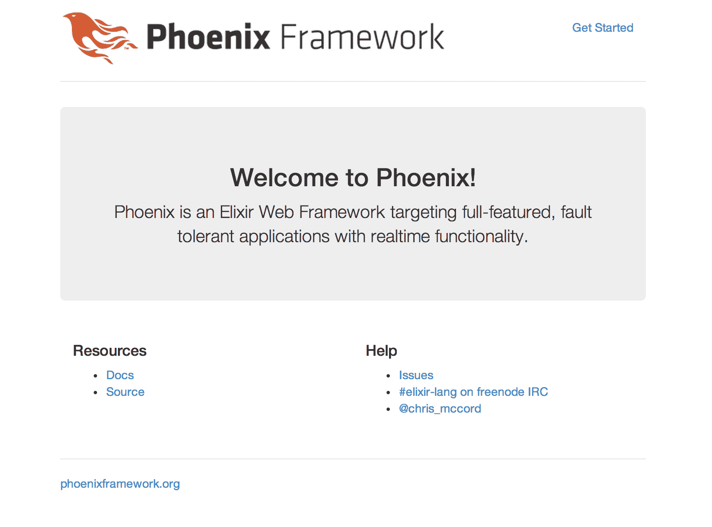
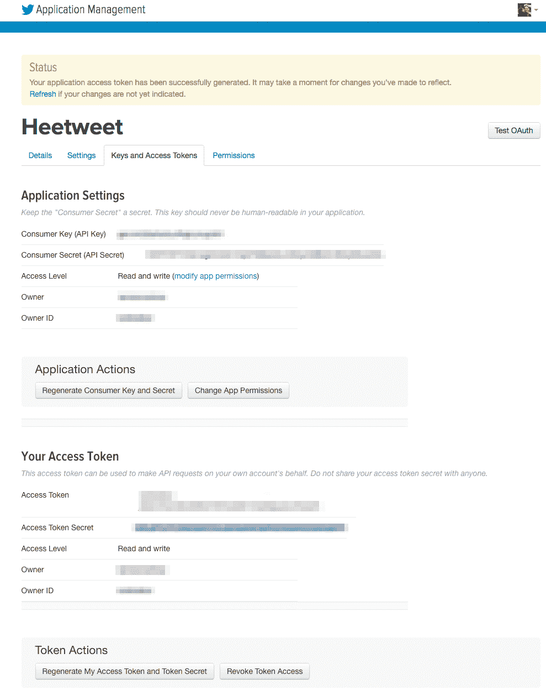

# 比较 Rails:探索凤凰城的 WebSockets

> 原文：<https://www.sitepoint.com/comparing-rails-exploring-websockets-in-phoenix/>

Rails 5 最大的特性之一就是 WebSockets。看起来这个特性在某种程度上是受了凤凰网的启发。在本文中，我们来看看如何使用 Elixir 和 Phoenix 创建实时 Twitter 流热图。

这个想法是挂钩到 Twitter 样本流，并在世界地图上绘制推文。我不会讨论安装说明，因为凤凰官方指南做得更好。

这就是我们追求的目标:

[https://www.youtube.com/embed/17iIX0-fleY](https://www.youtube.com/embed/17iIX0-fleY)

## 建立凤凰计划

我们开始吧！首先创建一个新的 Phoenix 项目:

```
% mix phoenix.new heetweet && cd heetweet 
```

为了确保一切设置正确，在浏览器中打开`http://localhost:4000`，你应该会看到默认的 Phoenix 页面:



为了与 Twitter API 通信，我们必须安装一个 Twitter 客户端库 [ExTwitter](https://github.com/parroty/extwitter) 。

我们将在`mix.exs`中指定这种依赖性，相当于 Rails 的`Gemfile`。定位`deps`功能，增加`ExTwitter`和`OAuth`，前者依赖于:

```
defmodule Heetweet.Mixfile do
  use Mix.Project

  # ...

  defp deps do
    [{:phoenix, "~> 1.1.4"},
     {:postgrex, ">= 0.0.0"},
     {:phoenix_ecto, "~> 2.0"},
     {:phoenix_html, "~> 2.4"},
     {:phoenix_live_reload, "~> 1.0", only: :dev},
     {:gettext, "~> 0.9"},
     {:cowboy, "~> 1.0"},
     {:oauth, github: "tim/erlang-oauth"},
     {:extwitter, "~> 0.7.1"}]
  end

end 
```

> 二郎和仙丹可以愉快地互操作！
> 
> 您可能已经注意到`OAuth`是一个 *Erlang* 库，然而 ExTwitter 依赖于它。事实证明，Elixir 和 Erlang 可以愉快地互操作。这意味着两种语言的库都可以在任一种语言中使用。

接下来，您需要告诉 Phoenix 启动 ExTwitter *应用程序*。Elixir 中的应用程序本质上是一个独立的库，可以被其他应用程序使用。事实上，`deps`函数中指定的许多依赖项都是应用程序。

你可能听说过药剂/Erlang 中的监督树。应用程序可以打包成自己的管理树，当出现问题时可以*自我修复*。

看看同一个`mix.exs`文件中指定的`applications`函数:

```
defmodule Heetweet.Mixfile do
  use Mix.Project

  # ...

  def application do
    [mod: {Heetweet, []},
     applications:[:phoenix, :phoenix_html, :cowboy, :logger, :gettext,
                    :phoenix_ecto, :postgrex]]
  end

end 
```

我们需要将 ExTwitter 添加到`applications`列表中:

```
def application do
  [mod: {Heetweet, []},
   applications:[:phoenix, :phoenix_html, :cowboy, :logger, :gettext,
                  :phoenix_ecto, :postgrex, :extwitter]]
end 
```

## 设置 Twitter

在使用 ExTwitter 之前，我们需要前往`https://apps.twitter.com/`，登录并点击“创建新应用”。

这是我填的:

*   **姓名** : Heetweet
*   **描述** : Heetweet 在热图上显示推文
*   **网站**:http://www.example.com

> 注意:您必须在“手机”下的个人资料部分提供您的手机号码。

完成这些步骤后，您将可以访问包含消费者密钥和密码以及访问令牌和访问令牌密码的页面:



我们需要将这些添加到`config/config.exs`中，并将它们添加到文件的底部:

```
config :extwitter, :oauth, [
  consumer_key: System.get_env("TWITTER_CONSUMER_KEY"),
  consumer_secret: System.get_env("TWITTER_CONSUMER_SECRET"),
  access_token: System.get_env("TWITTER_ACCESS_TOKEN"),
  access_token_secret: System.get_env("TWITTER_ACCESS_SECRET")
] 
```

当然，您永远不会希望以纯文本的形式存储敏感的凭据，并将它们提交给源代码控制。因此，您需要在`~/.bashrc`或类似的地方指定这些内容(取决于您的 shell):

```
export TWITTER_CONSUMER_KEY="xxxxxxxxxxxxxxxxxxxxxxxxx"
export TWITTER_CONSUMER_SECRET="xxxxxxxxxxxxxxxxxxxxxxxxxxxxxxxxxxxxxxxxxxxxxxxxxx"
export TWITTER_ACCESS_TOKEN="xxxxxxxxxxxxxxxxxxxxxxxxxxxxxxxxxxxxxxxxxxxxxxxxxx"
export TWITTER_ACCESS_SECRET="xxxxxxxxxxxxxxxxxxxxxxxxxxxxxxxxxxxxxxxxxxxxx" 
```

一旦完成，确保你或者打开一个新的终端窗口或者手动运行`source ~/.bashrc`(或者等效的，取决于你的 shell)。

## 带着菲尼克斯兜风

让我们确保一切都设置正确。我们将打开 REPL 药剂(read-eval-print-loop ),让它像这样加载我们的 Phoenix 应用程序:

```
% iex -S mix phoenix.server 
```

让我们通过运行一个查询来检查我们是否正确地配置了 ExTwitter，这个查询可以保证得到结果:

```
iex> ExTwitter.search("bieber", [count: 5]) \
|> Enum.map(fn(tweet) -> tweet.text end) \
|> Enum.join("\n---\n") \
|> IO.puts 
```

> 注意:如果你要复制粘贴上面的代码片段，请逐行粘贴*而不是整个代码块。*

让我们看看这段代码做了什么。第一行搜索“bieber ”,最多有五个结果。结果以一列`ExTwitter.Model.Tweet`返回。因为我们只对推文的内容感兴趣，所以我们运行`Enum.map`函数来提取每条推文的`text`。每条推文的内部表示如下:

```
%ExTwitter.Model.Tweet{id: 724195286688645120,
  lang: "en",
  user: %ExTwitter.Model.User{contributors_enabled: false,
   id: 714513423896342530,
   screen_name: "asloveme4", lang: "pl", name: "ohai",
   url: "https://t.co/A8YqMw5YPh",
   description: "@justinbieber So take my hand and walk with me,\n Show me what to be,\n I need you to set me free",
   profile_image_url: "http://pbs.twimg.com/profile_images/722497035136413696/4xAxtZvN_normal.jpg",
   statuses_count: 1186, friends_count: 177, favourites_count: 80,
   show_all_inline_media: nil, utc_offset: nil, followers_count: 93,
   profile_banner_url: "https://pbs.twimg.com/profile_banners/714513423896342530/1460233025",
   default_profile_image: false, following: false, location: "Poland",
   protected: false,
   profile_background_image_url_https: "https://abs.twimg.cimg/themes/theme1/bg.png",
  quoted_status: nil,
  text: "RT @hot_or_not_pll: #43 Justin Bieber\nRT- hot 🔥🔥\nFav- not 👎👎 https://t.co/3IpoxYL6qZ",
  entities: %{hashtags: [],
    media: [%{display_url: "pic.twitter.com/3IpoxYL6qZ",
       expanded_url: "http://twitter.com/hot_or_not_pll/status/723558996532187137/photo/1",
    user_mentions: [%{id: 723238093705367552, id_str: "723238093705367552",
, favorite_count: 28, favorited: false, geo: nil} 
```

请注意，`Tweet`模型有一个对应的`%ExTwitter.Model.User`模型。这将有助于我们确定用户的国家。

## 设置地图

我们将使用[传单](http://leafletjs.com/)，一个 Javascript 库，让我们拥有交互式地图。打开`web/templates/layout/app.html.eex`。我们将清除大部分 HTML，添加传单所需的 CSS 和 Javascript。结果如下:

```
<!DOCTYPE html>
<html lang="en">
  <head>
    <meta charset="utf-8">
    <meta http-equiv="X-UA-Compatible" content="IE=edge">
    <meta name="viewport" content="width=device-width, initial-scale=1">
    <meta name="description" content="">
    <meta name="author" content="">

    <title>Hello Heetweet!</title>
    <link rel="stylesheet" href="<%= static_path(@conn, "/css/app.css") %>">
    <link rel="stylesheet" href="http://cdn.leafletjs.com/leaflet/v0.7.7/leaflet.css" />
  </head>

  <body>
    <%= render @view_module, @view_template, assigns %>
    <script src="<%= static_path(@conn, "/js/app.js") %>"></script>
  </body>
</html> 
```

## 设置热图库

幸运的是，fleet 附带了一个方便的热图库，名为[fleet . heat](https://github.com/Leaflet/Leaflet.heat)。

我简单地下载了[库](https://raw.githubusercontent.com/Leaflet/Leaflet.heat/gh-pages/dist/leaflet-heat.js)，并将文件放入`web/static/vendor`。

## websocket

让我们来看看网络插座吧！首先，我们需要启用 Phoenix 中 WebSockets 的客户端部分。打开`app.js`，取消对以下行的注释:

```
import socket from "./socket" 
```

现在前往`web/static/js/socket.js`。导航到文件的底部:

```
let channel = socket.channel("tweets:lobby", {})
channel.join()
  .receive("ok", resp => { console.log("Joined successfully", resp) })
  .receive("error", resp => { console.log("Unable to join", resp) }) 
```

我们基本上指定我们希望套接字通过一个通道连接到“tweets:lobby”主题。现在，我们将原封不动地离开。

## 设置频道后端

让我们创建一个凤凰频道。凤凰号为此配备了一个方便的发电机:

```
% mix phoenix.gen.channel Room tweets
* creating web/channels/room_channel.ex
* creating test/channels/room_channel_test.exs

Add the channel to your `web/channels/user_socket.ex` handler, for example:

    channel "tweets:lobby", Heetweet.RoomChannel 
```

让我们听从生成器的建议，将通道添加到`user_socket.ex`:

```
defmodule Heetweet.UserSocket do
  use Phoenix.Socket

  channel "tweets:lobby", Heetweet.RoomChannel

  # ...
end 
```

当你打开 Phoenix 应用程序时，你应该可以看到

```
Joined successfully Object {} 
```

在浏览器控制台中。如果您已经到达这个阶段，那么您已经成功地在 Phoenix 中连接了 WebSockets。现在开始有趣的事情！

## 将所有东西连接在一起

现在浏览器可以成功连接到后端了，接下来呢？嗯，我们需要向我们的后端发出信号，它可以开始向我们发送数据。为此，我们将`start_stream`推入通道:

```
channel.join()
    .receive("ok", resp => {
        console.log("Joined successfully", resp)
        channel.push("start_stream", {})   // <---
    })
    .receive("error", resp => { console.log("Unable to join", resp) }) 
```

然后我们需要在后端处理`start_stream`消息。前往`web/channels/room_channel.ex`。回想一下，我们之前已经使用`mix phoenix.channel`生成器创建了它。神奇的事情发生在这个函数中:

```
defmodule Heetweet.RoomChannel do
  use Heetweet.Web, :channel

  # ...

 def handle_in("start_stream", payload, socket) do
    stream = ExTwitter.stream_filter(locations: ['-180,-90,180,90'])
    |> Stream.map(fn x -> x.coordinates end)

    # Twitter gives us coordinates in reverse order (long first, then lat)
    for %{coordinates: [lng, lat]} <- stream do
      push socket, "new_tweet", %{lat: lat, lng: lng}
    end

    {:reply, {:ok, payload}, socket}
  end

  # ...
end 
```

我们在这里做了很多，所以让我们打开包装。

首先，我们必须获得包含坐标的 tweets 流。我们想要覆盖全球的推文，ExTwitter 库有这样一个功能:

```
ExTwitter.stream_filter(locations: ['-180,-90,180,90']) 
```

这里有一个灵丹妙药:上面的函数返回一个*流*。在 Ruby 中，这类似于惰性可枚举。在我们明确请求它之前，它不会发出任何值。事实上，我们可以链接其他流操作来操作每个发出的值，它*仍然*不会返回任何值。因此，这就是我们如何从推文中产生一串*坐标*:

```
stream = ExTwitter.stream_filter(locations: ['-180,-90,180,90'])
         |> Stream.map(fn x -> x.coordinates end) 
```

最后，我们可以通过 *`for`理解*来迭代坐标流(可能是无限的)。虽然这里的`for`理解看起来像一个普通的`for`循环，但实际上并不像看上去那样简单。长生不老药`for`的理解有助于丢弃无效的值。这非常有用，因为有些推文没有坐标。在`for`理解的主体内，我们可以将坐标推出到连接的套接字:

```
for %{coordinates: [lng, lat]} <- stream do
  push socket, "new_tweet", %{lat: lat, lng: lng}
end 
```

现在回到客户端。打开`web/static/js/socket.js`。现在，我们首先设置地图并添加一个空的热点图图层:

```
var tiles = L.tileLayer('http://{s}.tile.osm.org/{z}/{x}/{y}.png', {
    attribution: '&copy; <a href="http://osm.org/copyright">OpenStreetMap</a> contributors',
}).addTo(map);

var heat = L.heatLayer([]).addTo(map); 
```

接下来，我们需要处理`new_tweet`和它的有效载荷(坐标):

```
channel.on("new_tweet", payload => {
    // artificially add more points to get the heatmap effect
    for (var i = 0; i < 100; i++) {
        heat.addLatLng([payload.lat, payload.lng])
    }
}) 
```

请注意，我们有一个针对给定坐标向热点图图层添加坐标一百次的循环。原因是我太懒了，不想看到漂亮的热图效果，为了即时的满足感，我决定加快一点速度。

就是这样！以下是 Heetweet 的全盛时期:

[https://www.youtube.com/embed/17iIX0-fleY](https://www.youtube.com/embed/17iIX0-fleY)

## 摘要

我希望你喜欢这篇文章，更重要的是，学到了一些新东西！我鼓励您尝试一下 Phoenix，尤其是如果您一直渴望尝试 WebSockets 的话。

## 分享这篇文章