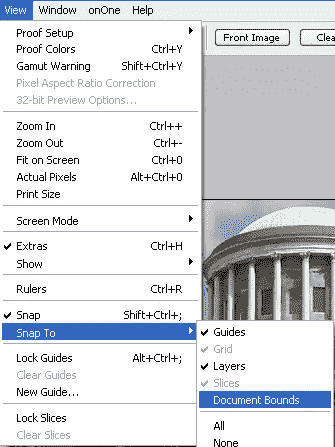
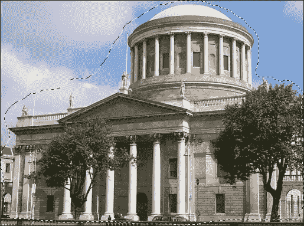

# 完成裁剪:在 Photoshop 中裁剪的 4 个技巧

> 原文：<https://www.sitepoint.com/complete-crop-4-tips-for-cropping-in-photoshop/>

如果你参与编辑图像，你无疑需要在某个地方裁剪一些图像。裁剪工具和选框工具是这些程序的首选工具。我在过去写过关于[保持你的裁剪](https://www.sitepoint.com/time-saving-photoshop-tips/)，大量的时间节省[裁剪和拉直](https://www.sitepoint.com/speed-up-your-workflow-with-the-crop-and-straighten-command-in-photoshop/)命令，还有[修剪命令](https://www.sitepoint.com/photoshop-web-graphics-tips/)，它也允许你基于像素颜色非常紧密地裁剪。

这里有另外四个小贴士，可以帮助你在种植过程中加快或改良作物。

**1。用裁剪工具**拉直图像

在 Photoshop 中有很多方法可以拉直扭曲的图像，包括使用裁剪工具的这种方法。以下是方法。在工具箱中，选择裁剪工具(![clip_image002[1]](img/90619b3db7caeebedf44f361afd5a47c.png "clip_image002[1]"))。现在在你弯曲的图像上，从右上角开始，用裁剪工具在图像周围画一个选框。如果你切掉一些边缘也没关系，因为你会调整选框来适应下一个。当您放开鼠标按钮时，您将看到**裁剪屏蔽**，它允许您查看应用裁剪时图像的哪些部分将被删除。

在工具选项栏上，确保未选中“透视”复选框。在图像窗口中，将指针移出裁剪选框，使其显示为弯曲的双箭头()。顺时针拖动以旋转选取框，直到它与图片的角度匹配。

将指针放在裁剪选框内，拖动选框直到它包含您想要显示的图片的所有部分。使用和角手柄来调整字幕的大小。

按 Enter 键(Windows)或 Return 键(Mac OS)。瞧啊。图像现在已被裁剪，裁剪后的图像现在会填充图像窗口，并根据您的指定进行拉直、调整大小和裁剪。

**2。停止裁剪到文档边缘**

有时当您使用裁剪工具时，让裁剪边框与图像边缘对齐会非常有用。选取框选择也会发生这种情况。当然，也有其他时候，作物像胶水一样粘在边缘是一种痛苦。如果你不希望任何抢购发生，按衬衫+Ctrl+；(win)或者 Shift+Cmd+；(mac)。这将关闭所有对齐功能，如对齐文档边界、对齐标尺和对齐参考线。如果您只想关闭裁剪或选取框与文档边缘的对齐，请选择“视图”>“对齐”，然后选择“文档边界”。

 **3。交换作物尺寸**

选择裁剪工具时，工具选项栏会显示许多选项，前两个选项是裁剪的宽度和高度。在这两个字段之间有一个你几乎不会注意到的小按钮，它可以节省一点时间。下面你可以看到我设置了一个正好 6 厘米 x 10cm 厘米的作物。如果我按下那个小按钮，我将得到 10 厘米×6 厘米的作物。省去所有不方便的打字。

**4。非方形裁剪**

你不必画出一个正方形来裁剪图像。您可以使用任何选择工具在对象周围或图像中进行选择。在这里，我用套索在建筑物周围画得很松。

选择“图像”>“裁剪”, Photoshop 会尽可能紧密地裁剪图像。

你还有其他快速修剪的小技巧想分享吗？

## 分享这篇文章