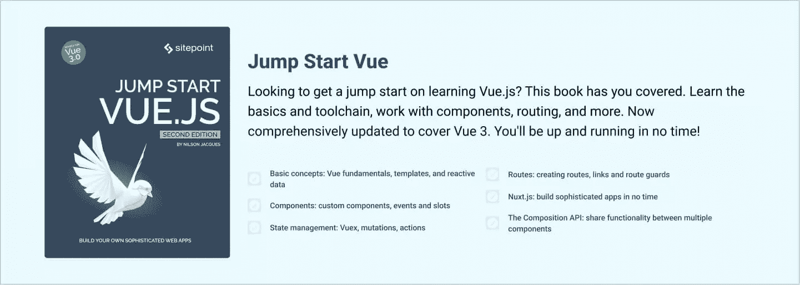

# 如何在 Vue.js 中有条件地应用 CSS 类

> 原文：<https://www.sitepoint.com/conditionally-applying-css-class-vue-js/>

有时你需要在运行时改变一个元素的 CSS 类。但是当改变类时，有时最好有条件地应用样式细节。例如，假设您的视图有一个分页器。寻呼机通常用于导航较大的项目集。导航时，向用户显示他们当前所在的页面会很有帮助。项目的样式是根据正在查看的当前页面有条件地设置的。

在这种情况下，寻呼机可能看起来像这样:


在这个例子中，有五页。一次只能选择这些页面中的一个。如果您使用 Bootstrap 构建这个页面，那么所选页面将应用一个名为`active`的 CSS 类。只有当该页面是当前查看的页面时，才需要应用这个类。换句话说，你想要*有条件地*应用`active` CSS 类。幸运的是，Vue 提供了一种有条件地将 CSS 类应用于元素的方法，我将在本文中演示这一点。

要在运行时有条件地应用 CSS 类，可以绑定到 JavaScript 对象。要成功完成这项任务，您必须完成两个步骤。首先，您必须确保您的 CSS 类已定义。然后，在模板中创建类绑定。我将在本文的剩余部分详细解释这些步骤。

[](https://www.sitepoint.com/premium/books/jump-start-vue-js-2nd-edition/)

## 步骤 1:定义你的 CSS 类

想象一下，上图中显示的五个页面项目是使用以下 HTML 定义的:

```
<div id="myApp">
  <nav aria-label="Page navigation example">
    <ul class="pagination">
      <li class="page-item"><a class="page-link" href="#">1</a></li>
      <li class="page-item"><a class="page-link" href="#">2</a></li>
      <li class="page-item active"><a class="page-link" href="#">3</a></li>
      <li class="page-item"><a class="page-link" href="#">4</a></li>
      <li class="page-item"><a class="page-link" href="#">5</a></li>
    </ul>
  </nav>
</div> 
```

请注意，该代码片段中的每个页面都有一个列表项元素(`<li …`)。该元素引用了`page-item` CSS 类。在本文的代码中，这个类是在 Bootstrap CSS 框架中定义的。然而，如果它没有被定义，你就有责任确保它在某个地方被定义了。然而，第二个 CSS 类是与本文最相关的一个。

CSS 类用来标识当前选中的页面。对于本文，这个 CSS 类也在引导 CSS 中定义。如上面的代码片段所示，`active`类只用于第三个列表项元素*中。您可能已经猜到，这是您想要有条件应用的 CSS 类。为此，您需要添加一个 JavaScript 对象。*

## 步骤 2:创建您的类绑定

让我们构建步骤 1 中显示的代码片段。在模板中创建类绑定时，有两个主要选择:使用对象语法或使用数组语法。在本文的剩余部分，我将向您展示如何使用这两种方法。

### 使用对象语法绑定

要使用对象语法创建类绑定，您必须使用 JavaScript **表达式**。我们将使用的表达式可以在与本文[相关的代码中看到。相关代码如下所示:](https://codepen.io/SitePoint/pen/RqbBdK)

```
<div id="myApp">
  <nav aria-label="An example with pagination">
    <ul class="pagination">
      <li v-for="page in totalPages" v-bind:class="{'page-item':true, 'active':(page === currentPage)}">
        <a class="page-link" href="#">{{ page }}</a>
      </li>
    </ul>
  </nav>
</div> 
```

我通过使用 Vue 的内置`v-for`指令减少了代码量。该指令用于在循环中呈现项目。本例中的项目是页面本身。除了使用`v-for`指令，还要注意使用`v-bind`指令。

`v-bind`指令将元素的`class`属性连接到 Vue 实例。Vue 的实例是这样定义的:

```
var app = new Vue({
  el: '#myApp',
  data: {
    totalPages: 5,
    currentPage: 3
  }
}); 
```

这个 Vue 实例直截了当。上面的`data`对象包含一个名为`currentPage`的属性。如果重新查看上面定义的 HTML 模板，您会注意到这个属性被引用了。事实上，与每个类绑定相关联的 JavaScript 对象看起来像这样:

```
{'page-item':true, 'active':(page === currentPage)} 
```

这个对象定义了两个属性:`page-item`和`active`。值得注意的是，这是步骤 1 中讨论的两个 CSS 类的名称。在步骤 2 中，这两个类引用已经成为 JavaScript 对象中的属性名。与这些属性名称相关联的值是 JavaScript 表达式。如果表达式评估为 true，CSS 类将被包含。如果表达式评估为`false`，CSS 类将*而不是*被包含。记住这些规则，让我们来看看每个属性。

第一个属性`page-item`的值为`true`。使用这个硬编码的值是因为我们总是希望包含`page-item`类。第二个属性`active`使用了一个 JavaScript 表达式。当该表达式为`true`时，将应用`active`类。这使我们能够根据`currentPage`的值有条件地应用`active`类。另一种有条件地应用`active`类的方法是绑定到`Array`。

### 使用数组语法绑定

Vue 允许你通过绑定到一个`Array`来应用 CSS 类的列表。如果您想使用`Array`语法，步骤 1 中显示的 HTML 将变成这样:

```
<div id="myApp">
  <nav aria-label="An example with pagination">
    <ul class="pagination">
        <li v-for="page in totalPages" v-bind:class="[pageItemClass, (page === currentPage) ? activeClass : '']">
          <a class="page-link" href="#">{{ page }}</a>
        </li>
    </ul>
  </nav>
</div> 
```

带有`Array`语法的运行版本可以在[这里](https://codepen.io/SitePoint/pen/dQbjxX)看到。唯一的区别是在类绑定上使用了一个`Array`。这种替代方法期望两个额外的属性存在于你的 Vue 的`data`对象中。这两个属性是:`pageItemClass`和`activeClass`。带有这些属性的更新后的 Vue 初始化代码如下所示:

```
var app = new Vue({
  el: '#myApp',
  data: {
    totalPages: 5,
    currentPage: 3,
    pageItemClass: 'page-item',
    activeClass: 'active'
  }
}); 
```

如您所见，`data`对象的大小增加了，但是当使用`Array`语法时，模板中的代码稍微干净了一些。对象语法稍微紧凑一点。对象语法和`Array`语法之间的选择取决于个人偏好。

这两种方法似乎都让你的 HTML 模板变得更加复杂。然而，这里实际上还有更多。事实上，我们在分离关注点。我们正在创建一个由数据驱动的模板。随着应用程序的增长，这使得视图更容易测试和维护。

## 包裹

我希望这篇文章对你有价值。如果你想了解更多关于 Vue.js 的信息，为什么不在 SitePoint 查看一下我们的其他 Vue 内容呢？否则，你可以在推特上找到我 [@chadcampbell](https://twitter.com/chadcampbell) 。再次感谢！

## 分享这篇文章